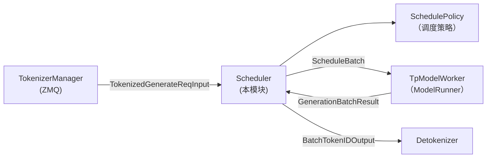

# Scheduler 核心

> **阶段 II · 请求调度** | 状态：已完成 | Git：`70df09b83363e0127b43c83a6007d3938f815b2d` 
> **源码范围：** `srt/managers/scheduler.py`、`scheduler_pp_mixin.py`、`scheduler_components/`

---

## 本模块在架构中的位置

Scheduler 是 SGLang **每个 GPU rank 上的独立子进程**，接收 TokenizerManager 的 tokenized 请求，维护 `waiting_queue` / `running_batch`，组 batch 后驱动 TpModelWorker 前向，处理 logits 采样并将 token 输出推给 Detokenizer。它是 Continuous Batching 的状态机核心：prefill → decode 循环、overlap 流水线、PP/Disaggregation 变体均通过 `dispatch_event_loop` 分派到不同 event loop 实现。



---

## 零基础一句话

**像交通指挥中心的「红绿灯调度员」**：决定哪些车辆（请求）何时上路（prefill/decode batch），避免路口（GPU）拥堵，让车流（吞吐）最大化。

---

## 用户场景

**Persona：** 系统工程师小孙排查 decode 延迟尖刺，需要理解 `event_loop_overlap` 如何把 CPU 调度与 GPU 前向流水线并行，以及 `waiting_queue` → `running_batch` 的状态迁移。她还需知道 PP 模式下 `event_loop_pp` 与 overlap 的互斥关系。

---

## 五件套阅读顺序

| 顺序 | 文件 | 一句话说明 |
|------|------|------------|
| 01 | [[07-Scheduler-01-核心概念]] | 术语、Mixin 组合、Continuous Batching 设计动机 |
| 启动链路 | [[07-Scheduler-02-源码走读]] | **主文档**：初始化 → 收请求 → 组 batch → 前向 → 出结果 |
| HTTP Server | [[07-Scheduler-03-数据流与交互]] | ZMQ IPC、Req 生命周期、与 TpWorker/Detokenizer 边界 |
| OpenAI API | [[07-Scheduler-04-关键问题]] | overlap vs normal、retract、PP 与 overlap 互斥 |
| ✓ | [[07-Scheduler-05-checkpoint]] | 验收：能否说明三层队列与 event loop 分派 |

---

## 核心源码锚点

**Explain：** 每个 GPU rank 上运行一个 Scheduler 子进程。`run_scheduler_process` 构造 `Scheduler` 实例后调用 `run_event_loop()`，后者根据 disaggregation / PP / overlap 配置分派到不同的事件循环实现；默认 HTTP 服务走 `event_loop_overlap`。

**Code：**

```python
# 来源：python/sglang/srt/managers/scheduler.py L4252-L4311
def run_scheduler_process(
    server_args: ServerArgs,
    port_args: PortArgs,
    gpu_id: int,
    tp_rank: int,
    attn_cp_rank: int,
    moe_dp_rank: int,
    moe_ep_rank: int,
    pp_rank: int,
    dp_rank: Optional[int],
    pipe_writer,
):
    # Load plugins so hooks can override Scheduler and its dependencies.
    load_plugins()
    dp_rank = configure_scheduler_process(
        server_args,
        gpu_id,
        tp_rank,
        attn_cp_rank,
        moe_dp_rank,
        moe_ep_rank,
        pp_rank,
        dp_rank,
    )
    parent_process = psutil.Process().parent()

    # Set up tracing
    if server_args.enable_trace:
        process_tracing_init(
            server_args.otlp_traces_endpoint,
            "sglang",
            trace_modules=server_args.trace_modules,
        )
        thread_label = "Scheduler"
        if server_args.disaggregation_mode == "prefill":
            thread_label = "Prefill Scheduler"
        elif server_args.disaggregation_mode == "decode":
            thread_label = "Decode Scheduler"
        trace_set_thread_info(thread_label, tp_rank, dp_rank, pp_rank)

    # Create a scheduler and run the event loop
    scheduler = None
    try:
        scheduler = Scheduler(
            server_args,
            port_args,
            gpu_id,
            tp_rank,
            moe_ep_rank,
            pp_rank,
            attn_cp_rank,
            moe_dp_rank,
            dp_rank,
        )

        # Send initialization info back to the parent process
        pipe_writer.send(scheduler.get_init_info())

        # Run the event loop (blocks until a ShutdownReq sets gracefully_exit)
        scheduler.run_event_loop()
```

```python
# 来源：python/sglang/srt/managers/scheduler.py L4164-L4192
def dispatch_event_loop(scheduler: Scheduler):
    # Dispatch to the appropriate event loop based on the disaggregation mode
    server_args = scheduler.server_args
    disaggregation_mode: DisaggregationMode = scheduler.disaggregation_mode
    if disaggregation_mode == DisaggregationMode.NULL:
        if scheduler.enable_pdmux:
            scheduler.event_loop_pdmux()
        elif server_args.pp_size > 1:
            scheduler.event_loop_pp()
        elif scheduler.enable_overlap_mlx:
            scheduler.event_loop_overlap_mlx()
        elif scheduler.enable_overlap:
            scheduler.event_loop_overlap()
        else:
            scheduler.event_loop_normal()
    elif disaggregation_mode == DisaggregationMode.PREFILL:
        if server_args.pp_size > 1:
            scheduler.event_loop_pp_disagg_prefill()
        elif scheduler.enable_overlap:
            scheduler.event_loop_overlap_disagg_prefill()
        else:
            scheduler.event_loop_normal_disagg_prefill()
    elif disaggregation_mode == DisaggregationMode.DECODE:
        if server_args.pp_size > 1:
            scheduler.event_loop_pp_disagg_decode()
        elif scheduler.enable_overlap:
            scheduler.event_loop_overlap_disagg_decode()
        else:
            scheduler.event_loop_normal_disagg_decode()
```

**Comment：**

- `pipe_writer.send(get_init_info())` 是与 TokenizerManager 的**握手**：告知 max tokens、状态 ready。
- `dispatch_event_loop` 是**策略模式**入口：同一 `Scheduler` 类，不同运行模式下走不同 loop。
- 默认 HTTP 服务（非 disagg、单 PP）走 `event_loop_overlap`，CPU 处理与 GPU 前向流水线并行。
- Disaggregation 模式（PREFILL/DECODE）走专用 prefill/decode event loop（PD 分离 展开）。

---

## 验证建议

1. **CLI：** 启动后 `ps aux | grep sglang::scheduler`，应看到每 GPU rank 一个 scheduler 子进程。
2. **日志：** 搜索 `event_loop_overlap` / `Scheduler initialized`；metrics 含 `sglang:num_running_reqs`、`sglang:gen_throughput`。

---

## 阅读路径

← [[06-TokenizerManager-00-MOC|TokenizerManager]] 
→ [[08-SchedulePolicy-00-MOC|SchedulePolicy]]
