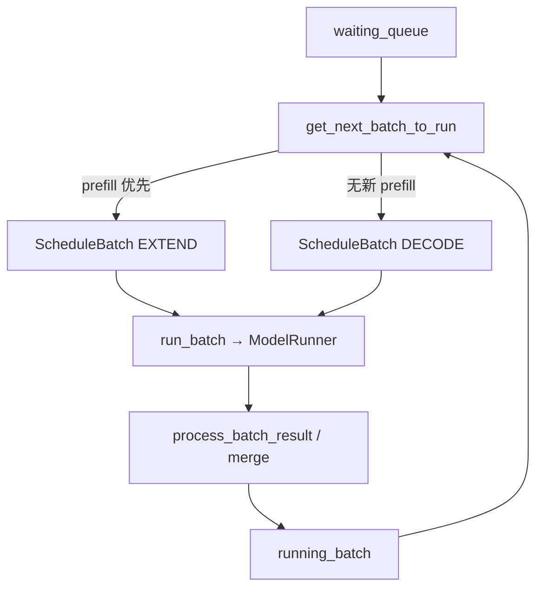

# Scheduler · 核心概念

## 用户故事：800 并发下的 Continuous Batching — 谁决定 prefill 还是 decode？

### Persona

**阿宁**，推理平台 SRE。Llama-3-8B 单卡 `--max-running-requests 256`，晚高峰 800 QPS 涌入。TTFT 与 decode 吞吐互相拉扯——她需要理解 Scheduler **每轮迭代**如何从 waiting 队列与 running batch 里选出 `cur_batch`。

### 时间线

| 时刻 | 事件 |
|------|------|
| T0 | 50 条新请求经 ZMQ 进入 `waiting_queue`；`running_batch` 已有 120 条在 decode |
| T0+1ms | `get_next_batch_to_run()` 优先 `_get_new_batch_prefill_raw()`，PrefillAdder 按预算组 extend batch |
| T0+2ms | 若无新 prefill，则 `update_running_batch(running_batch)` 过滤已完成 req，返回 decode batch |
| T0+80ms | GPU `run_batch` 完成；overlap 模式下结果进 `result_queue`，与下一轮 forward 并行 |
| T1 | KV 不足时 `retract_decode` 撤回部分 decode 请求，以 `is_retracted=True` 重回 waiting |

### 涉及模块



**Explain：** Scheduler 是**独立子进程里的调度中枢**，不碰分词。核心状态三组：`waiting_queue`（等 prefill）、`running_batch`（已 prefill、在 decode）、`cur_batch`（本轮 forward）。`get_next_batch_to_run()` **prefill 优先**——降低新请求 TTFT；decode 请求已在 running 中「排队」。默认 `event_loop_overlap` 让上一轮 CPU 处理与当前 GPU forward 重叠，提高吞吐。

**Code：**

```python
# 来源：python/sglang/srt/managers/scheduler.py L965-L984
# 提交版本：70df09b
    def init_running_status(self):
        # Set by the ShutdownReq handler to break the event loop for graceful shutdown.
        self.gracefully_exit = False
        self.waiting_queue: List[Req] = []
        # The running decoding batch for continuous batching
        self.running_batch: ScheduleBatch = ScheduleBatch(reqs=[], batch_is_full=False)
        # The current forward batch
        self.cur_batch: Optional[ScheduleBatch] = None
        # The last forward batch
        self.last_batch: Optional[ScheduleBatch] = None
        self.forward_ct = 0
        self.return_health_check_ipcs: Deque[Optional[str]] = deque()
        self.flush_wrapper = SchedulerFlushWrapper(
            flush_cache=self.flush_cache,
            is_fully_idle=self.is_fully_idle,
            ipc_channels=self.ipc_channels,
        )
        self.session_controller = SessionController(self.tree_cache)
        self.forward_sleep_time = None
        self._engine_paused = False
```

**Comment：**

- `last_batch` 供 overlap 模式延迟 `process_batch_result`，与当前 forward 并行。
- `chunked_req` 指向分块 prefill 未完成的请求，下一轮优先续传（见 调度策略/09）。
- 仅 `pp_rank==0 && attn_tp_rank==0 && attn_cp_rank==0` 的 rank 从 ZMQ 收请求，再 broadcast 到 TP/PP 组。

### 如果…会怎样（调试）

| 现象 | 可能原因 | 排查 |
|------|----------|------|
| 新请求 TTFT 极高、decode 很顺 | prefill 被 running decode 长期压制（罕见）或 KV 满导致 retract 重跑 | 看 `waiting_queue` 长度与 retract 日志 |
| 吞吐不如预期 | overlap 被 grammar+spec 单轮 disable | `--disable-overlap-schedule` 对比 A/B |
| 只有 rank0 收不到请求 | 误以为每 TP rank 各连 ZMQ | 确认 `SchedulerRequestReceiver._pull_raw_reqs` |

---

## 1. Scheduler 的角色

**Explain：** Scheduler 是 SGLang Runtime 的**调度中枢**，运行在独立子进程中，与 TokenizerManager（CPU 侧）和 TpWorker（GPU 前向）协作。它不直接做 tokenization 或 detokenization，而是：

- 接收已 tokenize 的请求（`TokenizedGenerateReqInput` 等）
- 维护请求队列与 running batch（Continuous Batching）
- 决定每轮 forward 是 **prefill（EXTEND）** 还是 **decode（DECODE）**
- 调用 `model_worker.forward_batch_generation` 执行 GPU 计算
- 将生成 token / logprob 通过 ZMQ 送回 TokenizerManager → Detokenizer

在全局架构中，Scheduler 位于 **「请求调度层」**，上游是 TokenizerManager，下游是 TpWorker + KV Cache。

---

## 2. 类继承与 Mixin 组合

**Explain：** `Scheduler` 通过多重继承组合多种运行模式的能力。核心逻辑在 `scheduler.py`，PP 专用逻辑在 `SchedulerPPMixin`，Disaggregation / Multiplex / DLLM 等 mixin 提供可选路径。

**Code：**

```python
# 来源：python/sglang/srt/managers/scheduler.py L298-L306
class Scheduler(
    SchedulerDisaggregationDecodeMixin,
    SchedulerDisaggregationPrefillMixin,
    SchedulerMultiplexMixin,
    SchedulerPPMixin,
    SchedulerDllmMixin,
    SchedulerMlxOverlapMixin,
):
    """A scheduler that manages a tensor parallel GPU worker."""
```

**Comment：**

- **Mixin 顺序**影响 MRO：Disaggregation mixin 在前，可覆盖部分 hook。
- `SchedulerPPMixin` 提供 `event_loop_pp()` 等 PP 专用循环；与 overlap 在注释中标注 **FIXME: pp is not compatible with overlap**。
- 本模块重点：`scheduler.py` 主体 + `scheduler_pp_mixin.py`；Disaggregation mixin 细节见 PD 分离。

---

## 3. 核心状态变量

**Explain：** Continuous Batching 依赖三组 batch/队列状态，在 `init_running_status` 中初始化。

**Code：**

```python
# 来源：python/sglang/srt/managers/scheduler.py L965-L984
    def init_running_status(self):
        # Set by the ShutdownReq handler to break the event loop for graceful shutdown.
        self.gracefully_exit = False
        self.waiting_queue: List[Req] = []
        # The running decoding batch for continuous batching
        self.running_batch: ScheduleBatch = ScheduleBatch(reqs=[], batch_is_full=False)
        # The current forward batch
        self.cur_batch: Optional[ScheduleBatch] = None
        # The last forward batch
        self.last_batch: Optional[ScheduleBatch] = None
        self.forward_ct = 0
        self.return_health_check_ipcs: Deque[Optional[str]] = deque()
        self.flush_wrapper = SchedulerFlushWrapper(
            flush_cache=self.flush_cache,
            is_fully_idle=self.is_fully_idle,
            ipc_channels=self.ipc_channels,
        )
        self.session_controller = SessionController(self.tree_cache)
        self.forward_sleep_time = None
        self._engine_paused = False
```

**Comment：**

| 变量 | 含义 |
|------|------|
| `waiting_queue` | 等待 prefill 的新请求 FIFO（可被 priority policy 重排） |
| `running_batch` | 已完成 prefill、处于 decode 阶段的请求集合 |
| `cur_batch` | 当前迭代选中的 forward batch |
| `last_batch` | overlap 模式下，上一轮 GPU 结果对应的 batch（用于 merge / 处理结果） |
| `chunked_req` | 分块 prefill 时尚未完成整段 prompt 的请求 |

---

## 4. 事件循环变体

**Explain：** 根据 `--disable-overlap-schedule`、`pp_size`、disaggregation 等配置，Scheduler 选择不同 loop。所有 loop 共享 **收请求 → 组 batch → run_batch → 处理结果** 骨架，差异在 CPU/GPU 流水线与 PP stage 通信。

| 循环 | 触发条件 | 特点 |
|------|----------|------|
| `event_loop_normal` | 禁用 overlap | 严格串行：forward 完成后才处理结果 |
| `event_loop_overlap` | 默认（CUDA） | `result_queue` 延迟处理上一轮结果，与当前 forward 重叠 |
| `event_loop_pp` | `pp_size > 1` | 多 microbatch、stage 间 send/recv proxy tensors |
| `event_loop_*_disagg_*` | PD 分离模式 | 在 normal/overlap 基础上插入 KV 传输队列 |

---

## 5. 子组件拆分（scheduler_components）

**Explain：** 近年重构将 Scheduler 的横切关注点拆成独立 dataclass 组件，由 `Scheduler.__init__` 中 `init_*` 方法装配。这样主类聚焦调度逻辑，IPC/指标/输出等可单独测试。

| 组件 | 职责 |
|------|------|
| `SchedulerIpcChannels` | ZMQ socket：收 tokenizer/rpc，发 detokenizer |
| `SchedulerRequestReceiver` | 收请求 + TP/PP broadcast |
| `SchedulerBatchResultProcessor` | forward 后更新 Req 状态、释放 KV、stream 输出 |
| `SchedulerOutputStreamer` | 将 token/logprob 打包发回 |
| `SchedulerMetricsReporter` | prefill/decode 统计、FPM 指标 |
| `SchedulerDPAttnAdapter` | DP Attention 下跨 rank MLP sync |
| `IdleSleeper` | 空闲时 ZMQ poll sleep，降低 CPU 占用 |

---

## 6. Prefill vs Decode 调度优先级

**Explain：** `get_next_batch_to_run()` 是每轮迭代的核心决策函数。逻辑上 **prefill 优先于 decode**：先尝试从 `waiting_queue` 组新 prefill batch；若无，则更新并返回 `running_batch` 做 decode。

**Code：**

```python
# 来源：python/sglang/srt/managers/scheduler.py L2687-L2699
        if new_batch is not None:
            # Run prefill first if possible
            ret = new_batch
        else:
            # Run decode (skip for prefill-only batches)
            if (
                not self.running_batch.is_empty()
                and not self.running_batch.is_prefill_only
            ):
                self.running_batch = self.update_running_batch(self.running_batch)
                ret = self.running_batch if not self.running_batch.is_empty() else None
            else:
                ret = None
```

**Comment：**

- **Prefill 优先**降低新请求 TTFT；decode 请求已在 running_batch 中「排队」。
- `update_running_batch` 会 filter 已完成请求、检查 KV 内存，必要时 **retract**（撤回部分 decode 请求回 waiting_queue）。
- `PrefillAdder` 的具体准入算法在调度策略 展开。

---

## 7. ParallelState（ps）

**Explain：** Scheduler 持有 `ParallelState` 封装 TP/PP/DP/EP/CP 等 rank 信息，避免在代码中散落 `tp_rank`、`pp_rank` 判断。

**Code：**

```python
# 来源：python/sglang/srt/managers/scheduler.py L371-L389
        self.ps = ParallelState(
            tp_rank=tp_rank,
            tp_size=server_args.tp_size,
            pp_rank=pp_rank,
            pp_size=server_args.pp_size,
            dp_rank=dp_rank,
            dp_size=server_args.dp_size,
            attn_tp_rank=attn_tp_rank,
            attn_tp_size=attn_tp_size,
            attn_cp_rank=attn_cp_rank,
            attn_cp_size=server_args.attn_cp_size,
            attn_dp_rank=attn_dp_rank,
            attn_dp_size=attn_dp_size,
            moe_ep_rank=moe_ep_rank,
            moe_ep_size=server_args.ep_size,
            moe_dp_rank=moe_dp_rank,
            moe_dp_size=server_args.moe_dp_size,
            gpu_id=gpu_id,
        )
```

**Comment：** 只有 `pp_rank==0 && attn_tp_rank==0 && attn_cp_rank==0` 的 rank 从 ZMQ 拉取请求（见 `SchedulerRequestReceiver._pull_raw_reqs`），再 broadcast 到其他 rank。
