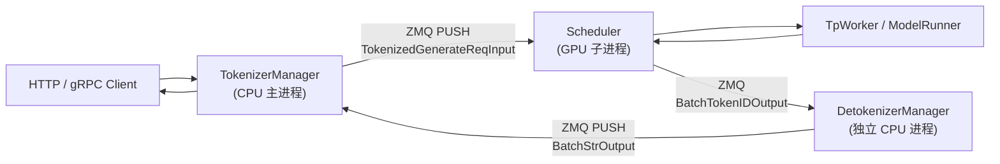

# Scheduler：数据流与交互

> **本模块独有焦点：** Scheduler `event_loop`、overlap batch、retract、PP 边界。 
> ZMQ 三进程拓扑与通道名见 [[06-TokenizerManager-03-数据流与交互|TokenizerManager §3]]（此处不再重复完整 IPC 表）。

---

## 1. 架构位置



**Explain：** Scheduler 与 TokenizerManager **进程隔离**，通过 ZMQ IPC 通信。Scheduler 内部调用同进程 TpWorker 做 CUDA forward。**Scheduler 不直接与 Detokenizer 双向对话**——Scheduler 将 `BatchTokenIDOutput` 发给 Detokenizer，Detokenizer 解码后 PUSH 回 TokenizerManager；TM 的 `handle_loop` 协程唤醒 `ReqState` 并 yield 给 HTTP。

---

## 2. 输入 / 输出类型

| 方向 | 类型 | 说明 | 处理函数 |
|------|------|------|----------|
| 输入 | `TokenizedGenerateReqInput` | 已 tokenize 的生成请求 | `handle_generate_request` |
| 输入 | `TokenizedEmbeddingReqInput` | Embedding 请求 | `handle_embedding_request` |
| 输入 | `AbortReq` / `FlushCacheReqInput` | 控制面 | `abort_request` / `flush_wrapper` |
| 输出 | `BatchStrOutput` 等 | 增量 token / 完成信号 | `output_streamer.stream_output` |
| 输出 | `AbortReq` | 队列满 / timeout / retract abort | `ipc_channels.send_to_tokenizer` |

**Code（Scheduler 消费的 IPC 输入）：**

```python
# 来源：python/sglang/srt/managers/io_struct.py L777-L802
# 提交版本：70df09b
class TokenizedGenerateReqInput(BaseReq, kw_only=True):
    input_text: Optional[Union[str, List[Union[str, List[str]]]]]
    # The input token ids
    input_ids: Optional[array]  # Optional[array[int]]
    # The input embeds
    input_embeds: Optional[List[List[float]]]
    # The multimodal inputs
    mm_inputs: Optional[PickleWrapper]  # Pickled Optional[MultimodalProcessorOutput]
    token_type_ids: Optional[List[int]]
    # The sampling parameters
    sampling_params: SamplingParams
    # Whether to return the logprobs
    return_logprob: bool
    # If return logprobs, the start location in the prompt for returning logprobs.
    logprob_start_len: int
    # If return logprobs, the number of top logprobs to return at each position.
    top_logprobs_num: int
    # If return logprobs, the token id to return logprob for
    token_ids_logprob: Optional[List[int]]
    # Whether to stream output
    stream: bool

    # Whether to return hidden states
    return_hidden_states: bool = False

    # Whether to return captured routed experts
```

**Comment：**

- msgspec Struct，跨进程只读传递；Scheduler 将其转为可变 `Req` 对象（ScheduleBatch-IO）。
- `bootstrap_*` 字段在 PD 分离模式下由 Gateway 填入，见 PD 分离。
- `http_worker_ipc` 用于 multi-tokenizer 模式将输出路由回正确 HTTP worker。

---

## 3. IPC 通道（SchedulerIpcChannels）

**Explain：** rank zero 创建 socket；`send_to_tokenizer` 将 batch 输出序列化发送。

**Code：**

```python
# 来源：python/sglang/srt/managers/scheduler.py L1651-L1671
    @scheduler_nvtx_method("scheduler.process_input_requests")
    def process_input_requests(self, recv_reqs: List):
        now = time.monotonic()
        self.session_controller.maybe_reap(now)
        for recv_req in recv_reqs:
            # Skip health check when server is busy — ongoing requests already carry health info.
            if is_health_check_generate_req(recv_req) and not self.is_fully_idle(
                for_health_check=True
            ):
                self.return_health_check_ipcs.append(
                    getattr(recv_req, "http_worker_ipc", None)
                )
                continue

            output = self._request_dispatcher(recv_req)
            if output is not None:
                if not isinstance(output, RpcReqOutput):
                    self.ipc_channels.send_to_tokenizer.send_output(output, recv_req)
                else:
                    if self.ipc_channels.recv_from_rpc is not None:
                        sock_send(self.ipc_channels.recv_from_rpc, output)
```

**Comment：** Health check 在 busy 时跳过，避免无意义探测；RPC 请求走独立 socket 同步回复。

---

## 4. 典型 Generate 请求数据流（逐步）

### 步骤 1：TokenizerManager → Scheduler（ZMQ）

TokenizerManager 完成 tokenize 后发送 `TokenizedGenerateReqInput`。Scheduler rank0 `sock_recv(NOBLOCK)` 批量拉取。

### 步骤 2：构造 Req 并入 waiting_queue

**Code：**

```python
# 来源：python/sglang/srt/managers/scheduler.py L2288-L2296
    def _add_request_to_queue(self, req: Req, is_retracted: bool = False):
        if not self._set_or_validate_priority(req):
            return
        if self.disaggregation_mode == DisaggregationMode.NULL:
            if self._abort_on_queued_limit(req):
                return
            self._prefetch_kvcache(req)
            self.waiting_queue.append(req)
            req.time_stats.set_wait_queue_entry_time()
```

**Comment：** `_prefetch_kvcache` 可触发 HiCache L3 预取（若启用 hierarchical cache）。

### 步骤 3：Prefill 调度

`get_next_batch_to_run` → `_get_new_batch_prefill_raw` → `PrefillAdder.add_one_req` 从 waiting_queue 取出请求，分配 KV slot，组 `ScheduleBatch(forward_mode=EXTEND)`。

### 步骤 4：GPU Forward

**Code：**

```python
# 来源：python/sglang/srt/managers/scheduler.py L3176-L3183
    def run_batch(
        self,
        batch: ScheduleBatch,
        pp_proxy_tensors: Optional[PPProxyTensors] = None,
    ) -> Union[GenerationBatchResult, EmbeddingBatchResult]:
        """Run a batch."""
        self.forward_ct += 1
        batch.forward_iter = self.forward_ct
```

### 步骤 5：处理结果并 Stream 输出

**Explain：** `SchedulerBatchResultProcessor` 更新每个 `Req` 的 `output_ids`，检查 `finished()`，释放 KV，调用 `output_streamer`。

**Code：**

```python
# 来源：python/sglang/srt/managers/scheduler_components/batch_result_processor.py L82-L99
    def process_batch_result_prebuilt(self, batch: ScheduleBatch):
        assert self.disaggregation_mode == DisaggregationMode.DECODE
        use_free_group = self.server_args.disaggregation_decode_enable_radix_cache
        if use_free_group:
            self.token_to_kv_pool_allocator.free_group_begin()
        for req in batch.reqs:
            req.time_stats.set_decode_prebuilt_finish_time()
            req.update_finish_state()
            if req.finished():
                req.time_stats.set_quick_finish_time()
                if self.server_args.enable_hisparse:
                    self.hisparse_coordinator.request_finished(req)
                release_kv_cache(req, self.tree_cache)

        # Note: Logprobs should be handled on the prefill engine.
        self.output_streamer.stream_output(batch.reqs, batch.return_logprob)
        if use_free_group:
            self.token_to_kv_pool_allocator.free_group_end()
```

**Comment：** 普通 generate 走更完整的 `process_batch_result` 路径（含 logprob、speculative、grammar）；prebuilt 是 disagg decode 接收远端 KV 后的快捷路径。

### 步骤 6：Prefill 完成 → Merge → Decode 循环

上一轮 prefill 的 `last_batch` merge 进 `running_batch`。后续迭代 `update_running_batch` + `prepare_for_decode`，每轮每请求生成 1 token（或 spec 多 token）。

---

## 5. 与 TpWorker 的边界

| Scheduler 职责 | TpWorker 职责 |
|----------------|---------------|
| 选哪些 Req 组成 batch | 构建 `ForwardBatch`、跑模型 |
| 管理 waiting/running 队列 | Attention / MoE 算子执行 |
| KV cache 分配（via allocator） | CUDA Graph 捕获与 replay |
| Retract / abort 策略 | Logits → sampling（或 delay_sample） |

**Code（调用边界）：**

```python
# 来源：python/sglang/srt/managers/scheduler.py L3235-L3237
                        batch_result = self.model_worker.forward_batch_generation(
                            batch, **fwd_kwargs
                        )
```

---

## 6. TP/PP Rank 间同步

**Explain：** 非 rank zero 不直接读 ZMQ；`SchedulerRequestReceiver._broadcast_reqs_across_ranks` 将请求 list 广播到所有 TP（及 PP rank0 链）。

**Code：**

```python
# 来源：python/sglang/srt/managers/scheduler_components/request_receiver.py L101-L113
    def _pull_raw_reqs(self) -> Optional[List]:
        if self.ps.pp_rank == 0:
            if self.ps.attn_tp_rank == 0 and self.ps.attn_cp_rank == 0:
                recv_reqs = []

                while True:
                    try:
                        if self.recv_limit_reached(len(recv_reqs)):
                            break
                        recv_req = sock_recv(self.recv_from_tokenizer, zmq.NOBLOCK)
                    except zmq.ZMQError:
                        break
                    recv_reqs.append(recv_req)
```

**Comment：** PP 非 0 stage 从上一 PP stage 接收 `recv_reqs` 副本（见 `event_loop_pp` 中 `_pp_send_pyobj_to_next_stage`）。

---

## 7. 空闲与负载上报

**Explain：** 无 batch 可跑时调用 `on_idle()`：flush cache、health check 回复、load snapshot 等。`LoadInquirer` 汇总 waiting/running 数量供 `/v1/loads` 使用。

**Code：**

```python
# 来源：python/sglang/srt/managers/scheduler.py L655-L666
    def publish_load_snapshot(self, force: bool = False):
        writer = self.load_snapshot_writer
        if writer is None:
            return
        if not force:
            writer.publish_counter += 1
            if writer.publish_counter < writer.publish_interval:
                return
        writer.publish_counter = 0
        try:
            result = self.load_inquirer.get_loads(GetLoadsReqInput(include=["all"]))
            writer.write(LoadSnapshot.from_get_loads_output(result))
```

---

## 8. 时间线（单请求，overlap 模式）

```
T0 TokenizedGenerateReqInput 到达 ZMQ
T1 handle_generate_request → waiting_queue
T2 get_next_batch_to_run 选中 prefill batch
T3 run_batch(EXTEND) — GPU prefill
T4 process_batch_result — merge to running_batch（可能 T3+1 轮，因 overlap 延迟）
T5 run_batch(DECODE) × N — 每轮 1 token
T6 finished() → stream_output → TokenizerManager → Detokenizer → Client
```
