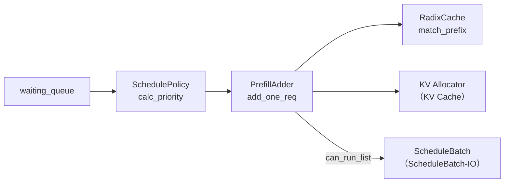

# 调度策略（SchedulePolicy）

> **阶段 II · 请求调度** | 状态：已完成 | Git：`70df09b83363e0127b43c83a6007d3938f815b2d` 
> **源码范围：** `schedule_policy.py`、`prefill_delayer.py`、`min_free_slots_delayer.py`

---

## 本模块在架构中的位置

SchedulePolicy 是 Scheduler **「选谁、能塞几个」** 的决策层。每个 prefill 轮次，Scheduler 在 `_get_new_batch_prefill_raw` 中先调用 `SchedulePolicy.calc_priority` 对 `waiting_queue` 排序（LPM/FCFS/LOF 等），再构造 `PrefillAdder` 在 KV 预算内逐个尝试准入。`PrefillDelayer` 与 `MinFreeSlotsDelayer` 分别处理跨 DP rank 协商延迟 prefill、等待足够空闲 slot 再批量准入。RadixCache 的 `match_prefix`（RadixAttention）支撑 LPM 前缀长度优先策略。



---

## 零基础一句话

**像超市收银台的「排队规则+购物车容量」**：先决定谁先结账（排序策略），再判断购物车还能塞多少商品（KV 预算装箱）。

---

## 用户场景

**Persona：** 性能调优工程师小周发现长 prompt 请求饿死短请求，需要切换 `--schedule-policy lpm`（Longest Prefix Match）并理解 in-batch prefix caching 如何影响排序。她还需知道 `PrefillAdder` 返回 `NO_TOKEN` 时 Scheduler 停止遍历队列的含义。

---

## 五件套阅读顺序

| 顺序 | 文件 | 一句话说明 |
|------|------|------------|
| 01 | [[08-SchedulePolicy-01-核心概念]] | 策略枚举、前缀匹配、预算模型、延迟器动机 |
| 启动链路 | [[08-SchedulePolicy-02-源码走读]] | **主文档**：三文件按调用顺序精读 |
| HTTP Server | [[08-SchedulePolicy-03-数据流与交互]] | 与 Scheduler / RadixCache / KV Pool 的交互 |
| OpenAI API | [[08-SchedulePolicy-04-关键问题]] | 策略选型、NO_TOKEN/OTHER 语义、易错点 |
| ✓ | [[08-SchedulePolicy-05-checkpoint]] | 验收：能否说明 calc_priority 与 PrefillAdder 两阶段 |

---

## 核心源码锚点

**Explain：** 每个 prefill 轮次，Scheduler 在 `_get_new_batch_prefill_raw` 中先调用 `SchedulePolicy.calc_priority` 对等待队列排序，再构造 `PrefillAdder` 逐个尝试准入——这是「策略 + 预算」两阶段调度的核心入口。

**Code：**

```python
# 来源：python/sglang/srt/managers/scheduler.py L2787-L2821
        # Get priority queue
        self.policy.calc_priority(self.waiting_queue, self.running_batch)

        if TEST_RETRACT and running_bs > TEST_RETRACT_NO_PREFILL_BS:
            # If we are testing retraction and the running batch size exceeds
            # TEST_RETRACT_NO_PREFILL_BS, we skip the prefill to keep the requests
            # in the waiting queue.
            return None

        # Determine chunked_prefill_size for this batch
        chunked_prefill_size = self.chunked_prefill_size
        if self.chunked_req is not None and self.enable_dynamic_chunking:
            history_len = len(self.chunked_req.prefix_indices)
            dynamic_size = self.predict_next_chunk_size(history_len)
            if dynamic_size is not None:
                chunked_prefill_size = dynamic_size

        # Prefill policy
        adder = PrefillAdder(
            self.page_size,
            self.tree_cache,
            self.token_to_kv_pool_allocator,
            self.running_batch,
            self.new_token_ratio_tracker.current,
            self.max_prefill_tokens,
            chunked_prefill_size,
            running_bs if self.is_mixed_chunk else 0,
            self.priority_scheduling_preemption_threshold,
            max_prefill_bs=self.max_prefill_bs,
            max_running_requests=self.max_running_requests,
            prefill_max_requests=self.server_args.prefill_max_requests,
            prefill_delayer_single_pass=prefill_delayer_single_pass,
            dllm_config=self.dllm_config,
            waiting_queue_len=len(self.waiting_queue),
        )
```

**Comment：**

- `calc_priority` **原地排序** `waiting_queue`，不移动请求对象，只改变顺序。
- `PrefillAdder` 持有本轮 KV / SWA / Mamba 的剩余预算快照；`add_one_req` 失败时 Scheduler 停止遍历队列。
- 若启用 `PrefillDelayer`，`prefill_delayer_single_pass` 在 `add_one_req` 内部决定是否因延迟而返回 `OTHER`。
- 上一专题（07）负责 event loop；本模块负责「选谁、能塞几个」。

---

## 验证建议

1. **CLI：** `--schedule-policy lpm` 或 `fcfs`，对比相同 workload 下 waiting queue 排序与 TTFT 分布。
2. **日志：** 搜索 `calc_priority` / `PrefillAdder` / `NO_TOKEN`；Prometheus `sglang:queue_time` 反映排队延迟。

---

## 阅读路径

← [[07-Scheduler-00-MOC|Scheduler]] 
→ [[09-ScheduleBatch-IO-00-MOC|ScheduleBatch-IO]]
