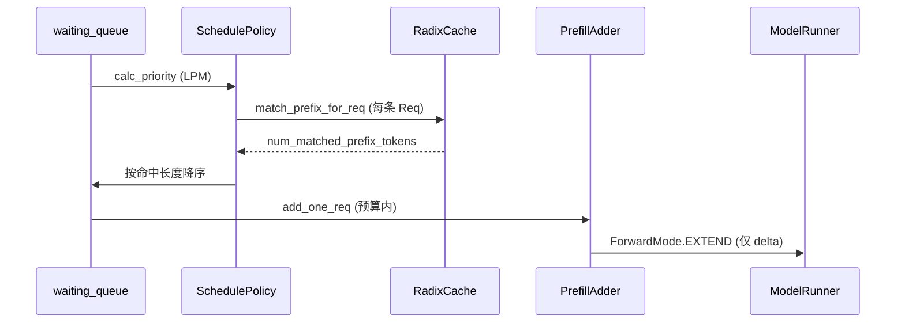
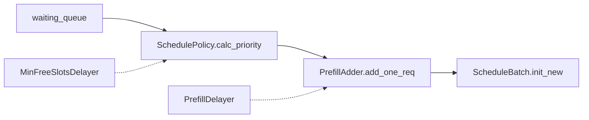

# 调度策略 · 核心概念

## 用户故事：共享 2k System Prompt — LPM 排序如何让 Radix 前缀「先算先共享」

### Persona

**小林**，客服 SaaS 推理工程师（与 [[07-用户故事与场景|故事 A]] 同场景）。平台 800 QPS、每条请求带相同 2k token system prompt。她发现 `--schedule-policy lpm` 下 `cache_hit_rate` 能到 ~0.85，换 `fcfs` 后 TTFT 明显变差——需要理解 **SchedulePolicy 如何把 Radix 命中长度写进 waiting 队列排序**。

### 时间线

| 时刻 | 事件 |
|------|------|
| T0 | 用户 A 首条消息；Scheduler 对完整 prompt extend prefill，RadixCache `insert` 挂树 |
| T0+30s | 用户 B、C… 进入 waiting；`match_prefix_for_req` 为每条 req 写入 `num_matched_prefix_tokens` |
| T1 | `SchedulePolicy.calc_priority` 按 LPM 重排 waiting_queue，高命中请求优先进入 PrefillAdder |
| T2 | PrefillAdder 预算内组 batch；多数请求 `prefix_indices` 已覆盖 2k token，GPU 只算 delta |
| T3 | 监控 `cache_hit_rate` 上升；TTFT 从 420ms 降至 ~90ms |

### 涉及模块



**Explain：** SchedulePolicy 位于 Scheduler 与 RadixCache 之间，承担**排序**（KV 预算未知时）与 **PrefillAdder 准入**（预算已知时）。Cache-Aware 策略（LPM、DFS-WEIGHT）依赖 `match_prefix_for_req` 把 `device_indices` 写入 `req.prefix_indices`，并用 `num_matched_prefix_tokens` 作排序 key。队列 >128 或 `tree_cache.disable` 时会**静默降级 FCFS**。

**Code：**

```python
# 来源：python/sglang/srt/managers/schedule_policy.py L91-L131
# 提交版本：70df09b
def match_prefix_for_req(
    tree_cache: BasePrefixCache,
    req: Req,
    token_ids: Optional[array[int]] = None,
    *,
    cow_mamba: bool = False,
    include_req: bool = False,
):
    if token_ids is None:
        token_ids = req.origin_input_ids + req.output_ids

    match_result = tree_cache.match_prefix(
        MatchPrefixParams(
            key=RadixKey(token_ids=token_ids, extra_key=req.extra_key),
            cow_mamba=cow_mamba,
            req=req if include_req else None,
        )
    )
    if envs.SGLANG_RADIX_FORCE_MISS.get():
        match_result = zero_match_result(tree_cache, match_result)
    (
        req.prefix_indices,
        req.last_node,
        req.last_host_node,
        req.best_match_node,
        req.host_hit_length,
        req.swa_host_hit_length,
        req.mamba_host_hit_length,
    ) = (
        match_result.device_indices,
        match_result.last_device_node,
        match_result.last_host_node,
        match_result.best_match_node,
        match_result.host_hit_length,
        match_result.swa_host_hit_length,
        match_result.mamba_host_hit_length,
    )
    max_len = req._compute_max_prefix_len(len(token_ids))
    req.num_matched_prefix_tokens = min(
        len(req.prefix_indices) + req.host_hit_length, max_len
    )
```

**Comment：**

- `extra_key` 来自 OpenAI 层 `_compute_extra_key`；各租户 LoRA adapter 不同则**不能**共享 system 前缀。
- 批内前缀优化：全局命中短时，模拟 Radix 树检测 waiting 内共享前缀，deprioritize 重复计算（见 §4）。
- `SGLANG_RADIX_FORCE_MISS=1` 可强制 miss，用于 A/B 验证 prefix cache 收益。

### 如果…会怎样（调试）

| 现象 | 可能原因 | 排查 |
|------|----------|------|
| `cache_hit_rate` 始终为 0 | system prompt 含动态 timestamp | 检查 chat template |
| LPM 无效、行为像 FCFS | waiting_queue >128 自动降级 | 显式 `--schedule-policy fcfs` 对比 |
| 命中长度只有几百 token | `extra_key` 不一致（LoRA、routing_key） | 对比 `GenerateReqInput.extra_key` |

---

## 1. 模块在架构中的角色

**Explain：** `SchedulePolicy` 模块位于 Scheduler 与 RadixCache / KV Pool 之间，承担两类决策：

1. **排序（SchedulePolicy）**：在 KV 预算未知时，决定 `waiting_queue` 的处理顺序——最大化前缀命中或公平性。
2. **准入（PrefillAdder）**：在已知剩余 token / slot 预算时，决定哪些请求能进入本轮 prefill batch。

此外还有两个**可选延迟器**，在 prefill 真正开始前「再等等」，以换取更大 batch 或更高 GPU 利用率。



| 组件 | 输入 | 输出 | 何时运行 |
|------|------|------|----------|
| `SchedulePolicy` | 等待队列 + running batch | 排序后的队列 | 每轮 prefill 开始 |
| `PrefillAdder` | 单个 `Req` + 预算快照 | `AddReqResult` + `can_run_list` | 排序后逐个尝试 |
| `PrefillDelayer` | 各 rank KV 使用率 + 队列长度 | allow / delay | `add_one_req` 内 |
| `MinFreeSlotsDelayer` | running_bs + 可分配 slot 数 | delay / proceed | prefill 轮次入口 |

---

## 2. 调度策略枚举

**Explain：** 策略分为 **Cache-Aware**（感知 Radix 前缀树）与 **Cache-Agnostic**（不读树）。CLI 参数 `--schedule-policy` 传入字符串，构造时校验并可能降级。

**Code：**

```python
# 来源：python/sglang/srt/managers/schedule_policy.py L139-L153
class CacheAwarePolicy(Enum):
    """Scheduling policies that are aware of the tree cache."""

    LPM = "lpm"  # longest prefix match
    DFS_WEIGHT = "dfs-weight"  # depth-first search weighting


class CacheAgnosticPolicy(Enum):
    """Scheduling policies that are not aware of the tree cache."""

    FCFS = "fcfs"  # first come first serve
    LOF = "lof"  # longest output first
    RANDOM = "random"
    ROUTING_KEY = "routing-key"  # prioritize by routing key frequency in running batch

```

**Comment：**

| 策略 | 含义 | 典型场景 |
|------|------|----------|
| `lpm` | 最长前缀匹配优先 | 共享 system prompt、RAG 前缀 |
| `dfs-weight` | 按 Radix 树 DFS 权重排序 | 希望同分支请求连续调度 |
| `fcfs` | 先到先服务（默认降级） | 公平性、队列 >128 时 LPM 自动降级 |
| `lof` | 最长 `max_new_tokens` 优先 | 长输出任务优先 |
| `random` | 随机打乱 | 压测、避免系统性偏置 |
| `routing-key` | 与 running batch 同 routing_key 优先 | 多租户 / PD 路由亲和 |

若 `tree_cache.disable == True`，即使指定 LPM 也会**静默降级为 FCFS**。

---

## 3. 前缀匹配：`match_prefix_for_req`

**Explain：** Cache-Aware 策略和（部分）Cache-Agnostic 策略都需要 `req.num_matched_prefix_tokens`。该函数封装了对 `tree_cache.match_prefix` 的调用，并把结果写回 `Req` 的多个字段。

**Code：**

```python
# 来源：python/sglang/srt/managers/schedule_policy.py L91-L136
def match_prefix_for_req(
    tree_cache: BasePrefixCache,
    req: Req,
    token_ids: Optional[array[int]] = None,
    *,
    cow_mamba: bool = False,
    include_req: bool = False,
):
    if token_ids is None:
        token_ids = req.origin_input_ids + req.output_ids

    match_result = tree_cache.match_prefix(
        MatchPrefixParams(
            key=RadixKey(token_ids=token_ids, extra_key=req.extra_key),
            cow_mamba=cow_mamba,
            req=req if include_req else None,
        )
    )
    if envs.SGLANG_RADIX_FORCE_MISS.get():
        match_result = zero_match_result(tree_cache, match_result)
    (
        req.prefix_indices,
        req.last_node,
        req.last_host_node,
        req.best_match_node,
        req.host_hit_length,
        req.swa_host_hit_length,
        req.mamba_host_hit_length,
    ) = (
        match_result.device_indices,
        match_result.last_device_node,
        match_result.last_host_node,
        match_result.best_match_node,
        match_result.host_hit_length,
        match_result.swa_host_hit_length,
        match_result.mamba_host_hit_length,
    )
    max_len = req._compute_max_prefix_len(len(token_ids))
    req.num_matched_prefix_tokens = min(
        len(req.prefix_indices) + req.host_hit_length, max_len
    )
    if match_result.mamba_branching_seqlen is not None:
        req.mamba_branching_seqlen = match_result.mamba_branching_seqlen
    if match_result.cache_protected_len is not None:
        req.cache_protected_len = match_result.cache_protected_len
    return match_result
```

**Comment：**

- `prefix_indices`：设备侧已命中 KV 的 token 索引（tensor）。
- `host_hit_length`：分层缓存（HiCache）在 host 侧命中的长度，准入时会触发 `init_load_back`。
- `num_matched_prefix_tokens` 是 LPM 排序的 key；批内前缀逻辑也依赖 `prefix_indices` 长度。

---

## 4. 批内前缀缓存（In-Batch Prefix Caching）

**Explain：** 当多个等待请求与**全局 Radix 树**匹配都很短，但彼此共享长前缀时，若同时调度它们会重复计算。策略会：

1. 用模拟 Radix 树 `waiting_queue_radix_tree` 检测批内共享前缀；
2. 对「批内匹配过长」的请求 **deprioritize**（排到队尾）；
3. 对首个请求 **insert** 进模拟树，让后续同前缀请求被降权。

关键阈值（环境变量可调）：

| 常量 | 默认 | 含义 |
|------|------|------|
| `IN_BATCH_PREFIX_CACHING_CHECK_THRESHOLD` | 32 | 全局匹配 ≤ 此值才做批内检查 |
| `IN_BATCH_PREFIX_CACHING_DEPRIORITIZE_THRESHOLD` | 32 | 批内匹配 ≥ 此值则 deprioritize |

---

## 5. PrefillAdder 预算模型

**Explain：** `PrefillAdder` 维护多层「剩余预算」，准入每个请求时扣减：

| 属性 | 含义 |
|------|------|
| `rem_total_tokens` | KV pool 可用 + 可驱逐 − 已预留（含 running decode 预估） |
| `cur_rem_tokens` | 本轮 prefill 即时占用上限 |
| `rem_input_tokens` | 本轮 prefill token 总量上限（`max_prefill_tokens`） |
| `rem_chunk_tokens` | 分块 prefill 单块上限 |
| `rem_swa_tokens` | Sliding Window Attention 专用池 |
| `rem_mamba_slots` | Mamba 状态 slot（与 full KV 解耦计数） |

`AddReqResult` 三态：

- `CONTINUE` — 还能继续加请求
- `NO_TOKEN` — KV / SWA / Mamba 不足
- `OTHER` — 其他限制（chunk 用完、delayer 拒绝、prefill_max_requests 等）

`CLIP_MAX_NEW_TOKENS`（默认 4096）用于**估算** decode 占用，不改变实际 stop 条件。

---

## 6. 两类延迟器的设计动机

**Explain：** SGLang 有两类 prefill 延迟器，解决不同瓶颈。**PrefillDelayer** 在 overlap + DP 场景跨 rank `all_gather` 协商，避免 prefill 插入导致 decode batch 跑不满；**MinFreeSlotsDelayer** 在单 rank 等待 `num_allocatable_reqs >= min_free_slots`，把高成本 prefill（如 DFlash draft）批量准入而非逐个插入。

**Code：**

```python
# 来源：python/sglang/srt/managers/min_free_slots_delayer.py L4-L25
def resolve_min_free_slots(
    user_value: Optional[int],
    max_running_requests: int,
    is_dflash: bool = False,
) -> Optional[int]:
    """Resolve the min-free-slots threshold (None = disabled).

    A user value (>1) is capped to the DFlash formula so the trigger never
    delays more aggressively than the legacy heuristic. When unset, DFlash
    workloads fall back to the formula (preserving the always-on behavior);
    other workloads stay disabled. Also disabled when max_running_requests < 8.
    """
    max_running_requests = max(0, int(max_running_requests))
    formula = min(4, max(2, (max_running_requests + 5) // 6))
    if user_value is None:
        user_value = formula if is_dflash else None

    if user_value is None or user_value <= 1:
        return None
    if max_running_requests < 8:
        return None
    return min(user_value, formula)
```

**Comment：**

- 公式 `min(4, max(2, (max_running_requests + 5) // 6))` 是 DFlash 的历史启发式。
- `max_running_requests < 8` 时禁用，避免小 batch 场景过度延迟。
- 用户值会被 cap 到公式，**不会比 legacy 更激进地 delay**。
