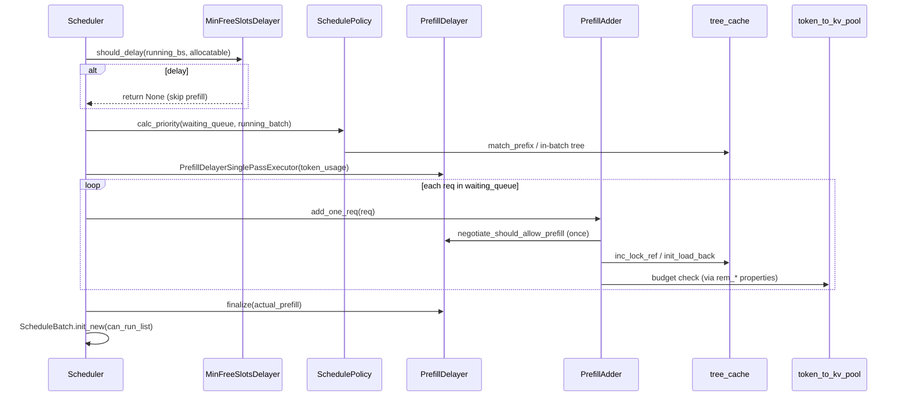

# 调度策略：数据流与交互

> **本模块独有焦点：** 等待队列 → prefill batch 的**决策时序**（MinFreeSlotsDelayer → SchedulePolicy → PrefillAdder）。 
> 通用 ZMQ / Req 类型见 [[06-TokenizerManager-03-数据流与交互|TokenizerManager]] 与 [[09-ScheduleBatch-IO-03-数据流与交互|ScheduleBatch-IO]]。

---

## 1. 架构位置

**Explain：** 本模块属于 **Scheduler 子系统**，在「等待队列 → prefill batch」转换阶段运行。它不直接执行 model forward，只决定**顺序**与**准入**。



---

## 2. 输入 / 输出

| 方向 | 类型 | 说明 | 产出方 |
|------|------|------|--------|
| 输入 | `List[Req]` waiting_queue | 等待 prefill 的请求 | Scheduler 队列管理 |
| 输入 | `ScheduleBatch` running_batch | 当前 decode batch | Scheduler |
| 输入 | `BasePrefixCache` tree_cache | Radix / HiCache | mem_cache（RadixAttention） |
| 输入 | `BaseTokenToKVPoolAllocator` | KV slot 分配器 | mem_cache（KV Cache） |
| 输出 | 排序后的 waiting_queue | 原地 sort | `SchedulePolicy.calc_priority` |
| 输出 | `List[Req]` can_run_list | 本轮准入的请求 | `PrefillAdder` |
| 输出 | `AddReqResult` | CONTINUE / NO_TOKEN / OTHER | `add_one_req` |
| 输出 | `List[Req]` preempt_list | 被抢占回 waiting 的请求 | `preempt_to_schedule` |

---

## 3. 上下游连接

| 上游/下游 | 模块 | 交互方式 | 说明 |
|-----------|------|----------|------|
| 上游 | `scheduler.py` | 直接调用 | `init_schedule_policy` / `get_new_batch_prefill` |
| 上游 | `server_args.py` | 配置 | `schedule_policy`, `enable_prefill_delayer`, `min_free_slots_delay` |
| 下游 | `schedule_batch.py` | `ScheduleBatch.init_new` | 用 `can_run_list` 构造 batch |
| 下游 | `metrics_reporter.py` | `PrefillAdder` log_* 字段 | prefix hit rate、delayer outcome |
| peer | `radix_cache.py` | match/insert/lock | LPM 排序与准入锁 |
| peer | KV allocators | available/evictable size | 预算计算 |

**Code — Scheduler 初始化策略与 MinFreeSlots：**

```python
# 来源：python/sglang/srt/managers/scheduler.py L887-L896, L1038-L1068
        self.min_free_slots_delayer: Optional[MinFreeSlotsDelayer] = None
        min_free_slots = resolve_min_free_slots(
            self.server_args.min_free_slots_delay,
            self.max_running_requests,
            is_dflash=self.spec_algorithm.is_dflash(),
        )
        if min_free_slots is not None:
            self.min_free_slots_delayer = MinFreeSlotsDelayer(
                min_free_slots=min_free_slots
            )
```

**Comment：**

- MinFreeSlots 与 PrefillDelayer **独立构造**，可同时存在；生效顺序见 §4。
- decode disaggregation 节点忽略 PrefillDelayer（无 prefill 路径）。

---

## 4. 典型数据流：一轮 prefill 调度

### 步骤 1 — 入口包装 PrefillDelayer

**Explain：** `get_new_batch_prefill` 在 raw 逻辑外包一层 single-pass executor，保证每 forward pass 只 all_gather 一次。

**Code：**

```python
# 来源：python/sglang/srt/managers/scheduler.py L2721-L2738
    def get_new_batch_prefill(self) -> Optional[ScheduleBatch]:
        prefill_delayer_single_pass = None
        if self.prefill_delayer:
            # Get max usage across all pools for prefill delay decision
            max_pool_usage = (
                self.pool_stats_observer.get_pool_stats().get_max_pool_usage()
            )
            prefill_delayer_single_pass = PrefillDelayerSinglePassExecutor(
                self.prefill_delayer, token_usage=max_pool_usage
            )

        ret = self._get_new_batch_prefill_raw(
            prefill_delayer_single_pass=prefill_delayer_single_pass
        )

        if self.prefill_delayer:
            prefill_delayer_single_pass.finalize(actual_prefill=ret is not None)

```

**Comment：** `token_usage` 取所有 pool 的最大使用率，用于低水位强制放行。

---

### 步骤 2 — MinFreeSlots 门禁

**Code：**

```python
# 来源：python/sglang/srt/managers/scheduler.py L2762-L2772
        running_bs = len(self.running_batch.reqs)
        # Skipped during a chunked prefill: that pass must proceed regardless.
        if (
            self.min_free_slots_delayer is not None
            and self.chunked_req is None
            and self.min_free_slots_delayer.should_delay(
                running_bs=running_bs,
                num_allocatable_reqs=self.get_num_allocatable_reqs(running_bs),
            )
        ):
            return None
```

**Comment：** `chunked_req is not None` 时必须继续——否则分块 prefill 中间态会内存泄漏。

---

### 步骤 3 — 排序 + 遍历 waiting_queue

**Code：**

```python
# 来源：python/sglang/srt/managers/scheduler.py L2787-L2879
        # Get priority queue
        self.policy.calc_priority(self.waiting_queue, self.running_batch)

        if TEST_RETRACT and running_bs > TEST_RETRACT_NO_PREFILL_BS:
            # If we are testing retraction and the running batch size exceeds
            # TEST_RETRACT_NO_PREFILL_BS, we skip the prefill to keep the requests
            # in the waiting queue.
            return None

        # Determine chunked_prefill_size for this batch
        chunked_prefill_size = self.chunked_prefill_size
        if self.chunked_req is not None and self.enable_dynamic_chunking:
            history_len = len(self.chunked_req.prefix_indices)
            dynamic_size = self.predict_next_chunk_size(history_len)
            if dynamic_size is not None:
                chunked_prefill_size = dynamic_size

        # Prefill policy
        adder = PrefillAdder(
            self.page_size,
            self.tree_cache,
            self.token_to_kv_pool_allocator,
            self.running_batch,
            self.new_token_ratio_tracker.current,
            self.max_prefill_tokens,
            chunked_prefill_size,
            running_bs if self.is_mixed_chunk else 0,
            self.priority_scheduling_preemption_threshold,
            max_prefill_bs=self.max_prefill_bs,
            max_running_requests=self.max_running_requests,
            prefill_max_requests=self.server_args.prefill_max_requests,
            prefill_delayer_single_pass=prefill_delayer_single_pass,
            dllm_config=self.dllm_config,
            waiting_queue_len=len(self.waiting_queue),
        )

        if self.chunked_req is not None:
            self.chunked_req.init_next_round_input()
            self.chunked_req = adder.add_chunked_req(self.chunked_req)

        if self.enable_lora:
            running_loras = {
                req.lora_id for req in self.running_batch.reqs if not req.finished()
            }
            # Account for LoRAs that are already loaded in the adder, such as chunked requests
            running_loras.update(req.lora_id for req in adder.can_run_list)

            if self.lora_drainer:
                self.lora_drainer.update_draining_state(
                    self.waiting_queue,
                    self.running_batch.reqs,
                )

        mamba_allocator = getattr(self.req_to_token_pool, "mamba_allocator", None)
        if mamba_allocator is not None:
            mamba_allocator.alloc_group_begin(len(self.waiting_queue))
        # Get requests from the waiting queue to a new prefill batch
        for req in self.waiting_queue:
            if self.enable_lora and not self._can_schedule_lora_req(req, running_loras):
                continue

            running_bs = len(self.running_batch.reqs)
            if len(adder.can_run_list) >= self.get_num_allocatable_reqs(running_bs):
                self.running_batch.batch_is_full = True
            if self.disaggregation_mode == DisaggregationMode.PREFILL:
                # In prefill mode, prealloc queue and transfer queue can also take memory,
                # so we need to check if the available size for the actual available size.
                if len(adder.can_run_list) >= self.req_to_token_pool.available_size():
                    self.running_batch.batch_is_full = True

            if self.running_batch.batch_is_full:
                if (
                    not self.enable_priority_preemption
                    or not adder.preempt_to_schedule(req, self.server_args)
                ):
                    break

            if self.enable_hicache_storage:
                prefetch_done = self.tree_cache.check_prefetch_progress(req.rid)
                if not prefetch_done:
                    # skip staging requests that are ongoing prefetch
                    continue
                # Pop the number of tokens loaded from storage (L3 hits)
                req.storage_hit_length = self.tree_cache.pop_prefetch_loaded_tokens(
                    req.rid
                )

            req.init_next_round_input(self.tree_cache)
            res = adder.add_one_req(
                req,
                has_chunked_req=(self.chunked_req is not None),
                truncation_align_size=self.truncation_align_size,
            )
```

**Comment：**

- `init_next_round_input` 在 `add_one_req` 之前——确保 `full_untruncated_fill_ids` 等字段最新。
- `NO_TOKEN` 时若 `can_run_list` 非空，Scheduler 仍会用已准入请求建 batch（hierarchical cache 分支有特殊 `batch_is_full` 逻辑）。

---

### 步骤 4 — 输出 can_run_list

**Code：**

```python
# 来源：python/sglang/srt/managers/scheduler.py L2912-L2934
        # Update waiting queue
        can_run_list: List[Req] = adder.can_run_list
        if len(can_run_list) == 0:
            return None

        can_run_set = set(can_run_list)
        self.waiting_queue = [x for x in self.waiting_queue if x not in can_run_set]
        if adder.preempt_list:
            for req in adder.preempt_list:
                self._add_request_to_queue(req)

        if adder.new_chunked_req is not None:
            # Update chunked prefill
            assert self.chunked_req is None
            self.chunked_req = adder.new_chunked_req

        if self.chunked_req is not None:
            self.chunked_req.inflight_middle_chunks += 1

        set_time_batch(can_run_list, "set_forward_entry_time")

        # Create a new batch
        new_batch = ScheduleBatch.init_new(
```

**Comment：**

- 被抢占的请求回到 waiting_queue 头部/尾部由 `_add_request_to_queue` 决定。
- `new_chunked_req` 标记分块 prefill 进行中，下一轮继续 `add_chunked_req`。

---

## 5. PrefillDelayer 的分布式同步

**Explain：** `_gather_info` 使用 `torch.distributed.all_gather_into_tensor` 汇总各 rank 的 5 元组，只在 TP0 行做决策（`tp0_info = buffer[:, 0, :]`）。

**Code：**

```python
# 来源：python/sglang/srt/managers/prefill_delayer.py L303-L328
    def _gather_info(
        self,
        local_prefillable: bool,
        local_token_watermark_force_allow: bool,
        running_batch: int = 0,
        max_prefill_bs: int = 0,
        waiting_queue_len: int = 0,
    ):
        local_info = torch.tensor(
            [
                int(local_prefillable),
                int(local_token_watermark_force_allow),
                running_batch,
                max_prefill_bs,
                waiting_queue_len,
            ],
            device=self._gather_device,
            dtype=torch.int64,
        )
        torch.distributed.all_gather_into_tensor(
            self._global_info_buffer.flatten(),
            local_info,
            group=self._gather_group,
        )
        tp0_info = self._global_info_buffer[:, 0, :]
        return tp0_info
```

**Comment：**

- DP attention 模式下 buffer 第一维为 `dp_size`；否则为 1。
- NCCL vs gloo 选择逻辑与 `scheduler_dp_attn_mixin` 保持一致，避免 sync batch 路径不一致。

---

## 6. 与Scheduler / 09 的边界

| 模块 | 边界 |
|------|------|
| **07 Scheduler** | event loop、`get_next_batch_to_run` 决定 prefill vs decode；本模块只在 prefill 分支内 |
| **09 ScheduleBatch** | `Req` / `ScheduleBatch` 字段定义；本模块消费但不定义 |
| **15 RadixAttention** | `match_prefix` / `inc_lock_ref` 实现细节 |
| **16 KV Cache** | allocator `available_size` 语义 |
