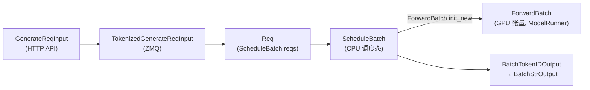

# ScheduleBatch-IO：ScheduleBatch 与 IO 结构

> **阶段 II · 请求调度** | Git：`70df09b83363e0127b43c83a6007d3938f815b2d` 
> **源码范围：** `schedule_batch.py`、`io_struct.py`、`embed_types.py`

---

## 本模块在架构中的位置

本模块定义 SGLang **调度层与跨进程 IPC 的数据契约**。`Req` 携带单请求生命周期状态；`ScheduleBatch` 是 Scheduler 管理的 CPU 侧调度批次，在 forward 前转换为 GPU 侧 `ForwardBatch`（ModelRunner）。`io_struct.py` 定义 TokenizerManager ↔ Scheduler ↔ Detokenizer 之间的 ZMQ 消息类型（msgpack / PickleWrapper）。三层分离：HTTP 层 `GenerateReqInput` → Tokenizer 层 `TokenizedGenerateReqInput` → Scheduler 层 `Req` → 输出层 `BatchTokenIDOutput` / `BatchStrOutput`。



---

## 零基础一句话

**像物流系统的「运单+集装箱规格书」**：Req 是单个包裹标签，ScheduleBatch 是装车清单（CPU），ForwardBatch 是实际上车的集装箱（GPU 张量）。

---

## 用户场景

**Persona：** 集成工程师小韩在自定义客户端时搞混了 HTTP 请求体与 Scheduler 内部 `Req` 字段。她需要理解 `ScheduleBatch.init_new` 与 `prepare_for_extend`/`prepare_for_decode` 何时填充 prefix_lens、extend_lens，以及 msgpack 与 PickleWrapper 哪些字段走强类型序列化。

---

## 五件套阅读顺序

| 顺序 | 文件 | 一句话说明 |
|------|------|------------|
| 01 | [[09-ScheduleBatch-IO-01-核心概念]] | Req / ScheduleBatch / IPC 分层术语 |
| 02 | [[09-ScheduleBatch-IO-02-源码走读]] | **主文档**：三文件按调用顺序精读 |
| 03 | [[09-ScheduleBatch-IO-03-数据流与交互]] | HTTP → Scheduler → 输出的完整 IPC 链路 |
| 04 | [[09-ScheduleBatch-IO-04-关键问题]] | ScheduleBatch vs ForwardBatch、PickleWrapper、多模态 pad |
| ✓ | [[09-ScheduleBatch-IO-05-checkpoint]] | 验收：能否画出 Req → ScheduleBatch → ForwardBatch 转换时机 |

---

## 核心源码锚点

**Explain：** 模块 docstring 直接声明了数据结构的层级关系。`ScheduleBatch` 是 Scheduler 管理的「调度批次」，`ForwardBatch` 是 ModelRunner 管理的「执行批次」——后者由前者在 forward 前通过 `ForwardBatch.init_new` 转换而来。

**Code：**

```python
## 来源：python/sglang/srt/managers/schedule_batch.py L25-L37
"""
Store information about requests and batches.

The following is the flow of data structures for a batch:

ScheduleBatch -> ForwardBatch

- ScheduleBatch is managed by `scheduler.py::Scheduler`.
  It contains high-level scheduling data. Most of the data is on the CPU.
- ForwardBatch is managed by `model_runner.py::ModelRunner`.
  It contains low-level tensor data. Most of the data consists of GPU tensors.
  It is constructed directly from a ScheduleBatch by `ForwardBatch.init_new`.
"""
```

**Comment：**

- 英文 docstring 的核心意思：`ScheduleBatch` 是 Scheduler 管理的高层调度数据，多数在 CPU；`ForwardBatch` 是 ModelRunner 管理的低层张量数据，多数在 GPU，由 `ForwardBatch.init_new` 从 `ScheduleBatch` 构造。
- **ScheduleBatch** 持有 `reqs: List[Req]` 及 CPU 侧调度元数据（prefix_lens、extend_lens、chunked_req 等）。
- **ForwardBatch** 在 `ModelRunner.forward` 前由 `ForwardBatch.init_new(batch)` 抽取 GPU 张量（input_ids、seq_lens、out_cache_loc 等）。
- **io_struct.py** 定义**进程间**传输结构——TokenizerManager ↔ Scheduler ↔ DetokenizerManager 走 ZMQ + msgpack。
- **embed_types.py** 的 `PositionalEmbeds` 独立模块，避免 schedule_batch 与 model 循环 import。

---

## 验证建议

1. **CLI：** 启动服务后观察 ZMQ port 绑定日志（`port_args`），确认 tokenizer/scheduler/detokenizer 三进程 IPC 通道。
2. **日志：** 调试模式下搜索 `ScheduleBatch` / `ForwardBatch.init_new`；batch 组包时可见 `prepare_for_extend` 相关 trace。

---

## 阅读路径

← [[08-SchedulePolicy-00-MOC|SchedulePolicy]] 
→ [[10-Detokenizer-00-MOC|Detokenizer]]
