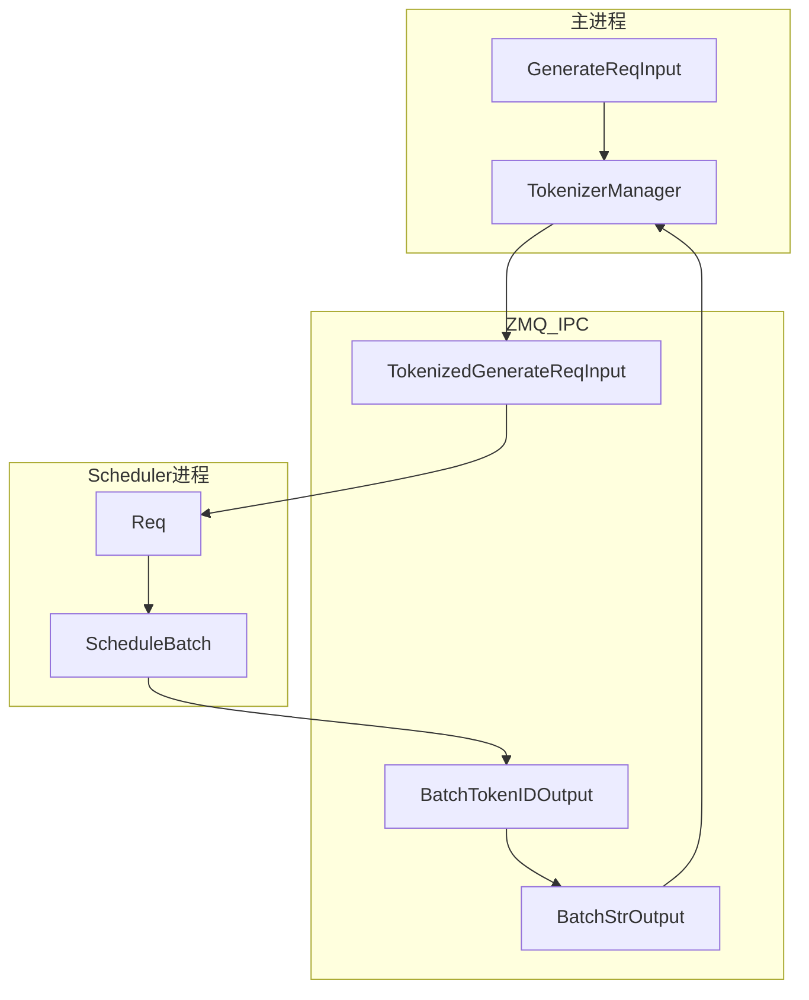

# ScheduleBatch-IO · 核心概念

> 本模块聚焦 SGLang 调度层的**数据结构层**——请求对象（Req）、批次对象（ScheduleBatch）与跨进程 IO 结构（io_struct）。

---

## 用户故事：调试「Scheduler 收到了什么」— 从 HTTP JSON 到 ScheduleBatch 的三层结构

### Persona

**老陈**，集成工程师。客户报「同一 prompt 有时快有时慢」，他需要在 **不读 GPU kernel** 的前提下，搞清一条请求在进程间传递时**长什么样**：HTTP 层 `GenerateReqInput`、ZMQ 层 `TokenizedGenerateReqInput`、Scheduler 内 `Req` + `ScheduleBatch`。

### 时间线

| 时刻 | 事件 |
|------|------|
| T0 | HTTP POST `{"text":"...", "sampling_params":{...}}` → `GenerateReqInput`（Pydantic dataclass，主进程） |
| T0+3ms | TokenizerManager 分词 → `TokenizedGenerateReqInput`（msgspec.Struct，`input_ids=array[int]`）经 ZMQ 发送 |
| T0+5ms | Scheduler 反序列化，构造 `Req`，挂入 `waiting_queue` |
| T1 | 组 batch 时 `ScheduleBatch.init_new(reqs=[...])`，含 `prefix_indices`、KV pool 引用 |
| T2 | `ScheduleBatch → ForwardBatch.init_new`（ModelRunner）；Detokenizer 侧走 `BatchTokenIDOutput` / `BatchStrOutput` 回程 |

### 涉及模块



**Explain：** 本模块文档覆盖**调度层数据结构**：`io_struct.py` 定义跨进程 msgspec 消息；`schedule_batch.py` 定义进程内 `Req`（~100+ 字段的生命周期对象）与 `ScheduleBatch`（一次 forward 的请求集合 + 批次级张量）。刻意分离 ScheduleBatch 与 ForwardBatch——Scheduler 在 CPU 做策略，ModelRunner 只消费 GPU 张量，减少 forward 路径 Python 开销。

**Code：**

```python
# 来源：python/sglang/srt/managers/io_struct.py L74-L93
# 提交版本：70df09b
class BaseReq(msgspec.Struct, tag=True, kw_only=True, array_like=True):
    """Base for single-request IPC payloads."""

    rid: Optional[str] = None
    http_worker_ipc: Optional[str] = None

    @classmethod
    def __get_pydantic_core_schema__(cls, source, handler):
        return msgspec_struct_pydantic_core_schema(cls, handler)


class BaseBatchReq(msgspec.Struct, tag=True, kw_only=True, array_like=True):
    """Base for batched IPC payloads."""

    rids: Optional[List[str]] = None
    http_worker_ipcs: Optional[List[Optional[str]]] = None

    @classmethod
    def __get_pydantic_core_schema__(cls, source, handler):
        return msgspec_struct_pydantic_core_schema(cls, handler)
```

**Comment：**

- `tag=True` 让 msgpack 解码时自动选择子类（如 `TokenizedGenerateReqInput` vs `AbortReq`）。
- `GenerateReqInput` **不是** `BaseReq` 子类——只在 HTTP 进程内，不走 ZMQ。
- `http_worker_ipc` 多 Worker 模式下把 Detokenizer 输出路由回发起请求的 HTTP worker。

### 如果…会怎样（调试）

| 现象 | 可能原因 | 排查 |
|------|----------|------|
| Scheduler 侧 rid 与 HTTP 不一致 | batch 请求共用 prefix 的 rid 生成规则 | 看 `GenerateReqInput.rid` 归一化 |
| 多模态字段丢失 | 复杂对象需 `PickleWrapper` | 对比 `io_struct` 中 pickle 字段 |
| prefix 命中但 extend 仍全长 | `Req.prefix_indices` 未写入 | 走读 `ScheduleBatch.init_new` / `match_prefix` |

---

## 1. 架构位置

ScheduleBatch / IO 结构位于 **阶段 II 调度链的中间层**：

```
HTTP/OpenAI API
 ↓ GenerateReqInput（Pydantic dataclass，HTTP 层）
TokenizerManager
 ↓ TokenizedGenerateReqInput（msgspec，ZMQ IPC）
Scheduler
 ↓ Req + ScheduleBatch（Python 对象，进程内）
ModelRunner
 ↓ ForwardBatch（GPU 张量，ModelRunner）
DetokenizerManager
 ↓ BatchTokenIDOutput → BatchStrOutput（msgspec，ZMQ IPC）
TokenizerManager → HTTP 响应
```

**Explain：** 本模块文档覆盖上图中间两段——IPC 结构体（io_struct）与调度器内部结构（schedule_batch）。Scheduler 本身的事件循环逻辑在Scheduler，调度策略在调度策略。

---

## 2. 核心术语

| 术语 | 定义 | 所在文件 |
|------|------|----------|
| **Req** | 单条请求的完整生命周期状态：输入 token、输出 token、KV 池索引、prefix cache 命中、finish reason、logprob 等 | `schedule_batch.py` |
| **ScheduleBatch** | 一次 forward 所涉及的 Req 集合 + 批次级 GPU/CPU 张量 + 调度标志 | `schedule_batch.py` |
| **ForwardBatch** | ModelRunner 消费的 GPU 侧执行批次（由 ScheduleBatch 转换，ModelRunner 详述） | `forward_batch_info.py` |
| **GenerateReqInput** | HTTP/API 层的原始生成请求，支持 text/input_ids/多模态，Pydantic 风格 dataclass | `io_struct.py` |
| **TokenizedGenerateReqInput** | Tokenizer 完成分词后发给 Scheduler 的 IPC 消息，msgspec.Struct | `io_struct.py` |
| **BatchTokenIDOutput** | Scheduler → Detokenizer 的 token 级输出（未 detokenize） | `io_struct.py` |
| **BatchStrOutput** | Detokenizer → Tokenizer 的字符串级输出 | `io_struct.py` |
| **PositionalEmbeds** | 在指定 token 位置注入自定义 embedding | `embed_types.py` |
| **PickleWrapper** | msgpack 无法直接序列化的字段的 pickle 包装 | `io_struct.py` |

---

## 3. ScheduleBatch 的三层字段分组

**Explain：** `ScheduleBatch` 是一个 dataclass，字段按注释分为四组——核心请求列表、引擎级共享资源、批次级调度状态、以及跨越到 ForwardBatch 的 GPU 张量。理解这个分组有助于区分「Scheduler 独有」与「会传给 ModelRunner」的字段。

**Code：**

```python
# 来源：python/sglang/srt/managers/schedule_batch.py L1674-L1696
class ScheduleBatch(ScheduleBatchDisaggregationDecodeMixin):
    """Store all information of a batch on the scheduler."""

    # === Core: request list (ForwardBatch derives lora_ids / rids / grammars / positions from it) ===
    reqs: List[Req]

    # === Global config and shared resources (engine-lifetime; identical across batches) ===
    # Memory pool and cache
    req_to_token_pool: ReqToTokenPool = None
    token_to_kv_pool_allocator: BaseTokenToKVPoolAllocator = None
    tree_cache: BasePrefixCache = None

    # Batch configs
    model_config: ModelConfig = None
    enable_overlap: bool = False

    # Device
    device: str = "cuda"

    # HiSparse (engine-level coordinator ref, same across batches)
    hisparse_coordinator: Optional[HiSparseCoordinator] = None

    # === Batch-variant scheduler state (per-batch; not read by ForwardBatch) ===
```

**Comment：**

- `reqs` 是唯一「每条请求不同」的核心列表；ForwardBatch 从中派生 lora_ids、grammars 等。
- `req_to_token_pool` / `token_to_kv_pool_allocator` / `tree_cache` 是引擎级单例引用，所有 batch 共享。
- 后续字段（L1696 起）包括 `batch_is_full`、`chunked_req`、GPU 张量组等，见 [[09-ScheduleBatch-IO-02-源码走读]]。

---

## 4. IPC 基类：BaseReq / BaseBatchReq

**Explain：** io_struct 中几乎所有跨进程消息都继承自 `BaseReq`（单请求）或 `BaseBatchReq`（批请求）。两者使用 msgspec.Struct，`tag=True` 支持多态反序列化，`array_like=True` 优化序列化布局。每个请求携带 `rid` 和 `http_worker_ipc` 用于多 worker 路由。

**Code：**

```python
# 来源：python/sglang/srt/managers/io_struct.py L74-L93
class BaseReq(msgspec.Struct, tag=True, kw_only=True, array_like=True):
    """Base for single-request IPC payloads."""

    rid: Optional[str] = None
    http_worker_ipc: Optional[str] = None

    @classmethod
    def __get_pydantic_core_schema__(cls, source, handler):
        return msgspec_struct_pydantic_core_schema(cls, handler)


class BaseBatchReq(msgspec.Struct, tag=True, kw_only=True, array_like=True):
    """Base for batched IPC payloads."""

    rids: Optional[List[str]] = None
    http_worker_ipcs: Optional[List[Optional[str]]] = None

    @classmethod
    def __get_pydantic_core_schema__(cls, source, handler):
        return msgspec_struct_pydantic_core_schema(cls, handler)
```

**Comment：**

- `tag=True`：msgpack 解码时根据 tag 字段自动选择正确的 Struct 子类（如 `TokenizedGenerateReqInput` vs `AbortReq`）。
- `http_worker_ipc`：多 HTTP worker 模式下，输出必须路由回发起请求的 worker。
- Pydantic 兼容：`__get_pydantic_core_schema__` 让 FastAPI 也能用这些结构做 schema 校验。

---

## 5. 两层请求输入：HTTP 层 vs IPC 层

**Explain：** `GenerateReqInput` 是面向 API 用户的宽松 dataclass（支持 text、input_ids、多模态混排、batch 归一化）；`TokenizedGenerateReqInput` 是 Tokenizer 处理完毕后的紧凑 IPC 结构（input_ids 已是 `array[int]`，多模态已 pickle 包装）。

**Code：**

```python
# 来源：python/sglang/srt/managers/io_struct.py L151-L168
@dataclass
class GenerateReqInput:
    # Request ID(s). If omitted, generated during normalization. For batch
    # requests, a string is expanded to per-item IDs using it as a prefix.
    rid: Optional[Union[str, List[str]]] = field(default=None, kw_only=True)
    # Stable identity shared by requests in the same session. Unlike
    # session_params, this does not alter or reconstruct the prompt.
    session_id: Optional[str] = field(default=None, kw_only=True)
    # The input prompt. It can be a single prompt or a batch of prompts.
    text: Optional[Union[List[str], str]] = None
    # The token ids for text.
    # Use C-loop validator to replace Pydantic per-element type check for efficiency.
    input_ids: Annotated[
        Optional[Union[List[List[int]], List[int]]],
        PlainValidator(validate_optional_list_i64_1d_2d),
    ] = None
    # The embeddings for input_ids; one can specify either text or input_ids or input_embeds.
    input_embeds: Optional[Union[List[List[List[float]]], List[List[float]]]] = None
```

**Comment：**

- `GenerateReqInput` **不是** `BaseReq` 子类——它在 HTTP 进程内使用，不走 ZMQ。
- TokenizerManager 负责 `GenerateReqInput` → `TokenizedGenerateReqInput` 的转换（分词、多模态预处理、LoRA 解析等），详见 TokenizerManager。
- `EmbeddingReqInput` / `TokenizedEmbeddingReqInput` 是 embedding 路径的对应结构。

---

## 6. PositionalEmbeds：位置嵌入注入

**Explain：** 某些场景需要在特定 token 位置替换 embedding（如 cross-encoder scoring、Matryoshka embedding）。`PositionalEmbeds` 独立放在 `embed_types.py` 以避免 `io_struct.py` 与 `schedule_batch.py` 循环 import。

**Code：**

```python
# 来源：python/sglang/srt/managers/embed_types.py L27-L58
class PositionalEmbeds(msgspec.Struct, array_like=True):
    """Embeddings to place at specific token positions.

    Accepts either a list of [1, hidden_dim] tensors or a pre-stacked [N, hidden_dim] tensor.
    In both cases, __post_init__ stacks into a single [N, hidden_dim] tensor to reduce
    ZMQ serialization overhead.

    Attributes:
        embeds: Stacked tensor of shape [N, hidden_dim] after __post_init__.
        positions: List of positions where embeddings should be injected.
    """

    embeds: torch.Tensor
    positions: List[int]

    def __post_init__(self):
        # Normalize list of tensors into a single [N, hidden_dim] tensor.
        # Dispatch by element rank to avoid a per-element unsqueeze.
        if isinstance(self.embeds, list):
            if not self.embeds:
                self.embeds = torch.cat(self.embeds, dim=0)  # raises — empty is invalid
            elif self.embeds[0].dim() == 1:
                # [hidden_dim] elements → stack adds the leading dim.
                self.embeds = torch.stack(self.embeds, dim=0)
            else:
                # [1, hidden_dim] (already has the leading dim) → plain concat.
                self.embeds = torch.cat(self.embeds, dim=0)
        if self.embeds.shape[0] != len(self.positions):
            raise ValueError(
                f"embeds length ({self.embeds.shape[0]}) != "
                f"positions length ({len(self.positions)})"
            )
```

**Comment：**

- `__post_init__` 统一将 list of tensors 合并为 `[N, hidden_dim]`，减少 ZMQ 传输次数。
- 在 `Req.__init__` 中保存为 `positional_embed_overrides`；`ScheduleBatch.prepare_for_extend` 将其转为 GPU 侧 `replace_embeds` / `replace_positions` 张量。

---

## 7. 设计动机小结

| 设计决策 | 动机 |
|----------|------|
| ScheduleBatch 与 ForwardBatch 分离 | Scheduler 在 CPU 做策略决策；ModelRunner 只需 GPU 张量，减少 forward 路径上的 Python 开销 |
| io_struct 独立文件 | 三进程（Tokenizer / Scheduler / Detokenizer）共享同一份类型定义，避免 drift |
| msgspec + PickleWrapper 混合 | 强类型字段走 msgpack（快、安全）；多模态/time_stats 等复杂对象走 pickle 兜底 |
| embed_types 独立模块 | 打破 io_struct ↔ schedule_batch 循环依赖 |
| Req 用普通 class 而非 dataclass | 字段极多（~100+），生命周期方法复杂，dataclass 反而难维护 |
