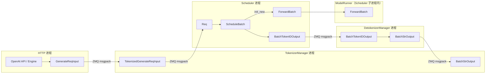

# ScheduleBatch-IO：数据流与交互

> 对齐 understand-explain 的「外部连接 + 数据流」：本模块在全局架构中的位置、输入/输出类型、上下游连接、典型请求逐步流转。

> **本模块独有焦点：** `Req` → `ScheduleBatch` → `ForwardBatch` **三层数据结构** 的生命周期与字段含义。进程拓扑图保留于此（调度链总览）；Scheduler 内部 overlap 见 [[07-Scheduler-03-数据流与交互|Scheduler]]。

---

## 1. 架构位置



**Explain：** 本模块文档覆盖图中 **Req / ScheduleBatch / IO 结构** 节点。ScheduleBatch 在 Scheduler 进程内由 Python 对象构成；ForwardBatch 在同一进程内由 GPU 张量构成；跨进程通信用 io_struct 定义的 msgspec 结构。

---

## 2. 输入 / 输出类型表

### 2.1 生成（Generate）路径

| 阶段 | 方向 | 类型 | 关键字段 | 定义位置 |
|------|------|------|----------|----------|
| HTTP → Tokenizer | 输入 | `GenerateReqInput` | text, input_ids, image_data, sampling_params | io_struct L152 |
| Tokenizer → Scheduler | 输入 | `TokenizedGenerateReqInput` | input_ids(array), sampling_params, mm_inputs(PickleWrapper) | io_struct L777 |
| Scheduler 内部 | — | `Req` | origin_input_ids, output_ids, prefix_indices, extend_range | schedule_batch L666 |
| Scheduler 内部 | — | `ScheduleBatch` | reqs, seq_lens, out_cache_loc, forward_mode | schedule_batch L1674 |
| Scheduler → Detokenizer | 输出 | `BatchTokenIDOutput` | decode_ids, finished_reasons, logprobs | io_struct L1194 |
| Detokenizer → Tokenizer | 输出 | `BatchStrOutput` | output_strs, finished_reasons | io_struct L1276 |

### 2.2 Embedding 路径

| 阶段 | 方向 | 类型 | 关键字段 |
|------|------|------|----------|
| HTTP → Tokenizer | 输入 | `EmbeddingReqInput` | text, input_ids, dimensions |
| Tokenizer → Scheduler | 输入 | `TokenizedEmbeddingReqInput` | input_ids, dimensions |
| Scheduler → Tokenizer | 输出 | `BatchEmbeddingOutput` | embeddings, prompt_tokens |

### 2.3 控制类消息（节选）

| 类型 | 方向 | 用途 |
|------|------|------|
| `AbortReq` | Tokenizer → Scheduler | 中止指定 rid |
| `FlushCacheReqInput/Output` | Tokenizer → Scheduler | 清空 KV cache |
| `PauseGenerationReqInput` | Tokenizer → Scheduler | 暂停生成（abort/retract/in_place） |

---

## 3. Req 构造：IPC → 调度器内部

**Explain：** Scheduler 收到 `TokenizedGenerateReqInput`（或 batch 形式 `BatchTokenizedGenerateReqInput`）后，为每条消息构造一个 `Req` 对象。多模态数据从 PickleWrapper 解包后转为 `MultimodalInputs`。

**Code：**

```python
# 来源：python/sglang/srt/managers/io_struct.py L871-L879
    def wrap_pickle_fields(self):
        self.mm_inputs = wrap_as_pickle(self.mm_inputs)
        self.mm_data_mooncake = wrap_as_pickle(self.mm_data_mooncake)
        self.time_stats = wrap_as_pickle(self.time_stats)

    def unwrap_pickle_fields(self):
        self.mm_inputs = unwrap_from_pickle(self.mm_inputs)
        self.mm_data_mooncake = unwrap_from_pickle(self.mm_data_mooncake)
        self.time_stats = unwrap_from_pickle(self.time_stats)
```

**Comment：**

- 发送方（TokenizerManager）调用 `wrap_pickle_fields()`，接收方（Scheduler）调用 `unwrap_pickle_fields()`。
- 解包后的 `mm_inputs` 是 `MultimodalProcessorOutput`，再经 `MultimodalInputs.from_processor_output()` 转为调度器侧的 `MultimodalInputs`（含 pad_value 和 hash）。

---

## 4. ScheduleBatch 生命周期

**Explain：** 一个 ScheduleBatch 从创建到销毁的典型生命周期如下。每个阶段对应 schedule_batch.py 中的特定方法。

**Code：**

```python
# 来源：python/sglang/srt/managers/schedule_batch.py L505-L571（MultimodalInputs.from_processor_output 核心逻辑）
    def from_processor_output(obj: MultimodalProcessorOutput):
        mm_items = obj.mm_items
        assert isinstance(mm_items, list)
        mm_items = [item for item in mm_items if item.is_valid()]

        # try reconstructing from cuda-ipc
        reconstruct_device = None
        for mm_item in mm_items:
            if mm_item.has_cuda_ipc_proxy():
                if reconstruct_device is None:
                    reconstruct_device = torch.cuda.current_device()
                mm_item.reconstruct(reconstruct_device)

        if envs.SGLANG_MM_BUFFER_SIZE_MB.get() > 0:
            # Multi-modal feature hashing optimization:
            # When SGLANG_MM_BUFFER_SIZE_MB > 0, we temporarily move feature tensors to GPU
            # for faster hash computation, while avoiding OOM issues.
            from sglang.srt.managers.mm_utils import (
                init_feature_buffer,
                is_feature_buffer_initialized,
                reset_buffer_offset,
                try_add_to_buffer,
            )

            device = torch.cuda.current_device() if torch.cuda.is_available() else "cpu"
            if not is_feature_buffer_initialized():
                init_feature_buffer(device)
            reset_buffer_offset()
            for item in mm_items:
                if item.feature is not None:
                    if isinstance(item.feature, torch.Tensor):
                        item.feature = try_add_to_buffer(item.feature)

        for item in mm_items:
            item.set_pad_value()

        if envs.SGLANG_MM_BUFFER_SIZE_MB.get() > 0:
            for item in mm_items:
                if item.feature is not None:
                    item.feature = item.feature.to("cpu", non_blocking=True)

        mm_inputs = MultimodalInputs(
            mm_items=mm_items,
            padded_input_ids=obj.padded_input_ids,
        )
        optional_args = [
            "mrope_positions",
            "mrope_position_delta",
            "im_token_id",
            "im_start_id",
            "im_end_id",
            "video_token_id",
            "slice_start_id",
            "slice_end_id",
            "audio_start_id",
            "audio_end_id",
            "audio_token_id",
            "vision_position_ids",
            "media_nums_per_sample",
            "visible_frame_counts",
        ]
        for arg in optional_args:
            val = getattr(obj, arg, None)
            if val is not None:
                setattr(mm_inputs, arg, val)

        return mm_inputs
```

**Comment：**

- 多模态 Req 入队时，`MultimodalInputs.from_processor_output` 完成 hash/pad_value 计算和 CUDA IPC 重建。
- 后续 `prepare_for_extend` 将 multimodal_inputs 列表挂到 ScheduleBatch 上供 ModelRunner 消费。

### 生命周期步骤

| 步骤 | 方法 | forward_mode | 说明 |
|------|------|-------------|------|
| 1. 创建 | `ScheduleBatch.init_new(reqs, ...)` | — | 从 waiting_queue 选中 reqs，创建空 batch |
| 2. Prefill 准备 | `batch.prepare_for_extend()` | EXTEND | 分配 KV slot，填充 input_ids/seq_lens |
| 3. Forward | `ForwardBatch.init_new(batch)` → ModelRunner | EXTEND | GPU forward，采样新 token |
| 4. 结果处理 | Scheduler event loop | — | 更新 req.output_ids，检查 stop condition |
| 5. Decode 准备 | `batch.prepare_for_decode()` | DECODE | seq_lens+1，分配 1 slot/req |
| 6. Forward | 同上 | DECODE | 每 req 生成 1 token |
| 7. 输出 | 构造 `BatchTokenIDOutput` | — | ZMQ 发给 Detokenizer |
| 8. 清理 | `batch.filter_batch()` | — | 移除 finished reqs |
| 重复 5–8 直到所有 req finish |

---

## 5. 输出路径：Scheduler → Detokenizer → Tokenizer

**Explain：** Scheduler 不直接 detokenize。它将 token 级结果打包为 `BatchTokenIDOutput`，DetokenizerManager 增量 detokenize 后发出 `BatchStrOutput`。

**Code：**

```python
# 来源：python/sglang/srt/managers/io_struct.py L1276-L1283
class BatchStrOutput(BaseBatchReq, kw_only=True):
    # The finish reason
    finished_reasons: List[Optional[FinishReasonDict]]
    # The output decoded strings
    output_strs: List[str]
    # The token ids
    output_ids: Optional[List[array]]

```

**Comment：**

- `BatchStrOutput` 与 `BatchTokenIDOutput` 字段高度对称，区别在于 `output_strs`（已 detokenize）vs `decode_ids`（原始 token）。
- `--skip-tokenizer-init` 模式下 Detokenizer 被跳过，Scheduler 直接发 `BatchTokenIDOutput` 给 TokenizerManager。

---

## 6. 上下游连接表

| 上游/下游 | 模块 | 交互方式 | 消息类型 | 代码位置 |
|-----------|------|----------|----------|----------|
| 上游 | TokenizerManager | ZMQ PUSH/PULL | `TokenizedGenerateReqInput`, `BatchTokenizedGenerateReqInput` | tokenizer_manager.py |
| 上游 | TokenizerManager | ZMQ | `TokenizedEmbeddingReqInput` | tokenizer_manager.py |
| 下游 | DetokenizerManager | ZMQ PUSH/PULL | `BatchTokenIDOutput` | detokenizer_manager.py |
| 下游 | DetokenizerManager → TokenizerManager | ZMQ | `BatchStrOutput`, `BatchEmbeddingOutput` | detokenizer_manager.py |
| 内部 | ModelRunner | 函数调用 | `ScheduleBatch` → `ForwardBatch.init_new` | model_runner.py |
| 内部 | mem_cache | 函数调用 | `alloc_for_extend`, `alloc_for_decode` | mem_cache/common.py |

---

## 7. 典型生成请求完整数据流

### 步骤 1：HTTP 收到 POST /v1/chat/completions

用户发送 `{"messages": [...], "max_tokens": 128}`。OpenAI API 层构造 `GenerateReqInput(text=..., sampling_params={...})`。

### 步骤 2：TokenizerManager 分词

TokenizerManager 将 text tokenize 为 `array('q', [1, 2345, ...])`，包装为 `TokenizedGenerateReqInput`，调用 `sock_send` 发往 Scheduler。

### 步骤 3：Scheduler 构造 Req 并入队

Scheduler 收到 IPC 消息，`unwrap_pickle_fields()`，构造 `Req(rid=..., origin_input_ids=..., sampling_params=...)`，放入 `waiting_queue`。调度策略（调度策略）选中该 Req。

### 步骤 4：ScheduleBatch.init_new + prepare_for_extend

```python
batch = ScheduleBatch.init_new([req], req_to_token_pool, allocator, tree_cache, ...)
batch.prepare_for_extend() # forward_mode=EXTEND, 分配 KV, 填充张量
```

### 步骤 5：ForwardBatch.init_new → ModelRunner.forward

```python
forward_batch = ForwardBatch.init_new(batch)
logits = model_runner.forward(forward_batch)
# 采样 → 更新 req.output_ids
```

### 步骤 6：循环 decode

```python
while not all(req.finished() for req in batch.reqs):
 batch.prepare_for_decode()
 forward_batch = ForwardBatch.init_new(batch)
 model_runner.forward(forward_batch)
 # 构造 BatchTokenIDOutput → sock_send → Detokenizer
 batch.filter_batch()
```

### 步骤 7：Detokenizer → Tokenizer → HTTP 响应

DetokenizerManager 收到 `BatchTokenIDOutput`，增量 detokenize，发出 `BatchStrOutput`。TokenizerManager 将 `output_strs` 包装为 OpenAI 兼容 JSON 返回给用户。

---

## 8. PositionalEmbeds 在数据流中的位置

**Explain：** Embedding 注入请求携带 `PositionalEmbeds(embeds, positions)`。TokenizerManager 解析后在 `TokenizedGenerateReqInput.positional_embed_overrides` 中传递；Scheduler 构造 Req 时保存；`prepare_for_extend` 将其转为 GPU 侧 `replace_embeds` / `replace_positions` 供 ModelRunner 在对应位置替换 embedding。

**Code：**

```python
# 来源：python/sglang/srt/managers/schedule_batch.py L1741-L1743
    # Token replacement embeddings and absolute positions (optional).
    replace_embeds: Optional[torch.Tensor] = None
    replace_positions: Optional[torch.Tensor] = None
```

**Comment：** 这是 ScheduleBatch 上直接传给 ForwardBatch 的 GPU 张量之一，与 `input_embeds`（整段 prompt 的 embedding 输入）不同——`replace_embeds` 是在特定 token 位置做 spot replacement。
