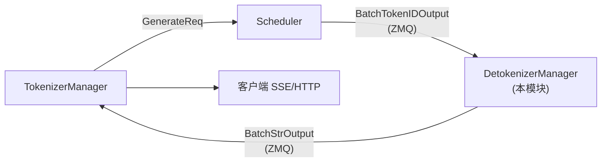

# Detokenizer 与输出反序列化

> **阶段 II · 请求调度** | 状态：已完成 | Git：`70df09b83363e0127b43c83a6007d3938f815b2d` 
> **源码范围：** `detokenizer_manager.py`、`communicator.py`（FanOutCommunicator）

---

## 本模块在架构中的位置

Detokenizer 是 **Scheduler 与 TokenizerManager 之间的独立 OS 进程**。Scheduler 只产出 token id（`BatchTokenIDOutput`）；Detokenizer 用 HF tokenizer 增量解码为可读字符串（`BatchStrOutput`），处理流式 `sent_offset`/`read_offset`、stop 截断、MoE routed_experts base64 编码等输出侧工作。多 HTTP Worker 模式下走 `multi_http_worker_event_loop`，按 `http_worker_ipcs` fan-out 回各 Tokenizer Worker。`FanOutCommunicator`（communicator.py）是 TokenizerManager 侧控制面 fan-out 原语，与本进程数据面解耦。



---

## 零基础一句话

**像「同声传译员」**：后厨（Scheduler）只递数字牌（token id），传译员（Detokenizer）实时翻译成客人能听懂的句子（UTF-8 文本）。

---

## 用户场景

**Persona：** 前端工程师小芳调试流式输出时看到偶发 `�` 乱码，需要理解 UTF-8 多字节边界与 `sent_offset`/`read_offset` 增量解码机制。她还需知道 Detokenizer 内存上限配置与 `DecodeStatus` 状态机如何防止长连接泄漏。

---

## 五件套阅读顺序

| 顺序 | 文件 | 一句话说明 |
|------|------|------------|
| 01 | [[10-Detokenizer-01-核心概念]] | 增量解码、DecodeStatus、进程边界 |
| 启动链路 | [[10-Detokenizer-02-源码走读]] | **主文档**：DetokenizerManager 全链路精读 |
| HTTP Server | [[10-Detokenizer-03-数据流与交互]] | ZMQ 消息流、IO 结构、上下游时序 |
| OpenAI API | [[10-Detokenizer-04-关键问题]] | 内存上限、UTF-8 边界、多 Worker fan-out |
| ✓ | [[10-Detokenizer-05-checkpoint]] | 验收：能否说明 token id → 流式字符串的增量路径 |

---

## 核心源码锚点

**Explain：** 服务启动时会 `spawn` 一个名为 `sglang::detokenizer` 的子进程。单 Tokenizer Worker 时走标准 `event_loop`；多 HTTP Worker 时走 `multi_http_worker_event_loop`，按 `http_worker_ipcs` 把结果 fan-out 回各 Tokenizer Worker。

**Code：**

```python
# 来源：python/sglang/srt/managers/detokenizer_manager.py L483-L499
def run_detokenizer_process(
    server_args: ServerArgs,
    port_args: PortArgs,
    detokenizer_manager_class=DetokenizerManager,
):
    kill_itself_when_parent_died()
    setproctitle.setproctitle("sglang::detokenizer")
    configure_logger(server_args)
    parent_process = psutil.Process().parent()

    manager = None
    try:
        manager = detokenizer_manager_class(server_args, port_args)
        if server_args.tokenizer_worker_num == 1:
            manager.event_loop()
        else:
            manager.multi_http_worker_event_loop()
```

**Comment：**

- 与 Scheduler、TokenizerManager 一样，Detokenizer 是**独立 OS 进程**，通过 ZMQ IPC 通信。
- `kill_itself_when_parent_died` 防止父进程退出后成为孤儿进程。
- 异常时向父进程发 `SIGQUIT`，便于整体 fail-fast。
- `multi_http_worker_event_loop` 支持多 HTTP Worker 水平扩展时的输出路由。

---

## 验证建议

1. **CLI：** `ps aux | grep sglang::detokenizer`，确认独立 detokenizer 子进程存在。
2. **日志：** 流式请求时搜索 `BatchTokenIDOutput` / `output_strs`；UTF-8 边界问题可见 incomplete decode 相关 trace。

---

## 阅读路径

← [[09-ScheduleBatch-IO-00-MOC|ScheduleBatch-IO]] 
→ [[11-ModelRunner-00-MOC|ModelRunner]]
