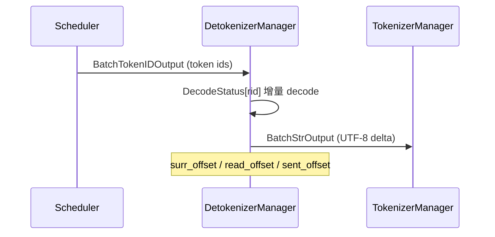

# Detokenizer · 核心概念

## 用户故事：流式输出出现「�」— Detokenizer 如何用 DecodeStatus 做增量 UTF-8 解码

### Persona

**Lisa**，前端工程师。Chat UI 用 SSE 逐字显示模型回复，偶发**中间 chunk 乱码或重复字符**。她了解到 GPU 只产出 token id，真正转成 UTF-8 的是 **Detokenizer 独立进程**——需要理解 `surr_offset` / `read_offset` / `sent_offset` 如何协调增量 decode。

### 时间线

| 时刻 | 事件 |
|------|------|
| T0 | Scheduler 完成首步 decode，发 `BatchTokenIDOutput`（含 `decode_ids`、`read_offsets`） |
| T0+1ms | Detokenizer `handle_batch_token_id_out` 为 `rid` 创建或更新 `DecodeStatus` |
| T0+2ms | 只对 **新增 token 片段** 调用 `batch_decode`，避免每步重 decode 全序列 |
| T0+3ms | 若 UTF-8 多字节字符未完整，暂存 partial；下步补齐后再 `sent_offset` 推进 |
| T1 | `finished_reasons[i] != None` → 收尾、删除 `decode_status[rid]`，发 `BatchStrOutput` |

### 涉及模块



**Explain：** Detokenizer 是**调度层输出末端**的独立 CPU 进程。流式场景下若每步对全部 `output_ids` 重新 decode，既浪费 CPU，又可能在 UTF-8 边界产生乱码。`DecodeStatus` 按 `rid` 维护解码状态，只处理 `[surr_offset, read_offset)` 区间的新增 token，并用 `sent_offset` 避免 partial 字符重复推送。

**Code：**

```python
# 来源：python/sglang/srt/managers/detokenizer_manager.py L63-L74
# 提交版本：70df09b
@dataclasses.dataclass
class DecodeStatus:
    """Store the status of incremental decoding."""

    decoded_text: str
    decode_ids: List[int]
    surr_offset: int
    read_offset: int
    # Offset that's sent to tokenizer for incremental update.
    sent_offset: int = 0
    decoded_text_len: int = dataclasses.field(init=False)
    decoded_text_chunks: List[str] = dataclasses.field(default_factory=list)
```

**Comment：**

- `decode_ids` 累积该请求迄今全部 output token；`read_offset` 是本轮参与 decode 的上界。
- `decoded_text_chunks` 懒拼接，减少频繁字符串 concat 的 O(n²) 开销。
- 嵌入模型路径 `handle_batch_embedding_out` 透传，不做 detokenize。

### 如果…会怎样（调试）

| 现象 | 可能原因 | 排查 |
|------|----------|------|
| 流式出现 `�` 后下一包恢复 | UTF-8 多字节字符跨 step 边界，设计如此 | 检查 `sent_offset` 与 incremental 模式 |
| 重复发送同一段 text | `sent_offset` 未正确推进 | 对比 Detokenizer 日志与 `read_offsets` |
| 无字符串只有 token id | `--skip-tokenizer-init` bypass detokenize | 客户端自行 decode `output_ids` |

---

## 1. Detokenizer 是什么

**Explain：** 在大模型推理服务中，GPU 侧 Scheduler 产出的是 **token id**（整数序列），而 HTTP/SSE 客户端需要的是 **UTF-8 文本**。Detokenizer 是专门负责「id → 字符串」的独立进程，把 CPU 密集的分词器工作从 Scheduler 和 TokenizerManager 中剥离出来，避免阻塞调度与 HTTP 事件循环。

**Code：**

```python
# 来源：python/sglang/srt/managers/detokenizer_manager.py L91-L92
class DetokenizerManager(MultiHttpWorkerDetokenizerMixin):
    """DetokenizerManager is a process that detokenizes the token ids."""
```

**Comment：**

- 与 Tokenizer（正向：文本→id）对称，Detokenizer 做反向：id→文本。
- 嵌入模型路径下 `handle_batch_embedding_out` 直接透传，不做 detokenize。

---

## 2. 增量解码（Incremental Decoding）

**Explain：** 流式生成时，每个 decode step 只新增少量 token。若每步都对**全部** output token 重新 decode，既浪费 CPU，又可能在 UTF-8 多字节字符边界产生乱码。SGLang 用 `DecodeStatus` 维护每个请求（按 `rid`）的解码状态，只 decode **新增片段**，并通过 `surr_offset` / `read_offset` / `sent_offset` 协调「已确认文本」与「待发送增量」。

**Code：**

```python
# 来源：python/sglang/srt/managers/detokenizer_manager.py L63-L74
@dataclasses.dataclass
class DecodeStatus:
    """Store the status of incremental decoding."""

    decoded_text: str
    decode_ids: List[int]
    surr_offset: int
    read_offset: int
    # Offset that's sent to tokenizer for incremental update.
    sent_offset: int = 0
    decoded_text_len: int = dataclasses.field(init=False)
    decoded_text_chunks: List[str] = dataclasses.field(default_factory=list)
```

**Comment：**

| 字段 | 含义 |
|------|------|
| `decode_ids` | 该请求迄今累积的全部 output token id |
| `surr_offset` | 上一轮已「提交」进 `decoded_text` 的 token 边界 |
| `read_offset` | 本轮参与 decode 的 token 上界（通常 ≤ len(decode_ids)） |
| `sent_offset` | 已向 TokenizerManager 发送的字符位置；用于 `�` 恢复时避免重复发送 |
| `decoded_text_chunks` | 延迟拼接的文本块，减少频繁字符串拼接 |

---

## 3. 输入 / 输出消息类型

**Explain：** Detokenizer 的主数据面输入是 `BatchTokenIDOutput`（Scheduler 发出），输出是 `BatchStrOutput`（TokenizerManager 接收）。除 `output_strs` 外，logprobs、token 计数、hidden states 等字段**透传**，Detokenizer 主要改写字符串与 base64 编码的 tensor 字段。

**Code：**

```python
# 来源：python/sglang/srt/managers/io_struct.py L1194-L1206
class BatchTokenIDOutput(BaseBatchReq, kw_only=True):
    # The finish reason
    finished_reasons: List[Optional[FinishReasonDict]]
    # For incremental decoding
    decoded_texts: List[str]
    decode_ids: List[array]  # List[array[int]]
    read_offsets: List[int]
    # Only used when `--skip-tokenizer-init` is on
    output_ids: Optional[List[array]]  # Optional[List[array[int]]]
    # Detokenization configs
    skip_special_tokens: List[bool]
    spaces_between_special_tokens: List[bool]
    no_stop_trim: List[bool]
```

**Comment：**

- 首包时 Scheduler 可带上 `decoded_texts` 与 `read_offsets`，Detokenizer 用其初始化 `DecodeStatus`。
- `finished_reasons[i] is None` 表示该请求仍在 streaming；非 None 则进入收尾逻辑并删除 `decode_status[rid]`。

---

## 4. FanOutCommunicator：控制面原语

**Explain：** 本模块源码范围中的 `communicator.py` **不是** Detokenizer 数据通路的一部分。它定义 `FanOutCommunicator`：TokenizerManager 在**控制面**（权重更新、缓存 flush、LoRA 等）向 **dp_size 个 Scheduler** 广播请求并等待全部响应。Detokenizer 与 Scheduler 之间是简单的 PULL/PUSH ZMQ，不使用该 Communicator。

**Code：**

```python
# 来源：python/sglang/srt/managers/communicator.py L11-L21
class FanOutCommunicator(Generic[T]):
    """Fan-out request + collect response primitive over zmq.

    One send is fanned out to `fan_out` recipients; the caller awaits until
    all `fan_out` responses are collected. Supports two modes:
    - "queueing": requests are serialized; concurrent callers wait in a FIFO queue.
    - "watching": concurrent callers share a single in-flight request and all
      receive the same result when it completes.

    Only one request is in-flight at any time in either mode.
    """
```

**Comment：**

- **数据面**：Generate 请求按 `rid` 多路复用，走 Scheduler ↔ Detokenizer ↔ TokenizerManager 的 batch 消息。
- **控制面**：`TokenizerControlMixin.init_communicators` 为每种控制操作创建一个 `FanOutCommunicator`，`fan_out=dp_size`。
- 两种模式保证同一时刻最多一个 in-flight 控制请求，避免 Scheduler 状态竞态。

---

## 5. 架构位置（layer:runtime-core · 调度子系统）

Detokenizer 属于 **SGLang Runtime 调度层**的输出末端：

```
HTTP → TokenizerManager → Scheduler → TP Worker → Scheduler
 ↓ BatchTokenIDOutput
 DetokenizerManager
 ↓ BatchStrOutput
 TokenizerManager → SSE
```

设计动机：

1. **隔离 GIL / CPU**：HuggingFace `batch_decode` 可能较慢，独立进程不阻塞 Scheduler 的 GPU 调度循环。
2. **有状态流式**：`DecodeStatus` 按 `rid` 保存，跨 batch 增量更新。
3. **可扩展**：`detokenizer_worker_num`、`tokenizer_worker_num` 支持多 Worker 与 Router（见下文 §6）。

---

## 6. MultiDetokenizerRouter 与多 Worker 拓扑

**Explain：** 默认 `detokenizer_worker_num=1` 时，Scheduler 将 `BatchTokenIDOutput` 直接 PUSH 到单一 Detokenizer IPC socket。当 `detokenizer_worker_num>1` 时，每个 Detokenizer Worker 拥有**私有 IPC**，另起一个 `MultiDetokenizerRouter` 进程监听 Scheduler 的公共 socket，按 `rid` 哈希将 batch 分发给某个 Worker——与 multi-tokenizer HTTP worker 模式对称。

**Code：**

```python
# 来源：python/sglang/srt/managers/multi_tokenizer_mixin.py L501-L519
class MultiDetokenizerRouter:
    """Route scheduler outputs to one of N DetokenizerManager workers.

    Each request is pinned to a worker by hashing its ``http_worker_ipc`` with
    ``zlib.crc32`` (deterministic across runs), so all outputs of the same rid
    always land on the same detokenizer and ``decode_status`` stays consistent.
    """

    def __init__(self, ipc_name_list: List[str], port_args: PortArgs):
        self.ipc_name_list = ipc_name_list
        self.num_workers = len(ipc_name_list)
        self.socket_mapping = SocketMapping()
        context = zmq.Context(2)
        self.recv_from_scheduler = get_zmq_socket(
            context, zmq.PULL, port_args.detokenizer_ipc_name, True
        )

    def _pick(self, key: str) -> str:
        return self.ipc_name_list[zlib.crc32(key.encode()) % self.num_workers]
```

**Comment：**

- Router 是**数据面**组件，不参与控制面 `FanOutCommunicator`（§4）。
- 调大 `detokenizer_worker_num` 可水平扩展 CPU detokenize 吞吐；需保证 `rid` 路由一致性，同一 `rid` 始终到同一 Worker 以保留 `DecodeStatus` 局部状态。
- 与 `tokenizer_worker_num>1` 组合时，Detokenizer → TokenizerManager 回传仍经 `http_worker_ipc` 路由到正确 HTTP worker。

---

## 7. `--skip-tokenizer-init` 决策树

**Explain：** 开启后服务**不加载** HuggingFace tokenizer；Detokenizer 跳过 `batch_decode`，在 `BatchStrOutput` 中透传 `output_ids`。适用于客户端自行 decode、或 embedding-only 场景。

| 条件 | 行为 |
|------|------|
| `skip_tokenizer_init=True` | TokenizerManager 不 init tokenizer；Detokenizer 透传 token ids |
| 同时 `detokenizer_worker_num>1` | ServerArgs **强制** `detokenizer_worker_num=1`（无字符串可 decode） |
| 流式 UI 需要文本 | **必须** `skip_tokenizer_init=False` |
| 仅要 logits/embeddings | 可 skip，客户端用自有 vocab decode |

**Code：**

```python
# 来源：python/sglang/srt/server_args.py L6153-L6158
            if self.detokenizer_worker_num != 1:
                logger.warning(
                    "skip_tokenizer_init=True disables detokenizer workers; forcing detokenizer_worker_num=1 "
                    f"(requested {self.detokenizer_worker_num})."
                )
                self.detokenizer_worker_num = 1
```

**Comment：**

- bypass 路径下 Lisa 用户故事（§ 用户故事）中的 UTF-8 增量 decode **不执行**——排查乱码前先确认未误开 skip。
- OpenAI 兼容 API 通常需要 tokenizer 做 chat template；skip 模式多用于 research / 自定义 pipeline。

