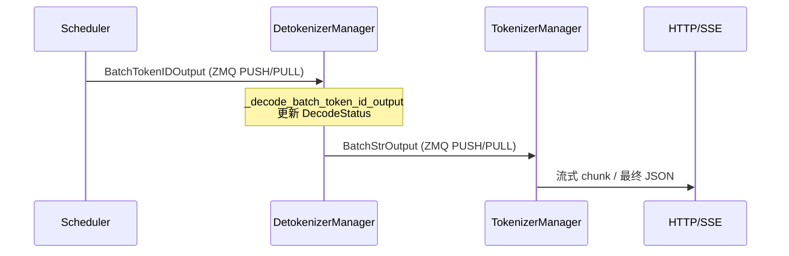

# Detokenizer：数据流与交互

> **本模块独有焦点：** token id → 字符串的**增量 decode 与 UTF-8 边界**（`read_offset` / `sent_offset` / `decoded_text_len`）。 
> Scheduler→Detokenizer 的 ZMQ 类型见 [[09-ScheduleBatch-IO-03-数据流与交互|ScheduleBatch-IO §4]]。

---

Detokenizer 处于 **Scheduler 下游、TokenizerManager 上游**，专门处理「token id → 字符串」及输出侧轻量变换（base64 编码）。



---

## 2. 输入 / 输出

| 方向 | 类型 | 关键字段 | 说明 |
|------|------|----------|------|
| 输入 | `BatchTokenIDOutput` | `rids`, `decode_ids`, `read_offsets`, `finished_reasons` | Scheduler 每步 batch 输出 |
| 输入 | `BatchEmbeddingOutput` | embedding 向量 | 透传，不 detokenize |
| 输入 | `FreezeGCReq` / `ConfigureLoggingReq` | 运维控制 | 本地处理，无下游输出 |
| 输出 | `BatchStrOutput` | `output_strs` | **本模块生成**的增量/最终文本 |
| 输出 | `BatchStrOutput` | `routed_experts` 等 | Scheduler 字段 + Detokenizer base64 编码 |

**Code（输出结构摘要）：**

```python
# 来源：python/sglang/srt/managers/io_struct.py L1276-L1282
class BatchStrOutput(BaseBatchReq, kw_only=True):
    # The finish reason
    finished_reasons: List[Optional[FinishReasonDict]]
    # The output decoded strings
    output_strs: List[str]
    # The token ids
    output_ids: Optional[List[array]]
```

**Comment：** `output_strs[i]` 在 streaming 时为**本步新增**文本片段，非全量；TokenizerManager 负责累加并推 SSE。

---

## 3. ZMQ 通道与 PortArgs

**Explain：** IPC 地址在 `PortArgs` 中配置：Scheduler bind PUSH 到 `detokenizer_ipc_name`；Detokenizer bind PULL。回传路径对称使用 `tokenizer_ipc_name`。

**Code：**

```python
# 来源：python/sglang/srt/managers/detokenizer_manager.py L111-L122
    def init_ipc_channels(self, port_args: PortArgs, server_args: ServerArgs):
        context = zmq.Context(2)
        self.recv_from_scheduler = get_zmq_socket(
            context, zmq.PULL, port_args.detokenizer_ipc_name, True
        )
        # In multi-tokenizer mode, results are pushed back to each TokenizerWorker
        # directly via SocketMapping inside multi_http_worker_event_loop, so the
        # single send_to_tokenizer socket is unused.
        if server_args.tokenizer_worker_num == 1:
            self.send_to_tokenizer = get_zmq_socket(
                context, zmq.PUSH, port_args.tokenizer_ipc_name, False
            )
```

**Comment：**

| Socket | 模式 | 对端 |
|--------|------|------|
| `recv_from_scheduler` | PULL (bind) | Scheduler PUSH |
| `send_to_tokenizer` | PUSH (connect) | TokenizerManager PULL |

多 HTTP Worker 时 Detokenizer 通过 `SocketMapping` 按 `http_worker_ipcs[i]` 分别 PUSH，不再使用单一 `send_to_tokenizer`。

---

## 4. 上下游连接

| 上游/下游 | 模块 | 交互方式 | 本模块代码位置 |
|-----------|------|----------|--------------|
| 上游 | Scheduler | ZMQ `BatchTokenIDOutput` | `event_loop` → `sock_recv(recv_from_scheduler)` |
| 下游 | TokenizerManager | ZMQ `BatchStrOutput` | `sock_send(send_to_tokenizer, output)` |
| 侧向 | HuggingFace Tokenizer | 进程内调用 | `_grouped_batch_decode` / `tokenizer.decode` |
| **非连接** | FanOutCommunicator | — | 用于 TokenizerManager→Scheduler 控制面 |

TokenizerManager 接收侧（对照理解，非本模块源码）：

```python
# 来源：python/sglang/srt/managers/tokenizer_manager.py L1851（引用）
                recv_obj = await async_sock_recv(self.recv_from_detokenizer)
```

---

## 5. 典型数据流（单请求 streaming）

**步骤 1 — Scheduler 发出首包 batch**

Scheduler 在 `BatchTokenIDOutput` 中带 `decode_ids`（本步新 token）、`read_offsets`（decode 上界）、`finished_reasons[i]=None`。

**步骤 2 — Detokenizer 初始化或更新 DecodeStatus**

```python
# 来源：python/sglang/srt/managers/detokenizer_manager.py L277-L288
            rid = recv_obj.rids[i]
            if rid not in self.decode_status:
                s = DecodeStatus(
                    decoded_text=recv_obj.decoded_texts[i],
                    decode_ids=list(recv_obj.decode_ids[i]),
                    surr_offset=0,
                    read_offset=recv_obj.read_offsets[i],
                )
                self.decode_status[rid] = s
            else:
                s = self.decode_status[rid]
                s.decode_ids.extend(recv_obj.decode_ids[i])
```

**步骤 3 — 双路 batch decode 求增量**

对 `surr_ids` 与 `read_ids` 分别 `_grouped_batch_decode`，`new_text = read_texts[i][len(surr_texts[i]):]`。

**步骤 4 — UTF-8 边界（本模块核心时序）**

| 步骤 | DecodeStatus 字段 | 行为 |
|:----:|-------------------|------|
| 1 | `surr_ids` 累积 token id | 每次 batch 追加本步 `decode_ids` |
| 2 | `tokenizer.decode(surr_ids[s:s+])` | 尝试解码到 `read_offset` |
| 3 | 若末字符为 `\ufffd`（`�`） | **不推进** `read_offset`，等待下一 token 补全 UTF-8 |
| 4 | 可打印子串 | 写入 `output_strs` 增量；更新 `sent_offset` |

**Explain：** Lisa 的故事（见 [[10-Detokenizer-01-核心概念|01-核心概念 §用户故事]]）：中文等多字节字符可能被拆成多个 byte-level token；过早 decode 会得到 `�`，若错误推进 offset 会导致乱码永久化。

**Code：**

```python
# 来源：python/sglang/srt/managers/detokenizer_manager.py L300-L318（逻辑节选）
        if not self.disable_tokenizer_batch_decode:
            surr_texts = self._grouped_batch_decode(
                surr_ids,
                recv_obj.skip_special_tokens,
                recv_obj.spaces_between_special_tokens,
            )
            read_texts = self._grouped_batch_decode(
                read_ids,
                recv_obj.skip_special_tokens,
                recv_obj.spaces_between_special_tokens,
            )
        else:
            # Do not use batch decode to prevent some detokenization edge cases (e.g., gpt-oss).
            surr_texts = [
                self.tokenizer.decode(
                    surr, skip_special_tokens=skip, spaces_between_special_tokens=space
                )
                for surr, skip, space in zip(
                    surr_ids,
```

**Comment：** 排障对照 [[10-Detokenizer-04-关键问题|04-关键问题]]「误解 vs 实际」表；见到 `�` 是**正常等待**，不是 decode bug。

**步骤 5 — 组装 BatchStrOutput 并 PUSH**

TokenizerManager 将 `output_strs` 追加到 per-rid 缓冲区，通过 HTTP SSE 推送。

**步骤 6 — 结束包**

`finished_reasons[i]` 非 None → 合并全文、`trim_matched_stop`、发送 tail、`del decode_status[rid]`。

```python
# 来源：python/sglang/srt/managers/detokenizer_manager.py L372-L383
            if rid in self.decode_status:
                del self.decode_status[rid]

            # Finished: materialize once, trim the matched stop, emit the tail.
            output_str = self.trim_matched_stop(
                s.get_decoded_text() + new_text,
                recv_obj.finished_reasons[i],
                recv_obj.no_stop_trim[i],
            )
            incremental_output = output_str[s.sent_offset :]
            s.sent_offset = len(output_str)
            output_strs.append(incremental_output)
```

---

## 6. 多 Worker 回传路径

**Explain：** `tokenizer_worker_num > 1` 时，Detokenizer 使用 `multi_http_worker_event_loop`，按 batch 内每条请求的 `http_worker_ipcs[i]` 将切片后的 `BatchStrOutput` 发回对应 Tokenizer Worker。

**Code：**

```python
# 来源：python/sglang/srt/managers/multi_tokenizer_mixin.py L351-L368
    def multi_http_worker_event_loop(self: DetokenizerManager):
        """The event loop that handles requests, for multi multi-http-worker mode"""
        self.socket_mapping = SocketMapping()
        while True:
            recv_obj = sock_recv(self.recv_from_scheduler)
            output = self._request_dispatcher(recv_obj)
            if output is None:
                continue

            # Fan out the output back to the originating tokenizer worker(s).
            # In multi-detokenizer mode the upstream MultiDetokenizerRouter may
            # forward either batched or single requests, so handle both shapes.
            if isinstance(recv_obj, BaseBatchReq):
                for i, ipc_name in enumerate(recv_obj.http_worker_ipcs):
                    new_output = _handle_output_by_index(output, i)
                    self.socket_mapping.send_output(
                        ipc_name, new_output, is_tokenizer=True
                    )
```

**Comment：** 此路径替代单 socket `send_to_tokenizer`，保证多 HTTP 进程架构下结果回到发起请求的 Worker。

---

## 7. 控制面 vs 数据面（communicator.py）

| 维度 | 数据面（Detokenizer） | 控制面（FanOutCommunicator） |
|------|----------------------|------------------------------|
| 消息 | `BatchTokenIDOutput` / `BatchStrOutput` | `FlushCacheReq`、`UpdateWeightsReq` 等 |
| 并发模型 | 连续 batch，按 rid 多路复用 | 单 in-flight，queueing/watching |
| fan-out | 无（单 Detokenizer 消费 Scheduler 输出） | `fan_out = dp_size` |
| 同步 | 进程内阻塞 ZMQ | asyncio Event |

**Code：**

```python
# 来源：python/sglang/srt/managers/tokenizer_control_mixin.py L130-L141
    def init_communicators(self: TokenizerManager, server_args: ServerArgs):
        dispatch_pairs = []
        for spec in _COMMUNICATOR_SPECS:
            name, resp_type = spec[0], spec[1]
            mode = spec[2] if len(spec) > 2 else "queueing"
            comm = FanOutCommunicator(
                self._dispatch_to_scheduler,
                server_args.dp_size,
                mode,
            )
            setattr(self, f"{name}_communicator", comm)
            dispatch_pairs.append((resp_type, comm.handle_recv))
```

**Comment：** 阅读 Detokenizer 时不要与 `FanOutCommunicator` 混淆；二者同属 `managers/` 包，但服务不同子系统。
