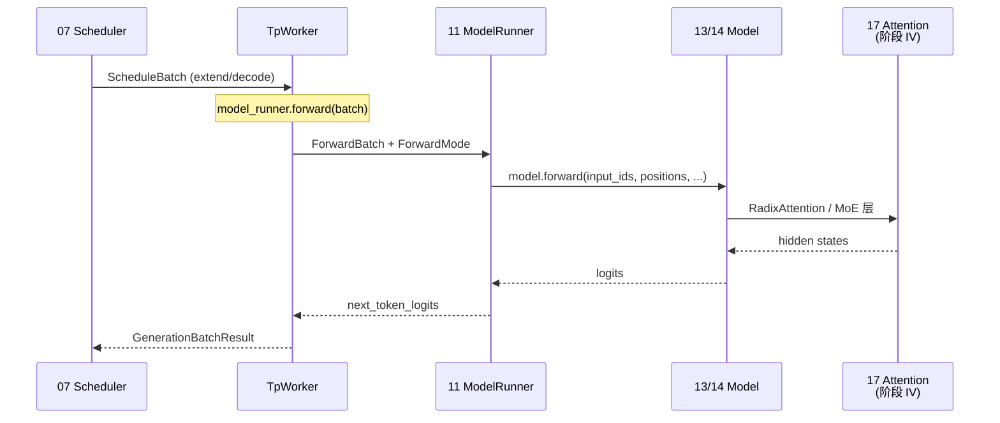

# 阶段 III · 模型执行（ModelRunner–Models 专用）

> **你只需阅读本目录，不必打开 `sglang/` 源码。** 
> 内嵌代码对应 sglang Git commit `70df09b`。

---

## 本阶段解决什么问题

阶段 II 讲清了 Scheduler 如何把请求组织成 `ScheduleBatch` 并发起 forward。阶段 III 回答：**GPU 上谁真正跑模型 forward？权重从哪来？Llama / Qwen / DeepSeek 如何注册与加载？**

| 模块 | 模块 | 一句话 |
|------|------|--------|
| [[11-ModelRunner-00-MOC|11 ModelRunner]] | 执行器核心 | ForwardBatch、CUDA Graph、TpWorker 调度 model.forward |
| [[12-ModelLoader-00-MOC|12 ModelLoader]] | 权重加载 | safetensors / HF / 量化权重 iterator → load_weights |
| [[13-Models-通用-00-MOC|13 Models 通用]] | 通用架构 | Registry、Llama/Qwen3 Decoder 层模式 |
| [[14-Models-专用-00-MOC|14 Models 专用]] | 专用架构 | MLA、MoE、DeepSeek、Context Parallel |

---

## 端到端执行链（阶段 III 验收图）



**Explain：** `TpWorker` 持有 `ModelRunner` 实例；Scheduler 子进程通过 ZMQ/共享内存把 batch 交给 worker。`ModelRunner` 负责把 `ScheduleBatch` 转为 `ForwardBatch`、选择 CUDA Graph replay 或 eager forward，并调用 `model.forward`。权重在启动时由 `12 ModelLoader` 灌入，模型类由 `13/14 Registry` 解析。

**Code：**

```python
# 来源：python/sglang/srt/model_executor/model_runner.py L1188-L1205
                and (moe_intermediate_size // moe_tp_size) % weight_block_size_n != 0
                and not _use_aiter
            ):
                raise ValueError(
                    f"For quantized MoE models, please make sure ({moe_intermediate_size=} / {moe_tp_size=}) % {weight_block_size_n=} == 0 "
                    f"where moe_tp_size is equal to tp_size ({self.tp_size}) divided by ep_size ({self.moe_ep_size}). "
                    f"You can fix this by setting arguments `--tp` and `--ep` correctly."
                )

    def init_torch_distributed(self):
        tic = time.perf_counter()
        logger.info("Init torch distributed begin.")

        try:
            torch.get_device_module(self.device).set_device(self.gpu_id)
        except Exception:
            logger.warning(
                f"Context: {self.device=} {self.gpu_id=} {os.environ.get('CUDA_VISIBLE_DEVICES')=} {self.tp_rank=} {self.tp_size=}"
```

**Comment：**

- `forward_mode` 区分 EXTEND（prefill）、DECODE、IDLE 等；CUDA Graph 路径仅覆盖固定 shape 的 decode/extend。
- Attention backend 初始化在 forward 前完成（Attention 展开）。
- PP（pipeline parallel）时返回 `PPProxyTensors` 而非最终 logits。

---

## 零基础一句话

**像后厨灶台：** 12 是进货与备料（权重），13/14 是菜谱（模型结构），11 是主厨按单炒菜（forward），Scheduler 只负责传菜单不传刀工细节。

---

## 推荐阅读顺序

| 顺序 | 文档 | 必读理由 |
|------|------|----------|
| 1 | [[11-ModelRunner-01-核心概念|11/01-核心概念]] | ForwardBatch、ForwardMode、Graph 契约 |
| 2 | [[11-ModelRunner-02-源码走读|11/02-源码走读]] | TpWorker → ModelRunner 主路径 |
| 3 | [[12-ModelLoader-02-源码走读|12/02-源码走读]] | safetensors 加载与 TP 分片 |
| 4 | [[13-Models-通用-01-核心概念|13/01-核心概念]] | Registry resolve 流程 |
| 5 | [[14-Models-专用-04-关键问题|14/04-关键问题]] | MLA vs MHA、MoE 层判定 |

---

## 阶段衔接

| 方向 | 模块 | 衔接点 |
|------|------|--------|
| ← 上一阶段 | 06–10 请求调度 | 07 Scheduler `run_batch` → TpWorker |
| → 下一阶段 | 15–19 内存与 Attention | ModelRunner 读写 KV slot；RadixAttention 在 model 层调用 |
| → 高级 | 20–21 | logits → 20 Sampling；21 投机 draft worker 复用 ModelRunner |
| → 运维 | 32 | 12 weight_sync / checkpoint-engine 热更新 base 权重 |

---

## 验证建议（零基础可试）

1. **启动日志：** 观察 `Load weight end` 与 `Capture cuda graph` 顺序，确认 12→11 初始化完成。
2. **Registry：** 换 `--model-path` 为 Qwen3，日志应出现 `qwen3` entry class 而非 llama。
3. **Graph：** `--disable-cuda-graph` 对比吞吐；decode 密集场景 graph 通常更优。

---

## 模块导航

| 模块 | 目录 | 五件套 |
|------|------|--------|
| 11 | [[11-ModelRunner-00-MOC|ModelRunner]] | ✅ |
| 12 | [[12-ModelLoader-00-MOC|ModelLoader]] | ✅ |
| 13 | [[13-Models-通用-00-MOC|Models 通用]] | ✅ |
| 14 | [[14-Models-专用-00-MOC|Models 专用]] | ✅ |

← [[02-请求调度-00-MOC|阶段 II：请求调度]] · → [[04-内存与Attention-00-MOC|阶段 IV：内存与 Attention]]
