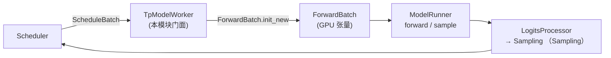

# ModelRunner 与执行器

> **阶段 III · 模型执行** | 状态：已完成 | Git：`70df09b83363e0127b43c83a6007d3938f815b2d` 
> **源码范围：** `srt/model_executor/`、`srt/managers/tp_worker.py`

---

## 本模块在架构中的位置

ModelRunner 是 **阶段 III 执行层核心**：单 GPU rank 上的模型执行引擎，负责加载权重、管理 KV 池、选择 Attention 后端、跑 transformer forward 并输出 logits。Scheduler 进程内的 `TpModelWorker` 是其门面，暴露 `forward_batch_generation` 供 Scheduler 直接调用。`ScheduleBatch`（ScheduleBatch-IO）在 forward 前通过 `ForwardBatch.init_new` 转换为 GPU 张量包；CUDA Graph Runner 在 decode 固定 shape 时 capture/replay 以降低 kernel launch 开销。



---

## 零基础一句话

**像工厂车间的「数控机床」**：Scheduler 递来加工单（ScheduleBatch），ModelRunner 把原料（token ids + KV 索引）切成成品（logits）。

---

## 用户场景

**Persona：** GPU 工程师小陆 profiling decode 吞吐，需要理解 `forward_batch_generation` 调用栈、CUDA Graph 何时 capture/replay，以及 PP 模式下 `pp_group.is_last_rank` 为何只有末段 rank 产出 logits。她还需追踪 HiCache consumer index 的传递。

---

## 五件套阅读顺序

| 顺序 | 文件 | 一句话说明 |
|------|------|------------|
| 01 | [[11-ModelRunner-01-核心概念]] | ForwardBatch、ForwardMode、执行器分层、CUDA Graph |
| 启动链路 | [[11-ModelRunner-02-源码走读]] | **主文档**：ModelRunner / TpWorker 精读 |
| HTTP Server | [[11-ModelRunner-03-数据流与交互]] | Scheduler → TP Worker → ModelRunner 逐步时序 |
| OpenAI API | [[11-ModelRunner-04-关键问题]] | Graph replay、draft worker、PP 与 overlap |
| ✓ | [[11-ModelRunner-05-checkpoint]] | 验收：能否说明 ScheduleBatch → ForwardBatch 衔接点 |

---

## 核心源码锚点

**Explain：** Scheduler 在 TP 进程内调用 `TpModelWorker.forward_batch_generation`，它把 CPU 侧的 `ScheduleBatch` 转成 GPU 张量包 `ForwardBatch`，再交给 `ModelRunner.forward` 执行模型前向。PP 模式下只有末段 rank 产出 logits。

**Code：**

```python
# 来源：python/sglang/srt/managers/tp_worker.py L482-L509
    def forward_batch_generation(
        self,
        batch: Optional[ScheduleBatch],
        forward_batch: Optional[ForwardBatch] = None,
        pp_proxy_tensors: Optional[PPProxyTensors] = None,
        is_verify: bool = False,
        skip_attn_backend_init: Optional[bool] = None,  # deprecated
    ) -> GenerationBatchResult:
        # Get forward batch from schedule batch
        if batch is not None:
            # update the consumer index of hicache to the running batch
            self.set_hicache_consumer(batch.hicache_consumer_index)

            forward_batch = ForwardBatch.init_new(batch, self.model_runner)
        else:
            # FIXME(lsyin): unify the interface of forward_batch
            assert forward_batch is not None

        # Deprecated kwarg: pre-planners mark the batch themselves now.
        forward_batch.apply_deprecated_skip_attn_backend_init(skip_attn_backend_init)

        if self.is_dllm():
            return self._forward_batch_generation_dllm(forward_batch)

        if self.pp_group.is_last_rank:
            out = self.model_runner.forward(
                forward_batch,
                pp_proxy_tensors=pp_proxy_tensors,
```

**Comment：**

- `ForwardBatch.init_new` 是ScheduleBatch-IO（ScheduleBatch）与本模块的**衔接点**——把调度层数据物化为 GPU tensor。
- `pp_group.is_last_rank` 表明 Pipeline Parallel 下只有末段 rank 产出 logits；中间 rank 走 PP proxy 传递 hidden states。
- `set_hicache_consumer` 传递 HiCache 消费者索引，与KV Cache KV 分层存储协作。
- 返回值 `GenerationBatchResult` 含 logits 与 next_token_ids，供 Scheduler 采样与 detokenize。

---

## 验证建议

1. **CLI：** `--disable-cuda-graph` 对比 decode 吞吐，观察 CUDA Graph capture/replay 日志差异。
2. **日志/指标：** 搜索 `ModelRunner` / `cuda graph`；Prometheus `sglang:gen_throughput`、`sglang:queue_time`。

---

## 阅读路径

← [[10-Detokenizer-00-MOC|Detokenizer]] 
→ [[12-ModelLoader-00-MOC|ModelLoader]]
