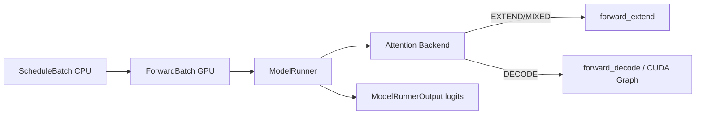
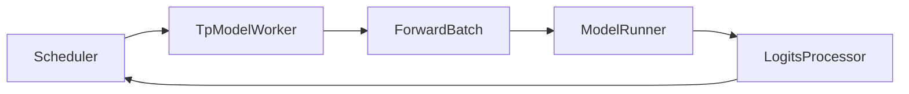

# ModelRunner · 核心概念

## 用户故事：Prefill 还是 Decode？— ModelRunner 如何读 ForwardMode 选 kernel

### Persona

**大刘**，性能工程师。对 Llama-3-8B 做 profiling 时发现：**extend 一步算几百 token，decode 一步每 req 只算 1 token**，kernel 形态完全不同。他需要理解 `ScheduleBatch → ForwardBatch → ModelRunner` 链路上，`ForwardMode` 如何决定走 prefill kernel 还是 CUDA Graph decode。

### 时间线

| 时刻 | 事件 |
|------|------|
| T0 | Scheduler 组好 `ScheduleBatch`，`forward_mode=EXTEND`（新 prompt 或 chunked prefill） |
| T0+1ms | `ForwardBatch.init_new` 把 `req_pool_indices`、`seq_lens`、`out_cache_loc` 等搬上 GPU |
| T0+2ms | ModelRunner `forward_batch_generation` → Attention backend `forward_extend` |
| T1 | Prefill 完成，后续迭代 `forward_mode=DECODE`；若 shape 固定则 `is_cuda_graph()` → replay graph |
| T2 | `ModelRunnerOutput.logits_output` 回 Scheduler；`can_run_graph` 影响 overlap 策略 |

### 涉及模块



**Explain：** ModelRunner 是**单 GPU rank 上的执行引擎**：加载权重、管理 KV 池、选 Attention 后端、跑 transformer forward。Scheduler 不直接碰 ModelRunner，而是通过 TpWorker 门面调用。`ForwardMode` 是选路的**唯一语义开关**——`EXTEND`/`MIXED` 走 prefill kernel（可带 Radix 已缓存 prefix）；`DECODE` 走 batch decode，且 `is_cuda_graph()` 为 true 时尝试 CUDA Graph replay 降低 launch 开销。

**Code：**

```python
# 来源：python/sglang/srt/model_executor/forward_batch_info.py L78-L91
# 提交版本：70df09b
class ForwardMode(IntEnum):
    # Extend a sequence. The KV cache of the beginning part of the sequence is already computed (e.g., system prompt).
    # It is also called "prefill" in common terminology.
    EXTEND = auto()
    # Decode one token.
    DECODE = auto()
    # Contains both EXTEND and DECODE when doing chunked prefill.
    MIXED = auto()
    # No sequence to forward. For data parallel attention, some workers will be IDLE if no sequence are allocated.
    IDLE = auto()

    # Used in speculative decoding: verify a batch in the target model.
    TARGET_VERIFY = auto()
    # Used in speculative decoding: extend a batch in the draft model.
```

**Comment：**

- 已有 prefix KV 时 EXTEND 只算 `origin_input_ids[len(prefix_indices):]` 的 delta（RadixAttention Radix）。
- `MIXED` 用于 chunked prefill：同一 batch 内既有 extend 又有 decode。
- PP 中间 rank 的 `logits_output` 可能是 `PPProxyTensors`（hidden states），不是最终 logits。

### 如果…会怎样（调试）

| 现象 | 可能原因 | 排查 |
|------|----------|------|
| decode 吞吐低、launch 开销大 | CUDA Graph 未 capture 或 `can_run_graph=False` | 看 `ModelRunnerOutput.can_run_graph` |
| prefill 仍算全长 prompt | `prefix_indices` 为空 / Radix miss | 对比调度策略 `match_prefix_for_req` |
| 改 attention backend 无效 | prefill/decode 分裂需 HybridAttnBackend | 见 Attention `--prefill-attention-backend` |

---

## 1. 架构位置

ModelRunner 位于 **阶段 III 执行层**，承接 Scheduler 已组好的 batch，在 GPU 上跑 transformer forward，输出 logits。



## 2. 核心术语

| 术语 | 含义 |
|------|------|
| **ModelRunner** | 单 GPU rank 上的模型执行引擎：加载权重、管理 KV 池、选 Attention 后端、跑 forward |
| **TpModelWorker** | Scheduler 进程内的 TP Worker 门面，持有 ModelRunner，暴露 `forward_batch_generation` |
| **ForwardBatch** | GPU 侧前向输入包，由 `ScheduleBatch` 转换而来 |
| **ForwardMode** | EXTEND（prefill）/ DECODE / MIXED / TARGET_VERIFY 等模式枚举 |
| **CUDA Graph Runner** | decode 固定 shape 时 capture/replay 图，降低 kernel launch 开销 |

## 3. ScheduleBatch → ForwardBatch

**Explain：** 模块文档头明确了两层 batch 的分工：ScheduleBatch 在 CPU、含调度语义；ForwardBatch 在 GPU、含张量索引。

**Code：**

```python
# 来源：python/sglang/srt/model_executor/forward_batch_info.py L14-L26
# 提交版本：70df09b
"""
Store information about a forward batch.

The following is the flow of data structures for a batch:

ScheduleBatch -> ForwardBatch

- ScheduleBatch is managed by `scheduler.py::Scheduler`.
  It contains high-level scheduling data. Most of the data is on the CPU.
- ForwardBatch is managed by `model_runner.py::ModelRunner`.
  It contains low-level tensor data. Most of the data consists of GPU tensors.
  It is constructed directly from a ScheduleBatch by `ForwardBatch.init_new`.
"""
```

**Comment：**

- 读者在ScheduleBatch-IO 已学 ScheduleBatch；本模块关注 `init_new` 如何把 req 索引、seq_lens、KV slot 映射成 GPU tensor。
- ForwardBatch 还携带 `forward_mode`，决定走 extend kernel 还是 decode graph。

## 4. ForwardMode 枚举

**Explain：** ForwardMode 区分 prefill、decode、混合批、投机 verify、PD 分离等场景；`is_cuda_graph()` 决定能否 replay 已 capture 的图。

**Code：**

```python
# 来源：python/sglang/srt/model_executor/forward_batch_info.py L78-L161
# 提交版本：70df09b
class ForwardMode(IntEnum):
    # Extend a sequence. The KV cache of the beginning part of the sequence is already computed (e.g., system prompt).
    # It is also called "prefill" in common terminology.
    EXTEND = auto()
    # Decode one token.
    DECODE = auto()
    # Contains both EXTEND and DECODE when doing chunked prefill.
    MIXED = auto()
    # No sequence to forward. For data parallel attention, some workers will be IDLE if no sequence are allocated.
    IDLE = auto()

    # Used in speculative decoding: verify a batch in the target model.
    TARGET_VERIFY = auto()
    # Used in speculative decoding: extend a batch in the draft model.
    DRAFT_EXTEND_V2 = auto()

    # Used in disaggregated decode worker
    # Represent a batch of requests having their KV cache ready to start decoding
    PREBUILT = auto()

    # Split Prefill for PD multiplexing
    SPLIT_PREFILL = auto()

    # Used in dLLM
    DLLM_EXTEND = auto()

    def is_prefill(self, include_draft_extend_v2: bool = False):
        return self.is_extend(include_draft_extend_v2=include_draft_extend_v2)

    def is_extend(self, include_draft_extend_v2: bool = False):
        return (
            self == ForwardMode.EXTEND
            or self == ForwardMode.MIXED
            or (include_draft_extend_v2 and self == ForwardMode.DRAFT_EXTEND_V2)
            or self == ForwardMode.TARGET_VERIFY
            or self == ForwardMode.SPLIT_PREFILL
            or self == ForwardMode.DLLM_EXTEND
        )

    def is_context_parallel_extend(self, include_draft_extend_v2: bool = False):
        return (
            self == ForwardMode.EXTEND
            or self == ForwardMode.MIXED
            or (
                self == ForwardMode.DRAFT_EXTEND_V2
                if include_draft_extend_v2
                else False
            )
        )

    def is_decode(self):
        return self == ForwardMode.DECODE

    def is_mixed(self):
        return self == ForwardMode.MIXED

    def is_idle(self):
        return self == ForwardMode.IDLE

    def is_decode_or_idle(self):
        return self == ForwardMode.DECODE or self == ForwardMode.IDLE

    def is_target_verify(self):
        return self == ForwardMode.TARGET_VERIFY

    def is_draft_extend_v2(self):
        # For fixed shape logits output in eagle v2 worker
        return self == ForwardMode.DRAFT_EXTEND_V2

    def is_extend_or_draft_extend_or_mixed(self, include_draft_extend_v2: bool = False):
        return (
            self == ForwardMode.EXTEND
            or self == ForwardMode.MIXED
            or self == ForwardMode.SPLIT_PREFILL
            or (include_draft_extend_v2 and self == ForwardMode.DRAFT_EXTEND_V2)
        )

    def is_cuda_graph(self):
        return (
            self == ForwardMode.DECODE
            or self == ForwardMode.TARGET_VERIFY
            or self == ForwardMode.IDLE
            or self == ForwardMode.DLLM_EXTEND
        )
```

**Comment：**

- `EXTEND` 即业界常说的 prefill；已有 prefix KV 时只算新增 token。
- `MIXED` 用于 chunked prefill：同一 batch 内既有 extend 又有 decode。
- `is_cuda_graph()` 为 true 的模式才尝试 CUDA Graph replay（shape 相对固定）。

## 5. ModelRunnerOutput

**Explain：** forward 的返回值封装 logits、是否可跑 graph、MoE 指标等，供 Scheduler 与监控使用。

**Code：**

```python
# 来源：python/sglang/srt/model_executor/model_runner.py L335-L340
# 提交版本：70df09b
class ModelRunnerOutput:
    logits_output: Union[LogitsProcessorOutput, PPProxyTensors]
    can_run_graph: bool
    expert_distribution_metrics: Optional[ExpertDistributionMetrics] = None
    routed_experts_output: Optional[TopkCaptureOutput] = None
    indexer_topk_output: Optional[TopkCaptureOutput] = None
```

**Comment：**

- PP 中间 rank 的 `logits_output` 实际是 `PPProxyTensors`（hidden states），不是 logits。
- `can_run_graph` 告知 Scheduler 本 step 是否走了 CUDA Graph，影响 overlap 调度策略。

## 6. TpWorker 抽象层

**Explain：** `BaseTpWorker` 定义 Scheduler 需要的接口；权重热更新、LoRA、embedding forward 都委托给内部 `ModelRunner`。

**Code：**

```python
# 来源：python/sglang/srt/managers/tp_worker.py L63-L101
# 提交版本：70df09b
class BaseTpWorker(ABC):
    @abstractmethod
    def forward_batch_generation(self, forward_batch: ForwardBatch):
        pass

    @property
    @abstractmethod
    def model_runner(self) -> ModelRunner:
        pass

    @property
    def war_fastpath_runner(self):
        # The runner that runs the step's LAST shared-buffer-reading phase --
        # it owns the read-done event the scheduler's WAR barrier waits on.
        # For a plain worker that's its own runner.
        return self.model_runner

    @property
    def sliding_window_size(self) -> Optional[int]:
        return self.model_runner.sliding_window_size

    @property
    def is_hybrid_swa(self) -> bool:
        return self.model_runner.is_hybrid_swa

    def get_tokens_per_layer_info(self):
        return (
            self.model_runner.full_max_total_num_tokens,
            self.model_runner.swa_max_total_num_tokens,
        )

    def get_pad_input_ids_func(self):
        return getattr(self.model_runner.model, "pad_input_ids", None)

    def get_memory_pool(self) -> Tuple[ReqToTokenPool, BaseTokenToKVPoolAllocator]:
        return (
            self.model_runner.req_to_token_pool,
            self.model_runner.token_to_kv_pool_allocator,
        )
```

**Comment：**

- Scheduler 不直接持有 ModelRunner，而是通过 TpWorker 统一访问——便于 EAGLE 多 runner、draft worker 等变体。
- 权重更新后 `recapture_cuda_graph` 可选重 capture graph（权重变了 graph 需重建）。
