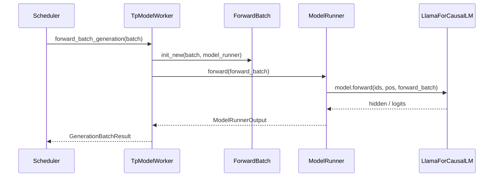

# ModelRunner：数据流与交互

## 1. 架构位置

ModelRunner 处于 **Scheduler 与模型层（Models 通用）之间**，是 GPU 算力消耗的核心。



## 2. 输入 / 输出

| 方向 | 类型 | 说明 | 定义位置 |
|------|------|------|----------|
| 输入 | `ScheduleBatch` | CPU 调度 batch，含 Req 列表 | ScheduleBatch-IO |
| 中间 | `ForwardBatch` | GPU 张量 + forward_mode | forward_batch_info.py |
| 输出 | `GenerationBatchResult` | logits、next_token_ids、can_run_cuda_graph | tp_worker / io_struct |

**Code（GenerationBatchResult 字段）：**

```python
# 来源：python/sglang/srt/managers/io_struct.py L180-L195
# 提交版本：70df09b（节选）
    # Optional per-image hashes the caller has already computed (hex strings).
    # Single request: one hash per image. Batch request: either one hash per
    # request when each request has one image, or one list of hashes per request.
    # When supplied, each MultimodalDataItem's
    # `hash` is initialised from this list and `set_pad_value` skips the
    # internal `hash_feature()` recompute, so the resulting `pad_value` is
    # deterministic from the caller's hash. Intended for external KV routers
    # that compute their own per-image hash for routing decisions and need
    # sglang's prefix-cache key to align. When unset, behavior is unchanged
    # (sglang hashes the processor feature tensor).
    mm_hashes: Optional[Union[List[str], List[List[str]]]] = None
    # Whether to extract and process audio from video inputs.
    use_audio_in_video: bool = False
    # The sampling_params. See descriptions below.
    sampling_params: Optional[Union[List[Dict[str, Any]], Dict[str, Any]]] = None
    # Whether to return logprobs.
```

## 3. 上下游连接

| 上游/下游 | 模块 | 交互方式 | 说明 |
|-----------|------|----------|------|
| 上游 | Scheduler | 进程内直接调用 | `tp_worker.forward_batch_generation` |
| 上游 | ScheduleBatch | 数据转换 | `ForwardBatch.init_new` |
| 下游 | models/* | Python forward | `model.forward(..., forward_batch)` |
| 下游 | layers/attention | RadixAttention | 读 forward_batch 中的 KV 索引 |
| 下游 | mem_cache | KV pool | req_to_token_pool / token_to_kv_pool |
| 侧向 | model_loader | 启动时 | `ModelRunner.load_model` |

## 4. 典型 decode step 数据流

### 步骤 1：Scheduler 组 batch

Scheduler 将多个 decode 中的 Req 合并，`forward_mode=DECODE`，更新 `req_to_token_pool` 中 token→KV slot 映射（RadixAttention RadixCache 参与 prefix 匹配在 prefill 阶段）。

### 步骤 2：构造 ForwardBatch

**Code：**

```python
# 来源：python/sglang/srt/managers/tp_worker.py L491-L495
# 提交版本：70df09b
        if batch is not None:
            # update the consumer index of hicache to the running batch
            self.set_hicache_consumer(batch.hicache_consumer_index)

            forward_batch = ForwardBatch.init_new(batch, self.model_runner)
```

**Comment：** `hicache_consumer_index` 用于分层 KV 与 host 侧 cache 同步（RadixAttention/16）。

### 步骤 3：选择执行路径

**Code：**

```python
# 来源：python/sglang/srt/model_executor/model_runner.py L2954-L2963
# 提交版本：70df09b
    def forward(
        self,
        forward_batch: ForwardBatch,
        skip_attn_backend_init: Optional[bool] = None,  # deprecated
        pp_proxy_tensors: Optional[PPProxyTensors] = None,
        reinit_attn_backend: bool = False,
        split_forward_count: int = 1,
    ) -> ModelRunnerOutput:
        # Deprecated kwarg: pre-planners mark the batch themselves now.
        forward_batch.apply_deprecated_skip_attn_backend_init(skip_attn_backend_init)
```

**Comment：** `_forward_raw` 内部判断 `forward_batch.forward_mode.is_cuda_graph()` 与当前 bs 是否已 capture。

### 步骤 4：模型层读 KV

RadixAttention 从 `forward_batch` 取 `out_cache_loc` 写入新 token 的 K/V；decode 时 seq_len 已 +1。

### 步骤 5：Logits 与采样

末 PP rank 得到 `LogitsProcessorOutput`，TpWorker 调 `model_runner.sample` 得 `next_token_ids`，Scheduler 写回各 Req。

## 5. 与分布式并行交互

| 并行 | ModelRunner 中的体现 |
|------|---------------------|
| TP | `tp_rank` 切分 QKV/MLP 权重；Attention 后端做 all-reduce |
| PP | 非末 rank 传 `PPProxyTensors`；仅末 rank 算 logits |
| EP | MoE expert 按 `moe_ep_rank` 分布 |
| DP Attention | `ForwardMode.IDLE`、padding mode、`prepare_mlp_sync_batch` |

**Code（PP 非末 rank）：**

```python
# 来源：python/sglang/srt/managers/tp_worker.py L548-L560
# 提交版本：70df09b（节选）
                    len(forward_batch.seq_lens),
                    dtype=torch.long,
                    device=forward_batch.input_ids.device,
                )
                if (
                    forward_batch.return_logprob
                    and logits_output.next_token_logits is not None
                ):
                    # NOTE: Compute logprobs without full sampling
                    self.model_runner.compute_logprobs_only(
                        logits_output, forward_batch
                    )

```

## 6. Draft Worker 数据流

投机解码时 target 与 draft 各有一个 TpModelWorker（`is_draft_worker` 标志）。Draft 的 `ForwardMode` 含 `DRAFT_EXTEND_V2` / verify 时 target 用 `TARGET_VERIFY`。

**Code：**

```python
# 来源：python/sglang/srt/model_executor/model_runner.py L438-L442
# 提交版本：70df09b
        if (
            (self.spec_algorithm.is_eagle() or self.spec_algorithm.is_standalone())
            and not self.is_draft_worker
            and server_args.speculative_draft_model_path
        ):
```

**Comment：** Target ModelRunner 预读 draft 层数以正确 sizing KV pool；draft worker 加载独立权重。
