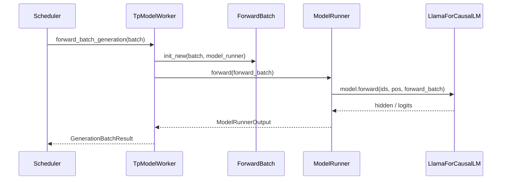

# ModelRunner：数据流与交互

## 1. 架构位置

**Explain：** ModelRunner 处于 **Scheduler 与模型层（Models 通用）之间**，是 GPU 算力消耗的核心。Scheduler 只决定 batch 怎么跑，真正把 `ScheduleBatch` 物化为 GPU forward 的入口在 TpModelWorker 与 ModelRunner。



## 2. 输入 / 输出

| 方向 | 类型 | 说明 | 定义位置 |
|------|------|------|----------|
| 输入 | `ScheduleBatch` | CPU 调度 batch，含 Req 列表 | ScheduleBatch-IO |
| 中间 | `ForwardBatch` | GPU 张量 + forward_mode | forward_batch_info.py |
| 输出 | `GenerationBatchResult` | logits、next_token_ids、can_run_cuda_graph | managers/utils.py |

**Explain：** `GenerationBatchResult` 是 `TpModelWorker.forward_batch_generation` 返回给 Scheduler 的结果包，定义在 `managers/utils.py`（经 `scheduler` 再导出）。末 PP rank 填充 `logits_output` 与 `next_token_ids`；非末 rank 填充 `pp_hidden_states_proxy_tensors`。`can_run_cuda_graph` 反馈本 step 是否成功 replay CUDA Graph。

**Code（GenerationBatchResult 字段）：**

```python
## 来源：python/sglang/srt/managers/utils.py L38-L86
# 提交版本：70df09b
@dataclasses.dataclass
class GenerationBatchResult:
    logits_output: Optional[LogitsProcessorOutput] = None
    pp_hidden_states_proxy_tensors: Optional[PPProxyTensors] = None
    next_token_ids: Optional[Union[torch.Tensor, List[torch.Tensor]]] = None
    num_correct_drafts: int = 0  # no bonus included
    num_correct_drafts_per_req_cpu: Optional[List[int]] = None
    can_run_cuda_graph: bool = False

    # PP skip output comm: True when output send/recv was skipped and
    # next_token_ids are placeholder zeros. Used by process_batch_result_prefill
    # to validate that skipped output is never consumed.
    skipped_output_comm: bool = False

    # For output processing
    extend_input_len_per_req: Optional[List[int]] = None
    extend_logprob_start_len_per_req: Optional[List[int]] = None

    # For overlap scheduling
    copy_done: Optional[torch.cuda.Event] = None
    delay_sample_func: Optional[callable] = None
    future_indices: Optional[torch.Tensor] = None
    speculative_num_draft_tokens: Optional[int] = None

    # FIXME(lsyin): maybe move to a better place?
    # sync path: forward stream -> output processor
    accept_lens: Optional[torch.Tensor] = None

    # Next-iter seq_lens; published via on_publish.
    new_seq_lens: Optional[torch.Tensor] = None

    # relay path: forward stream -> next step forward
    next_draft_input: Optional[EagleDraftInput] = None

    # Refs the worker wants scheduler to keep alive for the same 2-iter window
    # as batch_record_buf. Used for cross-stream tensor lifetime (e.g. a spec
    # V2 verify ForwardBatch whose tensors must outlive mid-iter SB rebinds).
    extra_keep_alive_refs: Optional[List[Any]] = None

    # Routed experts: pending async D2H for overlap scheduling
    routed_experts_output: Optional[TopkCaptureOutput] = None
    indexer_topk_output: Optional[TopkCaptureOutput] = None

    # metrics
    expert_distribution_metrics: Optional[ExpertDistributionMetrics] = None

    # Forward pass metrics (FPM) — GPU-accurate timing via CUDA events
    fpm_start_event: Optional[torch.cuda.Event] = None
    fpm_end_event: Optional[torch.cuda.Event] = None
```

**Comment：**

- 与 `ModelRunnerOutput` 不同：后者是 ModelRunner 单 rank forward 的原始输出；Worker 再封装为 `GenerationBatchResult` 供 Scheduler 写回 Req。
- overlap 模式下 grammar 约束时可能只设 `delay_sample_func`，采样推迟到 output processor 阶段。

## 3. 上下游连接

| 上游/下游 | 模块 | 交互方式 | 说明 |
|-----------|------|----------|------|
| 上游 | Scheduler | 进程内直接调用 | `tp_worker.forward_batch_generation` |
| 上游 | ScheduleBatch | 数据转换 | `ForwardBatch.init_new` |
| 下游 | models/* | Python forward | `model.forward(..., forward_batch)` |
| 下游 | layers/attention | RadixAttention | 读 forward_batch 中的 KV 索引 |
| 下游 | mem_cache | KV pool | req_to_token_pool / token_to_kv_pool |
| 侧向 | model_loader | 启动时 | `ModelRunner.load_model` |

## 4. 典型 decode step 数据流

### 步骤 1：Scheduler 组 batch

Scheduler 将多个 decode 中的 Req 合并，`forward_mode=DECODE`，更新 `req_to_token_pool` 中 token→KV slot 映射（RadixAttention RadixCache 参与 prefix 匹配在 prefill 阶段）。

### 步骤 2：构造 ForwardBatch

**Explain：** Scheduler 传入 `ScheduleBatch` 后，Worker 先同步 HiCache 消费者索引，再调用 `ForwardBatch.init_new` 把 CPU 调度数据物化为 GPU 张量视图。

**Code：**

```python
## 来源：python/sglang/srt/managers/tp_worker.py L491-L495
# 提交版本：70df09b
        if batch is not None:
            # update the consumer index of hicache to the running batch
            self.set_hicache_consumer(batch.hicache_consumer_index)

            forward_batch = ForwardBatch.init_new(batch, self.model_runner)
```

**Comment：** `hicache_consumer_index` 用于分层 KV 与 host 侧 cache 同步（RadixAttention/16）。

### 步骤 3：选择执行路径

**Explain：** `ModelRunner.forward` 是单 rank 执行入口；内部 `_forward_raw` 根据 `forward_mode` 与 batch size 在 EagerRunner 与 CudaGraphRunner 之间选路。

**Code：**

```python
## 来源：python/sglang/srt/model_executor/model_runner.py L2954-L2963
# 提交版本：70df09b
    def forward(
        self,
        forward_batch: ForwardBatch,
        skip_attn_backend_init: Optional[bool] = None,  # deprecated
        pp_proxy_tensors: Optional[PPProxyTensors] = None,
        reinit_attn_backend: bool = False,
        split_forward_count: int = 1,
    ) -> ModelRunnerOutput:
        # Deprecated kwarg: pre-planners mark the batch themselves now.
        forward_batch.apply_deprecated_skip_attn_backend_init(skip_attn_backend_init)
```

**Comment：** `_forward_raw` 内部判断 `forward_batch.forward_mode.is_cuda_graph()` 与当前 bs 是否已 capture。

### 步骤 4：模型层读 KV

RadixAttention 从 `forward_batch` 取 `out_cache_loc` 写入新 token 的 K/V；decode 时 seq_len 已 +1。

### 步骤 5：Logits 与采样

末 PP rank 得到 `LogitsProcessorOutput`，TpWorker 调 `model_runner.sample` 得 `next_token_ids`，Scheduler 写回各 Req。

## 5. 与分布式并行交互

| 并行 | ModelRunner 中的体现 |
|------|---------------------|
| TP | `tp_rank` 切分 QKV/MLP 权重；Attention 后端做 all-reduce |
| PP | 非末 rank 传 `PPProxyTensors`；仅末 rank 算 logits |
| EP | MoE expert 按 `moe_ep_rank` 分布 |
| DP Attention | `ForwardMode.IDLE`、padding mode、`prepare_mlp_sync_batch` |

**Explain：** 非末 PP rank 不执行采样。`ModelRunner.forward` 返回的 `logits_output` 实际是 `PPProxyTensors`（hidden states 等），Worker 将其写入 `GenerationBatchResult.pp_hidden_states_proxy_tensors` 供下一 pipeline stage 消费。

**Code（PP 非末 rank）：**

```python
## 来源：python/sglang/srt/managers/tp_worker.py L562-L572
# 提交版本：70df09b
        else:
            out = self.model_runner.forward(
                forward_batch,
                pp_proxy_tensors=pp_proxy_tensors,
            )
            pp_proxy_tensors, can_run_cuda_graph = out.logits_output, out.can_run_graph
            return GenerationBatchResult(
                pp_hidden_states_proxy_tensors=pp_proxy_tensors,
                can_run_cuda_graph=can_run_cuda_graph,
                expert_distribution_metrics=out.expert_distribution_metrics,
            )
```

**Comment：**

- `out.logits_output` 在非末 rank 的类型是 `PPProxyTensors`，不是末 rank 的 `LogitsProcessorOutput`。
- 与末 rank 分支（L506–561）对比：仅末 rank 构造含 `logits_output` / `next_token_ids` 的完整结果并调用 `sample`。

## 6. Draft Worker 数据流

**Explain：** 投机解码时 target 与 draft 各持一个 TpModelWorker（`is_draft_worker` 标志）。Target ModelRunner 在加载阶段预读 draft 层数以正确 sizing KV pool。

**Code：**

```python
## 来源：python/sglang/srt/model_executor/model_runner.py L438-L442
# 提交版本：70df09b
        if (
            (self.spec_algorithm.is_eagle() or self.spec_algorithm.is_standalone())
            and not self.is_draft_worker
            and server_args.speculative_draft_model_path
        ):
```

**Comment：** Target ModelRunner 预读 draft 层数以正确 sizing KV pool；draft worker 加载独立权重。Draft 的 `ForwardMode` 含 `DRAFT_EXTEND_V2`；verify 时 target 用 `TARGET_VERIFY`。
