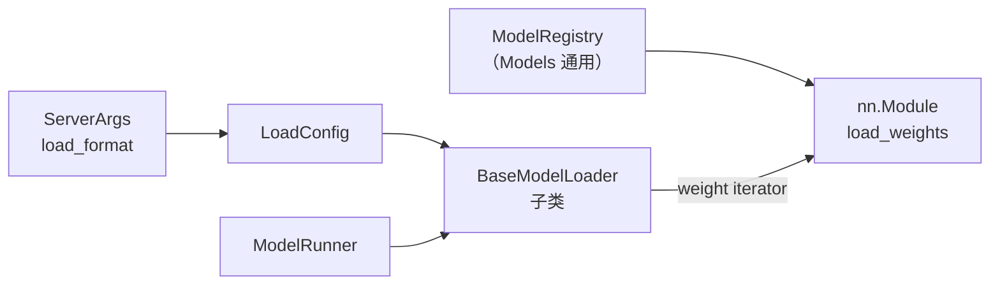

# ModelLoader 与权重同步

> **阶段 III · 模型执行** | 状态：已完成 | Git：`70df09b83363e0127b43c83a6007d3938f815b2d` 
> **源码范围：** `srt/model_loader/`、`srt/weight_sync/`

---

## 本模块在架构中的位置

ModelLoader 在 **启动阶段** 被 ModelRunner 调用，负责把 HuggingFace checkpoint 映射到 `ModelRegistry` 解析出的模型类（Models 通用），并按 TP rank 灌入对应分片。`LoadFormat` 决定使用 DefaultModelLoader、GGUFModelLoader、RemoteInstanceModelLoader 等具体实现；weight iterator 逐 `(name, tensor)` yield，模型 `load_weights` 按名匹配参数。运行时权重热更新（disk / distributed / IPC）走 `weight_sync/` 子系统，`FlattenedTensorBucket` 用于跨进程高效传权重。



---

## 零基础一句话

**像「仓库入库员」**：把 HuggingFace 大箱快递（safetensors）按清单（weight name）拆包，把每个零件（tensor）放到模型骨架（nn.Module）的正确位置，并按 TP rank 只拿自己那份。

---

## 用户场景

**Persona：** MLOps 工程师小郑需要在线热更新 LoRA 权重，需要理解 `LoadFormat.REMOTE_INSTANCE` 与 `weight_sync` IPC 路径，以及 `LayeredModelLoader` 如何逐层加载降低峰值显存。她还需知道 safetensors iterator 与多线程 buffered 读盘的差异。

---

## 五件套阅读顺序

| 顺序 | 文件 | 一句话说明 |
|------|------|------------|
| 01 | [[12-ModelLoader-01-核心概念]] | LoadConfig、Loader 体系、weight iterator、device_loading_context |
| 启动链路 | [[12-ModelLoader-02-源码走读]] | DefaultModelLoader、weight_utils、safetensors 精读 |
| HTTP Server | [[12-ModelLoader-03-数据流与交互]] | ModelRunner → Loader → Model.load_weights 全链路 |
| OpenAI API | [[12-ModelLoader-04-关键问题]] | 量化加载、远程加载、TP 分片、热更新 |
| ✓ | [[12-ModelLoader-05-checkpoint]] | 验收：能否说明 LoadFormat 与 Loader 映射关系 |

---

## 核心源码锚点

**Explain：** `ModelRunner.load_model` 根据 `server_args.load_format` 构造 `LoadConfig`，再经 factory 取得具体 Loader 实例并 `load_model`，返回已灌权重的 `nn.Module`。所有 Loader 实现统一 `download_model` + `load_model` 接口。

**Code：**

```python
# 来源：python/sglang/srt/model_loader/loader.py L330-L349
class BaseModelLoader(ABC):
    """Base class for model loaders."""

    def __init__(self, load_config: LoadConfig):
        self.load_config = load_config

    @abstractmethod
    def download_model(self, model_config: ModelConfig) -> None:
        """Download a model so that it can be immediately loaded."""
        raise NotImplementedError

    @abstractmethod
    def load_model(
        self,
        *,
        model_config: ModelConfig,
        device_config: DeviceConfig,
    ) -> nn.Module:
        """Load a model with the given configurations."""
        raise NotImplementedError
```

**Comment：**

- 所有 Loader 实现统一接口：`download_model`（可选预下载）+ `load_model`（返回 nn.Module）。
- `DefaultModelLoader` 覆盖绝大多数 HF 本地/Hub 场景；GGUF、RemoteInstance 等走子类。
- weight iterator（如 `safetensors_weights_iterator`）逐 tensor yield，避免一次性读入全部权重。
- TP rank 在模型 `weight_loader` 内只加载本 rank 需要的 slice。

---

## 验证建议

1. **CLI：** `--load-format safetensors` 或 `gguf`，启动日志应显示选用的 Loader 类名与权重文件列表。
2. **日志：** 搜索 `Loading weights` / `load_model` / `safetensors`；热更新时可见 `weight_sync` 相关 trace。

---

## 阅读路径

← [[11-ModelRunner-00-MOC|ModelRunner]] 
→ [[13-Models-通用-00-MOC|Models 通用]]
