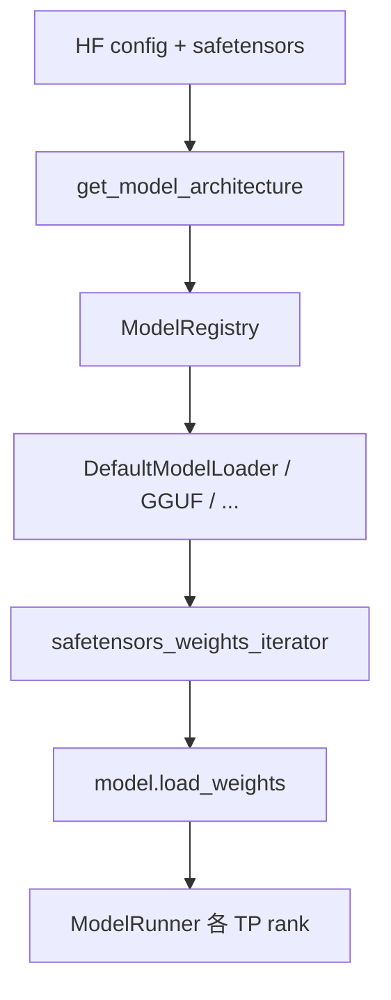

# ModelLoader · 核心概念

## 用户故事：Friday 换模型 — ModelLoader 如何把 safetensors 灌进 TP rank

### Persona

**运维老王**，负责周五晚把生产从 Llama-3-8B 切到微调 checkpoint。启动命令 `--model-path ./my-finetune --load-format safetensors --tp-size 4`。他关心：**谁决定用哪个 Loader、权重如何按 rank 分片、为何不能一次性读入全部 tensor**。

### 时间线

| 时刻 | 事件 |
|------|------|
| T0 | `Engine._launch_subprocesses` → 各 rank 的 ModelRunner 初始化 |
| T0+5s | `get_model_architecture` 读 HF config `architectures` → `ModelRegistry.resolve_model_cls` |
| T0+30s | `DefaultModelLoader` 用 `safetensors_weights_iterator` 逐 `(name, tensor)` yield |
| T1 | 模型 `load_weights` 按名匹配参数；TP rank 只保留本 rank 的 slice |
| T2 | 可选 `device_loading_context` 临时 GPU 校准量化；完成后 restore CPU 参数 |

### 涉及模块



**Explain：** ModelLoader 在**启动阶段**被 ModelRunner 调用，负责 checkpoint → 模型类的映射与灌权重。不一次性读入全部 tensor，而用 **iterator 模式**逐 `(name, tensor)` yield，模型 `load_weights` 按名匹配——降低峰值内存、支持多线程读盘。`LoadFormat` 决定具体 Loader（AUTO/SAFETENSORS/GGUF/BITSANDBYTES 等）。

**Code：**

```python
# 来源：python/sglang/srt/model_loader/weight_utils.py L930-L960
# 提交版本：70df09b（节选）
def safetensors_weights_iterator(
    hf_weights_files: List[str],
    disable_mmap: bool = False,
    prefetch: bool = False,
    prefetch_num_threads: int = 4,
    drop_cache_after_load: bool = False,
) -> Generator[Tuple[str, torch.Tensor], None, None]:
    """Iterate over the weights in the model safetensor files."""
    enable_tqdm = (
        not torch.distributed.is_initialized() or torch.distributed.get_rank() == 0
    )

    if prefetch and not disable_mmap:
        _prefetch_all_checkpoints(
            sorted(hf_weights_files), num_threads=prefetch_num_threads
        )

    for st_file in tqdm(
        hf_weights_files,
        desc="Loading safetensors checkpoint shards",
        disable=not enable_tqdm,
        bar_format=BAR_FORMAT,
        position=tqdm._get_free_pos(),
    ):
        if disable_mmap:
            with open(st_file, "rb") as f:
                result = safetensors.torch.load(f.read())
                for name in sorted(result.keys()):
                    yield name, result[name]
        else:
            with safetensors.safe_open(st_file, framework="pt", device="cpu") as f:
```

**Comment：**

- `LayeredModelLoader` 逐层加载，进一步降低峰值显存（大模型常见）。
- `DummyModelLoader` 随机权重，用于压测占位、不测磁盘 IO。
- 热更新 LoRA 可走 `FlattenedTensorBucket` 打平多 tensor，减少跨进程 pickle（ModelRunner TpWorker）。

### 如果…会怎样（调试）

| 现象 | 可能原因 | 排查 |
|------|----------|------|
| 启动 OOM | 非 iterator 路径或 TP 分片未生效 | 试 `--load-format auto` + 检查 `weight_loader` |
| `architecture not supported` | ModelRegistry 无对应类 | 看 HF config `architectures` 字段 |
| GGUF 与 HF 混用报错 | `LoadFormat` 与文件格式不匹配 | 显式 `--load-format gguf` 或 safetensors |

---

## 1. 架构位置

ModelLoader 在 **启动阶段** 被 ModelRunner 调用，负责把 checkpoint 映射到 `ModelRegistry` 解析出的模型类，并按 TP rank 灌入对应分片。

## 2. LoadFormat 与 Loader 映射

| LoadFormat | Loader 类 | 场景 |
|------------|-----------|------|
| AUTO / PT / SAFETENSORS | DefaultModelLoader | HF 标准权重 |
| GGUF | GGUFModelLoader | llama.cpp 格式 |
| REMOTE_INSTANCE | RemoteInstanceModelLoader | 从另一实例拉权重 |
| SHARDED_STATE | ShardedStateLoader | 预分片 checkpoint |
| DUMMY | DummyModelLoader | 压测/占位 |
| BITSANDBYTES | BitsAndBytesModelLoader | BnB 量化加载 |

**Code（Loader 类层次节选）：**

```python
# 来源：python/sglang/srt/model_loader/loader.py L352-L353, L824, L1371
# 提交版本：70df09b
class DefaultModelLoader(BaseModelLoader):
    """Model loader that can load different file types from disk."""
```

## 3. weight iterator 模式

**Explain：** 加载不一次性读入全部 tensor，而是用 iterator 逐 `(name, tensor)` yield，模型 `load_weights` 按名匹配参数。

**Code：**

```python
# 来源：python/sglang/srt/model_loader/weight_utils.py L930-L960
# 提交版本：70df09b（节选）
def safetensors_weights_iterator(
    hf_weights_files: List[str],
    disable_mmap: bool = False,
    prefetch: bool = False,
    prefetch_num_threads: int = 4,
    drop_cache_after_load: bool = False,
) -> Generator[Tuple[str, torch.Tensor], None, None]:
    """Iterate over the weights in the model safetensor files."""
    enable_tqdm = (
        not torch.distributed.is_initialized() or torch.distributed.get_rank() == 0
    )

    if prefetch and not disable_mmap:
        _prefetch_all_checkpoints(
            sorted(hf_weights_files), num_threads=prefetch_num_threads
        )

    for st_file in tqdm(
        hf_weights_files,
        desc="Loading safetensors checkpoint shards",
        disable=not enable_tqdm,
        bar_format=BAR_FORMAT,
        position=tqdm._get_free_pos(),
    ):
        if disable_mmap:
            with open(st_file, "rb") as f:
                result = safetensors.torch.load(f.read())
                for name in sorted(result.keys()):
                    yield name, result[name]
        else:
            with safetensors.safe_open(st_file, framework="pt", device="cpu") as f:
```

**Comment：**

- 多线程版本 `buffered_multi_thread_safetensors_weights_iterator` 并行读盘。
- TP rank 只加载本 rank 需要的 slice（在模型 `weight_loader` 内处理）。

## 4. device_loading_context

**Explain：** 量化校准等场景需临时把 CPU 参数拷到 GPU 算完再还原，避免长期占显存。

**Code：**

```python
# 来源：python/sglang/srt/model_loader/loader.py L135-L158
# 提交版本：70df09b
@contextmanager
def device_loading_context(module: torch.nn.Module, target_device: torch.device):
    if target_device.type == "cpu":
        # If target is CPU, no need to move anything
        yield module
        return

    original_infos: Dict[str, Dict] = {}

    # Store original device states and move parameters to GPU if they're on CPU
    for name, p in module.named_parameters():
        if p.device.type == "cpu":
            original_data = p.data
            device_data = p.data.to(target_device)
            original_infos[name] = dict(
                device=p.device,
                original_data=original_data,
                device_data=device_data,
            )
            p.data = device_data
        # Parameters already on target device are not touched

    try:
        yield module
```

## 5. FlattenedTensorBucket（weight_sync）

**Explain：** 跨进程热更新 LoRA/权重时，多个 tensor 打平成一块 uint8 buffer，附带 metadata 重建，减少 pickle 次数。

**Code：**

```python
# 来源：python/sglang/srt/weight_sync/tensor_bucket.py L19-L72
# 提交版本：70df09b
class FlattenedTensorBucket:
    """
    A bucket that flattens multiple tensors into a single tensor for efficient processing
    while preserving all metadata needed for reconstruction.
    """

    # This field is solely for users of to check whether the class supports this feature
    supports_multi_dtypes = True

    def __init__(
        self,
        named_tensors: List[Tuple[str, torch.Tensor]] = None,
        flattened_tensor: torch.Tensor = None,
        metadata: List[FlattenedTensorMetadata] = None,
    ):
        """
        Initialize a tensor bucket from a list of named tensors OR from pre-flattened data.
        Args:
            named_tensors: List of (name, tensor) tuples (for creating new bucket)
            flattened_tensor: Pre-flattened tensor (for reconstruction)
            metadata: Pre-computed metadata (for reconstruction)
        """
        if named_tensors is not None:
            # Create bucket from named tensors
            self.metadata: List[FlattenedTensorMetadata] = [None] * len(named_tensors)
            self.flattened_tensor: torch.Tensor = None

            if not named_tensors:
                raise ValueError("Cannot create empty tensor bucket")

            # Collect metadata and flatten tensors
            current_idx = 0
            flattened_tensors: List[torch.Tensor] = [None] * len(named_tensors)

            for i, (name, tensor) in enumerate(named_tensors):
                flattened = tensor.flatten().view(torch.uint8)
                flattened_tensors[i] = flattened

                # Store metadata

                numel = flattened.numel()
                metadata_obj = FlattenedTensorMetadata(
                    name=name,
                    shape=tensor.shape,
                    dtype=tensor.dtype,
                    start_idx=current_idx,
                    end_idx=current_idx + numel,
                    numel=numel,
                )
                self.metadata[i] = metadata_obj
                current_idx += numel

            # Concatenate all flattened tensors
            self.flattened_tensor = torch.cat(flattened_tensors, dim=0)
```

**Comment：** TpWorker 的 `load_lora_adapter_from_tensors` 在 `load_format=="flattened_bucket"` 时用此类反序列化（ModelRunner tp_worker 已引用）。

## 6. get_model_architecture

**Explain：** 读 HF config 的 `architectures` 字段，经 ModelRegistry 解析具体 Python 类。

**Code：**

```python
# 来源：python/sglang/srt/model_loader/utils.py L25-L45
# 提交版本：70df09b（节选）
    """Sets the default torch dtype to the given dtype."""
    old_dtype = torch.get_default_dtype()
    torch.set_default_dtype(dtype)
    yield
    torch.set_default_dtype(old_dtype)


def _is_moe_model(model_config: ModelConfig, architectures: list[str]) -> bool:
    lowered_arches = [arch.lower() for arch in architectures]
    if any("moe" in arch or "mixtral" in arch for arch in lowered_arches):
        return True

    text_config = model_config.hf_text_config
    expert_attrs = (
        "num_local_experts",
        "num_experts",
        "num_experts_per_tok",
        "moe_intermediate_size",
        "n_routed_experts",
    )
    for attr in expert_attrs:
```
