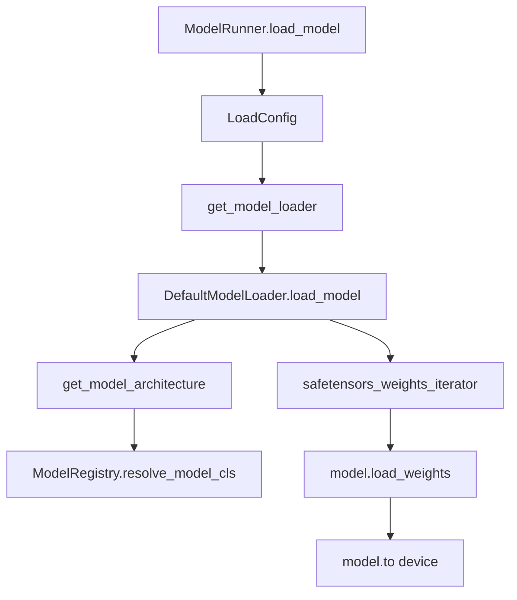

# ModelLoader：数据流与交互

## 1. 启动加载数据流



## 2. 输入 / 输出

| 输入 | 输出 |
|------|------|
| `ModelConfig`（path、dtype、architectures） | 灌权重的 `nn.Module` |
| `LoadConfig`（format、tp_rank、download_dir） | 可选 `QuantizationConfig` |
| HF 磁盘 / Hub 文件 | TP 分片后的 Parameter |

## 3. 与 ModelRunner 交互

**Code：**

```python
# 来源：python/sglang/srt/model_executor/model_runner.py L1421-L1437
# 提交版本：70df09b
        self.load_config = LoadConfig(
            load_format=self.server_args.load_format,
            download_dir=self.server_args.download_dir,
            model_loader_extra_config=self.server_args.model_loader_extra_config,
            tp_rank=self.tp_rank,
            remote_instance_weight_loader_seed_instance_ip=self.server_args.remote_instance_weight_loader_seed_instance_ip,
            remote_instance_weight_loader_seed_instance_service_port=self.server_args.remote_instance_weight_loader_seed_instance_service_port,
            remote_instance_weight_loader_send_weights_group_ports=self.server_args.remote_instance_weight_loader_send_weights_group_ports,
            remote_instance_weight_loader_backend=self.server_args.remote_instance_weight_loader_backend,
            remote_instance_weight_loader_transfer_engine=self.remote_instance_transfer_engine,
            remote_instance_weight_loader_transfer_engine_session_id=self.remote_instance_transfer_engine_session_id,
            modelexpress_url=self.server_args.modelexpress_url,
            modelexpress_transport=self.server_args.modelexpress_transport,
            modelopt_config=modelopt_config,
            rl_quant_profile=self.server_args.rl_quant_profile,
            draft_model_idx=self.draft_model_idx,
        )
```

## 4. 运行时热更新

| 路径 | TpWorker 方法 | ModelRunner 方法 |
|------|---------------|------------------|
| 磁盘 | `update_weights_from_disk` | 重新 load + 可选 recapture graph |
| NCCL 组 | `update_weights_from_distributed` | broadcast named tensors |
| 序列化 tensor | `update_weights_from_tensor` | 按 tp_rank 反序列化 |
| IPC | `update_weights_from_ipc` | checkpoint-engine 集成 |

**Code：**

```python
# 来源：python/sglang/srt/managers/tp_worker.py L165-L174
# 提交版本：70df09b
    def update_weights_from_tensor(self, recv_req: UpdateWeightsFromTensorReqInput):

        monkey_patch_torch_reductions()
        success, message = self.model_runner.update_weights_from_tensor(
            named_tensors=MultiprocessingSerializer.deserialize(
                recv_req.serialized_named_tensors[self.tp_rank]
            ),
            load_format=recv_req.load_format,
        )
        return success, message
```

## 5. LoRA 与 flattened_bucket

**Code：**

```python
# 来源：python/sglang/srt/managers/tp_worker.py L200-L208
# 提交版本：70df09b
        if recv_req.load_format == "flattened_bucket":
            flattened_data = MultiprocessingSerializer.deserialize(
                recv_req.serialized_tensors
            )
            bucket = FlattenedTensorBucket(
                flattened_tensor=flattened_data["flattened_tensor"],
                metadata=flattened_data["metadata"],
            )
            tensors = dict(bucket.reconstruct_tensors())
```

## 6. 与 ModelRegistry / 模型层

Loader 只负责 **tensor 流**；架构定义在 `srt/models/*`（Models 通用）。`get_model_architecture` 桥接两者。

---

## 7. safetensors 迭代加载路径

**Explain：** `DefaultModelLoader` 通过 `safetensors_weights_iterator` 逐 shard 流式读取 checkpoint，避免一次性 mmap 整个模型到内存。每个 tensor 经 `model.load_weights` 按 name 匹配 Parameter；TP rank 只保留本 rank 分片。

**Code：**

```python
# 来源：python/sglang/srt/model_loader/loader.py L234-L248（概念节选）
            }
        )

    if model_config.quantization is not None:
        quant_config = get_quant_config(
            model_config, load_config, packed_modules_mapping, remap_prefix
        )
        # (yizhang2077) workaround for nvidia/Llama-4-Maverick-17B-128E-Eagle3
        if quant_config is None:
            return None
        # Carry DSV4 expert layout into Fp8Config so downstream readers don't read env.
        from sglang.srt.layers.quantization.fp8 import Fp8Config

        if isinstance(quant_config, Fp8Config):
            quant_config.is_fp4_experts = model_config.is_fp4_experts
```

**Comment：**

- `--load-format safetensors` 为默认；`dummy` 格式用于压测调度而不灌真实权重。
- 量化 checkpoint 在 `load_weights` 后调用 `quant_method.process_weights_after_loading`（Quantization）。
- 加载完成后 `ModelRunner` 可选 capture CUDA Graph（ModelRunner、17）。

---

## 8. 加载失败与 OOM 边界

**Explain：** 权重 shape 与模型定义不匹配时 `load_weights` 抛错；TP 分片错误常表现为某 rank OOM 而其他 rank 正常。`--mem-fraction-static` 在加载前预留 KV pool，与权重占用叠加需小于 GPU 总显存。

**Code：**

```python
# 来源：python/sglang/srt/model_executor/model_runner.py L1421-L1437
        self.load_config = LoadConfig(
            load_format=self.server_args.load_format,
            download_dir=self.server_args.download_dir,
            model_loader_extra_config=self.server_args.model_loader_extra_config,
            tp_rank=self.tp_rank,
            remote_instance_weight_loader_seed_instance_ip=self.server_args.remote_instance_weight_loader_seed_instance_ip,
            remote_instance_weight_loader_seed_instance_service_port=self.server_args.remote_instance_weight_loader_seed_instance_service_port,
            remote_instance_weight_loader_send_weights_group_ports=self.server_args.remote_instance_weight_loader_send_weights_group_ports,
            remote_instance_weight_loader_backend=self.server_args.remote_instance_weight_loader_backend,
            remote_instance_weight_loader_transfer_engine=self.remote_instance_transfer_engine,
            remote_instance_weight_loader_transfer_engine_session_id=self.remote_instance_transfer_engine_session_id,
            modelexpress_url=self.server_args.modelexpress_url,
            modelexpress_transport=self.server_args.modelexpress_transport,
            modelopt_config=modelopt_config,
            rl_quant_profile=self.server_args.rl_quant_profile,
            draft_model_idx=self.draft_model_idx,
        )
```

**Comment：** `draft_model_idx` 非 None 时加载投机解码 draft 权重；与 target 模型共用 loader 路径但不同 `ModelRunner` 实例（投机解码）。

