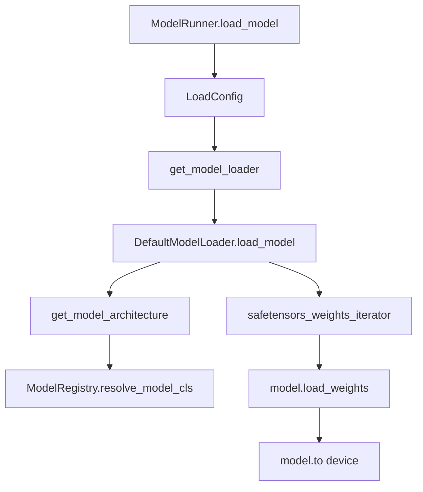
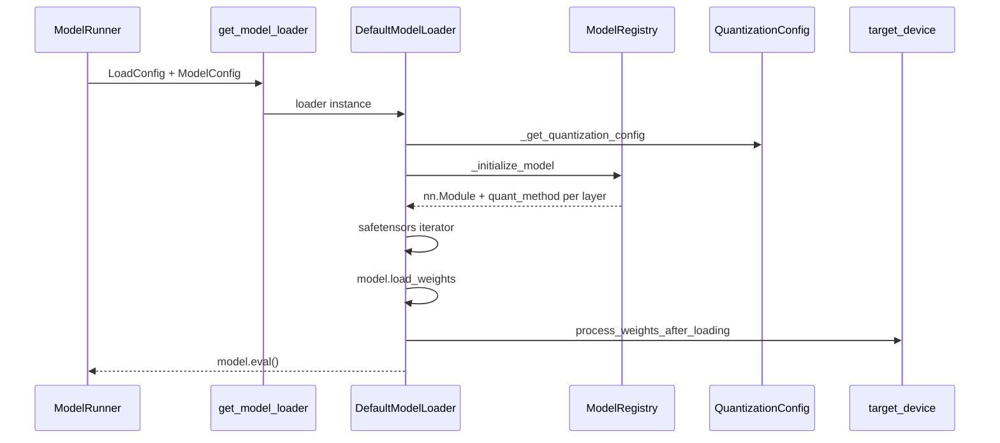

# ModelLoader：数据流与交互

## 1. 启动加载数据流



## 2. 输入 / 输出

| 方向 | 类型 | 说明 | 源码 |
|------|------|------|------|
| 输入 | `ModelConfig` | path、dtype、architectures、quantization | `model_config.py` |
| 输入 | `LoadConfig` | format、tp_rank、download_dir、remote IPC 字段 | `load_config.py` |
| 输入 | HF 磁盘 / Hub safetensors | shard 文件列表 | `_prepare_weights` |
| 输出 | 灌权重的 `nn.Module` | 含 `quant_config`、各层 `quant_method` | `load_model` |
| 输出 | 可选 `QuantizationConfig` | `_get_quantization_config` 解析 | `weight_utils.py` |
| 输出 | TP 分片 Parameter | 经 `weight_loader` slice | 各 `models/*` |

## 2.1 上下游

| 模块 | 关系 | 说明 |
|------|------|------|
| ModelRunner | 下游消费者 | `get_model_loader` → `loader.load_model` 在 `load_model()` 内 |
| ModelRegistry | 协同 | `get_model_architecture` → `ModelRegistry.resolve_model_cls` |
| Quantization | 下游 | `load_weights_and_postprocess` 调 `process_weights_after_loading` |
| TpWorker | 运行时 | 热更新 `update_weights_from_*` 复用 loader 逻辑 |
| CheckpointEngine | 运行时 | IPC / flattened_bucket 灌权重 |
| LoRA | 并行 | `flattened_bucket` + `FlattenedTensorBucket` |
| ServerArgs | 上游 | `--load-format`、`download_dir`、remote loader 端口 |
| Distributed | 协同 | TP rank 决定 stagger 读 shard 顺序 |

## 3. 与 ModelRunner 交互

**Code：**

```python
## 来源：python/sglang/srt/model_executor/model_runner.py L1421-L1437
# 提交版本：70df09b
        self.load_config = LoadConfig(
            load_format=self.server_args.load_format,
            download_dir=self.server_args.download_dir,
            model_loader_extra_config=self.server_args.model_loader_extra_config,
            tp_rank=self.tp_rank,
            remote_instance_weight_loader_seed_instance_ip=self.server_args.remote_instance_weight_loader_seed_instance_ip,
            remote_instance_weight_loader_seed_instance_service_port=self.server_args.remote_instance_weight_loader_seed_instance_service_port,
            remote_instance_weight_loader_send_weights_group_ports=self.server_args.remote_instance_weight_loader_send_weights_group_ports,
            remote_instance_weight_loader_backend=self.server_args.remote_instance_weight_loader_backend,
            remote_instance_weight_loader_transfer_engine=self.remote_instance_transfer_engine,
            remote_instance_weight_loader_transfer_engine_session_id=self.remote_instance_transfer_engine_session_id,
            modelexpress_url=self.server_args.modelexpress_url,
            modelexpress_transport=self.server_args.modelexpress_transport,
            modelopt_config=modelopt_config,
            rl_quant_profile=self.server_args.rl_quant_profile,
            draft_model_idx=self.draft_model_idx,
        )
```

## 4. 运行时热更新

| 路径 | TpWorker 方法 | ModelRunner 方法 |
|------|---------------|------------------|
| 磁盘 | `update_weights_from_disk` | 重新 load + 可选 recapture graph |
| NCCL 组 | `update_weights_from_distributed` | broadcast named tensors |
| 序列化 tensor | `update_weights_from_tensor` | 按 tp_rank 反序列化 |
| IPC | `update_weights_from_ipc` | checkpoint-engine 集成 |

**Code：**

```python
## 来源：python/sglang/srt/managers/tp_worker.py L165-L174
# 提交版本：70df09b
    def update_weights_from_tensor(self, recv_req: UpdateWeightsFromTensorReqInput):

        monkey_patch_torch_reductions()
        success, message = self.model_runner.update_weights_from_tensor(
            named_tensors=MultiprocessingSerializer.deserialize(
                recv_req.serialized_named_tensors[self.tp_rank]
            ),
            load_format=recv_req.load_format,
        )
        return success, message
```

## 5. LoRA 与 flattened_bucket

**Code：**

```python
## 来源：python/sglang/srt/managers/tp_worker.py L200-L208
# 提交版本：70df09b
        if recv_req.load_format == "flattened_bucket":
            flattened_data = MultiprocessingSerializer.deserialize(
                recv_req.serialized_tensors
            )
            bucket = FlattenedTensorBucket(
                flattened_tensor=flattened_data["flattened_tensor"],
                metadata=flattened_data["metadata"],
            )
            tensors = dict(bucket.reconstruct_tensors())
```

## 6. 与 ModelRegistry / 模型层

Loader 只负责 **tensor 流**；架构定义在 `srt/models/*`（Models 通用）。`get_model_architecture` 桥接两者。

---

## 7. safetensors 迭代加载路径

**Explain：** `DefaultModelLoader` 通过 `safetensors_weights_iterator` 逐 shard 流式读取 checkpoint，避免一次性 mmap 整个模型到内存。每个 tensor 经 `model.load_weights` 按 name 匹配 Parameter；TP rank 只保留本 rank 分片。

**Code：**

```python
## 来源：python/sglang/srt/model_loader/loader.py L234-L248（概念节选）
            }
        )

    if model_config.quantization is not None:
        quant_config = get_quant_config(
            model_config, load_config, packed_modules_mapping, remap_prefix
        )
        # (yizhang2077) workaround for nvidia/Llama-4-Maverick-17B-128E-Eagle3
        if quant_config is None:
            return None
        # Carry DSV4 expert layout into Fp8Config so downstream readers don't read env.
        from sglang.srt.layers.quantization.fp8 import Fp8Config

        if isinstance(quant_config, Fp8Config):
            quant_config.is_fp4_experts = model_config.is_fp4_experts
```

**Comment：**

- `--load-format safetensors` 为默认；`dummy` 格式用于压测调度而不灌真实权重。
- 量化 checkpoint 在 `load_weights` 后调用 `quant_method.process_weights_after_loading`（Quantization）。
- 加载完成后 `ModelRunner` 可选 capture CUDA Graph（ModelRunner、17）。

---

## 8. 加载失败与 OOM 边界

**Explain：** 权重 shape 与模型定义不匹配时 `load_weights` 抛错；TP 分片错误常表现为某 rank OOM 而其他 rank 正常。`--mem-fraction-static` 在加载前预留 KV pool，与权重占用叠加需小于 GPU 总显存。

**Code：**

```python
## 来源：python/sglang/srt/model_executor/model_runner.py L1421-L1437
        self.load_config = LoadConfig(
            load_format=self.server_args.load_format,
            download_dir=self.server_args.download_dir,
            model_loader_extra_config=self.server_args.model_loader_extra_config,
            tp_rank=self.tp_rank,
            remote_instance_weight_loader_seed_instance_ip=self.server_args.remote_instance_weight_loader_seed_instance_ip,
            remote_instance_weight_loader_seed_instance_service_port=self.server_args.remote_instance_weight_loader_seed_instance_service_port,
            remote_instance_weight_loader_send_weights_group_ports=self.server_args.remote_instance_weight_loader_send_weights_group_ports,
            remote_instance_weight_loader_backend=self.server_args.remote_instance_weight_loader_backend,
            remote_instance_weight_loader_transfer_engine=self.remote_instance_transfer_engine,
            remote_instance_weight_loader_transfer_engine_session_id=self.remote_instance_transfer_engine_session_id,
            modelexpress_url=self.server_args.modelexpress_url,
            modelexpress_transport=self.server_args.modelexpress_transport,
            modelopt_config=modelopt_config,
            rl_quant_profile=self.server_args.rl_quant_profile,
            draft_model_idx=self.draft_model_idx,
        )
```

**Comment：** `draft_model_idx` 非 None 时加载投机解码 draft 权重；与 target 模型共用 loader 路径但不同 `ModelRunner` 实例（投机解码）。

---

## 9. 典型一次冷启动加载数据流

**Explain：** 服务启动时 `ModelRunner.load_model` 构造 `LoadConfig`，经 `get_model_loader` 选具体 Loader 类，再 `load_model` 完成架构实例化 + 权重灌入 + quant postprocess。

| 步骤 | 组件 | 动作 |
|:----:|------|------|
| 1 | ModelRunner | 构造 `LoadConfig`（含 tp_rank、remote 字段） |
| 2 | `get_model_loader` | 按 `load_format` / quantization 选 Default / Dummy / Remote / ModelOpt 等 |
| 3 | `_get_quantization_config` | 从 HF config 解析 AWQ/GPTQ/FP8 等 |
| 4 | `_initialize_model` | 空壳模型 + 每层 `get_quant_method` 绑定 |
| 5 | `_prepare_weights` | 下载 / 列 shard / stagger 排序 |
| 6 | `_get_weights_iterator` | safetensors 流式 iterator（可多线程） |
| 7 | `model.load_weights` | name 匹配 → `weight_loader` TP slice |
| 8 | `load_weights_and_postprocess` | 遍历 `process_weights_after_loading` |
| 9 | ModelRunner | 可选 CUDA Graph capture、KV pool 初始化 |



**Code：**

```python
## 来源：python/sglang/srt/model_loader/loader.py L741-L770
# 提交版本：70df09b
    def load_model(
        self,
        *,
        model_config: ModelConfig,
        device_config: DeviceConfig,
    ) -> nn.Module:
        target_device = torch.device(device_config.device)
        quant_config = _get_quantization_config(model_config, self.load_config)
        with set_default_torch_dtype(model_config.dtype):
            with target_device:
                model = _initialize_model(
                    model_config,
                    self.load_config,
                    quant_config,
                )

            self.load_weights_and_postprocess(
                model, self._get_all_weights(model_config, model), target_device
            )

        self.counter_after_loading_weights = time.perf_counter()
        return model.eval()
```

**Comment：**

- `with target_device` 在 meta/empty init 阶段指定 Parameter 默认 device。
- ModelOpt 专用路径在 `modelopt_quant` 设置时走 `_load_modelopt_base_model`，不经过标准 iterator（见 [[12-ModelLoader-02-源码走读|02]] §6）。

---

## 10. Loader 选型路由

**Explain：** `get_model_loader` 按 `LoadFormat` 与 quantization 标志分发；Dummy 用于压测，RemoteInstance 用于 PD 分离拉权重，ModelOpt 用于 NVIDIA ModelOpt 量化工作流。

**Code：**

```python
## 来源：python/sglang/srt/model_loader/loader.py L3202-L3228
# 提交版本：70df09b
def get_model_loader(
    load_config: LoadConfig, model_config: Optional[ModelConfig] = None
) -> BaseModelLoader:
    """Get a model loader based on the load format."""

    if load_config.load_format == LoadFormat.DUMMY:
        return DummyModelLoader(load_config)

    if model_config and model_config.quantization in ["auto-round-int8"]:
        logger.info("Using IncModelLoader due to AutoRound quantization config.")
        return IncModelLoader(load_config)

    model_optloader_allowed = model_config and load_config.load_format not in (
        LoadFormat.RUNAI_STREAMER,
        LoadFormat.REMOTE_INSTANCE,
    )

    if model_optloader_allowed and (
        (hasattr(model_config, "modelopt_quant") and model_config.modelopt_quant)
        or model_config.quantization
        in ["modelopt_fp8", "modelopt_fp4", "modelopt_mixed", "modelopt"]
    ):
        logger.info("Using ModelOptModelLoader due to ModelOpt quantization config.")
        return ModelOptModelLoader(load_config)
```

**Comment：**

- 默认 fall through 到 `DefaultModelLoader`（文件后续分支）。
- `REMOTE_INSTANCE` 与 `RUNAI_STREAMER` 禁止 ModelOpt loader，各自 transport 路径独立。

---

## 11. ModelRunner 侧调用点

**Explain：** Loader 不单独进程运行；每个 TP worker 的 `ModelRunner.load_model` 在 `memory_saver_adapter.region(GPU_MEMORY_TYPE_WEIGHTS)` 内调用，加载后 `empty_cache` 避免与 KV pool 争用。

**Code：**

```python
## 来源：python/sglang/srt/model_executor/model_runner.py L1472-L1479
# 提交版本：70df09b
            self.loader = get_model_loader(
                load_config=self.load_config,
                model_config=self.model_config,
            )
            self.model = self.loader.load_model(
                model_config=self.model_config,
                device_config=DeviceConfig(self.device, self.gpu_id),
            )
```

---

## 12. 与相邻专题的边界

| 问题 | 本模块回答 | 见其他批 |
|------|----------|----------|
| 架构类谁定义？ | `ModelRegistry` / `srt/models/*` | [[13-Models-通用-00-MOC]] |
| quant layout 谁变换？ | loader 尾部 postprocess | [[19-Quantization-00-MOC]] |
| 运行时热更新谁入口？ | TpWorker `update_weights_from_*` | 本模块 §4 |
| forward 谁消费灌好的权重？ | ModelRunner eager/graph | [[11-ModelRunner-00-MOC]] |
