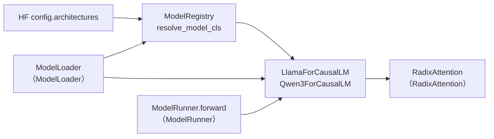

# Models 通用：通用模型实现（Registry / Llama / Qwen3）

> **阶段 III · 模型执行** | 状态：已完成 | Git：`70df09b83363e0127b43c83a6007d3938f815b2d` 
> **源码范围：** `srt/models/registry.py`、`llama.py`、`qwen3.py`

---

## 本模块在架构中的位置

Models 通用层是 **HuggingFace architecture → Python 模型类** 的映射枢纽。`ModelRegistry` 在 import 时用 `pkgutil.iter_modules` 扫描 `sglang.srt.models` 包，读取各模块的 `EntryClass` 属性注册 architecture 键。ModelLoader（ModelLoader）在 `get_model_architecture` 中调用 `resolve_model_cls`；ModelRunner 持有解析出的 `nn.Module` 并调用 `(input_ids, positions, forward_batch)` 统一 forward 签名。Llama / Qwen3 代表标准 Decoder 结构：RMSNorm → RadixAttention → MLP，含 PP/TP 切分与 QKV gate-up 权重映射。



---

## 零基础一句话

**像「车型目录+标准底盘」**：Registry 是目录（哪个 HF 架构名对应哪辆车），Llama/Qwen3 是可复用的标准底盘模板，各厂商模型在此基础上换壳。

---

## 用户场景

**Persona：** 模型集成工程师小许要接入新的 Llama 衍生模型，需要理解 `EntryClass` 约定、`resolve_model_cls` 的 Transformers fallback，以及 Qwen3 相对 Llama 的 QK-Norm、`LayerCommunicator` 差异。她还需追踪 `load_weights` 中 QKV / gate-up 合并映射逻辑。

---

## 五件套阅读顺序

| 顺序 | 文件 | 一句话说明 |
|------|------|------------|
| 01 | [[13-Models-通用-01-核心概念]] | Registry 术语、Decoder 层模式、EntryClass 约定 |
| 启动链路 | [[13-Models-通用-02-源码走读]] | registry / llama / qwen3 按调用顺序精读 |
| HTTP Server | [[13-Models-通用-03-数据流与交互]] | ModelLoader → ModelRunner → forward 全链路 |
| OpenAI API | [[13-Models-通用-04-关键问题]] | Llama vs Qwen3、PP 切层、权重映射 |
| ✓ | [[13-Models-通用-05-checkpoint]] | 验收：能否说明 Registry 扫描与 resolve 流程 |

---

## 核心源码锚点

**Explain：** 模块 import 时即执行 `ModelRegistry.register("sglang.srt.models")`，用 `pkgutil.iter_modules` 扫描包内所有 `.py`，读取各模块的 `EntryClass` 属性，以类名 `__name__` 为 architecture 键写入字典。ModelLoader 在 `get_model_architecture` 中调用 `resolve_model_cls`。

**Code：**

```python
# 来源：python/sglang/srt/models/registry.py L94-L131
@lru_cache()
def import_model_classes(package_name: str, strict: bool = False):
    model_arch_name_to_cls = {}
    package = importlib.import_module(package_name)
    for _, name, ispkg in pkgutil.iter_modules(package.__path__, package_name + "."):
        if not ispkg:
            if name.split(".")[-1] in envs.SGLANG_DISABLED_MODEL_ARCHS.get():
                logger.debug(f"Skip loading {name} due to SGLANG_DISABLED_MODEL_ARCHS")
                continue

            try:
                module = importlib.import_module(name)
            except Exception as e:
                if strict:
                    raise
                logger.warning(f"Ignore import error when loading {name}: {e}")
                continue
            if hasattr(module, "EntryClass"):
                entry = module.EntryClass
                if isinstance(
                    entry, list
                ):  # To support multiple model classes in one module
                    for tmp in entry:
                        assert (
                            tmp.__name__ not in model_arch_name_to_cls
                        ), f"Duplicated model implementation for {tmp.__name__}"
                        model_arch_name_to_cls[tmp.__name__] = tmp
                else:
                    assert (
                        entry.__name__ not in model_arch_name_to_cls
                    ), f"Duplicated model implementation for {entry.__name__}"
                    model_arch_name_to_cls[entry.__name__] = entry

    return model_arch_name_to_cls


ModelRegistry = _ModelRegistry()
ModelRegistry.register("sglang.srt.models")
```

**Comment：**

- `@lru_cache()` 保证同一 package 只扫描一次；import 失败默认 warning 跳过。
- `SGLANG_DISABLED_MODEL_ARCHS` 可黑名单跳过特定 arch 模块。
- `EntryClass` 可以是单个类或 list（如 DeepSeek 一文件多版本，见 Models 专用）。
- 外部插件包可通过 `SGLANG_EXTERNAL_MODEL_PACKAGE` 覆盖注册。

---

## 验证建议

1. **CLI：** 启动时在日志中搜索 `Loading model` / architecture 名，确认 `resolve_model_cls` 命中预期类（如 `Qwen3ForCausalLM`）。
2. **日志：** 搜索 `ModelRegistry` / `EntryClass`；不支持的 arch 会 append `TransformersForCausalLM` fallback 或 raise。

---

## 阅读路径

← [[12-ModelLoader-00-MOC|ModelLoader]] 
→ [[14-Models-专用-00-MOC|Models 专用]]
