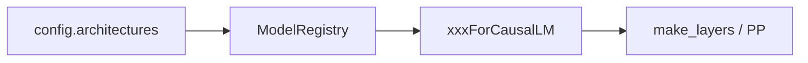

# Models 通用 · 核心概念

## 用户故事：新 HuggingFace 模型 day-0 接入 — Registry 如何对上类名？

### Persona

**小田**，开源社区刚发布 `Qwen3-For-CausalLM` 架构。HF 上已有权重，SGLang 启动报 `Model not found`。她需要在 `srt/models/` 新增文件并让 `config.architectures` 映射到 Python 类。

### 时间线

| 时刻 | 事件 |
|------|------|
| T0 | `ModelLoader` 读 `config.json`，取 `architectures[0]` |
| T0+1ms | `ModelRegistry.get_model_cls` 查表；未注册则失败 |
| T1 | 新建 `qwen3.py`，末尾 `EntryClass = Qwen3ForCausalLM` |
| T2 | `import_model_classes` 扫描包，Registry 自动收录 |
| T3 | 服务启动成功，`make_layers` 按 PP rank 实例化层区间 |

### 涉及模块



**Explain：** Registry 像**电话簿**：HF 配置文件报「找谁」（类名），SGLang 查表得到具体 `nn.Module` 实现。新模型 = 新文件 + `EntryClass`，不必改中央列表。

**Code：**

```python
# 来源：python/sglang/srt/models/registry.py L19-L25
@dataclass
class _ModelRegistry:
    # Keyed by model_arch
    models: Dict[str, Union[Type[nn.Module], str]] = field(default_factory=dict)

    def register(
        self, package_name: str, overwrite: bool = False, strict: bool = False
```

**Comment：**

- 键是 **Python 类名**，与 HF `architectures` 字符串一致。
- PP 下 `make_layers` 只建本 rank 负责的 layer 区间。

### 如果…会怎样（调试）

| 现象 | 可能原因 | 排查 |
|------|----------|------|
| Model not found | 类名与 HF architectures 不一致 | 对比 `config.json` 与 `EntryClass` |
| 权重 shape 错 | 新架构 layer 命名与 loader 不匹配 | 看 `load_weights` skip 列表 |
| PP 中间 rank 无输出 | 误改 `PPMissingLayer` 逻辑 | 读Models 通用 §PP |

---

## 1. ModelRegistry：architecture → Python 类

**Explain：** SGLang 沿用 vLLM 的 registry 模式。每个模型文件末尾声明 `EntryClass`（单个 `nn.Module` 子类或 list），Registry 以**类名**（如 `Qwen3ForCausalLM`）为键，与 HuggingFace `config.json` 中 `architectures` 字段对齐。新增模型 = 新建 `xxx.py` + 写 `EntryClass`，无需改 central 注册表。

**Code：**

```python
# 来源：python/sglang/srt/models/registry.py L19-L36
@dataclass
class _ModelRegistry:
    # Keyed by model_arch
    models: Dict[str, Union[Type[nn.Module], str]] = field(default_factory=dict)

    def register(
        self, package_name: str, overwrite: bool = False, strict: bool = False
    ):
        new_models = import_model_classes(package_name, strict=strict)
        if overwrite:
            self.models.update(new_models)
        else:
            for arch, cls in new_models.items():
                if arch in self.models:
                    raise ValueError(
                        f"Model architecture {arch} already registered. Set overwrite=True to replace."
                    )
                self.models[arch] = cls
```

**Comment：**

- `overwrite=True` 用于 `SGLANG_EXTERNAL_MODEL_PACKAGE` 插件覆盖内置实现。
- 重复 arch 名且 `overwrite=False` 会直接 `ValueError`，防止 silent 覆盖。

---

## 2. get_model_architecture：ModelLoader 入口

**Explain：** `ModelRunner` 初始化时通过 `get_model_architecture(model_config)` 解析应实例化的类。若 HF config 中的 arch 均不在 Registry，或用户指定 `model_impl=TRANSFORMERS`，会先改写 architectures 再 resolve。

**Code：**

```python
# 来源：python/sglang/srt/model_loader/utils.py L195-L230
def get_model_architecture(model_config: ModelConfig) -> Tuple[Type[nn.Module], str]:
    from sglang.srt.models.registry import ModelRegistry

    architectures = getattr(model_config.hf_config, "architectures", [])
    # Special handling for quantized Mixtral.
    # FIXME(woosuk): This is a temporary hack.
    mixtral_supported = [
        "fp8",
        "compressed-tensors",
        "gptq_marlin",
        "awq_marlin",
        "quark_int4fp8_moe",
    ]

    if (
        model_config.quantization is not None
        and model_config.quantization not in mixtral_supported
        and "MixtralForCausalLM" in architectures
    ):
        architectures = ["QuantMixtralForCausalLM"]

    supported_archs = ModelRegistry.get_supported_archs()
    is_native_supported = any(arch in supported_archs for arch in architectures)

    if model_config.model_impl == ModelImpl.MINDSPORE:
        architectures = ["MindSporeForCausalLM"]
    elif not is_native_supported or model_config.model_impl == ModelImpl.TRANSFORMERS:
        architectures = resolve_transformers_arch(model_config, architectures)
    model_cls, resolved_arch = ModelRegistry.resolve_model_cls(architectures)
    setattr(model_config, "_resolved_model_arch", resolved_arch)
    setattr(
        model_config,
        "_resolved_model_impl",
        _model_impl_from_architecture(resolved_arch),
    )
    return model_cls, resolved_arch
```

**Comment：** `_resolved_model_arch` 供后续日志、量化、CUDA graph 分支读取；本模块只需知道「Loader 靠 Registry 定类」。

---

## 3. EntryClass 约定

**Explain：** 一个 `.py` 可 export 多个 architecture（list）；也可只 export 一个。Llama 文件同时注册 `LlamaForCausalLM`、`Phi3ForCausalLM` 等继承类，共享同一套层实现。

**Code：**

```python
# 来源：python/sglang/srt/models/llama.py L851-L856
EntryClass = [
    LlamaForCausalLM,
    Phi3ForCausalLM,
    InternLM3ForCausalLM,
    IQuestCoderForCausalLM,
]
```

```python
# 来源：python/sglang/srt/models/qwen3.py L719
EntryClass = Qwen3ForCausalLM
```

**Comment：** 类名必须与 HF `architectures` 字符串完全一致（大小写敏感）。

---

## 4. 标准 Decoder 层：Pre-Norm + 残差

**Explain：** Llama / Qwen3 均采用 **Pre-RMSNorm** 结构：`input_layernorm` → Attention → `post_attention_layernorm` → MLP。残差在 layernorm 内部或 `LayerCommunicator` 中融合。Attention 内部统一使用 `RadixAttention` 对接 KV cache 与 backend。

**Code（Llama）：**

```python
# 来源：python/sglang/srt/models/llama.py L313-L335
    def forward(
        self,
        positions: torch.Tensor,
        hidden_states: torch.Tensor,
        forward_batch: ForwardBatch,
        residual: Optional[torch.Tensor],
    ) -> Tuple[torch.Tensor, torch.Tensor]:
        # Self Attention
        if residual is None:
            residual = hidden_states
            hidden_states = self.input_layernorm(hidden_states)
        else:
            hidden_states, residual = self.input_layernorm(hidden_states, residual)
        hidden_states = self.self_attn(
            positions=positions,
            hidden_states=hidden_states,
            forward_batch=forward_batch,
        )

        # Fully Connected
        hidden_states, residual = self.post_attention_layernorm(hidden_states, residual)
        hidden_states = self.mlp(hidden_states)
        return hidden_states, residual
```

**Comment：** Qwen3 用 `LayerCommunicator.prepare_attn` / `postprocess_mlp` 封装 scatter/gather，语义等价但支持 DP-Attention 与 sparse 层边界。

---

## 5. RadixAttention 在 Attention 层的嵌入

**Explain：** 模型 Attention 子模块负责 QKV 投影、RoPE、（Qwen3 的 QK-Norm），**不**直接写 FlashAttention。计算交给 `self.attn`（`RadixAttention`），由它根据 `forward_batch.forward_mode` 选择 backend 并读写 paged KV cache。

**Code：**

```python
# 来源：python/sglang/srt/models/llama.py L197-L205
        self.attn = RadixAttention(
            self.num_heads,
            self.head_dim,
            self.scaling,
            num_kv_heads=self.num_kv_heads,
            layer_id=layer_id,
            quant_config=quant_config,
            prefix=add_prefix("attn", prefix),
        )
```

```python
# 来源：python/sglang/srt/models/llama.py L250-L252
        attn_output = self.attn(q, k, v, forward_batch)
        output, _ = self.o_proj(attn_output)
        return output
```

**Comment：** `layer_id` 用于定位 KV cache 槽位；RadixAttention 展开 `RadixAttention.forward` 与 `get_attn_backend()`。

---

## 6. 统一 CausalLM forward 签名

**Explain：** 所有 `*ForCausalLM` 实现相同入口：`input_ids`、`positions`（RoPE 位置）、`forward_batch`（batch 元数据 + cache loc）。最后一 PP rank 走 `LogitsProcessor`；中间 rank 返回 `hidden_states` 或 `PPProxyTensors`。

**Code：**

```python
# 来源：python/sglang/srt/models/llama.py L528-L562
    @torch.no_grad()
    def forward(
        self,
        input_ids: torch.Tensor,
        positions: torch.Tensor,
        forward_batch: ForwardBatch,
        input_embeds: torch.Tensor = None,
        get_embedding: bool = False,
        pp_proxy_tensors: Optional[PPProxyTensors] = None,
    ) -> LogitsProcessorOutput:
        hidden_states = self.model(
            input_ids,
            positions,
            forward_batch,
            input_embeds,
            pp_proxy_tensors=pp_proxy_tensors,
        )

        aux_hidden_states = None
        if self.capture_aux_hidden_states:
            hidden_states, aux_hidden_states = hidden_states

        if self.pp_group.is_last_rank:
            if not get_embedding:
                return self.logits_processor(
                    input_ids,
                    hidden_states,
                    self.lm_head,
                    forward_batch,
                    aux_hidden_states,
                )
            else:
                return self.pooler(hidden_states, forward_batch)
        else:
            return hidden_states
```

**Comment：** `get_embedding=True` 走 pooling 路径（embedding API）；generate 默认走 logits。

---

## 7. Pipeline Parallel 切层

**Explain：** `make_layers` 按 PP rank 只实例化 `[start_layer, end_layer)` 区间。非首 rank 用 `PPMissingLayer` 占位 embedding；非末 rank 返回 `PPProxyTensors` 传给下一 stage。

**Code：**

```python
# 来源：python/sglang/srt/models/llama.py L349-L377
        self.pp_group = get_pp_group()
        if self.pp_group.is_first_rank:
            self.embed_tokens = VocabParallelEmbedding(
                config.vocab_size,
                config.hidden_size,
                quant_config=quant_config,
                prefix=add_prefix("embed_tokens", prefix),
            )
        else:
            self.embed_tokens = PPMissingLayer()

        pp_start_layer, _ = get_pp_indices(
            config.num_hidden_layers,
            self.pp_group.rank_in_group,
            self.pp_group.world_size,
        )
        self.layers, self.start_layer, self.end_layer = make_layers(
            config.num_hidden_layers,
            lambda idx, prefix: LlamaDecoderLayer(
                config=config,
                quant_config=quant_config,
                layer_id=idx,
                start_layer=pp_start_layer,
                prefix=prefix,
            ),
            pp_rank=self.pp_group.rank_in_group,
            pp_size=self.pp_group.world_size,
            prefix="model.layers",
        )
```

**Comment：** `load_weights` 会 skip 不在 `[start_layer, end_layer)` 的层参数，避免 PP 重复加载。

---

## 8. Qwen3 相对 Llama 的关键差异

**Explain：** Qwen3 在 Attention 内增加 **Q/K RMSNorm**（`apply_qk_norm`）；使用 `attn_tp_rank` / `attn_tp_size`（支持 DP-Attention）；Decoder 层用 `LayerCommunicator` 处理 tensor 布局；可选 aiter fused mRoPE（decode 时 KV 已写入 cache）。

**Code：**

```python
# 来源：python/sglang/srt/models/qwen3.py L118-L119
        self.q_norm = RMSNorm(self.head_dim, eps=rms_norm_eps, **norm_kwargs)
        self.k_norm = RMSNorm(self.head_dim, eps=rms_norm_eps, **norm_kwargs)
```

```python
# 来源：python/sglang/srt/models/qwen3.py L176-L184
        q, k = apply_qk_norm(
            q=q,
            k=k,
            q_norm=self.q_norm,
            k_norm=self.k_norm,
            head_dim=self.head_dim,
            alt_stream=self.alt_stream,
        )
        q, k = self.rotary_emb(positions, q, k)
```

**Comment：** Qwen3 复用 `Qwen2Model` / `Qwen2MLP` 骨架，差异主要在 Attention 与 communicator。

---

## 9. stacked_params_mapping：权重合并加载

**Explain：** Checkpoint 常按 HF 命名存 `q_proj`/`k_proj`/`v_proj` 分片，SGLang 运行时 fused 为 `qkv_proj`。`load_weights` 用 mapping 表把 checkpoint 名 rewrite 后调用各 param 的 `weight_loader(shard_id)`。

**Code：**

```python
# 来源：python/sglang/srt/models/llama.py L629-L685
    def load_weights(self, weights: Iterable[Tuple[str, torch.Tensor]]):
        stacked_params_mapping = [
            # (param_name, shard_name, shard_id)
            (".qkv_proj", ".q_proj", "q"),
            (".qkv_proj", ".k_proj", "k"),
            (".qkv_proj", ".v_proj", "v"),
            (".gate_up_proj", ".gate_proj", 0),
            (".gate_up_proj", ".up_proj", 1),
        ]

        params_dict = dict(self.named_parameters())

        for name, loaded_weight in weights:
            if name.endswith(".activation_scale"):
                name = name.replace(".activation_scale", ".input_scale")
            if name.endswith(".weight_scale_inv"):
                name = name.replace(".weight_scale_inv", ".weight_scale")

            layer_id = get_layer_id(name)
            if (
                layer_id is not None
                and hasattr(self.model, "start_layer")
                and (
                    layer_id < self.model.start_layer
                    or layer_id >= self.model.end_layer
                )
            ):
                continue
            if "rotary_emb.inv_freq" in name or "projector" in name:
                continue
            if "rotary_emb.cos_cached" in name or "rotary_emb.sin_cached" in name:
                # Models trained using ColossalAI may include these tensors in
                # the checkpoint. Skip them.
                continue
            if name.startswith("model.vision_tower") and name not in params_dict:
                continue
            if self.config.tie_word_embeddings and "lm_head.weight" in name:
                continue
            # Handle FP8 kv-scale remapping
            if "scale" in name:
                name = maybe_remap_kv_scale_name(name, params_dict)
                if name is None:
                    continue

            for param_name, weight_name, shard_id in stacked_params_mapping:
                if weight_name not in name:
                    continue
                name = name.replace(weight_name, param_name)
                # Skip loading extra bias for GPTQ models.
                if name.endswith(".bias") and name not in params_dict:
                    continue
                if name not in params_dict:
                    continue
                param = params_dict[name]
                weight_loader = param.weight_loader
                weight_loader(param, loaded_weight, shard_id)
                break
```

**Comment：** `tie_word_embeddings` 时 skip `lm_head.weight`；PP 非本 rank 层直接 `continue`。
