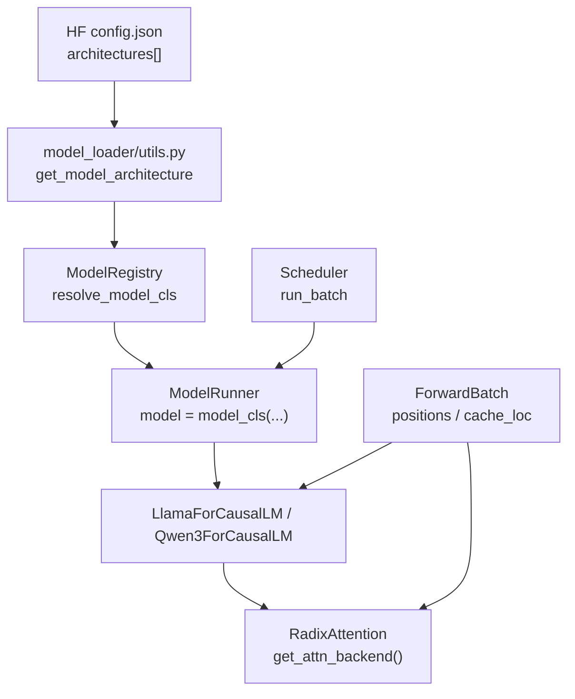
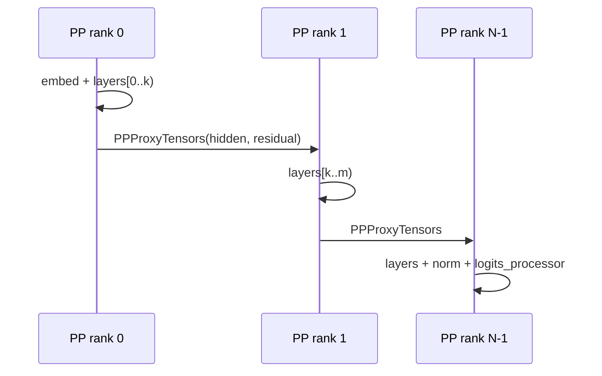

# Models 通用：数据流与交互

> 上下游模块边界与数据流。 — Registry / Llama / Qwen3 与 ModelLoader、ModelRunner、Scheduler 的边界。

---

## 1. 架构位置



**Explain：** Registry 只在 **模型加载阶段** 参与；运行时 Scheduler 组好 `ForwardBatch` 后，ModelRunner 调用 `model.forward(input_ids, positions, forward_batch)`。Attention 层内的 `RadixAttention` 再读 `forward_batch` 里的 cache 索引与 `forward_mode`（EXTEND/DECODE 等）。

---

## 2. 输入 / 输出

| 方向 | 类型 | 字段 / 说明 | 定义位置 |
|------|------|-------------|----------|
| 输入（Loader） | HF `architectures` | 如 `["Qwen3ForCausalLM"]` | `config.json` |
| 输出（Loader） | `(model_cls, resolved_arch)` | 待 `nn.Module` 实例化 | `get_model_architecture` |
| 输入（Runtime） | `input_ids` | 当前 batch token | Scheduler → ModelRunner |
| 输入（Runtime） | `positions` | RoPE 位置 id | `ScheduleBatch` 构造 |
| 输入（Runtime） | `ForwardBatch` | forward_mode、out_cache_loc、req 元数据 | `forward_batch_info.py` |
| 输出（Runtime） | `LogitsProcessorOutput` | next token logits / hidden | last PP rank |

**Code（ForwardBatch 在 Attention 中的使用）：**

```python
# 来源：python/sglang/srt/models/llama.py L228-L233
    def forward(
        self,
        positions: torch.Tensor,
        hidden_states: torch.Tensor,
        forward_batch: ForwardBatch,
    ) -> torch.Tensor:
```

**Comment：** 模型层不解析 `Req`；Scheduler 已将 batch 压平为 tensor + metadata。

---

## 3. 上下游连接

| 上游/下游 | 模块 | 交互方式 | 代码锚点 |
|-----------|------|----------|----------|
| 上游 | `model_loader` | 调用 `get_model_architecture` → `ModelRegistry.resolve_model_cls` | `utils.py L223` |
| 上游 | `ModelRunner` | `model_cls(config, quant_config)` + `load_weights` | ModelLoader |
| 下游 | `RadixAttention` | `self.attn(q,k,v, forward_batch)` | `llama.py L250` |
| 下游 | `LogitsProcessor` | last rank：`logits_processor(..., lm_head, forward_batch)` | `llama.py L552` |
| 下游 | PP 下一 stage | 非 last rank 返回 `PPProxyTensors` | `llama.py L418` |

---

## 4. 典型加载 + 前向数据流

### 步骤 1：读取 HF config

Server 启动，ModelConfig 加载 `hf_config.architectures`。

### 步骤 2：Registry 解析类

**Code：**

```python
# 来源：python/sglang/srt/model_loader/utils.py L216-L224
    supported_archs = ModelRegistry.get_supported_archs()
    is_native_supported = any(arch in supported_archs for arch in architectures)

    if model_config.model_impl == ModelImpl.MINDSPORE:
        architectures = ["MindSporeForCausalLM"]
    elif not is_native_supported or model_config.model_impl == ModelImpl.TRANSFORMERS:
        architectures = resolve_transformers_arch(model_config, architectures)
    model_cls, resolved_arch = ModelRegistry.resolve_model_cls(architectures)
    setattr(model_config, "_resolved_model_arch", resolved_arch)
```

**Comment：** 若 `Qwen3ForCausalLM` 在 Registry 中，直接命中 `qwen3.py`；否则 fallback `TransformersForCausalLM`。

### 步骤 3：实例化 + load_weights

ModelRunner 构造 `Qwen3ForCausalLM(config, quant_config)`，迭代 safetensors checkpoint，`load_weights` 做 QKV/gate-up 合并写入 GPU。

### 步骤 4：Scheduler 触发 forward

Prefill（EXTEND）：整段 prompt token 一次 forward；`forward_batch.forward_mode.is_extend()` 为真，RadixAttention 写 KV 到 `out_cache_loc` 指定槽位。

Decode：每步 1 token；positions 递增；读已有 KV + 写新 slot。

**Code（Model 层循环）：**

```python
# 来源：python/sglang/srt/models/llama.py L407-L416
        for i in range(self.start_layer, self.end_layer):
            if i in self.layers_to_capture:
                aux_hidden_states.append(hidden_states + residual)
            layer = self.layers[i]
            hidden_states, residual = layer(
                positions,
                hidden_states,
                forward_batch,
                residual,
            )
```

### 步骤 5：Logits 输出

Last PP rank：`LogitsProcessor` 应用 temperature、logprob 等 sampling 前处理，结果回 Scheduler `process_batch_result`。

---

## 5. PP 多 stage 数据流



**Code：**

```python
# 来源：python/sglang/srt/models/llama.py L418-L424
        if not self.pp_group.is_last_rank:
            return PPProxyTensors(
                {
                    "hidden_states": hidden_states,
                    "residual": residual,
                }
            )
```

**Comment：** 仅 `is_first_rank` 消费 `input_ids`；中间 rank `input_ids` 可为占位。

---

## 6. Qwen3 LayerCommunicator 边界

**Explain：** Attention 前后 hidden states 可能需在 TP/DP group 间 scatter 或 all-gather。`LayerCommunicator` 在 `prepare_attn` / `postprocess_attn` / `postprocess_mlp` 插入通信，对 Scheduler 透明。

**Code：**

```python
# 来源：python/sglang/srt/models/qwen3.py L397-L410
        # Self Attention
        hidden_states, residual = self.layer_communicator.prepare_attn(
            hidden_states,
            residual,
            forward_batch,
            post_residual_addition=post_residual_addition,
        )
        if hidden_states.shape[0] != 0:
            hidden_states = self.self_attn(
                positions=positions,
                hidden_states=hidden_states,
                forward_batch=forward_batch,
            )

```

**Comment：** Llama 无 communicator，默认 MLP/Attn 在同一 TP layout；Qwen3/MoE 模型更依赖此抽象。

---

## 7. 与 Radix Cache 的间接连接

**Explain：** 本模块模型层**不**直接调用 `RadixCache.match_prefix`；Scheduler / PrefillAdder 在组 batch 前匹配前缀，把 `prefix_indices` 写入 `Req`，最终反映到 `ForwardBatch.out_cache_loc`。模型层只通过 `RadixAttention` + backend 读写物理 KV pool。

→ 前缀树生命周期见 [RadixAttention]]。
