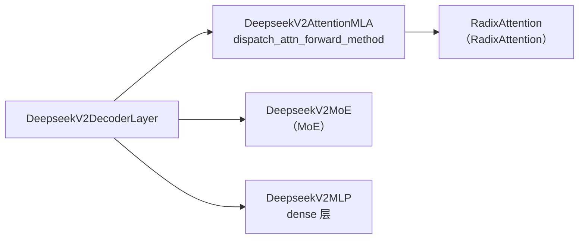

# Models 专用：专用模型实现（DeepSeek V2/V3）

> **阶段 III · 模型执行** | 状态：已完成 | Git：`70df09b83363e0127b43c83a6007d3938f815b2d` 
> **源码范围：** `srt/models/deepseek_v2.py`（含 V3/V3.2 EntryClass）

---

## 本模块在架构中的位置

DeepSeek 专用层在通用 Decoder 模式（Models 通用）之上引入 **MLA（Multi-head Latent Attention）**、**MoE 稀疏层** 与 **shared experts fusion**。`DeepseekV2AttentionMLA` 通过 `dispatch_attn_forward_method` 在 MHA/MLA absorb/DSA 等路径间分派；`DeepseekV2MoE` 消费 MoE 流水线（MoE）做 routed + shared experts 计算。单文件 `EntryClass` 注册三个 CausalLM 类（V2/V3/V3.2），Decoder 层 dense/sparse 由 `first_k_dense_replace` 与 `moe_layer_freq` 决定。



---

## 零基础一句话

**像「定制超跑」**：在标准底盘（Llama 式 Decoder）上换了压缩引擎（MLA 省 KV）和可变气缸（MoE 按需点火），同一车库文件停着 V2/V3/V3.2 三代车型。

---

## 用户场景

**Persona：** 推理优化工程师小唐部署 DeepSeek-V3，需要理解 MLA absorb 路径如何把 KV 压缩到 latent space、与 RadixAttention 及 FA3 MLA wrapper 的配合，以及 EP 下 `DeepseekV2MoE` 的 expert 数量与 top-k 配置。她还需知道 NextN speculative 层为何强制 sparse。

---

## 五件套阅读顺序

| 顺序 | 文件 | 一句话说明 |
|------|------|------------|
| 01 | [[14-Models-专用-01-核心概念]] | MLA、MoE、DSA、Context Parallel 术语 |
| 启动链路 | [[14-Models-专用-02-源码走读]] | AttentionMLA / MoE / DecoderLayer / ForCausalLM 精读 |
| HTTP Server | [[14-Models-专用-03-数据流与交互]] | CP metadata、MoE dispatch、与 Scheduler 边界 |
| OpenAI API | [[14-Models-专用-04-关键问题]] | MLA vs MHA 选型、DeepEP、EPLB 衔接 |
| ✓ | [[14-Models-专用-05-checkpoint]] | 验收：能否说明 dense/sparse 层判定与 MLA dispatch |

---

## 核心源码锚点

**Explain：** `deepseek_v2.py` 单文件服务 V2/V3/V3.2；Registry 按类名分别注册。Decoder 层是否 MoE 由 `first_k_dense_replace`、`moe_layer_freq`、`n_routed_experts` 决定；NextN speculative 层强制 sparse。MLA forward 先 `dispatch_attn_forward_method`，再分派到 absorb/MHA 等 mixin 方法。

**Code：**

```python
# 来源：python/sglang/srt/models/deepseek_v2.py L2176-L2181
    def _is_layer_sparse(self, layer_id: int, is_nextn: bool) -> bool:
        return is_nextn or (
            self.config.n_routed_experts is not None
            and layer_id >= self.config.first_k_dense_replace
            and layer_id % self.config.moe_layer_freq == 0
        )
```

```python
# 来源：python/sglang/srt/models/deepseek_v2.py L1890-L1908
        attn_forward_method = self.dispatch_attn_forward_method(forward_batch)
        if attn_forward_method == AttnForwardMethod.MHA:
            inner_state = self.forward_normal_prepare(
                positions, hidden_states, forward_batch, zero_allocator
            )
        elif attn_forward_method == AttnForwardMethod.MHA_CHUNKED_KV:
            inner_state = self.forward_normal_chunked_kv_prepare(
                positions, hidden_states, forward_batch, zero_allocator
            )
        elif attn_forward_method == AttnForwardMethod.MHA_ONE_SHOT:
            inner_state = self.forward_normal_one_shot_prepare(
                positions, hidden_states, forward_batch, zero_allocator
            )
        elif attn_forward_method == AttnForwardMethod.MLA:
            inner_state = self.forward_absorb_prepare(
                positions,
                hidden_states,
                forward_batch,
                zero_allocator,
```

**Comment：**

- `_is_layer_sparse`：前几层 dense 用 `DeepseekV2MLP`，之后按 freq 插入 MoE 层。
- `AttnForwardMethod.MLA` 的 absorb 路径把 KV 压缩到 latent space，显著降低 KV 显存。
- Prepare/Core 分离支持 batch overlap（SBO/TBO），与 Scheduler overlap 模式协作。
- `EntryClass = [DeepseekV2ForCausalLM, DeepseekV3ForCausalLM, DeepseekV32ForCausalLM]` 一文件多版本注册。

---

## 验证建议

1. **CLI：** 启动 DeepSeek-V3 时加 `--attention-backend trtllm_mla`（Blackwell）或默认 auto-detect，日志应显示 MLA 路径。
2. **日志：** 搜索 `MLA` / `DeepseekV2MoE` / `dispatch_attn_forward_method`；MoE 层可见 expert dispatch 相关 trace。

---

## 阅读路径

← [[13-Models-通用-00-MOC|Models 通用]] 
→ [[15-RadixAttention-00-MOC|RadixAttention]]
