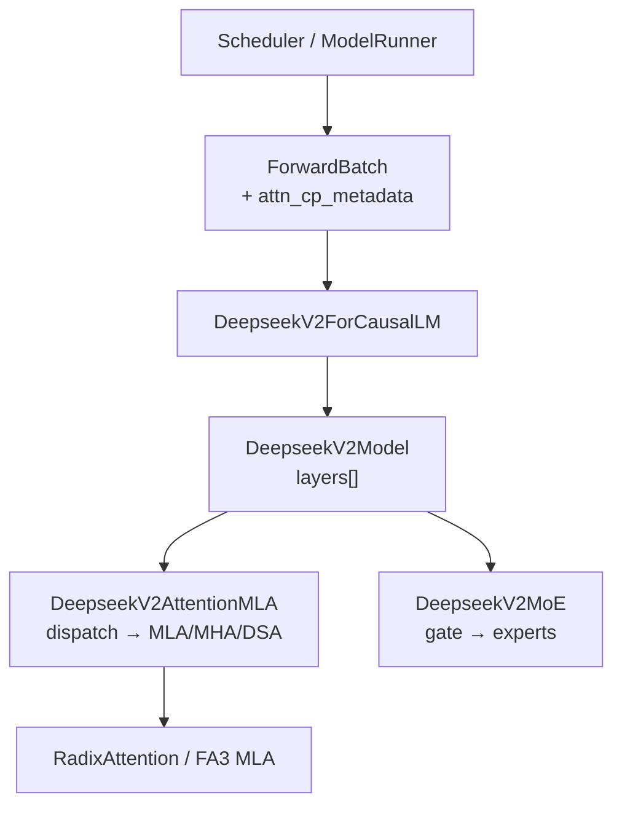
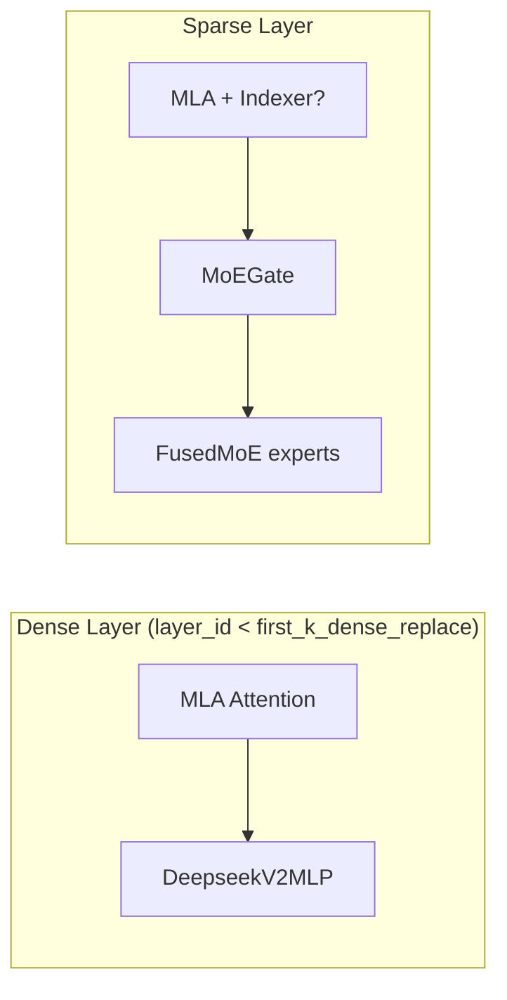

# Models 专用：数据流与交互

---

## 1. 架构位置



**Explain：** DeepSeek 专用逻辑封装在 model 内部；Scheduler 仍组统一 `ForwardBatch`。唯一额外字段常见为 `attn_cp_metadata`（prefill CP）与 MoE 相关 buffer（内部 context manager）。

---

## 2. 输入 / 输出

| 方向 | 类型 | 说明 |
|------|------|------|
| 输入 | `ForwardBatch` | 与 Llama 相同 + 可选 `attn_cp_metadata` |
| 输入 | `prev_topk_indices` | DSA 层间传递（DecoderLayer 内部） |
| 输入 | `zero_allocator` | 层内 BumpAllocator，非 batch 字段 |
| 输出 | `LogitsProcessorOutput` | last PP rank |
| 输出 | `topk_indices` | DSA attention → 下一层 sparse attention |

---

## 3. Dense vs MoE 层数据流



**Code：**

```python
# 来源：python/sglang/srt/models/deepseek_v2.py L2062-L2084
        self.self_attn = DeepseekV2AttentionMLA(
            config=config,
            hidden_size=self.hidden_size,
            num_heads=config.num_attention_heads,
            qk_nope_head_dim=config.qk_nope_head_dim,
            qk_rope_head_dim=config.qk_rope_head_dim,
            v_head_dim=config.v_head_dim,
            q_lora_rank=(
                config.q_lora_rank if hasattr(config, "q_lora_rank") else None
            ),
            kv_lora_rank=config.kv_lora_rank,
            rope_theta=rope_theta,
            rope_scaling=rope_scaling,
            max_position_embeddings=max_position_embeddings,
            quant_config=quant_config,
            layer_id=layer_id,
            reduce_results=False,
            prefix=add_prefix("self_attn", prefix),
            alt_stream=alt_stream,
            is_nextn=is_nextn,
            dsa_enable_prefill_cp=dsa_enable_prefill_cp,
            mla_enable_prefill_cp=mla_enable_prefill_cp,
        )
```

---

## 4. MLA Attention 内部数据流

### 步骤 1：dispatch 方法

`dispatch_attn_forward_method(forward_batch)` 读取 forward_mode、backend、量化、是否 graph capture。

### 步骤 2：prepare 阶段

- **MLA absorb**：latent Q/K 写入 cache 格式，可能 fused RoPE
- **MHA**：标准 Q/K/V 布局，兼容非 absorb kernel

### 步骤 3：core 阶段

调用 `RadixAttention` 或 piecewise `unified_attention_with_output`；MLA 使用压缩 KV layout。

**Code：**

```python
# 来源：python/sglang/srt/models/deepseek_v2.py L1836-L1855
    def forward(
        self,
        positions: torch.Tensor,
        hidden_states: torch.Tensor,
        forward_batch: ForwardBatch,
        zero_allocator: BumpAllocator,
        layer_scatter_modes: LayerScatterModes = None,
        llama_4_scaling: Optional[torch.Tensor] = None,
        prev_topk_indices: Optional[torch.Tensor] = None,
    ):
        s = self.forward_prepare(
            positions=positions,
            hidden_states=hidden_states,
            forward_batch=forward_batch,
            zero_allocator=zero_allocator,
            layer_scatter_modes=layer_scatter_modes,
            llama_4_scaling=llama_4_scaling,
            prev_topk_indices=prev_topk_indices,
        )
        return self.forward_core(s)
```

---

## 5. MoE 层数据流

### 步骤 1：`prepare_mlp` scatter hidden states

`LayerCommunicator` 按 EP/TP 布局准备 token 分布。

### 步骤 2：Gate → TopK

`MoEGate` 输出 logits；`TopK` 或 `HashTopK` 选 expert id + weight。

### 步骤 3：Dispatch → Expert GEMM → Combine

`self.experts`（FusedMoE）执行；DeepEP 时 token 跨 rank dispatch。

### 步骤 4：scaling + allreduce

**Code：**

```python
# 来源：python/sglang/srt/models/deepseek_v2.py L1528-L1538
                x.add_(final_hidden_states)
            else:
                x.add_(final_hidden_states, alpha=self.routed_scaling_factor)
            final_hidden_states = x
        elif _use_aiter:
            # fused in aiter_biased_grouped_topk so we can skip here
            pass
        else:
            final_hidden_states *= self.routed_scaling_factor

        state.hidden_states_mlp_output = final_hidden_states
```

**Comment：** `routed_scaling_factor` 来自 config，影响 routed expert 贡献幅度。

---

## 6. Context Parallel 与 Scheduler

**Explain：** CP 仅在 **ForCausalLM.forward 入口** 设置 metadata；Scheduler 需保证 `seq_lens_cpu` / `extend_seq_lens_cpu` 正确。各 rank 只算 sequence 分片，attention 内 all-gather 拼回。

**Code：**

```python
# 来源：python/sglang/srt/models/deepseek_v2.py L2824-L2832
        elif self.mla_enable_prefill_cp:
            if can_cp_split(len_input_ids, self.cp_size, forward_batch):
                forward_batch.attn_cp_metadata = prepare_context_parallel_metadata(
                    len_input_ids,
                    self.cp_rank,
                    self.cp_size,
                    forward_batch.seq_lens_cpu.tolist(),
                    extend_seqs_len=forward_batch.extend_seq_lens_cpu,
                )
```

---

## 7. 与 Registry / Loader 的连接

**Code：**

```python
# 来源：python/sglang/srt/models/deepseek_v2.py L2966
EntryClass = [DeepseekV2ForCausalLM, DeepseekV3ForCausalLM, DeepseekV32ForCausalLM]
```

HF `architectures: ["DeepseekV3ForCausalLM"]` → 同一文件内 V3 类；权重 loader 根据 config 字段区分 MLA/DSA/MoE 参数名。

---

## 8. attn_tp_context scatter 边界

**Code：**

```python
# 来源：python/sglang/srt/models/deepseek_v2.py L2834-L2837
        with get_attn_tp_context().maybe_input_scattered(forward_batch):
            hidden_states = self.model(
                input_ids, positions, forward_batch, input_embeds, pp_proxy_tensors
            )
```

**Comment：** QLoRA + DP Attention 时 embedding 输出可能 scattered；whole model forward 包在 context 内统一处理。

---

## 9. 与 Radix Cache 的关系

**Explain：** MLA 改变 **KV 物理 layout**（latent dim），但不改变 prefix 树逻辑——仍按 token id 序列 match/insert。`RadixAttention.layer_id` 定位 pool 中 MLA 格式 buffer。HiCache / UnifiedRadixCache 对 DeepSeek 与 Llama 使用同一套 API。

→ 见 [[15-RadixAttention-03-数据流与交互|RadixAttention]]
