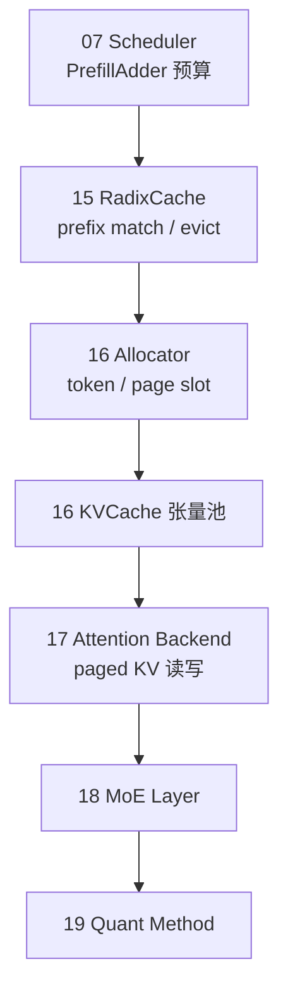

# 阶段 IV · 内存与 Attention（RadixAttention–Quantization）

> **你只需阅读本目录，不必打开 `sglang/` 源码。** 
> 内嵌代码对应 sglang Git commit `70df09b`。

---

## 本阶段解决什么问题

阶段 III 跑通了 model forward。阶段 IV 回答：**KV Cache 如何分配与复用？Attention 内核如何选路？MoE 与量化如何压显存、提吞吐？** 这是 SGLang 相对 vLLM 等框架的核心差异化所在。

| 模块 | 模块 | 一句话 |
|------|------|--------|
| [[15-RadixAttention-00-MOC|15 RadixAttention]] | 前缀缓存 | Radix Tree 共享 prompt 前缀 KV，LPM 调度协同 |
| [[16-KV-Cache-00-MOC|16 KV Cache]] | 物理分配 | Token/Page allocator、HiCache、Storage Backend |
| [[17-Attention-00-MOC|17 Attention]] | 算子后端 | FlashInfer / Triton / MLA，extend vs decode kernel |
| [[18-MoE-00-MOC|18 MoE]] | 专家并行 | Router、TopK、DeepEP dispatch、EPLB |
| [[19-Quantization-00-MOC|19 Quantization]] | 量化 | FP8/GPTQ/AWQ method、Linear/MoE 量化 apply |

---

## 内存—Attention 分层（阶段 IV 验收图）



**Explain：** 逻辑层（Radix Tree）决定「哪些 token 可复用前缀」；物理层（Allocator + KVCache）发 slot；Attention backend 在 forward 时按 `req_to_token` 索引读写 K/V。MoE 与量化在 layer 内叠加，不改变 Scheduler 调度接口。

**Code：**

```python
# 来源：python/sglang/srt/mem_cache/radix_cache.py L312-L328
    def create_simulated(
        self,
        disable: bool = False,
        mock_allocator: Optional[Any] = None,
        page_size: int = 1,
        enable_kv_cache_events: bool = False,
    ) -> RadixCache:
        """Init a radix cache without memory pools for simulation purpose."""
        params = CacheInitParams(
            disable=disable,
            req_to_token_pool=None,
            token_to_kv_pool_allocator=mock_allocator,
            page_size=page_size,
            enable_kv_cache_events=enable_kv_cache_events,
        )
        return RadixCache(params)

```

**Comment：**

- `match_prefix` 返回可复用的 KV slot indices，Scheduler 在 prefill 时跳过已缓存 前缀。
- page 对齐时截断 token 长度，与 `16-KV-Cache` page allocator 一致。
- evict 叶节点时通过 `allocator.free` 归还 slot（见 RadixAttention / KV Cache 专题）。

---

## 零基础一句话

**像图书馆：** 15 是书目索引（谁借过哪本书），16 是书架格子（物理位置），17 是阅览规则（怎么读），18/19 是特藏分区与压缩版藏书。

---

## 推荐阅读顺序

| 顺序 | 文档 | 必读理由 |
|------|------|----------|
| 1 | [[15-RadixAttention-01-核心概念|15/01-核心概念]] | RadixKey、match/insert/evict |
| 2 | [[16-KV-Cache-02-源码走读|16/02-源码走读]] | alloc_extend / alloc_decode |
| 3 | [[17-Attention-03-数据流与交互|17/03-数据流与交互]] | ForwardBatch → backend 时序 |
| 4 | [[18-MoE-01-核心概念|18/01-核心概念]] | 五阶段 MoE 流水线 |
| 5 | [[19-Quantization-04-关键问题|19/04-关键问题]] | backend 选型与 Marlin |

---

## 阶段衔接

| 方向 | 模块 | 衔接点 |
|------|------|--------|
| ← 上一阶段 | 11–14 模型执行 | Model 层调用 RadixAttention；ModelRunner 持有 attn_backend |
| → 下一阶段 | 20–23 高级特性 | 20 对 logits 采样；21 投机复用 KV；22 PD 传 KV |
| → 扩展 | 26 sgl-kernel | 17/18/19 热点算子下沉到 CUDA custom op |

---

## 验证建议（零基础可试）

1. **前缀命中：** 同一 system prompt 发两次，第二次 TTFT 应显著降低（`--schedule-policy lpm`）。
2. **OOM：** 调低 `--mem-fraction-static`，观察 retract 与 `KV cache pool is full` 日志。
3. **量化：** `--quantization fp8` 启动，确认 Linear 走 `dispatch_w8a8_block_fp8_linear`（见 19 走读）。

---

## 模块导航

| 模块 | 目录 | 五件套 |
|------|------|--------|
| 15 | [[15-RadixAttention-00-MOC|RadixAttention]] | ✅ |
| 16 | [[16-KV-Cache-00-MOC|KV Cache]] | ✅ |
| 17 | [[17-Attention-00-MOC|Attention]] | ✅ |
| 18 | [[18-MoE-00-MOC|MoE]] | ✅ |
| 19 | [[19-Quantization-00-MOC|Quantization]] | ✅ |

← [[03-模型执行-00-MOC|阶段 III：模型执行]] · → [[05-高级特性-00-MOC|高级特性]]
