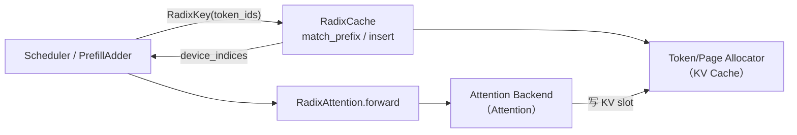

# RadixAttention 与前缀缓存

> **阶段 IV · 内存与 Attention** | 状态：已完成 | Git：`70df09b83363e0127b43c83a6007d3938f815b2d` 
> **源码范围：** `mem_cache/radix_cache.py`、`mem_cache/unified_radix_cache.py`、`layers/radix_attention.py`

---

## 本模块在架构中的位置

RadixAttention 是 SGLang **前缀 KV 复用**的核心：Scheduler 在 prefill 前用 Radix Tree 查找 prompt 是否已有缓存；命中则跳过重复计算，未命中部分算完后把 KV pool 索引挂回树上。模型侧 `RadixAttention` 层负责把 QKV 写入 paged KV 并调用 Attention backend。它位于 **SchedulePolicy（LPM 排序）** 与 **KV 物理池（KV Cache）** 之间，是吞吐优化的关键一环。



---

## 零基础一句话

**像图书馆的「目录索引卡」**：相同 prompt 前缀只存一份 KV「书页」，后来的读者（请求）直接翻到已抄好的页，不用从头抄写。

---

## 用户场景

**Persona：** 平台工程师小林部署 Qwen 聊天服务，系统 prompt 固定 2k token，用户问题各不相同。她希望多用户并发时 GPU 不被重复 prefill 拖垮——读完本模块应能解释：为何 `match_prefix` 命中后 TTFT 骤降，以及 LoRA id 如何通过 `extra_key` 隔离缓存 namespace。

---

## 五件套阅读顺序

| 顺序 | 文件 | 一句话说明 |
|------|------|------------|
| 01 | [[15-RadixAttention-01-核心概念]] | RadixKey、TreeNode、lock_ref 与 match/insert/evict 三操作 |
| 启动链路 | [[15-RadixAttention-02-源码走读]] | 按调用顺序精读 `match_prefix`、`cache_unfinished_req`、UnifiedRadixCache |
| HTTP Server | [[15-RadixAttention-03-数据流与交互]] | Scheduler → RadixCache → ForwardBatch 的 prefix indices 传递 |
| OpenAI API | [[15-RadixAttention-04-关键问题]] | page 对齐、EAGLE bigram、HiCache 与 SWA 多 component 边界 |
| ✓ | [[15-RadixAttention-05-checkpoint]] | 读者自测：不打开 sglang/ 能否口述 prefix 命中路径 |

---

## 核心源码锚点

**Explain：** Scheduler / PrefillAdder 在 extend prefill 前用 prompt token 序列查树，命中则复用已有 KV pool indices，跳过重复计算。`extra_key` 隔离 LoRA / cache salt 等 namespace；匹配可能 split 节点以精确对齐 page 边界。

**Code：**

```python
# 来源：python/sglang/srt/mem_cache/radix_cache.py L355-L413
    def match_prefix(self, params: MatchPrefixParams) -> MatchResult:
        """Find the longest cached prefix of ``key`` in the radix tree.

        The logical namespace for prefix matching is determined by both the
        token id sequence and the optional ``extra_key`` carried by ``RadixKey``.
        Entries that share identical leading token ids but have *different*
        ``extra_key`` values are intentionally kept disjoint and never share
        prefix nodes. This is useful to:

        * Isolate KV cache lines for different LoRA / adapter IDs.
        * Separate requests that intentionally should not share state (e.g.,
          different sampling salt, cache version, or retrieval augmentation
          context) by supplying a distinct ``extra_key``.

        Args:
            params (MatchPrefixParams): Parameters containing the lookup key
                with a list of token ids and an optional ``extra_key`` namespace tag.
                If ``page_size > 1`` the length is internally truncated to a multiple
                of ``page_size`` before matching. Passing an empty key returns an
                empty result with the root as the last node.

        Returns:
            MatchResult: ``device_indices`` is a 1-D ``torch.int64`` tensor of
            the concatenated KV cache indices corresponding to the longest
            cached prefix (may be length 0).
            ``last_device_node`` and ``last_host_node`` (currently the same) are the tree node objects
            representing the terminal node of the matched prefix. This method
            may mutate internal structure by splitting an existing node if the
            match ends inside a stored segment.

        Internal updates:
            * Refreshes access metadata (timestamps) used by the
                configured eviction strategy.
            * If the lookup ends inside a stored segment the node is split once
                to expose a precise boundary; this structural refinement improves
                subsequent match efficiency and does not duplicate data.
        """
        key = params.key
        key, _ = key.maybe_to_bigram_view(self.is_eagle)

        if self.disable or len(key) == 0:
            return self._empty_match_result

        key = key.page_aligned(self.page_size)

        if len(key) == 0:
            return self._empty_match_result

        value, last_node = self._match_prefix_helper(self.root_node, key)
        if value:
            value = torch.cat(value)
        else:
            value = self._empty_match_result.device_indices
        return MatchResult(
            device_indices=value,
            last_device_node=last_node,
            last_host_node=last_node,
            best_match_node=last_node,
        )
```

**Comment：**

- `maybe_to_bigram_view` 支持 EAGLE 投机解码的 bigram 前缀视图。
- `page_aligned` 按 `page_size` 截断 key，与 paged KV allocator 对齐。
- 返回的 `device_indices` 写入 `req.prefix_indices`，供 ForwardBatch 跳过已缓存 token 的 attention 计算。
- `last_node` 用于 `inc_lock_ref`，保护活跃请求路径上的节点不被 evict。

---

## 验证建议

1. **CLI：** 启动时加 `--disable-radix-cache`，对比相同 system prompt 二次请求的 prefill token 数（应显著增加）。
2. **日志：** 搜索 `Cache hit` / `prefix cache` 相关 metrics；Prometheus 指标 `sglang:cache_hit_rate`（若启用 observability 可观测性）。

---

## 阅读路径

← [[14-Models-专用-00-MOC|Models 专用]] 
→ [[16-KV-Cache-00-MOC|KV Cache 分配]]
