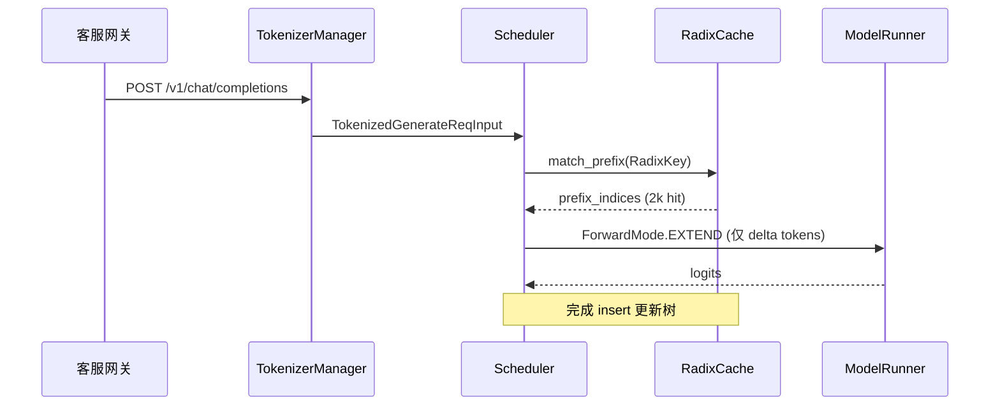

# RadixAttention · 核心概念

## 用户故事：长对话共享 System Prompt → RadixCache 前缀命中 → 跳过 Prefill

### Persona

**小林**，某 SaaS 客服平台的推理工程师。平台用同一套 2k token 的 system prompt（含安全策略、工具说明、品牌语气），每个终端用户会话再追加 50–500 token 的用户消息。峰值 800 QPS，P99 TTFT 是 SLA 红线。

### 时间线

| 时刻 | 事件 |
|------|------|
| T0 | 用户 A 发起首条消息；Scheduler 对完整 prompt 做 extend prefill，RadixCache `insert` 挂树 |
| T0+30s | 用户 B、C… 陆续进入；`match_prefix` 命中相同 system 前缀 |
| T1 | 800 并发会话；extend batch 中多数请求 `prefix_indices` 已覆盖 2k token，GPU 只算 delta |
| T2 | 监控 `cache_hit_rate` 从 0 升至 ~0.85；TTFT 从 420ms 降至 90ms |

### 涉及模块



**Explain：** 多请求共享相同 token 前缀时，KV 向量相同，应共用 GPU 内存。SGLang 用 **radix tree** 按 token 序列（分页对齐）组织节点，叶节点 `value` 存 KV pool index tensor。前缀命中发生在 `ScheduleBatch` 初始化阶段：`match_prefix` 返回的 `device_indices` 写入 `prefix_indices`，后续 extend 只对 delta 分配 KV slot 并跑 attention。**RadixAttention** 层则是 GPU Attention 算子入口，与树数据结构无直接调用关系——名字均强调「按 token 前缀共享 KV」。

**Code：**

```python
# 来源：python/sglang/srt/mem_cache/radix_cache.py L217-L226
# 提交版本：70df09b
class TreeNode:

    counter = 0

    def __init__(self, id: Optional[int] = None, priority: int = 0):
        self.children = defaultdict(TreeNode)
        self.parent: TreeNode = None
        self.key: RadixKey = None
        self.value: Optional[torch.Tensor] = None
        self.lock_ref = 0
```

**Comment：**

- `extra_key` 区分 LoRA adapter、cache salt；`child_key` 把 namespace 编入 dict key，同 token 不同 adapter 永不合并。
- `lock_ref>0` 的节点不可 evict；活跃请求 `inc_lock_ref` 保护从叶到 root 的路径。
- `page_size>1` 时未对齐 tail 不进树，由 `cache_protected_len` 追踪（见 [[15-RadixAttention-04-关键问题]] Q3）。

### 如果…会怎样（调试）

| 现象 | 可能原因 | 排查 |
|------|----------|------|
| `cache_hit_rate` 始终为 0 | system prompt 含动态 timestamp / request id | 检查 template 是否每请求变化 |
| 命中长度只有几百 token | `extra_key` 不一致（LoRA、routing_key） | 对比 `GenerateReqInput.extra_key` |
| 强制验证 miss 行为 | 设 `SGLANG_RADIX_FORCE_MISS=1` | 对比 A/B latency |

---

## 1. Radix Tree 与 Prefix Cache


**Explain：** 多请求若共享相同 token 前缀，KV 向量相同，应共用 GPU 内存。SGLang 用 **radix tree** 按 token 序列（分页对齐）组织节点，叶节点 `value` 存 KV pool index tensor。新请求 `match_prefix` 沿树走，命中越长 prefill 越短。

**Code：**

```python
# 来源：python/sglang/srt/mem_cache/radix_cache.py L217-L226
class TreeNode:

    counter = 0

    def __init__(self, id: Optional[int] = None, priority: int = 0):
        self.children = defaultdict(TreeNode)
        self.parent: TreeNode = None
        self.key: RadixKey = None
        self.value: Optional[torch.Tensor] = None
        self.lock_ref = 0
```

---

## 2. RadixKey：token 序列 + namespace

**Explain：** `token_ids` 用 `array('q')` 存储；`extra_key` 区分 LoRA id、cache salt 等；`is_bigram` 支持 EAGLE 投机（bigram 视图）；`page_aligned` 按 `page_size` 截断。

**Code：**

```python
# 来源：python/sglang/srt/mem_cache/radix_cache.py L60-L80
class RadixKey:
    """is_bigram=True: token_ids holds raw tokens (N+1 for N bigrams); slices share one boundary token."""

    __slots__ = ("token_ids", "extra_key", "is_bigram", "limit")

    def __init__(
        self,
        token_ids: array[int],
        extra_key: Optional[str] = None,
        is_bigram: bool = False,
        limit: Optional[int] = None,
    ):
        # token ids sequence (raw ints in both modes)
        self.token_ids = token_ids
        # extra key (e.g. lora_id, cache_salt)
        self.extra_key = extra_key
        # bigram view over token_ids: length = max(0, len(token_ids) - 1)
        self.is_bigram = is_bigram
        # Optional cap on raw tokens: behave as if token_ids were sliced to
        # token_ids[:limit], without the O(n) copy. None = use all tokens.
        self.limit = limit
```

```python
# 来源：python/sglang/srt/mem_cache/radix_cache.py L198-L208
    def child_key(self, page_size: int = 1):
        """Hashable dict-key for the first ``page_size`` logical units, namespaced by ``extra_key``."""
        t = self.token_ids
        if self.is_bigram:
            if page_size == 1:
                plain = (t[0], t[1])
            else:
                plain = tuple((t[j], t[j + 1]) for j in range(page_size))
        else:
            plain = t[0] if page_size == 1 else tuple(t[:page_size])
        return plain if self.extra_key is None else (self.extra_key, plain)
```

**Comment：** `children` dict 的 key = `child_key(page_size)`，同前缀不同 `extra_key` 永不合并。

---

## 3. match / insert / evict 三操作

| 操作 | 时机 | 作用 |
|------|------|------|
| `match_prefix` | prefill 前 / unfinished 更新后 | 最长前缀命中，返回 pool indices |
| `insert` | unfinished/finished cache | 把新算出的 KV indices 挂到树上 |
| `evict` | pool 不足 | 按 LRU/priority 淘汰叶节点，free indices |

---

## 4. lock_ref：保护活跃请求路径

**Explain：** 请求持有 `req.last_node` 时对该节点到 root 路径 `inc_lock_ref`；`lock_ref>0` 的节点不可 evict。decode 结束或 abort 时 `dec_lock_ref`。

**Code：**

```python
# 来源：python/sglang/srt/mem_cache/radix_cache.py L592-L605
    def inc_lock_ref(self, node: TreeNode) -> IncLockRefResult:
        if self.disable:
            return IncLockRefResult(delta=0)

        delta = 0
        while node != self.root_node:
            if node.lock_ref == 0:
                self.evictable_size_ -= len(node.key)
                self.protected_size_ += len(node.key)
                delta -= len(node.key)
            node.lock_ref += 1
            self._update_leaf_status(node)
            node = node.parent
        return IncLockRefResult(delta=delta)
```

---

## 5. cache_unfinished_req vs cache_finished_req

**Explain：** **Unfinished**：chunked prefill 或 streaming 中间态，insert 后 rematch，更新 `req.prefix_indices` 与 lock。**Finished**：请求完成，整段 prompt+output 插入树，释放 duplicate indices，可选不 insert（deterministic mode）。

**Code（finished）：**

```python
# 来源：python/sglang/srt/mem_cache/radix_cache.py L437-L471
    def cache_finished_req(self, req: Req, is_insert: bool = True):
        """Cache request when it finishes."""
        # In deterministic mode, disable finished request insertion to radix cache
        if self.disable_finished_insert:
            is_insert = False

        kv_committed_len = req.pop_committed_kv_cache()
        if self.disable:
            kv_indices = self.req_to_token_pool.req_to_token[
                req.req_pool_idx, :kv_committed_len
            ]
            self.token_to_kv_pool_allocator.free(kv_indices)
            return

        token_ids = (req.origin_input_ids + req.output_ids)[:kv_committed_len]
        kv_indices = self.req_to_token_pool.req_to_token[
            req.req_pool_idx, : len(token_ids)
        ]

        radix_key = RadixKey(
            token_ids, req.extra_key, is_bigram=self.is_eagle
        ).page_aligned(self.page_size)
        key_len = len(radix_key)
        values = kv_indices[:key_len].to(dtype=torch.int64, copy=True)

        # Radix Cache takes one ref in memory pool
        if is_insert:
            priority = getattr(req, "priority", 0) or 0
            result = self.insert(
                InsertParams(key=radix_key, value=values, priority=priority)
            )
            session_leaf = result.last_device_node
            # Free the duplicates that were already in the tree
            self.token_to_kv_pool_allocator.free(
                kv_indices[req.cache_protected_len : result.prefix_len]
```

---

## 6. RadixAttention 层职责

**Explain：** **不是** radix tree 实现；是 Attention **计算**统一入口，持有 head 数、layer_id、量化 scale，委托 `get_attn_backend()`（FlashInfer / FA / MLA 等）读写 **已由 Scheduler 分配好** 的 cache loc。

**Code：**

```python
# 来源：python/sglang/srt/layers/radix_attention.py L57-L88
class RadixAttention(nn.Module):
    """
    The attention layer implementation.
    """

    def __init__(
        self,
        num_heads: int,
        head_dim: int,
        scaling: float,
        num_kv_heads: int,
        layer_id: int,
        logit_cap: float = 0.0,
        v_head_dim: int = -1,
        sliding_window_size: int = -1,
        is_cross_attention: bool = False,
        pos_encoding_mode: str = "NONE",
        logit_capping_method: str = "tanh",
        quant_config: Optional[QuantizationConfig] = None,
        attn_type: AttentionType = AttentionType.DECODER,
        use_irope: bool = False,
        prefix: str = "",
    ):
        super().__init__()
        self.tp_q_head_num = num_heads
        self.tp_k_head_num = num_kv_heads
        self.tp_v_head_num = num_kv_heads
        self.head_dim = head_dim
        self.qk_head_dim = head_dim
        self.v_head_dim = v_head_dim if v_head_dim != -1 else head_dim
        self.scaling = scaling
        self.layer_id = layer_id
```

---

## 7. UnifiedRadixCache：多 component 树

**Explain：** 同一 token 前缀可能关联 **多种 cache**（full KV、SWA 窗口 KV、Mamba state）。`UnifiedTreeNode` 用 `component_data[]` 存各 component 的 device/host value；每 component 独立 LRU 链。

**Code：**

```python
# 来源：python/sglang/srt/mem_cache/unified_radix_cache.py L78-L89
class UnifiedTreeNode:
    counter = 0

    def __init__(self, tree_components: tuple[ComponentType, ...], priority: int = 0):
        self.children = defaultdict(partial(UnifiedTreeNode, tree_components))
        self.parent: UnifiedTreeNode | None = None
        self.key: Optional[RadixKey] = None
        self.tree_components = tree_components
        # list indexed by ComponentType (int enum 0..N-1)
        self.component_data: list[ComponentData] = [
            ComponentData() for _ in range(_NUM_COMPONENT_TYPES)
        ]
```

```python
# 来源：python/sglang/srt/mem_cache/unified_radix_cache.py L305-L378
class UnifiedRadixCache(KVCacheEventMixin, BasePrefixCache):
    def __init__(
        self,
        params: CacheInitParams,
    ):
        self.req_to_token_pool = params.req_to_token_pool
        self.token_to_kv_pool_allocator = params.token_to_kv_pool_allocator
        self.page_size = params.page_size
        self.disable = params.disable
        self.is_eagle = params.is_eagle
        self.enable_kv_cache_events = params.enable_kv_cache_events
        self.kv_event_queue = []
        self.eviction_policy = params.eviction_policy.lower()
        self.eviction_strategy = get_eviction_strategy(self.eviction_policy)

        if self.token_to_kv_pool_allocator:
            self.device = self.token_to_kv_pool_allocator.device
        else:
            self.device = torch.device("cpu")

        if params.enable_metrics:
            self.init_metrics_collector()
        self._enable_metrics_flag = params.enable_metrics
        self.enable_storage_metrics = False
        self.storage_metrics_collector: Optional[StorageMetricsCollector] = None
        self.extra_metric_labels = None

        assert params.tree_components is not None
        self.tree_components = tuple(params.tree_components)
        component_registry = COMPONENT_REGISTRY
        if params.component_registry_override:
            component_registry = {
                **COMPONENT_REGISTRY,
                **params.component_registry_override,
            }
        self.components: dict[ComponentType, TreeComponent] = {
            ct: component_registry[ct](self, params) for ct in self.tree_components
        }
        self._components_tuple: tuple[TreeComponent, ...] = tuple(
            self.components.values()
        )
        self.sidecar_pool_specs: list[SidecarPoolSpec] = []

        # Streaming session: embedded StreamingSession with self as inner.
        # Always on -- zero overhead when no streaming session is open (the
        # try_* entries short-circuit on non-streaming reqs / real TreeNodes).
        # Dispatch methods below pre-check conditions so the session's
        # internal fall-through to self.inner.xxx never fires -- no recursion.
        self.session = StreamingSession(inner=self)

        self.tp_group = params.tp_cache_group
        self.attn_cp_group = params.attn_cp_cache_group
        self.attn_tp_group = params.attn_tp_cache_group
        self.pp_group = params.pp_cache_group
        self.tp_world_size = (
            1
            if self.tp_group is None
            else torch.distributed.get_world_size(group=self.tp_group)
        )
        self.pp_rank = params.pp_rank
        self.pp_size = params.pp_size
        self.work_list: list[torch.distributed.Work] = []

        # HiCache D↔H defaults (overridden by init_hicache)
        self.cache_controller: Optional[HybridCacheController] = None
        self.write_through_threshold = 256
        self.prefetch_stop_policy = "best_effort"
        self.prefetch_threshold = 256
        self.prefetch_timeout_base = 1.0
        self.prefetch_timeout_per_page = 0.25
        self.hicache_storage_pass_prefix_keys = False

        self.reset()
        logger.info(f"Init Unified RadixTree with components {self.tree_components}")
```

---

## 8. HiCache / HybridCacheController

**Explain：** Unified 版本可挂 `HybridCacheController`，支持 device↔host write-through、L3 storage prefetch。`match_prefix` 后处理可能触发 host 侧命中或 prefetch queue。

**Comment：** 细节在 `hybrid_cache/`；本模块只需知 Unified API 兼容 RadixCache 且扩展 storage 层。

---

## 9. EAGLE bigram 模式

**Explain：** `is_eagle=True` 时 `maybe_to_bigram_view` 把 key 转为 bigram 逻辑长度（N token → N-1 bigram），与 speculative 算法 KV 布局一致。

**Code：**

```python
# 来源：python/sglang/srt/mem_cache/radix_cache.py L142-L153
    def maybe_to_bigram_view(
        self,
        is_eagle: bool,
        value: Optional[torch.Tensor] = None,
    ) -> Tuple[RadixKey, Optional[torch.Tensor]]:
        # O(1): flip the bigram flag instead of materializing a tuple list.
        # value is paired with raw tokens and gets truncated to the bigram count.
        if is_eagle and not self.is_bigram:
            self.is_bigram = True
            if value is not None:
                value = value[: len(self)]
        return self, value
```

---

## 10. piecewise CUDA graph 路径

**Explain：** `--enforce-piecewise-cuda-graph` 时 extend 阶段走 `unified_attention_with_output` custom op，预分配 output，narrow `out_cache_loc` 到真实 token 数，FA 直接写 buffer。

**Code：**

```python
# 来源：python/sglang/srt/layers/radix_attention.py L211-L229
    original_out_cache_loc = forward_batch.out_cache_loc
    # Keep the original ForwardBatch object and only narrow cache locations for
    # this backend call so model/backend state is still written to the same batch.
    forward_batch.out_cache_loc = original_out_cache_loc[:real_num_tokens]

    # Store pre-allocated output for FA backend to write directly into.
    # Must slice to real_num_tokens to match the narrowed query shape —
    # the FA kernel validates out.size(0) == q.size(0).
    forward_batch._attn_output = output[:real_num_tokens]

    ret = get_attn_backend().forward(
        query,
        key,
        value,
        attention_layer,
        forward_batch,
        save_kv_cache,
        **kwargs,
    )
```
