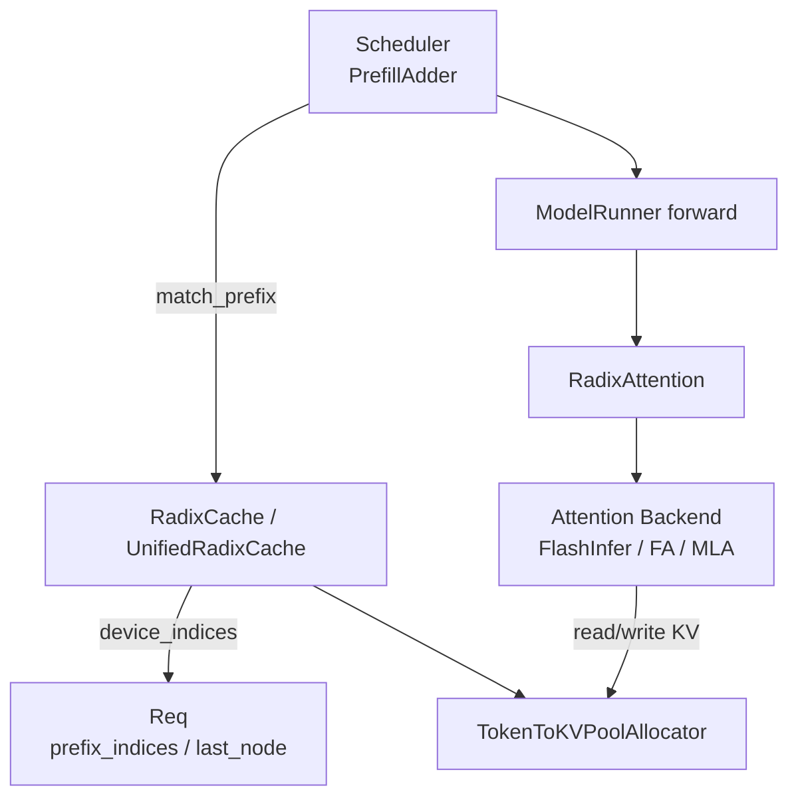
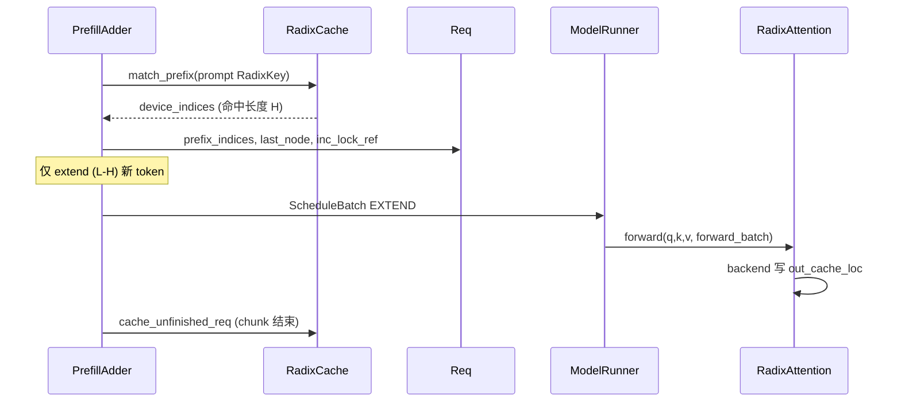

# RadixAttention：数据流与交互

---

## 1. 架构位置



**Explain：** **Radix tree** 管理「哪些 token 前缀已有 KV indices」；**RadixAttention** 在 forward 时用 `forward_batch.out_cache_loc` 读写物理 KV tensor。二者通过 pool allocator 间接耦合。

---

## 2. 输入 / 输出

| API | 输入 | 输出 |
|-----|------|------|
| `match_prefix` | `MatchPrefixParams(key=RadixKey)` | `MatchResult(device_indices, last_device_node, ...)` |
| `insert` | `InsertParams(key, value=tensor indices)` | `InsertResult(prefix_len, last_device_node)` |
| `cache_unfinished_req` | `Req` | 更新 req pool 行 + lock |
| `cache_finished_req` | `Req` | 插入树 + free duplicates |
| `RadixAttention.forward` | q,k,v + `ForwardBatch` | attention output tensor |

**Code（RadixKey 构造于 finished cache）：**

```python
# 来源：python/sglang/srt/mem_cache/radix_cache.py L456-L460
        radix_key = RadixKey(
            token_ids, req.extra_key, is_bigram=self.is_eagle
        ).page_aligned(self.page_size)
        key_len = len(radix_key)
        values = kv_indices[:key_len].to(dtype=torch.int64, copy=True)
```

---

## 3. 新请求 Prefill 数据流



### 步骤 1：match_prefix

PrefillAdder 用 `origin_input_ids`（+ extra_key）建 `RadixKey`，`page_aligned`。

### 步骤 2：分配与 lock

命中 indices 填入 `req_to_token`；`inc_lock_ref(last_node)` 保护路径。

### 步骤 3：GPU extend forward

仅未命中 suffix 参与 attention extend；`ForwardBatch.out_cache_loc` 指向新 slots。

### 步骤 4：cache_unfinished / finished

Chunked prefill 每 chunk 调 `cache_unfinished_req`；完成时 `cache_finished_req` 整段 insert。

**Code（unfinished rematch 断言）：**

```python
# 来源：python/sglang/srt/mem_cache/radix_cache.py L524-L526
        assert len(new_indices) == len(
            radix_key
        ), f"{len(new_indices)=}, {len(radix_key)=}"
```

---

## 4. Decode 阶段

**Explain：** Decode 通常 **不再 insert radix**（token 逐条变长）；树插入在 finished 或 chunked unfinished。Decode forward 仅通过 RadixAttention + backend **读**已有 cache 并 append 新 slot（Scheduler 分配 `out_cache_loc`）。

---

## 5. Eviction 与内存压力

**Explain：** `PrefillAdder` / allocator 内存不足时调用 `radix_cache.evict(num_tokens)`。仅 `lock_ref==0` 叶节点入堆；evict 后 parent 若无 child 且 unlock 可升级为叶。

**Code：**

```python
# 来源：python/sglang/srt/mem_cache/radix_cache.py L583-L585
            if len(x.parent.children) == 0 and x.parent.lock_ref == 0:
                new_priority = self.eviction_strategy.get_priority(x.parent)
                heapq.heappush(eviction_heap, (new_priority, x.parent))
```

---

## 6. UnifiedRadixCache 与 HiCache


**Explain：** `UnifiedTreeNode.backuped` 表示 full KV 在 host；`evicted` 表示 device value 为空但树结构仍在。match 后处理可触发 prefetch。

**Code：**

```python
# 来源：python/sglang/srt/mem_cache/unified_radix_cache.py L108-L119
    @property
    def backuped(self) -> bool:
        """Tree-level: Full KV present on host."""
        return self.component_data[ComponentType.FULL].host_value is not None

    @property
    def evicted(self) -> bool:
        """Tree-level: Full KV not on device (non-root with value=None)."""
        return (
            self.parent is not None
            and self.component_data[ComponentType.FULL].value is None
        )
```

---

## 7. RadixAttention 与 ForwardBatch 字段

| 字段 | 用途 |
|------|------|
| `forward_mode` | extend/decode/spec → backend 分支 |
| `out_cache_loc` | 本步 KV 写入 pool 索引 |
| `num_token_non_padded_cpu` | piecewise graph 真实 token 数 |
| `_attn_output` | FA 预分配 output（unified 路径） |

**Code：**

```python
# 来源：python/sglang/srt/layers/radix_attention.py L180-L184
    real_num_tokens = forward_batch.num_token_non_padded_cpu

    query = query[:real_num_tokens]
    if key is not None:
        key = key[:real_num_tokens]
```

---

## 8. RadixCache vs UnifiedRadixCache 选型

**Explain：** Server 启动时由 `mem_cache/registry.py` 与 server args 决定实例类。Unified 为 **superset**：多 component、session、HiCache、分布式 cache group sync。

**Code：**

```python
# 来源：python/sglang/srt/mem_cache/unified_radix_cache.py L332-L342
        assert params.tree_components is not None
        self.tree_components = tuple(params.tree_components)
        component_registry = COMPONENT_REGISTRY
        if params.component_registry_override:
            component_registry = {
                **COMPONENT_REGISTRY,
                **params.component_registry_override,
            }
        self.components: dict[ComponentType, TreeComponent] = {
            ct: component_registry[ct](self, params) for ct in self.tree_components
        }
```

---

## 9. 与 Scheduler flush_cache

**Explain：** 用户 `FlushCacheReqInput` → Scheduler `flush_cache` → `radix_cache.reset()` + pool 清空。所有 `lock_ref` 须已释放，否则 reset 可能 leak 或 assert。

→ Scheduler 侧见 [[07-Scheduler-03-数据流与交互|Scheduler]]

---

## 10. EAGLE 路径差异

**Explain：** `is_eagle=True` 时 key 长度与 kv indices 差 1（bigram）；`cache_unfinished_req` 拼接 `prefix_indices` 时保留未对齐 tail。

**Code：**

```python
# 来源：python/sglang/srt/mem_cache/radix_cache.py L545-L550
        if len(new_indices) < len(kv_indices):
            req.prefix_indices = torch.cat(
                [new_indices, kv_indices[len(new_indices) :]]
            )
        else:
            req.prefix_indices = new_indices
```
