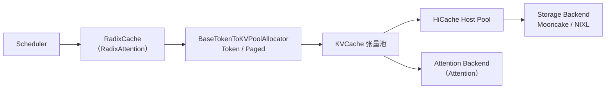

# KV Cache 分配与存储

> **阶段 IV · 内存与 Attention** | 状态：已完成 | Git：`70df09b83363e0127b43c83a6007d3938f815b2d` 
> **源码范围：** `mem_cache/allocator/`、`mem_cache/memory_pool.py`、`mem_cache/storage/`

---

## 本模块在架构中的位置

KV Cache 层是 **逻辑索引（Radix Tree）与物理 GPU 张量** 之间的桥梁。RadixCache 通过 `TokenToKVPoolAllocator` / `PagedTokenToKVPoolAllocator` 申请与释放 token 或 page 级 slot；`KVCache` 张量池实际存储 K/V 向量；HiCache 将冷 KV 溢出到主机内存，Storage Backend（Mooncake/NIXL 等）支持跨节点共享。Attention backend（Attention）读写这些 slot，Scheduler 在 OOM 时触发 evict。



---

## 零基础一句话

**像停车场的「车位编号系统」**：Radix Tree 记的是「哪辆车停哪」，本模块负责发号、回收车位，以及把闲置车辆挪到地下库（Host）或异地仓库（Storage）。

---

## 用户场景

**Persona：** 运维工程师阿杰在 8×H100 上跑 DeepSeek-V3，频繁遇到 `KV cache pool is full`。他需要理解 token 级与 page 级 allocator 的差异、HiCache 如何缓解显存压力，以及 `--page-size 64` 对碎片率的影响——本模块文档给出从 Scheduler 到物理 pool 的完整链路。

---

## 五件套阅读顺序

| 顺序 | 文件 | 一句话说明 |
|------|------|------------|
| 01 | [[16-KV-Cache-01-核心概念]] | Token vs Page 分配、HiCache 分层、Storage 后端术语 |
| 启动链路 | [[16-KV-Cache-02-源码走读]] | `alloc`/`free`、`alloc_extend`/`alloc_decode`、pool_host 精读 |
| HTTP Server | [[16-KV-Cache-03-数据流与交互]] | Scheduler → Allocator → KV Pool → Attention 的数据流 |
| OpenAI API | [[16-KV-Cache-04-关键问题]] | page_size 选型、OOM 与 retract、与 RadixAttention 协作 |
| ✓ | [[16-KV-Cache-05-checkpoint]] | 验收：能否画出 allocator 与 RadixCache 的调用边界 |

---

## 核心源码锚点

**Explain：** 所有 KV 索引分配器继承 `BaseTokenToKVPoolAllocator`，统一暴露 `alloc`/`free`/`available_size` 接口。`free_group_begin/end` 支持批量释放后合并，减少 sort 开销；Paged 子类额外实现 `alloc_extend` 与 `alloc_decode` 以适配 prefill/decode 不同粒度。

**Code：**

```python
# 来源：python/sglang/srt/mem_cache/allocator/base.py L27-L110
class BaseTokenToKVPoolAllocator(abc.ABC):
    @abc.abstractmethod
    def __init__(
        self,
        size: int,
        page_size: int,
        dtype: torch.dtype,
        device: str,
        kvcache: KVCache,
        need_sort: bool,
    ):
        self.size = size
        self.page_size = page_size
        self.dtype = dtype
        self.device = device
        self._kvcache = kvcache
        self.need_sort = need_sort

        self.free_pages = None
        self.release_pages = None
        self.is_not_in_free_group = True
        self.free_group = []

    @property
    def size_full(self):
        return self.size

    def debug_print(self) -> str:
        return ""

    def available_size(self):
        return (len(self.free_pages) + len(self.release_pages)) * self.page_size

    def get_kvcache(self):
        return self._kvcache

    def restore_state(self, state):
        self.free_pages, self.release_pages = state

    def backup_state(self):
        return (self.free_pages, self.release_pages)

    def free_group_begin(self):
        self.is_not_in_free_group = False
        self.free_group = []

    def free_group_end(self):
        self.is_not_in_free_group = True
        if self.free_group:
            self.free(torch.cat(self.free_group))

    def merge_and_sort_free(self):
        if len(self.release_pages) > 0:
            self.free_pages = torch.cat((self.free_pages, self.release_pages))
            self.free_pages, _ = torch.sort(self.free_pages)
            self.release_pages = torch.empty(
                (0,), dtype=self.release_pages.dtype, device=self.device
            )

    def get_cpu_copy(self, indices, mamba_indices=None):
        # FIXME: reuse the get_cpu_copy after paged allocator is implemented
        raise NotImplementedError()

    def load_cpu_copy(self, kv_cache_cpu, indices, mamba_indices=None):
        # FIXME: reuse the load_cpu_copy after paged allocator is implemented
        raise NotImplementedError()

    def alloc_extend(self, *args, **kwargs):
        raise NotImplementedError("alloc_extend is only for paged allocator")

    def alloc_decode(self, *args, **kwargs):
        raise NotImplementedError("alloc_decode is only for paged allocator")

    @abc.abstractmethod
    def clear(self):
        raise NotImplementedError()

    @abc.abstractmethod
    def alloc(self, need_size: int):
        raise NotImplementedError()

    @abc.abstractmethod
    def free(self, free_index: torch.Tensor):
        raise NotImplementedError()
```

**Comment：**

- `available_size` 把 `free_pages` 与 `release_pages` 合并计算剩余 slot，供 PrefillAdder 预算判断。
- `free_group_begin/end` 在 batch 结束时批量 free，避免多次 sort。
- `TokenToKVPoolAllocator` 固定 `page_size=1`；`PagedTokenToKVPoolAllocator` 按 page 对齐分配。
- RadixCache evict 叶节点时调用 `allocator.free` 归还 indices。

---

## 验证建议

1. **CLI：** `--mem-fraction-static 0.85 --page-size 64`，观察启动日志中 KV pool 总 slot 数与 `available_size`。
2. **日志/指标：** OOM 时搜索 `KV cache pool is full` 或 `retract`；Prometheus `sglang:token_usage` 反映 pool 占用率。

---

## 阅读路径

← [[15-RadixAttention-00-MOC|RadixAttention]] 
→ [[17-Attention-00-MOC|Attention 后端]]
