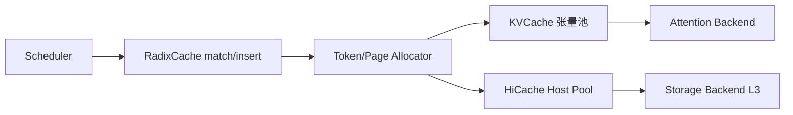
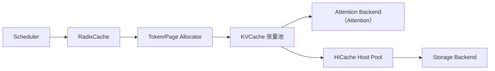

# KV Cache · 核心概念

## 用户故事：KV Pool 告急 — Allocator 如何在 Radix 与物理张量之间「借 slot」

### Persona

**赵工**，内存调优工程师。生产 Llama-3-70B `--mem-fraction-static 0.85`，晚高峰日志出现 `alloc returned None` 后紧跟 `retract_decode`。她需要理解：**RadixCache 决定「共享什么前缀」，Allocator 决定「物理 slot 存哪」**，二者如何通过 `token_to_kv_pool_allocator` 解耦。

### 时间线

| 时刻 | 事件 |
|------|------|
| T0 | 新请求 extend prefill；Radix `match_prefix` 命中 1k token，剩余 500 token 需新 alloc |
| T0+1ms | `TokenToKVPoolAllocator.alloc(500)` 或 `PagedTokenToKVPoolAllocator.alloc(page_aligned)` 从 `free_pages` 取索引 |
| T1 | Forward 写入 KV 张量池对应 slot；`req_to_token_pool` 记录 req → token index 映射 |
| T2 | 并发升高，free list 耗尽；`alloc` 返回 `None` → Scheduler evict Radix 叶节点或 retract decode |
| T3 | 请求完成；`free(kv_indices)` 回收 slot，Paged 路径对 index 做 `torch.unique(// page_size)` |

### 涉及模块



**Explain：** KV Cache 分配层位于 **RadixAttention（RadixAttention）** 与 **物理 KV 张量** 之间。`TokenToKVPoolAllocator` 以 token 为粒度（`page_size=1`）；`PagedTokenToKVPoolAllocator` 按 page 对齐，与 FlashInfer PagedAttention 及 `--page-size` 一致。slot 0 保留给 padding dummy 写入。Radix `insert` 发现重复前缀时会 `free` duplicate indices——Allocator 只负责索引生命周期，不理解语义。

**Code：**

```python
# 来源：python/sglang/srt/mem_cache/allocator/token.py L52-L61
# 提交版本：70df09b
        # To avoid minor "len(free_pages) * 1" overhead
        return len(self.free_pages) + len(self.release_pages)

    def alloc(self, need_size: int):
        if self.need_sort and need_size > len(self.free_pages):
            self.merge_and_sort_free()

        if need_size > len(self.free_pages):
            return None

```

**Comment：**

- `need_sort=True` 时释放的索引先进 `release_pages`，alloc 前 merge，减少碎片。
- Paged `free` 必须 `unique(page_index)`，否则同一 page 部分释放会导致 double-free。
- HiCache `HostKVCache` 启动时检查 `psutil.virtual_memory()`，防止 host RAM OOM。

### 如果…会怎样（调试）

| 现象 | 可能原因 | 排查 |
|------|----------|------|
| 第二条相同 prompt 莫名慢 200ms（ROCm） | Paged free 首调 JIT `torch.unique` | 见 paged.py init 预热注释 |
| 频繁 retract、吞吐下降 | KV pool 容量不足或 `max_running_requests` 过大 | 调 `--mem-fraction-static` 或减并发 |
| HiCache 启动失败 | host 内存不足 | 减小 `--hicache-ratio` / `--hicache-size` |

---

## 1. 架构位置

KV Cache 分配层位于 **RadixAttention（RadixAttention）** 与 **物理 KV 张量（memory_pool）** 之间：



## 2. Token 级 vs Page 级分配

**Explain：** `TokenToKVPoolAllocator` 以 token 为粒度管理索引，`page_size=1`；适合 page_size=1 或未启用 paged KV 的场景。

**Code：**

```python
# 来源：python/sglang/srt/mem_cache/allocator/token.py L28-L84
class TokenToKVPoolAllocator(BaseTokenToKVPoolAllocator):
    """An allocator managing the indices to kv cache data."""

    def __init__(
        self,
        size: int,
        dtype: torch.dtype,
        device: str,
        kvcache: KVCache,
        need_sort: bool,
    ):
        super().__init__(size, 1, dtype, device, kvcache, need_sort)
        self.clear()

    def clear(self):
        # The padded slot 0 is used for writing dummy outputs from padded tokens.
        self.free_pages = torch.arange(
            1, self.size + 1, dtype=torch.int64, device=self.device
        )
        self.is_not_in_free_group = True
        self.free_group = []
        self.release_pages = torch.empty((0,), dtype=torch.int64, device=self.device)

    def available_size(self):
        # To avoid minor "len(free_pages) * 1" overhead
        return len(self.free_pages) + len(self.release_pages)

    def alloc(self, need_size: int):
        if self.need_sort and need_size > len(self.free_pages):
            self.merge_and_sort_free()

        if need_size > len(self.free_pages):
            return None

        select_index = self.free_pages[:need_size]
        self.free_pages = self.free_pages[need_size:]
        return select_index

    def free(self, free_index: torch.Tensor):
        if free_index.numel() == 0:
            return

        if self.is_not_in_free_group:
            if self.need_sort:
                self.release_pages = torch.cat((self.release_pages, free_index))
            else:
                self.free_pages = torch.cat((self.free_pages, free_index))
        else:
            self.free_group.append(free_index)

    def get_cpu_copy(self, indices, mamba_indices=None):
        return self._kvcache.get_cpu_copy(indices, mamba_indices=mamba_indices)

    def load_cpu_copy(self, kv_cache_cpu, indices, mamba_indices=None):
        return self._kvcache.load_cpu_copy(
            kv_cache_cpu, indices, mamba_indices=mamba_indices
        )
```

**Comment：**
- slot 0 保留给 padding token 的 dummy 写入
- `need_sort=True` 时释放的索引先进入 `release_pages`，alloc 前 merge
- `get_cpu_copy/load_cpu_copy` 支持 HiCache 与 CPU offload


## 3. Page 对齐分配

**Explain：** `PagedTokenToKVPoolAllocator` 将 KV 索引按 page 对齐，与 FlashInfer PagedAttention 及 `--page-size` 配置一致。

**Code：**

```python
# 来源：python/sglang/srt/mem_cache/allocator/paged.py L105-L170
class PagedTokenToKVPoolAllocator(BaseTokenToKVPoolAllocator):
    """
    An allocator managing the indices to kv cache data.

    This class has the same interface as `TokenToKVPoolAllocator` but the output
    of one request is always page-aligned.

    TODO: fuse last_loc into the kernel.
    """

    def __init__(
        self,
        size: int,
        page_size: int,
        dtype: torch.dtype,
        device: str,
        kvcache: KVCache,
        need_sort: bool,
    ):
        super().__init__(size, page_size, dtype, device, kvcache, need_sort)
        self.num_pages = size // page_size
        self.debug_mode = get_bool_env_var("SGLANG_DEBUG_MEMORY_POOL")

        # Pre-warm the torch.unique HIP kernel used in free(). When a request
        # finishes with a prompt that already exists in the radix tree (e.g.
        # bench_serving sending the same warmup+measured prompt), the radix
        # cache's _insert_helper frees the duplicate KV indices via
        # token_to_kv_pool_allocator.free(value[start:prefix_len]). That call
        # path runs `torch.unique(free_index // self.page_size)` on a
        # ~prompt_len-sized int64 tensor. The first such call on AMD ROCm
        # JIT-compiles rocPRIM sort/unique kernels and costs ~200ms, which
        # shows up as a mysterious "second-request slow" (Run 1) for
        # repeated-prompt benchmarks. Running it once at init time moves
        # that JIT cost to startup. This is a ROCm-only JIT cost, so the
        # warm-up is gated on _is_hip and skipped on other platforms.
        if _is_hip and torch.cuda.is_available():
            try:
                _warmup = torch.arange(1024, dtype=torch.int64, device=device)
                _ = torch.unique(_warmup // page_size)
                torch.cuda.synchronize()
            except Exception:
                pass
        self.clear()

    def alloc(self, need_size: int):
        # page-aligned allocation, returning contiguous indices of pages
        if self.debug_mode:
            assert (
                need_size % self.page_size == 0
            ), "The allocation size should be page-aligned"

        num_pages = need_size // self.page_size
        if self.need_sort and num_pages > len(self.free_pages):
            self.merge_and_sort_free()
        if num_pages > len(self.free_pages):
            return None

        out_pages = self.free_pages[:num_pages]
        self.free_pages = self.free_pages[num_pages:]

        out_indices = (
            out_pages[:, None] * self.page_size
            + torch.arange(self.page_size, device=self.device)
        ).reshape(-1)

        return out_indices
```

**Comment：**
- `alloc` 返回连续 page 展开后的 token 索引
- ROCm 上 init 时预热 `torch.unique`，避免首请求 JIT 延迟
- `num_pages = size // page_size` 定义总 page 数


## 4. HiCache 主机池

**Explain：** `HostKVCache` 在主机 RAM 上维护 KV 副本，实现分层缓存（L1 设备 / L2 主机 / L3 外部 storage）。

**Code：**

```python
# 来源：python/sglang/srt/mem_cache/pool_host/base.py L79-L143
class HostKVCache(abc.ABC):

    def __init__(
        self,
        device_pool: KVCache,
        host_to_device_ratio: float,
        host_size: int,
        page_size: int,
        layout: str,
        pin_memory: bool,
        device: str,
        allocator_type: str = "default",
    ):
        self.device_pool = device_pool
        self.page_size = page_size
        self.layout = layout
        self.pin_memory = pin_memory
        self.device = device
        self.allocator = get_allocator_from_storage(allocator_type)
        self.can_use_write_back_jit = False

        self.dtype = device_pool.store_dtype
        self.size_per_token = self.get_size_per_token()
        if host_size > 0:
            self.size = sync_fixed_hicache_size(
                int(host_size * 1e9 // self.size_per_token), host_size
            )
        else:
            self.size = int(device_pool.size * host_to_device_ratio)
        # Align up the host memory pool size to the page size
        self.page_num = self.size // self.page_size + 1
        self.size = self.page_num * self.page_size
        self.start_layer = device_pool.start_layer
        self.end_layer = device_pool.end_layer

        if self.size <= device_pool.size:
            logger.warning(
                "HiCache host KV pool (%d tokens) is smaller than the device pool (%d tokens);"
                "L2 cache effectiveness is reduced."
                "Consider increasing --hicache-ratio (or --hicache-size) for higher L2 cache hit rate.",
                self.size,
                device_pool.size,
            )

        # Verify there is enough available host memory.
        host_mem = psutil.virtual_memory()
        requested_bytes = self.size * self.size_per_token
        available_bytes = host_mem.available - HICACHE_HOST_MEMORY_RESERVE_BYTES
        if requested_bytes > available_bytes:
            raise ValueError(
                f"Not enough host memory available. Requesting "
                f"{requested_bytes / 1e9:.2f} GB but only have "
                f"{available_bytes / 1e9:.2f} GB free. Please reduce the "
                f"size of the hierarchical cache."
            )
        else:
            logger.info(
                f"Allocating {requested_bytes / 1e9:.2f} GB host memory for hierarchical KV cache."
            )

        self.kv_buffer = self.init_kv_buffer()

        # A lock for synchronized operations on memory allocation and state transitions.
        self.lock = threading.RLock()
        self.clear()
```

**Comment：**
- `host_size`（GB）或 `host_to_device_ratio` 决定容量
- PP 并行时 `sync_fixed_hicache_size` 取各 rank 最小 token 数
- 启动前检查 `psutil.virtual_memory()` 防止 OOM


## 5. Storage 后端工厂

**Explain：** `StorageBackendFactory` 注册并懒加载 Mooncake、NIXL、LMCache 等 HiCache 外部存储后端。

**Code：**

```python
# 来源：python/sglang/srt/mem_cache/storage/backend_factory.py L16-L96
class StorageBackendFactory:
    """Factory for creating storage backend instances with support for dynamic loading."""

    _registry: Dict[str, Dict[str, Any]] = {}

    @staticmethod
    def _load_backend_class(
        module_path: str, class_name: str, backend_name: str
    ) -> type[HiCacheStorage]:
        """Load and validate a backend class from module path."""
        try:
            module = importlib.import_module(module_path)
            backend_class = getattr(module, class_name)
            if not issubclass(backend_class, HiCacheStorage):
                raise TypeError(
                    f"Backend class {class_name} must inherit from HiCacheStorage"
                )
            return backend_class
        except ImportError as e:
            raise ImportError(
                f"Failed to import backend '{backend_name}' from '{module_path}': {e}"
            ) from e
        except AttributeError as e:
            raise AttributeError(
                f"Class '{class_name}' not found in module '{module_path}': {e}"
            ) from e

    @classmethod
    def register_backend(cls, name: str, module_path: str, class_name: str) -> None:
        """Register a storage backend with lazy loading.

        Args:
            name: Backend identifier
            module_path: Python module path containing the backend class
            class_name: Name of the backend class
        """
        if name in cls._registry:
            logger.warning(f"Backend '{name}' is already registered, overwriting")

        def loader() -> type[HiCacheStorage]:
            """Lazy loader function to import the backend class."""
            return cls._load_backend_class(module_path, class_name, name)

        cls._registry[name] = {
            "loader": loader,
            "module_path": module_path,
            "class_name": class_name,
        }

    @classmethod
    def create_backend(
        cls,
        backend_name: str,
        storage_config: HiCacheStorageConfig,
        mem_pool_host: Any,
        **kwargs,
    ) -> HiCacheStorage:
        """Create a storage backend instance.
        Args:
            backend_name: Name of the backend to create
            storage_config: Storage configuration
            mem_pool_host: Memory pool host object
            **kwargs: Additional arguments passed to external backends
        Returns:
            Initialized storage backend instance
        Raises:
            ValueError: If backend is not registered and cannot be dynamically loaded
            ImportError: If backend module cannot be imported
            Exception: If backend initialization fails
        """
        # First check if backend is already registered
        if backend_name in cls._registry:
            registry_entry = cls._registry[backend_name]
            backend_class = registry_entry["loader"]()
            logger.info(
                f"Creating storage backend '{backend_name}' "
                f"({registry_entry['module_path']}.{registry_entry['class_name']})"
            )
            return cls._create_builtin_backend(
                backend_name, backend_class, storage_config, mem_pool_host
            )
```

**Comment：**
- `_registry` 保存 backend 名 → loader 映射
- `register_backend` 支持插件式扩展
- 创建实例时传入 `HiCacheStorageConfig` 与 `mem_pool_host`

