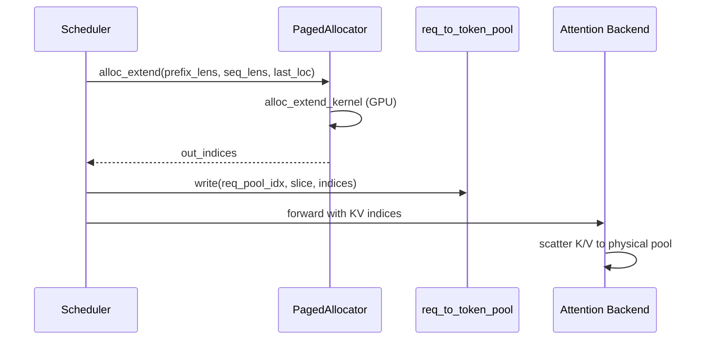

# KV Cache：数据流与交互

## 1. 输入 / 输出

| 方向 | 类型 | 说明 | 源码 |
|------|------|------|------|
| 输入 | `need_size: int` | 需分配的 token/page 数 | allocator.alloc |
| 输出 | `torch.Tensor` | KV 池中的 slot 索引 | 同上 |
| 输入 | `free_index: Tensor` | 释放的索引 | allocator.free |

## 2. 上下游

| 模块 | 关系 | 说明 |
|------|------|------|
| RadixCache（RadixAttention） | 上游 | prefix match 后 alloc 新 extend 索引 |
| memory_pool.KVCache | 下游 | 索引映射到 K/V 物理张量 |
| Scheduler | 调用方 | OOM 时 retract 触发 free |
| Attention Backend（Attention） | 消费者 | 通过 indices 读写的 KV |

## 3. Prefill extend 数据流

**Explain：** Scheduler 提交 extend batch → ModelRunner forward → allocator.alloc_extend 批量分配 → req_to_token_pool 写入 indices → Attention backend scatter K/V。



**Code：**

```python
# 来源：python/sglang/srt/mem_cache/allocator/paged.py L172-L215
    def alloc_extend(
        self,
        prefix_lens: torch.Tensor,
        prefix_lens_cpu: torch.Tensor,
        seq_lens: torch.Tensor,
        seq_lens_cpu: torch.Tensor,
        last_loc: torch.Tensor,
        extend_num_tokens: int,
        num_new_pages: int = None,
    ):
        if self.debug_mode:
            assert torch.all(
                (last_loc + 1) % self.page_size == prefix_lens % self.page_size
            )

        bs = len(prefix_lens)
        if self.need_sort and extend_num_tokens // self.page_size + bs + 1 > len(
            self.free_pages
        ):
            self.merge_and_sort_free()

        out_indices = torch.empty(
            (extend_num_tokens,), dtype=torch.int64, device=self.device
        )

        alloc_extend_kernel[(bs,)](
            prefix_lens,
            seq_lens,
            last_loc,
            self.free_pages,
            out_indices,
            next_power_of_2(bs),
            self.page_size,
        )

        if self.debug_mode:
            assert len(torch.unique(out_indices)) == len(out_indices)

        if num_new_pages is None:
            num_new_pages = get_num_new_pages(
                seq_lens=seq_lens_cpu,
                page_size=self.page_size,
                prefix_lens=prefix_lens_cpu,
            )
```

**Comment：**
- 步骤 1：计算各 req prefix/seq len
- 步骤 2：kernel 填充 out_indices
- 步骤 3：Attention 用 indices scatter K/V


## 4. HiCache 回写流

**Explain：** 设备 KV evict 时 backup 到 HostKVCache，命中时 load_to_device_per_layer。

**Code：**

```python
# 来源：python/sglang/srt/mem_cache/pool_host/base.py L174-L189
    def load_to_device_per_layer(
        self, device_pool, host_indices, device_indices, layer_id, io_backend
    ) -> None:
        """
        Load KV data from the host memory pool to the device memory pool for a specific layer.
        """
        raise NotImplementedError()

    @abc.abstractmethod
    def backup_from_device_all_layer(
        self, device_pool, host_indices, device_indices, io_backend
    ) -> None:
        """
        Backup KV data from the device memory pool to the host memory pool for all layers.
        """
        raise NotImplementedError()
```

**Comment：**
逐 layer 异步 IO，与 forward 流水线重叠


## 5. 外部 Storage 加载

**Explain：** Storage 后端实现 HiCacheStorage，与 host pool 交换 page 数据。

**Code：**

```python
# 来源：python/sglang/srt/mem_cache/storage/backend_factory.py L66-L96
    def create_backend(
        cls,
        backend_name: str,
        storage_config: HiCacheStorageConfig,
        mem_pool_host: Any,
        **kwargs,
    ) -> HiCacheStorage:
        """Create a storage backend instance.
        Args:
            backend_name: Name of the backend to create
            storage_config: Storage configuration
            mem_pool_host: Memory pool host object
            **kwargs: Additional arguments passed to external backends
        Returns:
            Initialized storage backend instance
        Raises:
            ValueError: If backend is not registered and cannot be dynamically loaded
            ImportError: If backend module cannot be imported
            Exception: If backend initialization fails
        """
        # First check if backend is already registered
        if backend_name in cls._registry:
            registry_entry = cls._registry[backend_name]
            backend_class = registry_entry["loader"]()
            logger.info(
                f"Creating storage backend '{backend_name}' "
                f"({registry_entry['module_path']}.{registry_entry['class_name']})"
            )
            return cls._create_builtin_backend(
                backend_name, backend_class, storage_config, mem_pool_host
            )
```

**Comment：**
支持 file/NIXL/Mooncake 等多后端，factory 统一入口

