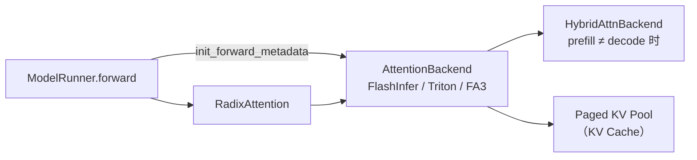

# Attention 后端

> **阶段 IV · 内存与 Attention** | 状态：已完成 | Git：`70df09b83363e0127b43c83a6007d3938f815b2d` 
> **源码范围：** `layers/attention/`、`layers/radix_attention.py`（backend 分发部分）

---

## 本模块在架构中的位置

Attention 后端是 **ModelRunner forward 与 GPU kernel** 之间的抽象层。Prefill（extend）与 decode 计算形态差异大，SGLang 允许 `--prefill-attention-backend` 与 `--decode-attention-backend` 分别指定；二者不同时包装为 `HybridAttnBackend`。每个 backend 实现 `AttentionBackend` 三阶段 metadata 契约（eager / out_graph / in_graph），以兼容 CUDA Graph capture/replay。RadixAttention 层在 QKV+RoPE 后调用 backend 读写 paged KV（RadixAttention/16 已分配的 slot）。



---

## 零基础一句话

**像「换轮胎的专家工坊」**：同一辆车（模型）在市区（prefill 大批量）和高速（decode 逐步）需要不同轮胎（kernel），Attention 后端就是按路况自动换胎的调度员。

---

## 用户场景

**Persona：** 内核工程师小周在 Hopper GPU 上调试 DeepSeek MLA，发现默认 FlashInfer 路径不满足需求，需要切换到 `trtllm_mla`。她需要理解 `init_forward_metadata_out_graph` 与 `in_graph` 的分工——哪些 host op 不能录进 CUDA Graph，以及 extend vs decode 两条算子路径的差异。

---

## 五件套阅读顺序

| 顺序 | 文件 | 一句话说明 |
|------|------|------------|
| 01 | [[17-Attention-01-核心概念]] | 后端分层、HybridAttnBackend、Extend vs Decode 语义 |
| 启动链路 | [[17-Attention-02-源码走读]] | FlashInfer/Triton 子类、metadata 三阶段、kernel launch |
| HTTP Server | [[17-Attention-03-数据流与交互]] | ForwardBatch → backend → paged KV 读写时序 |
| OpenAI API | [[17-Attention-04-关键问题]] | 后端选型、CUDA Graph lint 契约、MLA/DSA 特化路径 |
| ✓ | [[17-Attention-05-checkpoint]] | 验收：能否口述 extend 与 decode 的 kernel 差异 |

---

## 核心源码锚点

**Explain：** `AttentionBackend` 把 forward metadata 准备拆成 eager 入口、graph 外 host 逻辑、graph 内可录制 GPU op 三阶段。ModelRunner 每步 forward 前调用 `init_forward_metadata`；FlashInfer/Triton 子类在 extend/decode 路径上分别填充 paged KV 索引并 launch kernel。

**Code：**

```python
# 来源：python/sglang/srt/layers/attention/base_attn_backend.py L18-L87
class AttentionBackend(ABC):
    """The base class of attention backends.

    Forward-data init contract (3 methods):

      - ``init_forward_metadata(fb)`` — eager entry point. Default is a wrapper
        that calls ``_out_graph(fb)`` then ``_in_graph(fb)``. Backends may
        override to keep an independent eager body.
      - ``init_forward_metadata_out_graph(fb, in_capture=False)`` — per-iter
        metadata prep, runs outside ``with graph.capture():``. Capture
        sites pass ``in_capture=True``; replay/eager use the default
        ``False``. Backends read ``in_capture`` only when capture / replay
        bodies diverge.
      - ``init_forward_metadata_in_graph(fb)`` — graph-recordable static-shape
        GPU op, runs inside ``with graph.capture():`` at capture time and
        is auto-replayed by ``graph.replay()``. Default is no-op.

    The legacy ``init_forward_metadata_capture_cuda_graph`` and
    ``init_forward_metadata_replay_cuda_graph`` overrides are fully
    deprecated and removed from the ABC: out-of-tree backends overriding
    those must migrate to ``init_forward_metadata_out_graph(fb, in_capture)``.
    """

    # Resolved per-mode backend names, stamped by ModelRunner.init_attention_backend
    prefill_attention_backend_str: Optional[str] = None
    decode_attention_backend_str: Optional[str] = None

    def init_forward_metadata(self, forward_batch: ForwardBatch):
        """Eager entry point. Default = ``_out_graph(fb) + _in_graph(fb)``.

        Backends may override to keep an independent eager body.
        """
        self.init_forward_metadata_out_graph(forward_batch)
        self.init_forward_metadata_in_graph(forward_batch)

    def init_forward_metadata_out_graph(
        self,
        forward_batch: ForwardBatch,
        in_capture: bool = False,
    ):
        """Per-iter metadata prep — runs outside ``with graph.capture():``.

        Called at:
          * capture: before ``with graph.capture():`` (caller passes
            ``in_capture=True``).
          * replay: before ``graph.replay()`` (``in_capture=False``).
          * eager: via :py:meth:`init_forward_metadata` default wrapper
            (``in_capture=False``).

        Backends read ``in_capture`` only when capture / replay bodies
        diverge (e.g., snapshot metadata, swap buffer pointers, install
        temp workspace). Host op / dynamic-shape / non-graph-recordable
        logic lives here.

        Default: no-op.
        """

    def init_forward_metadata_in_graph(self, forward_batch: ForwardBatch):
        """Graph-recordable static-shape GPU op.

        Runs inside ``with graph.capture():`` at capture time; recorded
        ops auto-execute at replay via ``graph.replay()``.

        Lint contract for overrides: body must NOT call ``.item()`` /
        ``.cpu()`` / ``.tolist()`` / dynamic-shape ``torch.empty()``.
        Such ops belong in :py:meth:`init_forward_metadata_out_graph`; they
        cannot be recorded into a cuda graph.

        Default: no-op.
        """
```

**Comment：**

- `init_forward_metadata_out_graph`：host op、动态 shape、`.item()`/`.cpu()` 等不可录制逻辑。
- `init_forward_metadata_in_graph`：可录制进 CUDA Graph 的静态 GPU op，replay 时自动执行。
- `HybridAttnBackend` 在 `is_decode_or_idle()` 时走 decode 子 backend，extend 类 mode 走 prefill 子 backend。
- 旧版 `init_forward_metadata_capture_cuda_graph` 已废弃，out-of-tree backend 需迁移到新契约。

---

## 验证建议

1. **CLI：** `--prefill-attention-backend flashinfer --decode-attention-backend triton`，启动日志应出现 `Using hybrid attention backend`。
2. **日志：** 搜索 `attention backend` / `init_forward_metadata`；decode 阶段若启用 CUDA Graph，日志含 `cuda graph` capture/replay 相关信息。

---

## 阅读路径

← [[16-KV-Cache-00-MOC|KV Cache]] 
→ [[18-MoE-00-MOC|MoE 层]]
