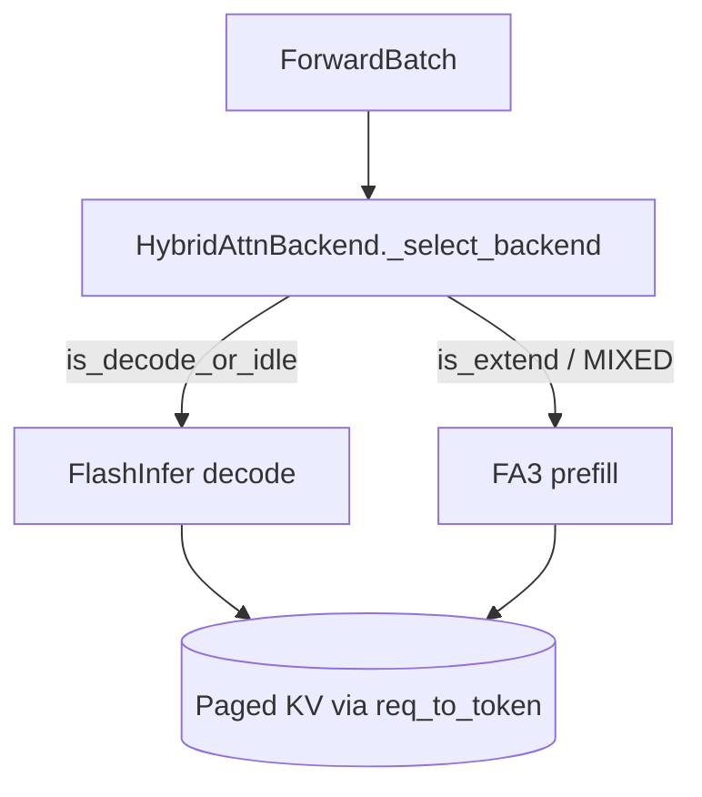
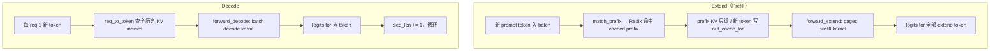

# Attention · 核心概念

## 用户故事：Hopper 上 Prefill 用 FA3、Decode 用 FlashInfer — Hybrid Attention 如何按 ForwardMode 切换

### Persona

**苏研**，内核选型工程师。在 H100 上跑 DeepSeek 类模型，发现 **extend 一步处理上千 query token**，**decode 每 req 仅 1 token**——单一 backend 难以两阶段都最优。她启用 `--prefill-attention-backend fa3 --decode-attention-backend flashinfer`，需要理解 HybridAttnBackend 如何在运行时切换。

### 时间线

| 时刻 | 事件 |
|------|------|
| T0 | ModelRunner `init_attention_backend`；prefill/decode 字符串不同 → 实例化 `HybridAttnBackend` |
| T1 | 新 prompt 进入；`ForwardMode.EXTEND` → `_select_backend` 走 prefill 子 backend（fa3 paged prefill） |
| T2 | Prefill 完成；后续 `ForwardMode.DECODE` → 切 decode 子 backend（FlashInfer batch decode） |
| T3 | Chunked prefill 出现 `MIXED`；`is_extend()` 仍为 true，继续 prefill kernel |
| T4 | CUDA Graph capture 仅对 `is_cuda_graph()` 模式；metadata 拆成 out_graph / in_graph |

### 涉及模块



**Explain：** Prefill 与 decode 计算形态差异大：extend 需 ragged/paged prefill kernel；decode 需 batch decode + CUDA Graph 友好路径。SGLang 允许 `--prefill-attention-backend` 与 `--decode-attention-backend` 分别指定；二者不同时 `ModelRunner._get_attention_backend` 包装 `HybridAttnBackend`，按 `ForwardMode` 运行时切换。AttentionBackend 三方法契约（`init_forward_metadata` / out_graph / in_graph）确保 eager 与 CUDA Graph 共用 metadata 生命周期。

**Code：**

```python
# 来源：python/sglang/srt/model_executor/model_runner.py L2486-L2505
# 提交版本：70df09b（节选）
        (
            self.prefill_attention_backend_str,
            self.decode_attention_backend_str,
        ) = self.server_args.get_attention_backends()

        if self.decode_attention_backend_str != self.prefill_attention_backend_str:
            from sglang.srt.layers.attention.hybrid_attn_backend import (
                HybridAttnBackend,
            )

            attn_backend = HybridAttnBackend(
                self,
                decode_backend=self._get_attention_backend_from_str(
                    self.decode_attention_backend_str,
                    init_new_workspace=init_new_workspace,
                ),
                prefill_backend=self._get_attention_backend_from_str(
                    self.prefill_attention_backend_str,
                    init_new_workspace=init_new_workspace,
                ),
```

**Comment：**

- FlashInfer 不可用时 `_get_default_attn_backend` 退回 `triton`；Triton `ForwardMetadata` 与 FlashInfer 参数同构。
- `TARGET_VERIFY`（EAGLE 投机）还受 `speculative_attention_mode` 影响选路。
- Radix prefix 命中后 extend 通过 `kv_indptr/kv_indices` 读 cached prefix + 写新 slot（衔接RadixAttention/16）。

### 如果…会怎样（调试）

| 现象 | 可能原因 | 排查 |
|------|----------|------|
| 只看到一个 backend 日志 | prefill/decode 字符串相同，未建 Hybrid | 对比 `get_attention_backends()` 返回值 |
| CUDA Graph capture 失败 | host sync（`.item()`）误入 in_graph | 见 `AttentionBackend` 契约注释 |
| extend 慢但 decode 正常 | prefill backend 选型不当 | A/B `--prefill-attention-backend triton` |

---

## 1. 后端分层

**Explain：** Prefill（extend）与 decode 的计算形态差异很大：extend 一次处理成百上千 query token、需 ragged/paged prefill kernel；decode 每步每 req 仅 1 token、需 batch decode + CUDA Graph 友好路径。SGLang 允许 `--prefill-attention-backend` 与 `--decode-attention-backend` 分别指定；当二者不同时，`ModelRunner._get_attention_backend` 包装 `HybridAttnBackend`，按 `ForwardMode` 在运行时切换 prefill/decode 子 backend。这与 vLLM 常见做法不同——vLLM 通常单一 attention backend 贯穿 prefill/decode，SGLang 把「阶段最优 kernel」与「混合实验」显式化。

**Code：**

```python
# 来源：python/sglang/srt/model_executor/model_runner.py L2486-L2520
        (
            self.prefill_attention_backend_str,
            self.decode_attention_backend_str,
        ) = self.server_args.get_attention_backends()

        if self.decode_attention_backend_str != self.prefill_attention_backend_str:
            from sglang.srt.layers.attention.hybrid_attn_backend import (
                HybridAttnBackend,
            )

            attn_backend = HybridAttnBackend(
                self,
                decode_backend=self._get_attention_backend_from_str(
                    self.decode_attention_backend_str,
                    init_new_workspace=init_new_workspace,
                ),
                prefill_backend=self._get_attention_backend_from_str(
                    self.prefill_attention_backend_str,
                    init_new_workspace=init_new_workspace,
                ),
            )
            logger.info(
                f"Using hybrid attention backend for decode and prefill: "
                f"decode_backend={self.decode_attention_backend_str}, "
                f"prefill_backend={self.prefill_attention_backend_str}."
            )
            logger.warning(
                "Warning: Attention backend specified by --attention-backend or default backend might be overridden."
                "The feature of hybrid attention backend is experimental and unstable. Please raise an issue if you encounter any problem."
            )
        else:
            attn_backend = self._get_attention_backend_from_str(
                self.server_args.attention_backend,
                init_new_workspace=init_new_workspace,
            )
```

**Comment：**
`HybridAttnBackend._select_backend` 在 `is_decode_or_idle()` 走 decode 子 backend，其余 extend 类 mode 走 prefill 子 backend；speculative `TARGET_VERIFY` 还受 `speculative_attention_mode` 影响。

| 后端 | 特点 | 何时选用 |
|------|------|----------|
| **flashinfer** | FlashInfer paged KV wrapper，extend/decode 双算子，NVIDIA 生产吞吐高 | 默认 MHA 路径：`is_flashinfer_available()` 且非 attention sinks；Hopper 以外多数 Ampere/Ada 场景 |
| **triton** | Python+Triton 自研 kernel，`ForwardMetadata` 可深度定制 | FlashInfer 不可用、需改 mask/新架构调试、或 `has_attention_sinks` 模型 |
| **trtllm_mla** | TensorRT-LLM MLA paged attention，DeepSeek 等 MLA 压缩 KV | MLA 架构 + SM100 Blackwell 默认；也可显式 `--attention-backend trtllm_mla` |
| **fa3 / trtllm_mha** | Hopper FA3 或 Blackwell TRT-LLM MHA，平台特化 | `_get_default_attn_backend` 按 GPU arch 自动选择，见 `server_args.py` |

**与 vLLM 的差异：** vLLM v1 通常一个 backend（如 FlashAttention / FlashInfer）同时服务 prefill 与 decode，block table 由 scheduler 维护。SGLang 额外暴露 prefill/decode 分裂配置，并通过 Radix prefix cache + `req_to_token` 两级 pool（KV Cache）把 prefix 复用与 kernel 选型解耦。

## 2. Extend vs Decode

**Explain：** Extend 像「批量读新书页」——一次 ingest 大量新 token（prompt 尾部或 chunked prefill），Radix 已缓存的前缀页只读 KV、不重算；Decode 像「逐字续写」——每步每 req 追加 1 token，attention 读该 req 全部历史 KV，写回新 slot。`ForwardMode` 枚举是 ModelRunner 与 Attention backend 选路的唯一语义开关。

**Code：**

```python
# 来源：python/sglang/srt/model_executor/forward_batch_info.py L78-L129
class ForwardMode(IntEnum):
    # Extend a sequence. The KV cache of the beginning part of the sequence is already computed (e.g., system prompt).
    # It is also called "prefill" in common terminology.
    EXTEND = auto()
    # Decode one token.
    DECODE = auto()
    # Contains both EXTEND and DECODE when doing chunked prefill.
    MIXED = auto()
    # No sequence to forward. For data parallel attention, some workers will be IDLE if no sequence are allocated.
    IDLE = auto()

    # Used in speculative decoding: verify a batch in the target model.
    TARGET_VERIFY = auto()
    # Used in speculative decoding: extend a batch in the draft model.
    DRAFT_EXTEND_V2 = auto()

    # Used in disaggregated decode worker
    # Represent a batch of requests having their KV cache ready to start decoding
    PREBUILT = auto()

    # Split Prefill for PD multiplexing
    SPLIT_PREFILL = auto()

    # Used in dLLM
    DLLM_EXTEND = auto()

    def is_prefill(self, include_draft_extend_v2: bool = False):
        return self.is_extend(include_draft_extend_v2=include_draft_extend_v2)

    def is_extend(self, include_draft_extend_v2: bool = False):
        return (
            self == ForwardMode.EXTEND
            or self == ForwardMode.MIXED
            or (include_draft_extend_v2 and self == ForwardMode.DRAFT_EXTEND_V2)
            or self == ForwardMode.TARGET_VERIFY
            or self == ForwardMode.SPLIT_PREFILL
            or self == ForwardMode.DLLM_EXTEND
        )

    def is_context_parallel_extend(self, include_draft_extend_v2: bool = False):
        return (
            self == ForwardMode.EXTEND
            or self == ForwardMode.MIXED
            or (
                self == ForwardMode.DRAFT_EXTEND_V2
                if include_draft_extend_v2
                else False
            )
        )

    def is_decode(self):
        return self == ForwardMode.DECODE
```

**Comment：**
`is_extend()` 覆盖 MIXED/SPLIT_PREFILL 等变体；调度器（Scheduler）决定 `ForwardBatch.forward_mode`，RadixAttention 再路由到 `forward_extend` 或 `forward_decode`。



Extend 与 Radix prefix cache（RadixAttention）的衔接：`match_prefix` 返回 `prefix_indices`，scheduler 将其写入 `req.prefix_indices`；extend 时 attention 通过 `kv_indptr/kv_indices` 读已缓存 prefix + 新写 KV，避免对 system prompt 重复 prefill。

## 3. AttentionBackend 契约

**Explain：** `ModelRunner.init_attention_backend` 根据 `server_args.attention_backend` 与 prefill/decode 模式实例化 FlashInfer、Triton 等实现，并把解析后的 backend 名字 stamp 到 `AttentionBackend.prefill_attention_backend_str` / `decode_attention_backend_str`。三方法契约确保 eager 与 CUDA Graph capture/replay 共用同一套 metadata 生命周期。

**Code：**

```python
# 来源：python/sglang/srt/layers/attention/base_attn_backend.py L18-L87
class AttentionBackend(ABC):
    """The base class of attention backends.

    Forward-data init contract (3 methods):

      - ``init_forward_metadata(fb)`` — eager entry point. Default is a wrapper
        that calls ``_out_graph(fb)`` then ``_in_graph(fb)``. Backends may
        override to keep an independent eager body.
      - ``init_forward_metadata_out_graph(fb, in_capture=False)`` — per-iter
        metadata prep, runs outside ``with graph.capture():``. Capture
        sites pass ``in_capture=True``; replay/eager use the default
        ``False``. Backends read ``in_capture`` only when capture / replay
        bodies diverge.
      - ``init_forward_metadata_in_graph(fb)`` — graph-recordable static-shape
        GPU op, runs inside ``with graph.capture():`` at capture time and
        is auto-replayed by ``graph.replay()``. Default is no-op.

    The legacy ``init_forward_metadata_capture_cuda_graph`` and
    ``init_forward_metadata_replay_cuda_graph`` overrides are fully
    deprecated and removed from the ABC: out-of-tree backends overriding
    those must migrate to ``init_forward_metadata_out_graph(fb, in_capture)``.
    """

    # Resolved per-mode backend names, stamped by ModelRunner.init_attention_backend
    prefill_attention_backend_str: Optional[str] = None
    decode_attention_backend_str: Optional[str] = None

    def init_forward_metadata(self, forward_batch: ForwardBatch):
        """Eager entry point. Default = ``_out_graph(fb) + _in_graph(fb)``.

        Backends may override to keep an independent eager body.
        """
        self.init_forward_metadata_out_graph(forward_batch)
        self.init_forward_metadata_in_graph(forward_batch)

    def init_forward_metadata_out_graph(
        self,
        forward_batch: ForwardBatch,
        in_capture: bool = False,
    ):
        """Per-iter metadata prep — runs outside ``with graph.capture():``.

        Called at:
          * capture: before ``with graph.capture():`` (caller passes
            ``in_capture=True``).
          * replay: before ``graph.replay()`` (``in_capture=False``).
          * eager: via :py:meth:`init_forward_metadata` default wrapper
            (``in_capture=False``).

        Backends read ``in_capture`` only when capture / replay bodies
        diverge (e.g., snapshot metadata, swap buffer pointers, install
        temp workspace). Host op / dynamic-shape / non-graph-recordable
        logic lives here.

        Default: no-op.
        """

    def init_forward_metadata_in_graph(self, forward_batch: ForwardBatch):
        """Graph-recordable static-shape GPU op.

        Runs inside ``with graph.capture():`` at capture time; recorded
        ops auto-execute at replay via ``graph.replay()``.

        Lint contract for overrides: body must NOT call ``.item()`` /
        ``.cpu()`` / ``.tolist()`` / dynamic-shape ``torch.empty()``.
        Such ops belong in :py:meth:`init_forward_metadata_out_graph`; they
        cannot be recorded into a cuda graph.

        Default: no-op.
        """
```

**Comment：**
CUDA Graph capture 时 out_graph 与 in_graph 分离，避免 .item() 破坏录制


## 4. ForwardMetadata（Triton）

**Explain：** Triton 后端在每次 forward 前把 paged KV 布局写入 `ForwardMetadata`：`kv_indptr`/`kv_indices` 来自 `ForwardBatch` 与 memory pool 的联合索引，`qo_indptr` 描述 query token 边界。该 dataclass 与 FlashInfer 的 `PrefillMetadata` 字段对齐，便于在 `--attention-backend` 切换时复用同一套 batch 字段。

**Code：**

```python
# 来源：python/sglang/srt/layers/attention/triton_backend.py L81-L100
@dataclass
class ForwardMetadata:
    attn_logits: torch.Tensor
    attn_lse: torch.Tensor
    max_extend_len: int
    num_kv_splits: torch.Tensor
    kv_indptr: torch.Tensor
    kv_indices: torch.Tensor
    qo_indptr: torch.Tensor
    custom_mask: torch.Tensor
    mask_indptr: torch.Tensor
    # Sliding window
    window_kv_indptr: torch.Tensor
    window_kv_indices: torch.Tensor
    window_num_kv_splits: torch.Tensor
    window_kv_offsets: torch.Tensor
    # Separate attn_logits for SWA layers when v_head_dim differs
    swa_attn_logits: Optional[torch.Tensor] = None
    # full->SWA translated out_cache_loc (SWA KV-store write target)
    swa_out_cache_loc: Optional[torch.Tensor] = None
```

**Comment：**
与 FlashInfer 的 wrapper 参数同构，便于切换


## 5. FlashInfer 模块说明

**Explain：** `flashinfer_backend.py` 文件头 docstring 概括 SGLang 当前双后端策略：FlashInfer 生产默认、Triton 便于定制 kernel。每个 backend 都实现 extend（带 cached prefix 的 prefill）与 decode 两套算子，与 `AttentionBackend.forward` 的路由一一对应。

**Code：**

```python
# 来源：python/sglang/srt/layers/attention/flashinfer_backend.py L5-L10
"""
Support different attention backends.
Now there are two backends: FlashInfer and Triton.
FlashInfer is faster and Triton is easier to customize.
Each backend supports two operators: extend (i.e. prefill with cached prefix) and decode.
"""
```

```python
# 来源：python/sglang/srt/layers/attention/flashinfer_backend.py L291-L292, L739-L761
class FlashInferAttnBackend(AttentionBackend):
    """Flashinfer attention kernels."""
```

**Comment：**
`is_flashinfer_available()` 控制是否走 FlashInfer 路径（L79 条件 import `flashinfer` wrapper）；不可用时 `ModelRunner._get_default_attn_backend` 退回 `triton`，Triton 后端复用同构 paged KV 元数据。

## 6. 设计追问

### Q1：何时应使用 Hybrid Attention Backend？

**答：** 当 prefill 与 decode 的最优 kernel 不同，例如 Hopper 上 extend 用 `fa3`、decode 用 `flashinfer`，或实验 `--prefill-attention-backend triton --decode-attention-backend flashinfer`。仅当 `get_attention_backends()` 返回的两个字符串**不相等**时才实例化 `HybridAttnBackend`；相等则单一 backend 贯穿两阶段。注意日志警告：该特性仍标记为 experimental。

### Q2：为何 CUDA Graph 要把 metadata 拆成 out_graph / in_graph？

**答：** CUDA Graph 只能录制静态 shape 的 GPU op；`.item()`、`.cpu()`、动态 `torch.empty()` 等 host sync 一旦进入 capture 段会导致录制失败或 replay 语义错误。`init_forward_metadata_out_graph` 在 graph 外更新指针、填 indptr；`init_forward_metadata_in_graph` 只放可录制的 GPU kernel launch。Replay 时 out_graph 以 `in_capture=False` 刷新 buffer 地址，再 `graph.replay()` 自动重放 in_graph 段。

### Q3：FlashInfer 不可用时的 fallback 路径？

**答：** `is_flashinfer_available()` 检查 `flashinfer` 包是否存在且为 CUDA（可用 `SGLANG_IS_FLASHINFER_AVAILABLE=false` 强制关闭）。MHA 默认选型在 `_get_default_attn_backend` 中：`flashinfer` 不可用时退回 `triton`；MLA 在 Blackwell 外多数也退回 `triton`。Sampling backend 同理：`flashinfer` 不可用则用 `pytorch`。Triton backend 通过 `create_flashinfer_kv_indices_triton` 复刻 paged 索引布局，保证与 FlashInfer wrapper 参数同构。

