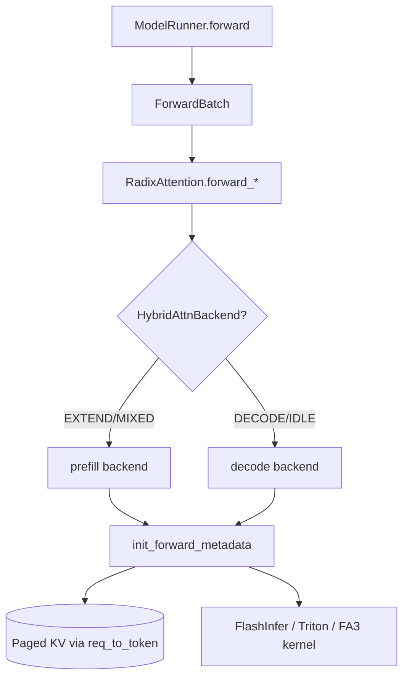

# Attention：数据流与交互

> 本模块聚焦 **Attention 子系统独有** 的数据流：Hybrid 选路、Extend/Decode metadata、CUDA Graph 契约。 
> ZMQ / Scheduler 通用 IPC 见 [[07-Scheduler-03-数据流与交互|Scheduler]]；KV 索引构建见 [[16-KV-Cache-03-数据流与交互|KV Cache]]。

---

## 1. 架构位置

**Explain：** 每个 Transformer 层的 `RadixAttention` 不直接调 kernel，而是委托 `AttentionBackend`：先按 `ForwardMode` 准备 metadata（`kv_indptr/kv_indices` 等），再调用 `forward_extend` 或 `forward_decode`。当 prefill/decode 配置不同时，`HybridAttnBackend` 在运行时切换子 backend。



| 上游 | 本模块输入 | 下游 |
|------|----------|------|
| [[11-ModelRunner-00-MOC|ModelRunner ModelRunner]] | `ForwardBatch`（mode、seq_lens、req_pool_indices） | logits |
| [[16-KV-Cache-00-MOC|KV Cache KV-Cache]] | `out_cache_loc`、`req_to_token` 映射 | KV 读写 |
| [[15-RadixAttention-00-MOC|RadixAttention RadixAttention]] | prefix 命中后的 cached indices | extend 只算新 token |

---

## 2. Hybrid 选路时序（本模块核心）

**Explain：** 苏研（见 [[17-Attention-01-核心概念|01-核心概念]]）配置 `--prefill-attention-backend fa3 --decode-attention-backend flashinfer` 后，`ModelRunner._get_attention_backend` 构造 `HybridAttnBackend`。每一步 forward 前，metadata 与 kernel 调用都经 `_select_backend(forward_mode)` 分发：`is_decode_or_idle()` 走 decode 子 backend；`TARGET_VERIFY`（EAGLE 投机）还受 `speculative_attention_mode` 影响。

**Code：**

```python
# 来源：python/sglang/srt/layers/attention/hybrid_attn_backend.py L28-L64
    def _select_backend(self, forward_mode: ForwardMode) -> AttentionBackend:
        """
        Select the appropriate attention backend based on the forward mode.

        Args:
            forward_mode: The current forward mode indicating the operation type

        Returns:
            The selected attention backend (prefill or decode)

        Note:
            - decode_or_idle: Always uses decode backend
            - target_verify: Uses decode backend if speculative_attention_mode is "decode", otherwise prefill backend
            - prefill: Always uses prefill backend
        """
        if forward_mode.is_decode_or_idle():
            return self.decode_backend
        elif forward_mode.is_target_verify():
            return (
                self.decode_backend
                if self.model_runner.server_args.speculative_attention_mode == "decode"
                else self.prefill_backend
            )
        else:
            return self.prefill_backend

    def init_forward_metadata_out_graph(
        self,
        forward_batch: ForwardBatch,
        in_capture: bool = False,
    ):
        backend = self._select_backend(forward_batch.forward_mode)
        backend.init_forward_metadata_out_graph(forward_batch, in_capture=in_capture)

    def init_forward_metadata(self, forward_batch: ForwardBatch):
        backend = self._select_backend(forward_batch.forward_mode)
        backend.init_forward_metadata(forward_batch)
```

**Comment：**

- `init_forward_metadata` / `init_forward_metadata_out_graph` **都**先选 backend，保证 eager 与 CUDA Graph replay 路径一致。
- CUDA Graph state 主要由 **decode 子 backend** 初始化；投机 verify 若走 prefill backend 还需额外 `init_cuda_graph_state`。
- CLI 解析：`ServerArgs.get_attention_backends()` 分别返回 prefill/decode 字符串；未单独指定时二者均回落到 `--attention-backend`。

**Code：**

```python
# 来源：python/sglang/srt/server_args.py L6922-L6933
    def get_attention_backends(self):
        prefill_attention_backend_str = (
            self.prefill_attention_backend
            if self.prefill_attention_backend
            else self.attention_backend
        )
        decode_attention_backend_str = (
            self.decode_attention_backend
            if self.decode_attention_backend
            else self.attention_backend
        )
        return prefill_attention_backend_str, decode_attention_backend_str
```

**Comment：** 两字符串相同时不建 Hybrid，直接 `_get_attention_backend_from_str(attention_backend)`。

---

## 3. Extend（Prefill）数据流 — 六步

**Explain：** Extend 阶段一次处理**多个新 query token**（含 chunked prefill 的 MIXED 模式）。Radix prefix 命中的 token **只读 KV、不重算 QK**；新 token 写入 `out_cache_loc` 指向的 paged slot。Triton 路径用 `ForwardMetadata` 携带索引；FlashInfer 路径在 `init_forward_metadata` 内填充 wrapper 参数。

| 步骤 | 动作 | 关键字段 |
|:----:|------|----------|
| 1 | Scheduler 组 `ScheduleBatch` → `ModelRunner` 建 `ForwardBatch` | `forward_mode=EXTEND` 或 `MIXED` |
| 2 | Hybrid 选 prefill 子 backend | `_select_backend` → prefill |
| 3 | `init_forward_metadata(fb)` | 由 `req_to_token` 压成 `kv_indptr/kv_indices` |
| 4 | 各层 `RadixAttention.forward_extend` | Q/K/V + `save_kv_cache=True` |
| 5 | Backend `forward_extend` 调 kernel | ragged/paged prefill |
| 6 | 输出 hidden → 下一层 / lm_head | prefix 命中段跳过 QK 重算 |

**Code：**

```python
# 来源：python/sglang/srt/layers/radix_attention.py L105-L116（节选）
        self.pos_encoding_mode = pos_encoding_mode
        self.logit_capping_method = logit_capping_method
        self.xai_temperature_len = -1

    def forward(
        self,
        q,
        k,
        v,
        forward_batch: ForwardBatch,
        save_kv_cache: bool = True,
        **kwargs,
```

**Code：**

```python
# 来源：python/sglang/srt/layers/attention/triton_backend.py L81-L100
@dataclass
class ForwardMetadata:
    attn_logits: torch.Tensor
    attn_lse: torch.Tensor
    max_extend_len: int
    num_kv_splits: torch.Tensor
    kv_indptr: torch.Tensor
    kv_indices: torch.Tensor
    qo_indptr: torch.Tensor
    custom_mask: torch.Tensor
    mask_indptr: torch.Tensor
    # Sliding window
    window_kv_indptr: torch.Tensor
    window_kv_indices: torch.Tensor
    window_num_kv_splits: torch.Tensor
    window_kv_offsets: torch.Tensor
    # Separate attn_logits for SWA layers when v_head_dim differs
    swa_attn_logits: Optional[torch.Tensor] = None
    # full->SWA translated out_cache_loc (SWA KV-store write target)
    swa_out_cache_loc: Optional[torch.Tensor] = None
```

**Comment：**

- `kv_indptr/kv_indices`：逻辑 token 位置 → paged 物理块，与 vLLM block table 语义等价。
- Sliding window 层额外 `window_*` 字段；SWA 与 full-attn 可共存于同一 batch。
- 长 prompt + prefix 命中：extend 只对新 token 段做 attention，cached 段经 indices 只读 KV。

---

## 4. Decode 数据流 — 五步

**Explain：** Decode 每 req 每步 **仅 1 个新 query token**（`input_ids` 长度 = batch_size）。KV 已在 prefill 写入；本步 attention 读全历史 KV 并写本步 K/V 到 `out_cache_loc`。FlashInfer 用 `BatchDecodeWithPagedKVCacheWrapper`；Triton 走 decode kernel。CUDA Graph 对 decode 收益最大——metadata 指针在 replay 前于 out_graph 阶段更新。

| 步骤 | 动作 |
|:----:|------|
| 1 | `ForwardMode.DECODE`；Hybrid 选 decode 子 backend |
| 2 | `init_forward_metadata_out_graph(fb, in_capture=False)` 更新 indptr/indices 指针 |
| 3 | `RadixAttention.forward_decode` → `attn_backend.forward_decode` |
| 4 | 若启用 CUDA Graph：`graph.replay()`（in_graph 段自动重放） |
| 5 | 输出 → sampling → 下一 token |

**Code：**

```python
# 来源：python/sglang/srt/layers/radix_attention.py L118-L135
        if k is not None:
            # For cross-layer sharing, kv can be None
            assert v is not None
            if "k_rope" not in kwargs:
                k = k.view(-1, self.tp_k_head_num, self.qk_head_dim)
                v = v.view(-1, self.tp_v_head_num, self.v_head_dim)
            else:
                k = k.view(-1, self.tp_k_head_num, self.v_head_dim)

        if (
            forward_batch.forward_mode.is_extend()
            and get_tc_piecewise_forward_context() is not None
        ):
            if self.qk_head_dim != self.v_head_dim:
                output = q.new_empty((q.shape[0], self.tp_q_head_num * self.v_head_dim))
            else:
                output = torch.empty_like(q)
            if is_in_breakable_cuda_graph():
```

**Comment：**

- Extend 与 Decode 调用**不同** backend 方法；metadata 布局也不同，不可混用。
- `save_kv_cache=True` 时本步 K/V 写入 `out_cache_loc`；投机 draft 路径可能 `save_kv_cache=False`。

---

## 5. CUDA Graph 三阶段契约

**Explain：** `AttentionBackend` 把 metadata 准备拆成 **graph 外**（可 host sync）与 **graph 内**（可录制静态 GPU op）两段。Capture：`out_graph(fb, in_capture=True)` → `with graph.capture(): in_graph(fb)`。Replay：`out_graph(fb, in_capture=False)` 更新指针 → `graph.replay()`。**禁止**在 `init_forward_metadata_in_graph` 内调用 `.item()` / `.cpu()` / 动态 shape `torch.empty()`。

**Code：**

```python
# 来源：python/sglang/srt/layers/attention/base_attn_backend.py L45-L51
    def init_forward_metadata(self, forward_batch: ForwardBatch):
        """Eager entry point. Default = ``_out_graph(fb) + _in_graph(fb)``.

        Backends may override to keep an independent eager body.
        """
        self.init_forward_metadata_out_graph(forward_batch)
        self.init_forward_metadata_in_graph(forward_batch)
```

**Comment：**

- Eager 推理仍走同一契约；子类可 override 整个 `init_forward_metadata`。
- Graph capture 失败常见根因：host sync 误入 in_graph；见 [[17-Attention-04-关键问题|04-关键问题]] Q3。
- Hybrid 下 graph 状态以 decode 子 backend 为主；见 `HybridAttnBackend.init_cuda_graph_state`。

---

## 6. 与相邻专题的边界

| 问题 | 本模块回答 | 见其他批 |
|------|----------|----------|
| token → KV 物理地址谁分配？ | backend 消费 `req_to_token` 压 indices | [[16-KV-Cache-00-MOC]] |
| prefix 谁匹配、谁 insert？ | extend 读 cached indices | [[15-RadixAttention-00-MOC]] |
| ForwardBatch 谁构造？ | 字段含义 | [[09-ScheduleBatch-IO-00-MOC]] |
| 选哪个 backend 字符串？ | Hybrid / 默认检测 | 本模块 [[17-Attention-01-核心概念|01]]、[[17-Attention-04-关键问题|04]] |
