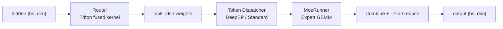

# MoE 层

> **阶段 IV · 内存与 Attention** | 状态：已完成 | Git：`70df09b83363e0127b43c83a6007d3938f815b2d` 
> **源码范围：** `layers/moe/`（router、dispatcher、fused_moe_triton、EPLB）

---

## 本模块在架构中的位置

MoE 层是稀疏模型的 **路由 → 分发 → 计算 → 合并** 流水线。每个 token 的 hidden state 经 Router 选出 top-k 专家，Token Dispatcher 按 expert parallel 配置做 all-to-all permute，MoeRunner 在本地 expert 权重上跑 batched GEMM，最后 Combine 加权求和并 unpermute。量化（Quantization）通过 `quant_method` 注入 FP8/GPTQ 等 GEMM；EPLB 在运行时迁移 expert 权重以平衡负载。DeepSeek 等专用模型（Models 专用）的 `DeepseekV2MoE` 是本模块的主要消费者。



---

## 零基础一句话

**像「专科门诊分诊台」**：每位患者（token）被分到最合适的几位专家（top-k experts），各科室分别诊疗后，前台按权重汇总处方（combine）。

---

## 用户场景

**Persona：** 性能工程师老陈部署 Mixtral-8×7B，发现 EP（Expert Parallel）下 all-to-all 成为瓶颈。他需要理解 Router Triton kernel 如何融合 gate+topk、DeepEP dispatcher 与 Standard dispatcher 的通信差异，以及 `--moe-dense-tp-size` 对内存占用的影响。

---

## 五件套阅读顺序

| 顺序 | 文件 | 一句话说明 |
|------|------|------------|
| 01 | [[18-MoE-01-核心概念]] | 五阶段流水线、Router/TopK/Dispatcher/GEMM/Combine 资源特征 |
| 启动链路 | [[18-MoE-02-源码走读]] | `FusedMoE.forward_impl`、DeepEP、EPLB 权重迁移精读 |
| HTTP Server | [[18-MoE-03-数据流与交互]] | MoE 层与 TP/EP group、量化 method 的交互边界 |
| OpenAI API | [[18-MoE-04-关键问题]] | topk 选型、通信 bound 优化、与 DeepSeek 专用层衔接 |
| ✓ | [[18-MoE-05-checkpoint]] | 验收：能否画出 dispatch → GEMM → combine 数据流 |

---

## 核心源码锚点

**Explain：** `fused_moe_router_cudacore_kernel` 为每个 token 加载 hidden 与 gate 权重，逐 expert 算 dot product 得 logits；可选 moe_softcapping 与 correction_bias。topk 在 kernel 内完成，避免 materialize 完整 `[bs, num_experts]` logits 回写 HBM，输出 `topk_ids` 与 `topk_weights` 供 dispatch 使用。

**Code：**

```python
# 来源：python/sglang/srt/layers/moe/router.py L13-L76
@triton.jit
def fused_moe_router_cudacore_kernel(
    input_ptr,  # input (bs, hidden_dim)
    moe_router_weight_ptr,  # input (num_experts, hidden_dim)
    topk_weights_ptr,  # output (bs, topk)
    topk_ids_ptr,  # output (bs, topk)
    correction_bias_ptr,
    is_correction_bias: tl.constexpr,
    num_experts: tl.constexpr,
    topk: tl.constexpr,
    moe_softcapping: tl.constexpr,
    moe_renormalize: tl.constexpr,  # not supported
    hidden_dim: tl.constexpr,
    BLOCK_SIZE: tl.constexpr,
):
    pid = tl.program_id(axis=0)

    offsets = tl.arange(0, BLOCK_SIZE)
    mask = offsets < hidden_dim

    # moe_router_weight is k major
    expert_offsets = tl.arange(0, num_experts)[:, None]
    router_mask = mask[None, :]
    w_router = tl.load(
        moe_router_weight_ptr + expert_offsets * hidden_dim + offsets[None, :],
        mask=router_mask,
        other=0.0,
    )

    x = tl.load(input_ptr + pid * hidden_dim + offsets, mask=mask, other=0.0)

    # todo: tl.dot?
    logits = tl.sum((w_router.to(tl.float32) * x[None, :].to(tl.float32)), axis=-1)

    # logit softcap
    if moe_softcapping == 0:
        logits_softcapped = logits
    else:
        logits_scaled = logits / moe_softcapping
        exped = tl.exp(2 * logits_scaled)
        top = exped - 1
        bottom = exped + 1
        logits_softcapped = top / bottom * moe_softcapping

    # Add bias after softcapping
    if is_correction_bias:
        bias = tl.load(correction_bias_ptr + tl.arange(0, num_experts))
        logits_softcapped = logits_softcapped + bias

    # topk
    # assert 1 <= topk <= num_experts

    # 5.38 us

    top1 = tl.argmax(logits_softcapped, axis=0)
    tl.store(topk_ids_ptr + pid * topk + 0, top1)  # 5.63 us

    top1_v = tl.max(logits_softcapped, axis=0)
    invsumexp = 1.0 / tl.sum(tl.exp(logits_softcapped - top1_v), axis=0)

    tl.store(
        topk_weights_ptr + pid * topk + 0,
        invsumexp,
    )  # 5.73 us
```

**Comment：**

- `moe_softcapping=0` 跳过 softcap；非零时使用 tanh 变体压缩 logits 动态范围。
- `correction_bias` 用于 load balancing 辅助（如 DeepSeek 的 expert bias）。
- topk=1 时直接 argmax + invsumexp；topk≥2 需 mask 已选 expert 再 argmax 后续专家。
- 输出 `topk_ids`/`topk_weights` 传入 `FusedMoE.dispatcher.dispatch` 做 token permute。

---

## 验证建议

1. **CLI：** 启动 MoE 模型时加 `--enable-expert-parallel`，日志应显示 EP rank 与 local expert 数量。
2. **日志/指标：** 搜索 `moe` / `expert`；EPLB 启用时可见 expert 迁移相关日志；吞吐对比 EP on/off 的 tokens/s。

---

## 阅读路径

← [[17-Attention-00-MOC|Attention]] 
→ [[19-Quantization-00-MOC|Quantization：量化]]
