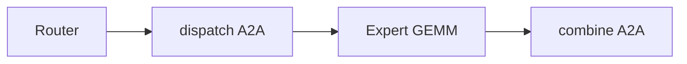
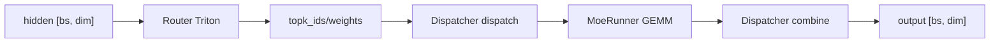

# MoE · 核心概念

## 用户故事：Mixtral 上线后 all-to-all 打满 — MoE 五阶段哪里最慢？

### Persona

**老陈**，部署 Mixtral-8×7B 的推理工程师。单卡 decode 正常，开 EP（Expert Parallel）后 NVLink 带宽长期 90%+，吞吐反而下降。他需要分清 Router、Dispatch、GEMM、Combine 哪一段是瓶颈。

### 时间线

| 时刻 | 事件 |
|------|------|
| T0 | 一批 128 token 进入 MoE 层，Router Triton kernel 输出 topk_ids |
| T0+0.5ms | DeepEP dispatcher 发起 all-to-all，token 按 expert 所在 rank permute |
| T0+3ms | 各 rank 本地 MoeRunner 跑 expert GEMM（compute-bound） |
| T0+6ms | combine 再 all-to-all；Profiler 显示 dispatch+combine 占 55% |
| T1 | 开启 EPLB 后 expert 权重迁移，dispatch 字节量下降 20% |

### 涉及模块



**Explain：** MoE 像**专科分诊**：每个 token 选 top-k 专家，EP 下专家分布在多卡，dispatch/combine 是「把病人送到对应科室再汇总处方」——通信往往比 Router 本身更贵。

**Code：**

```python
# 来源：python/sglang/srt/layers/moe/router.py L13-L20
@triton.jit
def fused_moe_router_cudacore_kernel(
    input_ptr,  # input (bs, hidden_dim)
    moe_router_weight_ptr,  # input (num_experts, hidden_dim)
    topk_weights_ptr,  # output (bs, topk)
    topk_ids_ptr,  # output (bs, topk)
    correction_bias_ptr,
    is_correction_bias: tl.constexpr,
```

**Comment：**

- Router 是轻量 GEMV；瓶颈常在 EP 的 all-to-all，而非 topk 本身。
- `--moe-dense-tp-size` 与 DeepEP vs Standard dispatcher 决定通信路径。

### 如果…会怎样（调试）

| 现象 | 可能原因 | 排查 |
|------|----------|------|
| EP 开比关还慢 | 小 batch + 高 RTT all-to-all | 对比 Standard dispatcher、增大 batch |
| 某 expert OOM | 负载极度倾斜 | 看 EPLB / correction_bias |
| Router 耗时长 | hidden_dim 极大或 num_experts 上千 | nsys 区分 Router vs GEMM |

---

## 1. MoE 流水线（五阶段资源特征）

MoE 层在单个 forward 中依次经历五个阶段，每阶段的计算/通信/内存特征不同：

**Router（路由）** 在每个 token 的 hidden state 上与 gate 权重做点积，产出 `[num_experts]` 维 logits 并 top-k 选取专家。此阶段是 **compute-bound 的轻量 GEMV**，每个 token 独立、无跨 rank 通信；Triton kernel `fused_moe_router_cudacore_kernel` 将 gate+topk 融合在单 kernel 内完成，输出 `topk_ids` 与 `topk_weights`。

**TopK 归一化** 对选中专家的 logits 做 softmax 归一化（或 sm_first 模式先 softmax 再 topk），产出 routing 权重。此阶段 **纯 GPU 寄存器操作**，topk=1 时权重为 invsumexp；topk≥2 时 mask 已选 expert 再 argmax 第二专家。

**Token Dispatcher（A2A dispatch）** 按 topk_ids 将 token 重排到各 expert 所在 rank。Expert Parallel 场景下这是 **通信-bound 阶段**：DeepEP 走 NVLink/RDMA all-to-all，Standard dispatcher 本地 permute。dispatch 输出 `DispatchOutput`，含 permuted hidden states 与 expert 分组元数据。

**MoeRunner（Expert GEMM）** 各 rank 对本地 expert 权重做 batched GEMM。此阶段 **compute-bound**，Triton fused_moe kernel 或 DeepGEMM/FlashInfer 按量化格式选择；EP 下每个 rank 只算部分 expert，内存占用与 `num_local_experts` 成正比。

**Combine（A2A combine）** 将各 expert 输出按 routing 权重加权求和并 unpermute 回原 token 顺序。与 dispatch 对称，**通信-bound**；完成后若 `moe_tp_size>1` 还需 TP all-reduce。最终 hidden states 维度与输入一致。



## 2. Router

**Explain：** `fused_moe_router_cudacore_kernel` 为每个 token（program_id=pid）加载 hidden 与 gate 权重，逐 expert 算 dot product 得 logits；可选 moe_softcapping（tanh 变体）和 correction_bias 修正负载。topk 在 kernel 内完成，避免 materialize 完整 `[bs, num_experts]` logits 张量回写 HBM。

**Code：**

```python
# 来源：python/sglang/srt/layers/moe/router.py L13-L76
@triton.jit
def fused_moe_router_cudacore_kernel(
    input_ptr,  # input (bs, hidden_dim)
    moe_router_weight_ptr,  # input (num_experts, hidden_dim)
    topk_weights_ptr,  # output (bs, topk)
    topk_ids_ptr,  # output (bs, topk)
    correction_bias_ptr,
    is_correction_bias: tl.constexpr,
    num_experts: tl.constexpr,
    topk: tl.constexpr,
    moe_softcapping: tl.constexpr,
    moe_renormalize: tl.constexpr,  # not supported
    hidden_dim: tl.constexpr,
    BLOCK_SIZE: tl.constexpr,
):
    pid = tl.program_id(axis=0)

    offsets = tl.arange(0, BLOCK_SIZE)
    mask = offsets < hidden_dim

    # moe_router_weight is k major
    expert_offsets = tl.arange(0, num_experts)[:, None]
    router_mask = mask[None, :]
    w_router = tl.load(
        moe_router_weight_ptr + expert_offsets * hidden_dim + offsets[None, :],
        mask=router_mask,
        other=0.0,
    )

    x = tl.load(input_ptr + pid * hidden_dim + offsets, mask=mask, other=0.0)

    # todo: tl.dot?
    logits = tl.sum((w_router.to(tl.float32) * x[None, :].to(tl.float32)), axis=-1)

    # logit softcap
    if moe_softcapping == 0:
        logits_softcapped = logits
    else:
        logits_scaled = logits / moe_softcapping
        exped = tl.exp(2 * logits_scaled)
        top = exped - 1
        bottom = exped + 1
        logits_softcapped = top / bottom * moe_softcapping

    # Add bias after softcapping
    if is_correction_bias:
        bias = tl.load(correction_bias_ptr + tl.arange(0, num_experts))
        logits_softcapped = logits_softcapped + bias

    # topk
    # assert 1 <= topk <= num_experts

    # 5.38 us

    top1 = tl.argmax(logits_softcapped, axis=0)
    tl.store(topk_ids_ptr + pid * topk + 0, top1)  # 5.63 us

    top1_v = tl.max(logits_softcapped, axis=0)
    invsumexp = 1.0 / tl.sum(tl.exp(logits_softcapped - top1_v), axis=0)

    tl.store(
        topk_weights_ptr + pid * topk + 0,
        invsumexp,
    )  # 5.73 us
```

**Comment：**
- `moe_softcapping=0` 跳过 softcap
- correction_bias 用于 load balancing 辅助（如 DeepSeek）

## 3. FusedMoE.forward_impl — dispatch → GEMM → combine

**Explain：** `FusedMoE` 是 MoE 层的统一入口；`forward_impl` 严格按 dispatch → `run_moe_core` → combine 三调用组织。`quant_method`（Quantization）注入量化 GEMM；`reduce_results` 控制 TP/EP all-reduce。Piecewise CUDA Graph 模式下走专用 capture 路径。

**Code：**

```python
# 来源：python/sglang/srt/layers/moe/fused_moe_triton/layer.py L1134-L1159
    def forward_impl(self, hidden_states: torch.Tensor, topk_output: TopKOutput):
        origin_hidden_states_dim = hidden_states.shape[-1]
        assert self.quant_method is not None

        dispatch_output = self.dispatcher.dispatch(
            hidden_states=hidden_states, topk_output=topk_output
        )

        combine_input = self.run_moe_core(
            dispatch_output=dispatch_output,
        )

        with use_symmetric_memory(
            get_tp_group(), disabled=not is_allocation_symmetric()
        ):
            final_hidden_states = self.dispatcher.combine(combine_input=combine_input)

            # TODO: should we add some conditions here?
            final_hidden_states = final_hidden_states[
                ..., :origin_hidden_states_dim
            ].contiguous()

        if self.reduce_results and (self.moe_tp_size > 1 or self.moe_ep_size > 1):
            final_hidden_states = tensor_model_parallel_all_reduce(final_hidden_states)

        return final_hidden_states
```

## 4. Token Dispatcher 抽象

**Explain：** `BaseDispatcher` 定义 dispatch/combine 接口与 hook 机制；Standard 本地 permute、DeepEP NVLink A2A、FlashInfer 等实现共享同一协议。`_PreDispatchHooks` 允许 EPLB 在 dispatch 前改写 topk_ids（logical→physical 映射）。

**Code：**

```python
# 来源：python/sglang/srt/layers/moe/token_dispatcher/base.py L229-L241
    def format_is_flashinfer(
        combine_input: CombineInput,
    ) -> TypeGuard[FlashinferCombineInput]:
        return combine_input.format == CombineInputFormat.FLASHINFER


class CombineInputFormat(Enum):
    STANDARD = "standard"
    DEEPEP_NORMAL = "deepep_normal"
    DEEPEP_LL = "deepep_ll"
    FLASHINFER = "flashinfer"


```

## 5. EPLB — Expert Parallel Load Balancer

**Explain：** 大规模 EP 部署中 expert 负载不均会导致 straggler rank；EPLB 周期性根据 `expert_distribution_recorder` 统计的 token 计数，调用 `rebalance()` 重排 logical expert 到 physical rank 的映射。`ExpertLocationDispatchInfo` 在 dispatch 前将 topk_ids 从 logical 转为 physical id。

**Code：**

```python
# 来源：python/sglang/srt/eplb/eplb_manager.py L161-L198
class EPLBManager:
 def __init__(self, model_runner: "ModelRunner"):
 self._rebalance_num_iterations = self._server_args.eplb_rebalance_num_iterations
 get_global_expert_distribution_recorder().start_record()
 self._main_generator = self._entrypoint()

 def _entrypoint(self):
 while True:
 for _ in range(self._rebalance_num_iterations):
 yield
 yield from self.rebalance()
```

**Comment：**
- `eplb_rebalance_num_iterations` 必须 ≥ recorder buffer size
- rebalance 期间可能短暂影响吞吐

## 6. MoeA2ABackend 选择

**Explain：** `MoeA2ABackend` 枚举所有 A2A 通信后端（DeepEP/Mooncake/NIXL/FlashInfer 等）；由 server_args 与硬件能力共同决定。`NONE` 表示纯本地 permute，适用于无 EP 或小规模部署。

**Code：**

```python
# 来源：python/sglang/srt/layers/moe/utils.py L539-L561
# Unit of padding - context dependent
def get_moe_padding_size(is_aiter_moe):
    if is_aiter_moe:
        return AITER_PADDING_SIZE
    else:
        return (
            TRITON_PADDING_SIZE
            if bool(int(os.getenv("SGLANG_MOE_PADDING", "0")))
            else 0
        )


def get_moe_weight_sizes(inter_dim, is_concat, is_packed, is_aiter_moe):
    """
    Calculate dimensions for MoE weight tensors.

    Args:
        inter_dim: Base intermediate dimension.
        is_concat: If True, fusions W1 (gate) and W3 (up) projections.
        is_packed: If True, uses 4-bit quantization (two FP4 elements per byte).
        is_aiter_moe: If True, applies Aiter-specific kernel padding alignment.
    """
    # w2_down_dim is the packing rank, but w13_up_dim not (of matrix to matmul)
```
