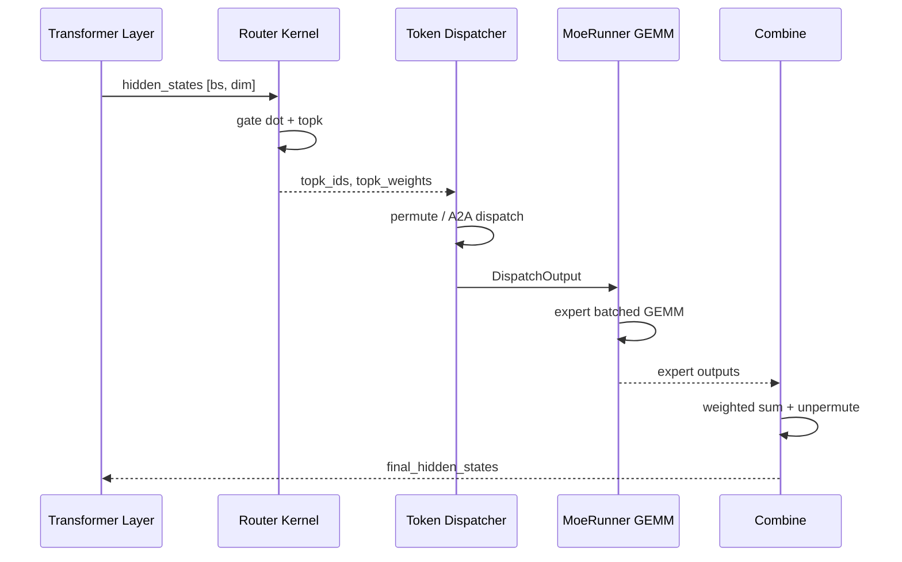

# MoE：数据流与交互

## 1. 输入 / 输出

| 方向 | 类型 | 说明 | 源码 |
|------|------|------|------|
| 输入 | `hidden_states [bs, hidden_dim]` | 上一层 MLP/Attention 输出 | FusedMoE.forward |
| 输入 | `TopKOutput` | topk_ids + topk_weights + router_logits | Router / topk.py |
| 输出 | `final_hidden_states [bs, hidden_dim]` | combine 后加权 expert 输出 | forward_impl |
| 中间 | `DispatchOutput` | permuted tokens + expert 元数据 | dispatcher.dispatch |

## 2. 上下游

| 模块 | 关系 | 说明 |
|------|------|------|
| Transformer Layer | 上游 | MoE 替换 dense FFN |
| Quantization | 注入 | quant_method 决定 GEMM kernel |
| Distributed | 协同 | EP/TP group 通信 |
| EPLB | 运行时 | 周期性 rebalance expert 位置 |

## 3. MoE 层完整时序

**Explain：** 单 token 在 MoE 层内经历 router→dispatch→GEMM→combine 四步；EP 场景 dispatch/combine 含跨 rank A2A，是主要延迟来源。



## 4. Router → Dispatch 数据流

**Explain：** Router 输出 topk_ids `[bs, topk]` 与 topk_weights `[bs, topk]`；Dispatcher 按 ids 将 hidden states 复制 topk 份并 permute 到 expert 分组布局。EPLB hook 可能在 dispatch 前改写 ids。

**Code：**

```python
# 来源：python/sglang/srt/layers/moe/router.py L401-L418
    def forward(
        self, x: torch.Tensor, residual: torch.Tensor
    ) -> Tuple[torch.Tensor, torch.Tensor]:
        if x.is_cuda:
            return self.forward_cuda(x, residual)
        else:
            return self.forward_vllm(x, residual)

    def forward_cuda(
        self, x: torch.Tensor, autotune=False
    ) -> Tuple[torch.Tensor, torch.Tensor]:
        return fused_moe_router_shim(
            moe_softcapping=self.moe_softcapping,
            hidden_states=x,
            gating_output=self.router_linear.weight,
            topk=self.topk,
            renormalize=False,
        )
```

**Comment：**
- `router_linear.weight` shape `[num_experts, hidden_dim]`
- renormalize=False 时权重已在 kernel 内归一化

## 5. Dispatch → GEMM → Combine

**Explain：** `run_moe_core` 内部调用 MoeRunner，按 expert 分组做 batched GEMM；combine 用 topk_weights 做 weighted sum 并 scatter 回原 token 顺序。TP all-reduce 仅在 `reduce_results=True` 且 moe_tp/ep >1 时触发。

**Code：**

```python
# 来源：python/sglang/srt/layers/moe/fused_moe_triton/layer.py L1134-L1159
    def forward_impl(self, hidden_states: torch.Tensor, topk_output: TopKOutput):
        origin_hidden_states_dim = hidden_states.shape[-1]
        assert self.quant_method is not None

        dispatch_output = self.dispatcher.dispatch(
            hidden_states=hidden_states, topk_output=topk_output
        )

        combine_input = self.run_moe_core(
            dispatch_output=dispatch_output,
        )

        with use_symmetric_memory(
            get_tp_group(), disabled=not is_allocation_symmetric()
        ):
            final_hidden_states = self.dispatcher.combine(combine_input=combine_input)

            # TODO: should we add some conditions here?
            final_hidden_states = final_hidden_states[
                ..., :origin_hidden_states_dim
            ].contiguous()

        if self.reduce_results and (self.moe_tp_size > 1 or self.moe_ep_size > 1):
            final_hidden_states = tensor_model_parallel_all_reduce(final_hidden_states)

        return final_hidden_states
```

## 6. EPLB rebalance 交互

**Explain：** 每 `eplb_rebalance_num_iterations` 次 forward 后 EPLBManager 触发 rebalance，更新 expert 权重分布与 location metadata；下一次 forward 的 dispatch hook 使用新映射。rebalance 期间可能短暂 stall。

**Code：**

```python
# 来源：python/sglang/srt/eplb/eplb_manager.py L193-L201
 def _entrypoint(self):
 while True:
 for _ in range(self._rebalance_num_iterations):
 yield
 yield from self.rebalance()
```
