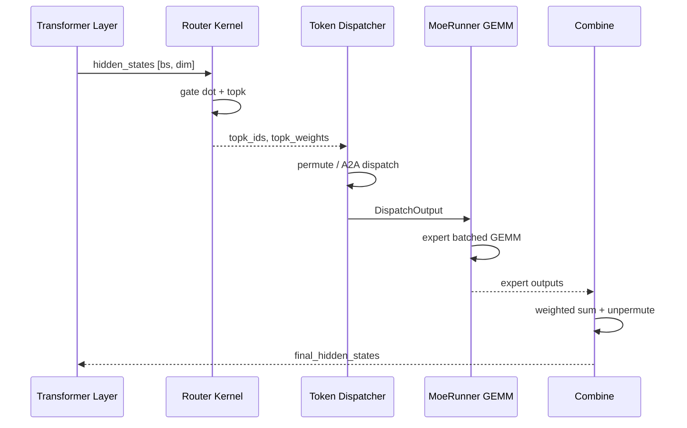
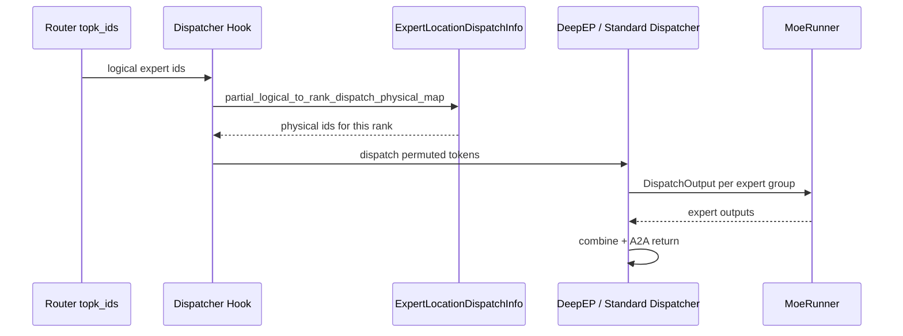

# MoE：数据流与交互

## 1. 输入 / 输出

| 方向 | 类型 | 说明 | 源码 |
|------|------|------|------|
| 输入 | `hidden_states [bs, hidden_dim]` | 上一层 MLP/Attention 输出 | FusedMoE.forward |
| 输入 | `TopKOutput` | topk_ids + topk_weights + router_logits | Router / topk.py |
| 输出 | `final_hidden_states [bs, hidden_dim]` | combine 后加权 expert 输出 | forward_impl |
| 中间 | `DispatchOutput` | permuted tokens + expert 元数据 | dispatcher.dispatch |

## 2. 上下游

| 模块 | 关系 | 说明 |
|------|------|------|
| Transformer Layer | 上游 | MoE block 内 Router → FusedMoE；替换 dense FFN |
| topk.py | 上游 | 产出 `TopKOutput`（ids/weights/logits）；triton_kernels 稀疏路由 |
| Quantization | 注入 | `quant_method.apply` = `run_moe_core`；与 A2A 正交 |
| token_dispatcher | 本模块 | Standard / DeepEP / FlashInfer 等 dispatch+combine |
| Distributed | 协同 | EP A2A、TP `tensor_model_parallel_all_reduce` |
| EPLB | 运行时 | hook 改写 logical→physical id；周期性 rebalance |
| ModelRunner | 下游 | CUDA Graph piecewise 捕获整层 MoE custom op |
| LoRA | 并行 | LoRA MoE runner 复用 `get_triton_quant_info` |
| ServerArgs | 上游 | `--moe-a2a-backend`、`--moe-runner-backend`、`--ep-dispatch-algorithm` |

## 3. MoE 层完整时序

**Explain：** 单 token 在 MoE 层内经历 router→dispatch→GEMM→combine 四步；EP 场景 dispatch/combine 含跨 rank A2A，是主要延迟来源。



## 4. Router → Dispatch 数据流

**Explain：** Router 输出 topk_ids `[bs, topk]` 与 topk_weights `[bs, topk]`；Dispatcher 按 ids 将 hidden states 复制 topk 份并 permute 到 expert 分组布局。EPLB hook 可能在 dispatch 前改写 ids。

**Code：**

```python
## 来源：python/sglang/srt/layers/moe/router.py L401-L418
    def forward(
        self, x: torch.Tensor, residual: torch.Tensor
    ) -> Tuple[torch.Tensor, torch.Tensor]:
        if x.is_cuda:
            return self.forward_cuda(x, residual)
        else:
            return self.forward_vllm(x, residual)

    def forward_cuda(
        self, x: torch.Tensor, autotune=False
    ) -> Tuple[torch.Tensor, torch.Tensor]:
        return fused_moe_router_shim(
            moe_softcapping=self.moe_softcapping,
            hidden_states=x,
            gating_output=self.router_linear.weight,
            topk=self.topk,
            renormalize=False,
        )
```

**Comment：**
- `router_linear.weight` shape `[num_experts, hidden_dim]`
- renormalize=False 时权重已在 kernel 内归一化

## 5. Dispatch → GEMM → Combine

**Explain：** `run_moe_core` 内部调用 MoeRunner，按 expert 分组做 batched GEMM；combine 用 topk_weights 做 weighted sum 并 scatter 回原 token 顺序。TP all-reduce 仅在 `reduce_results=True` 且 moe_tp/ep >1 时触发。

**Code：**

```python
## 来源：python/sglang/srt/layers/moe/fused_moe_triton/layer.py L1134-L1159
    def forward_impl(self, hidden_states: torch.Tensor, topk_output: TopKOutput):
        origin_hidden_states_dim = hidden_states.shape[-1]
        assert self.quant_method is not None

        dispatch_output = self.dispatcher.dispatch(
            hidden_states=hidden_states, topk_output=topk_output
        )

        combine_input = self.run_moe_core(
            dispatch_output=dispatch_output,
        )

        with use_symmetric_memory(
            get_tp_group(), disabled=not is_allocation_symmetric()
        ):
            final_hidden_states = self.dispatcher.combine(combine_input=combine_input)

            # TODO: should we add some conditions here?
            final_hidden_states = final_hidden_states[
                ..., :origin_hidden_states_dim
            ].contiguous()

        if self.reduce_results and (self.moe_tp_size > 1 or self.moe_ep_size > 1):
            final_hidden_states = tensor_model_parallel_all_reduce(final_hidden_states)

        return final_hidden_states
```

## 6. EPLB rebalance 交互

**Explain：** 每 `eplb_rebalance_num_iterations` 次 forward 后 EPLBManager 触发 rebalance，更新 expert 权重分布与 location metadata；下一次 forward 的 dispatch hook 使用新映射。rebalance 期间可能短暂 stall。

**Code：**

```python
## 来源：python/sglang/srt/eplb/eplb_manager.py L48-L53
 def _entrypoint(self):
 while True:
 for _ in range(self._rebalance_num_iterations):
 yield
 yield from self.rebalance()
```

---

## 7. 典型一次 MoE forward 数据流

**Explain：** 单 decode step、标准 `forward_impl` 路径（非 piecewise CUDA Graph）。EP>1 时步骤 3–4 与 6–7 含跨 rank A2A，是延迟主因；量化只改变步骤 5 的 GEMM kernel。

| 步骤 | 子系统 | 动作 | 张量 / 对象 |
|:----:|--------|------|-------------|
| 1 | Router | `hidden @ gate_weight` → softcap → topk | `topk_ids [bs,k]`、`topk_weights [bs,k]` |
| 2 | EPLB hook | 可选 `topk_ids_logical_to_physical` | `ExpertLocationDispatchInfo` |
| 3 | Dispatcher | `dispatch(hidden, topk_output)` | permute / A2A → `DispatchOutput` |
| 4 | Distribution | EP 场景记录 expert 负载 | `ExpertDistributionRecorder` |
| 5 | MoeRunner | `quant_method.apply` → expert batched GEMM | w13 + activation + w2 |
| 6 | Dispatcher | `combine(combine_input)` | weighted sum + unpermute |
| 7 | TP/EP | `reduce_results` 时 all-reduce | `[bs, hidden_dim]` |

**Code：**

```python
## 来源：python/sglang/srt/layers/moe/fused_moe_triton/layer.py L1178-L1183
    def run_moe_core(self, dispatch_output: DispatchOutput) -> CombineInput:
        # TODO: consider using symmetric memory
        return self.quant_method.apply(
            layer=self,
            dispatch_output=dispatch_output,
        )
```

**Comment：**

- Router 与 FusedMoE 解耦：`TopKOutput` 可在 layer 外预计算（bypassed CUDA Graph 路径）。
- `origin_hidden_states_dim` slice 处理 LoRA / 扩展 hidden 维场景。

---

## 8. EP dispatch 与 logical→physical 映射

**Explain：** Expert Parallel 下每 rank 只持有部分 physical expert 权重。EPLB / static dispatch 在 **dispatch 前** 通过 hook 把 logical expert id 映射为本 rank 可执行的 physical slot。



**Code：**

```python
## 来源：python/sglang/srt/eplb/expert_location_dispatch.py L38-L56
    @classmethod
    def init_new(cls, layer_id: int):
        ep_dispatch_algorithm = get_global_server_args().ep_dispatch_algorithm
        expert_location_metadata = get_global_expert_location_metadata()
        assert expert_location_metadata is not None

        if ep_dispatch_algorithm is None:
            return None

        return cls(
            ep_dispatch_algorithm=ep_dispatch_algorithm,
            partial_logical_to_rank_dispatch_physical_map=(
                expert_location_metadata.logical_to_rank_dispatch_physical_map[
                    layer_id, :
                ]
```

**Comment：**

- `ep_dispatch_algorithm=None` 时不安装 hook，topk_ids 直接进 dispatcher。
- rebalance 后 metadata 更新，**下一次** forward 的 hook 才生效（见 §6）。

---

## 9. CUDA Graph 与 eager 路径分叉

**Explain：** `FusedMoE.forward` 在 piecewise CUDA Graph 下可走整层 custom op，避免 graph break；否则 fall through 到 `forward_impl`。Ascend 另有 `forward_fuseep` 融合路径。

**Code：**

```python
## 来源：python/sglang/srt/layers/moe/fused_moe_triton/layer.py L1102-L1132
    def forward(self, hidden_states: torch.Tensor, topk_output: TopKOutput):
        if self._use_ascend_fuseep:
            from sglang.srt.hardware_backend.npu.moe.fuseep import forward_fuseep

            return forward_fuseep(self, hidden_states, topk_output)
        if is_in_tc_piecewise_cuda_graph():
            if TopKOutputChecker.format_is_standard(topk_output):
                return moe_forward_piecewise_cuda_graph_impl(
                    hidden_states,
                    topk_output.topk_weights,
                    topk_output.topk_ids,
                    topk_output.router_logits,
                    self.layer_id,
                )
            ...
        else:
            return self.forward_impl(hidden_states, topk_output)
```

**Comment：**

- Graph 路径要求 `TopKOutput` format 为 standard 或 bypassed；否则仍 `forward_impl`。
- Dispatcher format（Standard / DeepEP / FlashInfer）与 CombineInput format 成对匹配。

---

## 10. 与相邻专题的边界

| 问题 | 本模块回答 | 见其他批 |
|------|----------|----------|
| expert 权重怎么 quant？ | `quant_method` + MoeRunner | [[19-Quantization-00-MOC]] |
| A2A 用哪个 backend？ | `MoeA2ABackend` / DeepEP | [[23-Distributed-00-MOC]] |
| Router logits 谁消费？ | 本层 dispatch；可选 capture | 本模块 [[18-MoE-02-源码走读|02]] |
| MoE 层在 ModelRunner 哪调用？ | Transformer block forward | [[11-ModelRunner-00-MOC]] |
