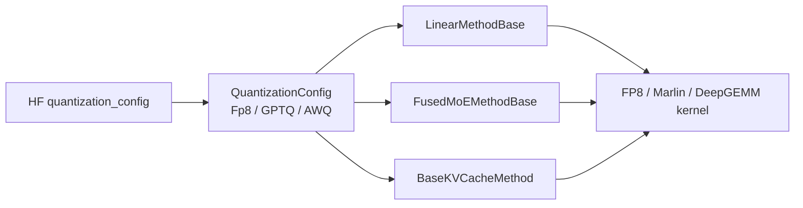

# Quantization：量化

> **阶段 IV · 内存与 Attention** | 状态：已完成 | Git：`70df09b83363e0127b43c83a6007d3938f815b2d` 
> **源码范围：** `layers/quantization/`（base_config、fp8、gptq、awq、compressed_tensors 等）

---

## 本模块在架构中的位置

量化层采用 **Config + Method 双轨** 扩展：HuggingFace checkpoint 的 `quantization_config` 解析为 `QuantizationConfig` 子类（Fp8Config/GPTQConfig/AWQConfig 等），每层通过 `get_quant_method()` 获取对应的 `QuantizeMethodBase` 实现。Linear、MoE、KV 三条线分别继承 `LinearMethodBase`、`FusedMoEMethodBase`、`BaseKVCacheMethod`；`create_weights` 注册 quant weight/scale，`apply` 在前向时调用 FP8/DeepGEMM/Marlin 等 kernel。ModelLoader（ModelLoader）加载后 `process_weights_after_loading` 做 layout 变换。



---

## 零基础一句话

**像「压缩打包的快递」**：权重以更小体积（INT8/FP8）存储和传输，到目的地（GPU）再按专用工具（quant method）解压计算，省带宽也省显存。

---

## 用户场景

**Persona：** 算法工程师小敏要在 Blackwell 上跑 FP8 DeepSeek-V3 checkpoint，需要选择 `--fp8-gemm-backend` 与 activation scheme（static/dynamic）。她需要理解 `Fp8Config.get_quant_method` 如何为 Linear 与 MoE 层分别注入 method，以及 Marlin 与 block-wise W8A8 的适用场景。

---

## 五件套阅读顺序

| 顺序 | 文件 | 一句话说明 |
|------|------|------------|
| 01 | [[19-Quantization-01-核心概念]] | Config+Method 双轨、FP8/GPTQ/AWQ 体系、KV 量化 |
| 启动链路 | [[19-Quantization-02-源码走读]] | `create_weights`/`apply`、`dispatch_w8a8_block_fp8_linear` 精读 |
| HTTP Server | [[19-Quantization-03-数据流与交互]] | ModelLoader → process_weights → forward apply 全链路 |
| OpenAI API | [[19-Quantization-04-关键问题]] | backend 选型、Marlin reorder、MoE FP4 expert |
| ✓ | [[19-Quantization-05-checkpoint]] | 验收：能否说明 Linear 与 MoE 量化 method 的分工 |

---

## 核心源码锚点

**Explain：** 所有量化方法实现 `create_weights`（注册 layer 上的 quant weight/scale 参数）与 `apply`（前向计算入口）两个核心方法。`process_weights_after_loading` 在 checkpoint load 后做 layout 变换（如 Marlin reorder、FP8 transpose），保证 apply 时权重已是 kernel-ready 格式。

**Code：**

```python
# 来源：python/sglang/srt/layers/quantization/base_config.py L20-L84
class QuantizeMethodBase(ABC):
    """Base class for different quantized methods."""

    def create_weights(
        self, layer: torch.nn.Module, *weight_args, **extra_weight_attrs
    ):
        """Create weights for a layer.

        The weights will be set as attributes of the layer."""
        raise NotImplementedError()

    @abstractmethod
    def apply(self, layer: torch.nn.Module, *args, **kwargs) -> torch.Tensor:
        """Apply the weights in layer to the input tensor.

        Expects create_weights to have been called before on the layer."""
        raise NotImplementedError()

    def process_weights_after_loading(self, layer: nn.Module) -> None:
        """Process the weight after loading.

        This can be used for example, to transpose weights for computation.
        """
        return


class LinearMethodBase(QuantizeMethodBase):
    """Base class for different (maybe quantized) linear methods."""

    def create_weights(
        self,
        layer: torch.nn.Module,
        input_size_per_partition: int,
        output_partition_sizes: List[int],
        input_size: int,
        output_size: int,
        params_dtype: torch.dtype,
        **extra_weight_attrs,
    ):
        """Create weights for a linear layer.
           The weights will be set as attributes of the layer.

        Args:
            layer: The layer that is using the LinearMethodBase factory.
            input_size_per_partition: Size of the weight input dim on rank X.
            output_partition_sizes: Sizes of the output dim of each logical
                weight on rank X. E.g., output_partition_sizes for QKVLinear
                is a list contains the width of Wq, Wk, Wv on rank X.
            input_size: Size of the input dim of the weight across all ranks.
            output_size: Size of the output dim of the weight across all ranks.
            params_dtype: Datatype of the parameters.
        """
        raise NotImplementedError()

    @abstractmethod
    def apply(
        self,
        layer: torch.nn.Module,
        x: torch.Tensor,
        bias: Optional[torch.Tensor] = None,
    ) -> torch.Tensor:
        """Apply the weights in layer to the input tensor.
        Expects create_weights to have been called before on the layer."""
        raise NotImplementedError()

```

**Comment：**

- `create_weights` 在模型 `__init__` 时被 `QuantizationConfig.get_quant_method` 调用，把 quant 参数挂到 layer 上。
- `apply` 是 forward 时的唯一计算入口；Linear 与 MoE 签名不同，由子类约束。
- `process_weights_after_loading` 在 ModelLoader 灌权重后执行，做 transpose/reorder 等预处理。
- MoE 层通过 `FusedMoEMethodBase` 注入量化 GEMM 到 `MoeRunner`（MoE）。

---

## 验证建议

1. **CLI：** `--quantization fp8 --fp8-gemm-backend auto`，启动日志应显示选中的 GEMM backend（DeepGEMM/Triton/FlashInfer 等）。
2. **日志：** 搜索 `quantization` / `fp8` / `marlin`；加载 GPTQ Marlin 权重时可见 reorder 相关 debug 信息。

---

## 阅读路径

← [[18-MoE-00-MOC|MoE]] 
→ [[20-Sampling-00-MOC|Sampling]]
