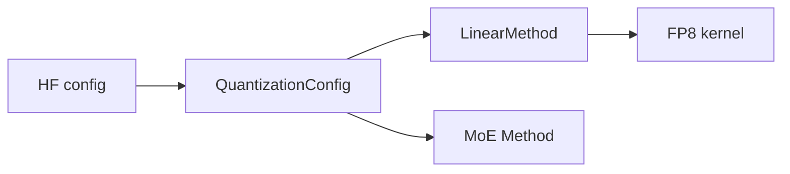
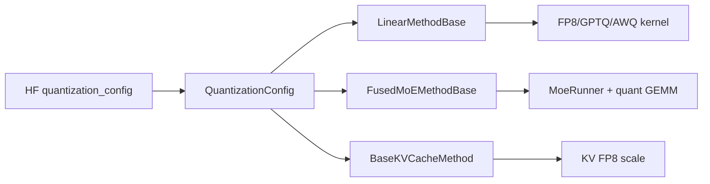

# Quantization · 核心概念

## 用户故事：FP8 上线后吞吐升了、首字却慢了 — 量化插在哪一层？

### Persona

**小薇**，要把 Llama-70B 从 BF16 切到 FP8 省显存。权重加载成功、吞吐 +30%，但部分请求 TTFT 抖动。她需要理解 QuantizationConfig 如何在 Linear/MoE/KV 三条线注入 kernel。

### 时间线

| 时刻 | 事件 |
|------|------|
| T0 | `ModelLoader` 读 HF `quantization_config`，实例化 `Fp8Config` |
| T0+load | 每层 `get_quant_method()` 返回 `Fp8LinearMethod`，`create_weights` 注册 scale |
| T1 | `process_weights_after_loading` 做 layout 变换，权重 kernel-ready |
| T2 | Prefill 走 `--fp8-gemm-backend=deep_gemm`；decode 偶发 fallback Triton |
| T3 | 关闭错误 backend 后 TTFT 稳定，吞吐保持 |

### 涉及模块



**Explain：** 量化像**换压缩格式的菜谱**：同一道菜（矩阵乘），食材（权重）变短了，但厨师（GEMM backend）必须会这种格式；load 后还有一次「备料整形」（process_weights_after_loading）。

**Code：**

```python
# 来源：python/sglang/srt/layers/quantization/base_config.py L20-L32
class QuantizeMethodBase(ABC):
    """Base class for different quantized methods."""

    def create_weights(
        self, layer: torch.nn.Module, *weight_args, **extra_weight_attrs
    ):
        """Create weights for a layer.

        The weights will be set as attributes of the layer."""
        raise NotImplementedError()

    @abstractmethod
    def apply(self, layer: torch.nn.Module, *args, **kwargs) -> torch.Tensor:
```

**Comment：**

- `create_weights` + `apply` 两阶段：注册参数 vs 前向计算。
- MoE 与 Linear 各走 `FusedMoEMethodBase` / `LinearMethodBase`，读代码时别混线。

### 如果…会怎样（调试）

| 现象 | 可能原因 | 排查 |
|------|----------|------|
| 加载报 scale shape 错 | checkpoint 与 Fp8Config scheme 不匹配 | 对照 HF config 与 `Fp8Config` |
| 吞吐无提升 | fallback 到慢速 Triton | 设 `SGLANG_KERNEL_API_LOGLEVEL=1` |
| 输出乱码 | KV quant scale 未加载 | 查 `BaseKVCacheMethod` |

---

## 1. 量化体系架构

SGLang 量化采用 **Config + Method 双轨** 扩展：HF checkpoint 的 `quantization_config` 解析为 `QuantizationConfig` 子类（Fp8Config/GPTQConfig/AWQConfig 等），每层通过 `get_quant_method()` 获取对应的 `QuantizeMethodBase` 实现（Linear/MoE/KV 三条线）。



## 2. QuantizeMethodBase 契约

**Explain：** 所有量化方法实现 `create_weights`（注册 layer 上的 quant weight/scale 参数）与 `apply`（前向计算入口）两个核心方法。`process_weights_after_loading` 在 checkpoint load 后做 layout 变换（如 Marlin reorder、FP8 transpose），保证 apply 时权重已是 kernel-ready 格式。Linear/MoE/KV 三条线通过不同基类约束 create_weights 签名。

**Code：**

```python
# 来源：python/sglang/srt/layers/quantization/base_config.py L20-L84
class QuantizeMethodBase(ABC):
    """Base class for different quantized methods."""

    def create_weights(
        self, layer: torch.nn.Module, *weight_args, **extra_weight_attrs
    ):
        """Create weights for a layer.

        The weights will be set as attributes of the layer."""
        raise NotImplementedError()

    @abstractmethod
    def apply(self, layer: torch.nn.Module, *args, **kwargs) -> torch.Tensor:
        """Apply the weights in layer to the input tensor.

        Expects create_weights to have been called before on the layer."""
        raise NotImplementedError()

    def process_weights_after_loading(self, layer: nn.Module) -> None:
        """Process the weight after loading.

        This can be used for example, to transpose weights for computation.
        """
        return


class LinearMethodBase(QuantizeMethodBase):
    """Base class for different (maybe quantized) linear methods."""

    def create_weights(
        self,
        layer: torch.nn.Module,
        input_size_per_partition: int,
        output_partition_sizes: List[int],
        input_size: int,
        output_size: int,
        params_dtype: torch.dtype,
        **extra_weight_attrs,
    ):
        """Create weights for a linear layer.
           The weights will be set as attributes of the layer.

        Args:
            layer: The layer that is using the LinearMethodBase factory.
            input_size_per_partition: Size of the weight input dim on rank X.
            output_partition_sizes: Sizes of the output dim of each logical
                weight on rank X. E.g., output_partition_sizes for QKVLinear
                is a list contains the width of Wq, Wk, Wv on rank X.
            input_size: Size of the input dim of the weight across all ranks.
            output_size: Size of the output dim of the weight across all ranks.
            params_dtype: Datatype of the parameters.
        """
        raise NotImplementedError()

    @abstractmethod
    def apply(
        self,
        layer: torch.nn.Module,
        x: torch.Tensor,
        bias: Optional[torch.Tensor] = None,
    ) -> torch.Tensor:
        """Apply the weights in layer to the input tensor.
        Expects create_weights to have been called before on the layer."""
        raise NotImplementedError()

```

## 3. FP8 — Fp8Config 与 backend dispatch

**Explain：** `Fp8Config` 支持 static/dynamic activation scheme、block-wise W8A8、mxfp8 与 FP4 expert 等模式。`dispatch_w8a8_block_fp8_linear()` 按 `--fp8-gemm-backend` 或硬件 auto-detect 选择 DeepGEMM/Triton/FlashInfer/Marlin 等 GEMM 路径；SM90/SM100/Blackwell 各有最优 backend。

**Code：**

```python
# 来源：python/sglang/srt/layers/quantization/fp8_utils.py L394-L409
def dispatch_w8a8_block_fp8_linear() -> Callable:
    """
    Dispatch to the appropriate FP8 block linear implementation.

    This function selects the backend based on:
    1. The --fp8-gemm-backend server argument (preferred)
    2. Auto-detection based on hardware capabilities
    """
    backend = get_fp8_gemm_runner_backend()

    # Handle explicit backend selection via --fp8-gemm-backend
    if not backend.is_auto():
        return _dispatch_explicit_backend(backend)

    # Auto mode: Select based purely on hardware/backend availability
    return _dispatch_auto_backend()
```

```python
# 来源：python/sglang/srt/layers/quantization/fp8.py L124-L156
        raise RuntimeError(
            "DeepSeek-V4 FP4 experts require torch.float4_e2m1fn_x2 support."
        )
    return fp4_dtype


if _use_aiter or _use_hip_int4:
    from aiter.ops.shuffle import (
        shuffle_scale,
        shuffle_weight,
    )

if _use_aiter:
    from sglang.srt.layers.quantization.fp8_utils import (
        aiter_w8a8_block_fp8_linear,
        use_aiter_triton_gemm_w8a8_tuned_gfx950,
    )


ACTIVATION_SCHEMES = ["static", "dynamic"]

logger = logging.getLogger(__name__)


class Fp8Config(QuantizationConfig):
    """Config class for FP8."""

    def __init__(
        self,
        is_checkpoint_fp8_serialized: bool = False,
        activation_scheme: str = "dynamic",
        ignored_layers: Optional[List[str]] = None,
        weight_block_size: List[int] = None,
```

## 4. GPTQ — 动态 per-module 规则

**Explain：** `GPTQConfig.dynamic` 允许 regex 匹配特定 layer 使用不同 bits/group_size；`checkpoint_format=marlin` 时走 GPTQMarlinLinearScheme 利用 Marlin kernel 加速。desc_act=True 时 activation reorder 影响 kernel 选择。

**Code：**

```python
# 来源：python/sglang/srt/layers/quantization/gptq/gptq.py L51-L90
class GPTQConfig(QuantizationConfig):
    """Config class for GPTQ.

    Reference: https://arxiv.org/abs/2210.17323
    """

    def __init__(
        self,
        weight_bits: int,
        group_size: int,
        desc_act: bool,
        lm_head_quantized: bool,
        dynamic: Dict[str, Dict[str, Union[int, bool]]],
        checkpoint_format: str = "",
        true_sequential: bool = False,
        static_groups: bool = False,
    ) -> None:
        # GPTQModel use `dynamic` config property to allow per module
        # quantization config so each module can be individually optimized.
        # Format is Dict[str, Dict] where key is a regex string that can
        # perform both positive ("+:" prefixed) or negative ("-:" prefixed)
        # matching of a module.
        # Default to positive match, override base quant config mode, if no
        # prefix is used. Value is in dict format of field key and override
        # value.
        # Negative matching will skip quantization init for this module
        # entirely:
        # non-quantized inference. More details and quantization examples can be
        # found at: https://github.com/ModelCloud/GPTQModel
        # Example:
        #  # last 1/2 of the layers 10-21 has 8bit vs 4bit for 0-9
        #  # last 1/4 of the layers 16-21 has 8bit and group_size 64
        # dynamic = {
        #  #`.*\.` matches the layers_node prefix
        #  # positive match layer 10-15
        #  r"+:.*\.(?:1[0-5])\..*": {"bits": 8,},
        #  # positive match layer 16-21
        #  r"+:.*\.(?:1[6-9]|20|21)\..*": {"bits": 8, "group_size": 64,},
        #  r"-:.*\.moe\..*": {}, # negative match (skip) all `moe` layers
        # }
```

```python
# 来源：python/sglang/srt/layers/quantization/gptq/gptq.py L43-L48
def check_marlin_format(hf_quant_cfg: Dict[str, Any]) -> bool:
    # compat: gptqmodel and autogptq (eol) main use checkpoint_format: str
    # compat: autogptq <=0.7.1 is_marlin_format: bool
    return hf_quant_cfg.get("checkpoint_format") == "marlin" or hf_quant_cfg.get(
        "is_marlin_format", False
    )
```

## 5. AWQ — 4bit weight-only

**Explain：** AWQ 保持 activation 为 fp16/bf16，仅量化 weight 到 4bit；`AWQMarlinLinearScheme` 在 Marlin layout 可用时加速 GEMM。MoE 层有独立的 `AWQMoEScheme`，与 Linear scheme 共享 quant config 但 create_weights 签名不同（num_experts 维度）。

**Code：**

```python
# 来源：python/sglang/srt/layers/quantization/awq/awq.py L362-L370
        return None

    def get_linear_scheme(self, layer: torch.nn.Module):
        return AWQMarlinLinearScheme(self)

    def get_moe_scheme(self, layer: torch.nn.Module):
        return AWQMoEScheme(self)

    @classmethod
```

## 6. KV Cache 量化

**Explain：** `BaseKVCacheMethod` 为 Attention 层注册 `k_scale`/`v_scale` 参数；写入 KV cache 前 quantize、读取后 dequantize。与 Attention backend（Attention 专题）配合，scale 可从 checkpoint 加载或 runtime 计算。

**Code：**

```python
# 来源：python/sglang/srt/layers/quantization/kv_cache.py L416-L447
class BaseKVCacheMethod(QuantizeMethodBase):
 def create_weights(self, layer: torch.nn.Module):
 layer.k_scale = torch.nn.Parameter(torch.tensor(-1.0, dtype=torch.float32), requires_grad=False)
 layer.v_scale = torch.nn.Parameter(torch.tensor(-1.0, dtype=torch.float32), requires_grad=False)
 def apply(self, layer: torch.nn.Module) -> torch.Tensor:
 raise RuntimeError(f"{self.__class__.__name__}.apply should not be called.")
 def process_weights_after_loading(self, layer) -> None:
 if layer.k_scale > 0.0 and layer.v_scale > 0.0:
 k_scale = layer.k_scale.to("cpu").tolist()
 if is_fp8_fnuz():
 k_scale *= 2
```

## 7. UnquantizedLinearMethod — fallback

**Explain：** 无量化模型或 ignored_layers 中的层使用 `UnquantizedLinearMethod`；apply 直接 `F.linear`。MoE 无量化路径创建 Triton MoeRunner，与 FP8/AWQ MoE scheme 共享 FusedMoE 框架但 GEMM kernel 不同。

**Code：**

```python
# 来源：python/sglang/srt/layers/quantization/unquant.py L488-L502
            # otherwise use_fp8=True for FP8 dispatch path
            use_fp8 = not envs.SGLANG_DEEPEP_BF16_DISPATCH.get()
            quant_info = DeepGemmMoeQuantInfo(
                w13_weight=w13_weight,
                w2_weight=w2_weight,
                use_fp8=use_fp8,
            )
            return self.runner.run(dispatch_output, quant_info)
        elif self.use_flashinfer_cutlass:
            from sglang.srt.layers.moe.moe_runner.flashinfer_cutlass import (
                FlashInferCutlassMoeQuantInfo,
            )

            quant_info = FlashInferCutlassMoeQuantInfo(
                quant_type="bf16",
```
