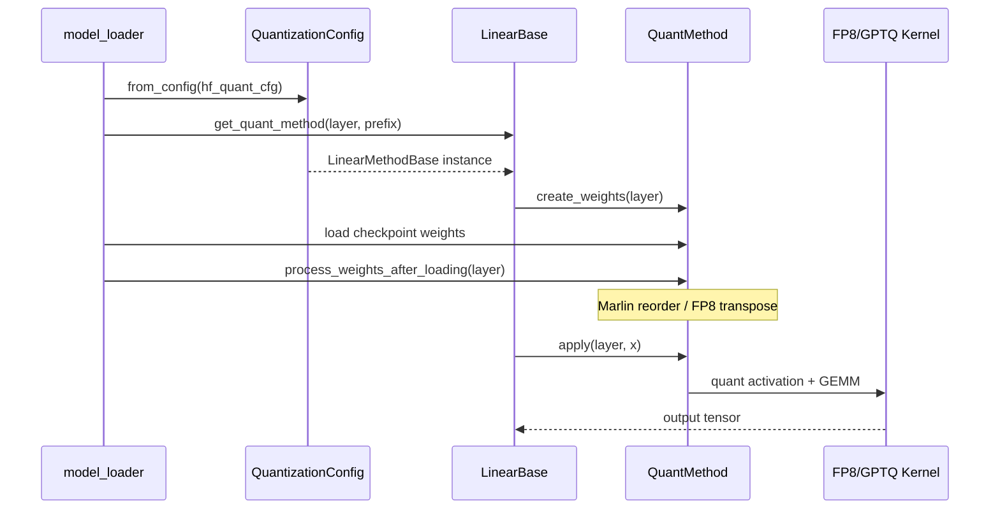

# Quantization：数据流与交互

## 1. 输入 / 输出

| 方向 | 类型 | 说明 | 源码 |
|------|------|------|------|
| 输入 | HF `quantization_config` | checkpoint 量化元数据 | model_loader |
| 输出 | layer.quant_method | 每层绑定的 Method 实例 | get_quant_method |
| 运行时 | activation tensor | apply 时 dynamic quant | fp8_kernel |
| 运行时 | k_scale/v_scale | KV cache quant/dequant | kv_cache.py |

## 2. 上下游

| 模块 | 关系 | 说明 |
|------|------|------|
| model_loader | 上游 | 解析 config、load weight、调用 process_weights_after_loading |
| LinearBase / FusedMoE | 消费者 | 前向时调用 quant_method.apply |
| Attention Backend（Attention） | 消费者 | KV scale 用于 cache 读写 |
| MoE Runner（MoE） | 消费者 | FusedMoEMethodBase.create_moe_runner |

## 3. 量化加载与前向时序

**Explain：** 模型 init 时 create_weights 注册参数；load checkpoint 后 process_weights_after_loading 做 layout 变换；forward 时 apply 执行 quant GEMM。



## 4. FP8 linear 前向路径

**Explain：** dynamic scheme 下 apply 先用 Triton kernel 对 input 做 per-token-group FP8 quant，再调用 dispatch 选定的 GEMM backend。weight 已在 load 时转为 block-scaled FP8 layout。

**Code：**

```python
# 来源：python/sglang/srt/layers/quantization/fp8_utils.py L394-L409
def dispatch_w8a8_block_fp8_linear() -> Callable:
    """
    Dispatch to the appropriate FP8 block linear implementation.

    This function selects the backend based on:
    1. The --fp8-gemm-backend server argument (preferred)
    2. Auto-detection based on hardware capabilities
    """
    backend = get_fp8_gemm_runner_backend()

    # Handle explicit backend selection via --fp8-gemm-backend
    if not backend.is_auto():
        return _dispatch_explicit_backend(backend)

    # Auto mode: Select based purely on hardware/backend availability
    return _dispatch_auto_backend()
```

**Comment：**
- static scheme 跳过 activation quant，直接用固定 scale
- ignored_layers 匹配的层不走此路径

## 5. MoE 量化与 MoeRunner 绑定

**Explain：** FusedMoEMethodBase.create_moe_runner 将 quant weight layout 信息注入 MoeRunnerConfig；run_moe_core 调用 MoeRunner 时自动选择 FP8/INT4 Triton kernel。与 A2A dispatch（MoE）正交——量化只影响 GEMM，不影响 token 路由。

**Code：**

```python
# 来源：python/sglang/srt/layers/quantization/base_config.py L86-L100
class FusedMoEMethodBase(QuantizeMethodBase):

    def create_weights(
        self,
        layer: torch.nn.Module,
        num_experts: int,
        hidden_size: int,
        intermediate_size_per_partition: int,
        params_dtype: torch.dtype,
        **extra_weight_attrs,
    ):
        raise NotImplementedError

    def create_moe_runner(
        self, layer: torch.nn.Module, moe_runner_config: MoeRunnerConfig
```

## 6. KV cache 量化交互

**Explain：** Attention 层持有 k_scale/v_scale；RadixAttention forward 写 KV 前 quantize、读 KV 后 dequantize。scale 无效（-1.0）时 fallback 到原始 dtype 存储。

**Code：**

```python
# 来源：python/sglang/srt/layers/quantization/kv_cache.py L430-L447
 def create_weights(self, layer: torch.nn.Module):
 layer.k_scale = torch.nn.Parameter(torch.tensor(-1.0, dtype=torch.float32), requires_grad=False)
 layer.v_scale = torch.nn.Parameter(torch.tensor(-1.0, dtype=torch.float32), requires_grad=False)
 def process_weights_after_loading(self, layer) -> None:
 if layer.k_scale > 0.0 and layer.v_scale > 0.0:
 ...
 elif layer.k_scale < 0.0 and layer.v_scale < 0.0:
 # no scales loaded, derive from kv_cache_dtype
```
