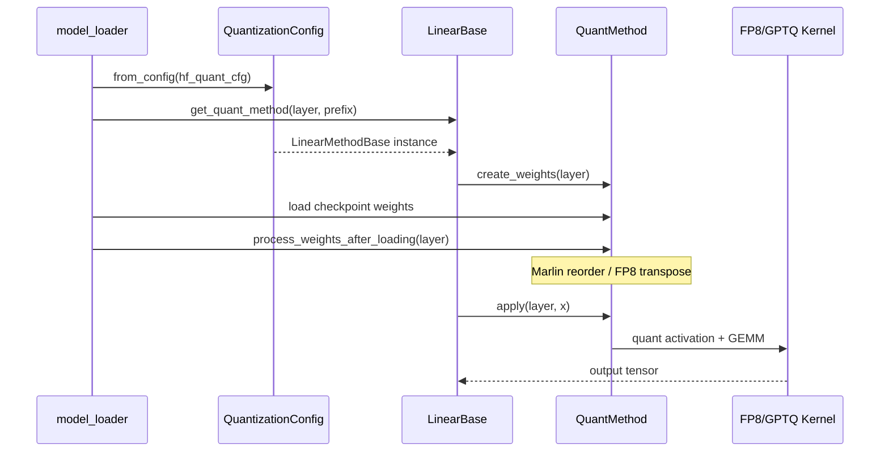
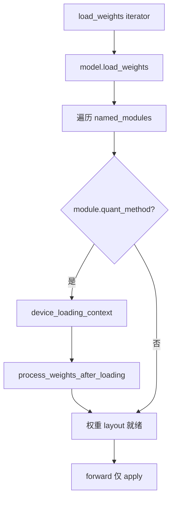

# Quantization：数据流与交互

## 1. 输入 / 输出

| 方向 | 类型 | 说明 | 源码 |
|------|------|------|------|
| 输入 | HF `quantization_config` | checkpoint 量化元数据 | model_loader |
| 输出 | layer.quant_method | 每层绑定的 Method 实例 | get_quant_method |
| 运行时 | activation tensor | apply 时 dynamic quant | fp8_kernel |
| 运行时 | k_scale/v_scale | KV cache quant/dequant | kv_cache.py |

## 2. 上下游

| 模块 | 关系 | 说明 |
|------|------|------|
| model_loader | 上游 | `get_quant_config` 解析 HF config；`load_weights_and_postprocess` 触发 layout 变换 |
| ModelRunner | 上游 | `load_model` 内 `get_model_loader` → `DefaultModelLoader.load_model` |
| ServerArgs | 上游 | `--quantization`、`--fp8-gemm-backend`、`--kv-cache-dtype` 影响 Method 与 kernel 选择 |
| LinearBase / FusedMoE | 消费者 | 前向时调用 `quant_method.apply` |
| RadixAttention | 消费者 | `BaseKVCacheMethod` 绑定 `k_scale`/`v_scale`，不经过 apply GEMM |
| Attention Backend（Attention） | 消费者 | 读写 KV cache 时用 scale quant/dequant |
| MoE Runner（MoE） | 消费者 | `FusedMoEMethodBase.create_moe_runner` 注入 quant layout |
| LoRA（LoRA） | 并行 | LoRA MoE runner 调 `get_triton_quant_info` 对齐 base weight 量化元数据 |
| Models / ModelRegistry | 协同 | 模型 `__init__` 时为每层调用 `get_quant_method(layer, prefix)` |

## 3. 量化加载与前向时序

**Explain：** 模型 init 时 create_weights 注册参数；load checkpoint 后 process_weights_after_loading 做 layout 变换；forward 时 apply 执行 quant GEMM。



## 4. FP8 linear 前向路径

**Explain：** dynamic scheme 下 apply 先用 Triton kernel 对 input 做 per-token-group FP8 quant，再调用 dispatch 选定的 GEMM backend。weight 已在 load 时转为 block-scaled FP8 layout。

**Code：**

```python
## 来源：python/sglang/srt/layers/quantization/fp8_utils.py L394-L409
def dispatch_w8a8_block_fp8_linear() -> Callable:
    """
    Dispatch to the appropriate FP8 block linear implementation.

    This function selects the backend based on:
    1. The --fp8-gemm-backend server argument (preferred)
    2. Auto-detection based on hardware capabilities
    """
    backend = get_fp8_gemm_runner_backend()

    # Handle explicit backend selection via --fp8-gemm-backend
    if not backend.is_auto():
        return _dispatch_explicit_backend(backend)

    # Auto mode: Select based purely on hardware/backend availability
    return _dispatch_auto_backend()
```

**Comment：**
- static scheme 跳过 activation quant，直接用固定 scale
- ignored_layers 匹配的层不走此路径

## 5. MoE 量化与 MoeRunner 绑定

**Explain：** FusedMoEMethodBase.create_moe_runner 将 quant weight layout 信息注入 MoeRunnerConfig；run_moe_core 调用 MoeRunner 时自动选择 FP8/INT4 Triton kernel。与 A2A dispatch（MoE）正交——量化只影响 GEMM，不影响 token 路由。

**Code：**

```python
## 来源：python/sglang/srt/layers/quantization/base_config.py L86-L100
class FusedMoEMethodBase(QuantizeMethodBase):

    def create_weights(
        self,
        layer: torch.nn.Module,
        num_experts: int,
        hidden_size: int,
        intermediate_size_per_partition: int,
        params_dtype: torch.dtype,
        **extra_weight_attrs,
    ):
        raise NotImplementedError

    def create_moe_runner(
        self, layer: torch.nn.Module, moe_runner_config: MoeRunnerConfig
```

## 6. KV cache 量化交互

**Explain：** Attention 层持有 k_scale/v_scale；RadixAttention forward 写 KV 前 quantize、读 KV 后 dequantize。scale 无效（-1.0）时 fallback 到原始 dtype 存储。

**Code：**

```python
## 来源：python/sglang/srt/layers/quantization/kv_cache.py L32-L63
 def create_weights(self, layer: torch.nn.Module):
 layer.k_scale = torch.nn.Parameter(torch.tensor(-1.0, dtype=torch.float32), requires_grad=False)
 layer.v_scale = torch.nn.Parameter(torch.tensor(-1.0, dtype=torch.float32), requires_grad=False)
 def process_weights_after_loading(self, layer) -> None:
 if layer.k_scale > 0.0 and layer.v_scale > 0.0:
 ...
 elif layer.k_scale < 0.0 and layer.v_scale < 0.0:
 # no scales loaded, derive from kv_cache_dtype
```

---

## 7. 典型一次 Linear forward 数据流

**Explain：** 量化对 serving 路径的影响分 **加载期**（create_weights + process_weights_after_loading）与 **推理期**（每层 `LinearBase.forward` → `quant_method.apply`）。以下以 FP8 dynamic activation + per-channel weight 为例；GPTQ/AWQ 跳过 activation quant，Marlin 走 weight-only 快路径。

| 步骤 | 阶段 | 动作 | 关键对象 |
|:----:|:----:|------|----------|
| 1 | 加载 | `get_quant_method` 按 layer 类型返回 `Fp8LinearMethod` 等 | `QuantizationConfig` |
| 2 | 加载 | `create_weights` 注册 `weight`/`weight_scale`/`input_scale` | `LinearBase` 上的 Parameter |
| 3 | 加载 | checkpoint iterator → `model.load_weights` | `(name, tensor)` 流 |
| 4 | 加载 | `process_weights_after_loading` 做 transpose / Marlin reorder | 仅一次，在 target device |
| 5 | forward | `LinearBase.forward(x)` 调 `quant_method.apply(layer, x)` | `[num_tokens, hidden]` |
| 6 | forward | dynamic：`scaled_fp8_quant` → dispatch 选定的 FP8 GEMM | `fp8_kernel` / Cutlass |
| 7 | forward | 输出 bf16/fp16 tensor → 下一层 | 与 unquant 接口一致 |

**Code：**

```python
## 来源：python/sglang/srt/layers/quantization/fp8.py L256-L274
    def get_quant_method(
        self, layer: torch.nn.Module, prefix: str
    ) -> Optional[QuantizeMethodBase]:
        from sglang.srt.layers.linear import LinearBase
        from sglang.srt.layers.moe.fused_moe_triton import FusedMoE
        from sglang.srt.layers.radix_attention import RadixAttention

        if isinstance(layer, LinearBase):
            if is_layer_skipped(
                prefix, self.ignored_layers, fused_mapping=self.packed_modules_mapping
            ):
                return UnquantizedLinearMethod()
            return Fp8LinearMethod(self)
```

**Comment：**

- `ignored_layers` / `modules_to_not_convert` 匹配的 prefix 在 **绑定期** 即 fallback 到 `UnquantizedLinearMethod`，forward 不再进入 FP8 apply。
- MoE / Attention 同函数内分支到 `Fp8MoEMethod` / `Fp8KVCacheMethod`（见 §5、§6）。

---

## 8. 加载后 layout 变换时序

**Explain：** 所有 quant Method 共享 `DefaultModelLoader.load_weights_and_postprocess` 尾部的 `process_weights_after_loading` 遍历；Marlin、block FP8 transpose、KV scale 推导均在此完成，**不在** decode 热路径重复执行。



**Code：**

```python
## 来源：python/sglang/srt/model_loader/loader.py L812-L821
# 提交版本：70df09b
        for _, module in model.named_modules():
            quant_method = getattr(module, "quant_method", None)
            if quant_method is not None:
                with device_loading_context(module, target_device):
                    quant_method.process_weights_after_loading(module)
```

**Comment：**

- `device_loading_context` 支持 CPU offload 加载：postprocess 时临时搬到 GPU，处理完再 offload。
- LayeredModelLoader 在**每层** load 后立即 postprocess，峰值显存更低（见 ModelLoader §9）。

---

## 9. FP8 apply 分叉与 GEMM dispatch

**Explain：** `Fp8LinearMethod.apply` 按初始化 flags 选择 Marlin / mxfp8 block / w8a8 block / 默认 `apply_fp8_linear`。block 路径内部先 activation quant，再调 §4 的 `dispatch_w8a8_block_fp8_linear`。

**Code：**

```python
## 来源：python/sglang/srt/layers/quantization/fp8.py L832-L840
        return apply_fp8_linear(
            input=x,
            weight=layer.weight,
            weight_scale=layer.weight_scale,
            input_scale=layer.input_scale,
            bias=bias,
            cutlass_fp8_supported=self.cutlass_fp8_supported,
            use_per_token_if_dynamic=self.use_per_token_if_dynamic,
        )
```

**Comment：**

- `--fp8-gemm-backend` 只影响 block/w8a8 GEMM 选型，不改变 MoE A2A 或 Attention backend。
- static activation scheme 时 `input_scale` 来自 checkpoint，跳过 dynamic quant kernel。

---

## 10. 与相邻专题的边界

| 问题 | 本模块回答 | 见其他批 |
|------|----------|----------|
| checkpoint 从哪读、何时 postprocess？ | `load_weights_and_postprocess` | [[12-ModelLoader-00-MOC]] |
| KV 物理块谁分配？ | 只提供 k/v_scale | [[16-KV-Cache-00-MOC]] |
| MoE token 怎么路由？ | 量化只影响 GEMM kernel | [[18-MoE-00-MOC]] |
| `--fp8-gemm-backend` 合法组合？ | dispatch 显式报错 vs silent fallback | [[19-Quantization-04-关键问题|04-关键问题]] |
