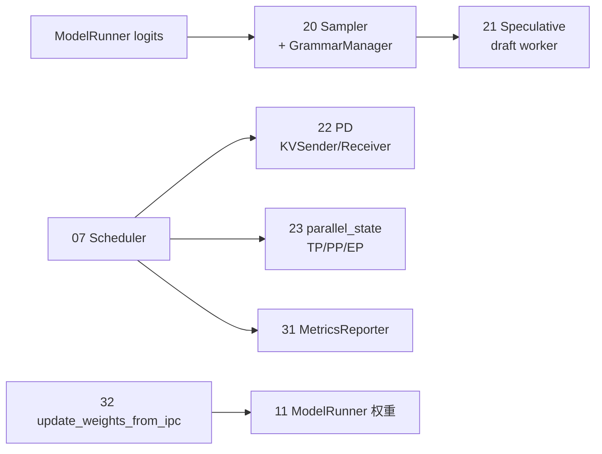

# 阶段 V · 高级特性（Sampling–分布式并行、31–32）

> **你只需阅读本目录，不必打开 `sglang/` 源码。** 
> 内嵌代码对应 sglang Git commit `70df09b`。

---

## 本阶段解决什么问题

阶段 IV 解决了「算得动、存得下」。阶段 V 回答：**生成质量如何控（采样/语法）？如何更快（投机）？如何扩规模（PD 分离、分布式）？如何运维（可观测、热更新）？**

| 模块 | 模块 | 一句话 |
|------|------|--------|
| [[20-Sampling-00-MOC|20 Sampling]] | 采样与约束 | temperature、penalty、json_schema / regex grammar |
| [[21-Speculative-00-MOC|21 Speculative]] | 投机解码 | EAGLE / N-gram draft，accept/reject 采样 |
| [[22-Disaggregation-00-MOC|22 Disaggregation]] | PD 分离 | Prefill 集群 + Decode 集群，KV 跨节点传输 |
| [[23-Distributed-00-MOC|23 Distributed]] | 分布式 | TP / PP / EP / DP，ProcessGroup 与 collective |
| [[31-Observability-00-MOC|31 Observability]] | 可观测性 | Prometheus、SchedulerStats、/metrics |
| [[32-CheckpointEngine-00-MOC|32 CheckpointEngine]] | 权重热更新 | IPC 灌权重、不重启 serving |

---

## 高级特性在请求路径中的挂载点



**Explain：** 采样发生在 Scheduler 收到 logits 之后、写回 next token 之前。投机解码在 Scheduler 层触发额外 draft forward。PD 与分布式改变进程拓扑与通信，不改变 HTTP API。31/32 偏运维：指标 scrape 与 RLHF 权重热更新。

**Code：**

```python
# 来源：python/sglang/srt/sampling/sampling_batch_info.py L89-L108
            )
            .to(device, non_blocking=True)
            .view(-1, 1)
        )
        top_ps = torch.tensor(
            [r.sampling_params.top_p for r in reqs],
            dtype=torch.float,
            pin_memory=_pin,
        ).to(device, non_blocking=True)
        top_ks = torch.tensor(
            [r.sampling_params.top_k for r in reqs],
            dtype=torch.int32,
            pin_memory=_pin,
        ).to(device, non_blocking=True)
        min_ps = torch.tensor(
            [r.sampling_params.min_p for r in reqs],
            dtype=torch.float,
            pin_memory=_pin,
        ).to(device, non_blocking=True)
        sampling_seed = (
```

**Comment：**

- `vocab_mask` 由 GrammarManager 编译约束（json_schema / regex）后填入。
- batch 级张量与 continuous batching 对齐，每条 req 一行。
- greedy 时跳过 random sampling kernel（见 20 走读）。

---

## 零基础一句话

**像高级餐厅增值服务：** 20 是口味定制，21 是预制菜加速，22 是中央厨房与分店分工，23 是连锁门店组网，31 是运营仪表盘，32 是换菜单不换店面。

---

## 推荐阅读顺序

| 顺序 | 文档 | 必读理由 |
|------|------|----------|
| 1 | [[20-Sampling-02-源码走读|20/02-源码走读]] | Sampler + Grammar 主路径 |
| 2 | [[21-Speculative-03-数据流与交互|21/03-数据流与交互]] | Scheduler 触发投机 |
| 3 | [[22-Disaggregation-03-数据流与交互|22/03-数据流与交互]] | PD 六步数据流 |
| 4 | [[23-Distributed-01-核心概念|23/01-核心概念]] | 并行维度术语 |
| 5 | [[31-Observability-04-关键问题|31/04-关键问题]] | enable_metrics 与 weight_load |
| 6 | [[32-CheckpointEngine-02-源码走读|32/02-源码走读]] | IPC 热更新 |

---

## 阶段衔接

| 方向 | 模块 | 衔接点 |
|------|------|--------|
| ← 上一阶段 | 15–19 内存与 Attention | 21 复用 KV；22 传 KV；20 读 logits |
| → 下一阶段 | 24–29 扩展组件 | 多模态/LoRA/Gateway 叠加在本阶段之上 |
| → 索引 | 30 | [[08-设计追问与框架对比]] 对比 vLLM/TRT-LLM |

---

## 验证建议（零基础可试）

1. **Grammar：** `response_format: json_schema` 请求，非法 JSON token 应被 mask（20）。
2. **投机：** `--speculative-algorithm EAGLE` 对比吞吐与 accept_rate 日志（21）。
3. **Metrics：** `--enable-metrics` 后 `curl localhost:30000/metrics | grep sglang`（31）。

---

## 模块导航

| 模块 | 目录 | 五件套 |
|------|------|--------|
| 20 | [[20-Sampling-00-MOC|Sampling]] | ✅ |
| 21 | [[21-Speculative-00-MOC|Speculative]] | ✅ |
| 22 | [[22-Disaggregation-00-MOC|Disaggregation]] | ✅ |
| 23 | [[23-Distributed-00-MOC|Distributed]] | ✅ |
| 31 | [[31-Observability-00-MOC|Observability]] | ✅ |
| 32 | [[32-CheckpointEngine-00-MOC|CheckpointEngine]] | ✅ |

← [[04-内存与Attention-00-MOC|阶段 IV：内存与 Attention]] · → [[06-扩展组件-00-MOC|阶段 VI：扩展组件]]
