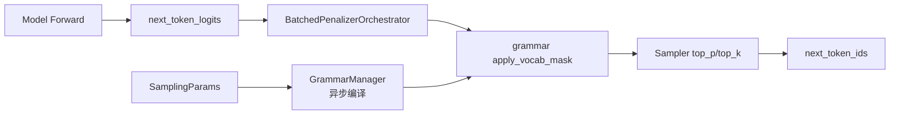

# Sampling 与约束解码

> **阶段 V · 高级特性** | 状态：已完成 | Git：`70df09b83363e0127b43c83a6007d3938f815b2d` 
> **源码范围：** `srt/sampling/`、`srt/constrained/`、`srt/parser/`

---

## 本模块在架构中的位置

采样层位于 **ModelRunner forward（logits 产出）** 与 **Scheduler 回写 next_token** 之间。`SamplingParams` 承载温度、top_p/k、penalty、stop 等 API 参数；`SamplingBatchInfo` 将 N 个 req 的标量堆叠为 GPU tensor 供 Sampler 批处理。约束解码由 `GrammarManager` 异步编译 json_schema/regex/ebnf，`apply_vocab_mask` 在采样前过滤非法 token。Parser 子系统处理 reasoning/harmony 等结构化输出解析。



---

## 零基础一句话

**像「抽奖机的规则设定员」**：模型吐出所有候选号码（logits），采样层按温度/概率筛号，约束解码则确保抽出的号码必须符合 JSON/正则等「格式彩票规则」。

---

## 用户场景

**Persona：** 应用开发者小何做结构化输出 API，要求模型返回合法 JSON。她需要理解 `json_schema` 如何从 HTTP 请求传入 `SamplingParams`，GrammarManager 何时异步编译完成，以及 `vocab_mask` 如何在每步 decode 前屏蔽非法 token——避免客户端收到半截 invalid JSON。

---

## 五件套阅读顺序

| 顺序 | 文件 | 一句话说明 |
|------|------|------------|
| 01 | [[20-Sampling-01-核心概念]] | SamplingParams、SamplingBatchInfo、GrammarManager 架构 |
| 启动链路 | [[20-Sampling-02-源码走读]] | Sampler、penalty orchestrator、constrained 编译与 mask 精读 |
| HTTP Server | [[20-Sampling-03-数据流与交互]] | logits → sample → Scheduler 回写 token 的逐步时序 |
| OpenAI API | [[20-Sampling-04-关键问题]] | 约束类型优先级、greedy vs 随机采样、stop 处理 |
| ✓ | [[20-Sampling-05-checkpoint]] | 验收：能否追踪 json_schema 从 API 到 vocab_mask 的路径 |

---

## 核心源码锚点

**Explain：** `SamplingParams` 用 msgspec Struct 实现零拷贝 IPC；API 字段与内部字段分离，`normalize()` 后 `stop`/`stop_regex` 转为 `stop_strs`/`stop_regex_strs`。`json_schema`、`regex`、`ebnf`、`structural_tag` 四者互斥，任一非空即进入约束解码路径。

**Code：**

```python
# 来源：python/sglang/srt/sampling/sampling_params.py L75-L120
class SamplingParams(msgspec.Struct, kw_only=True, omit_defaults=True):
    """
    The sampling parameters.

    See docs/backend/sampling_params.md or
    https://docs.sglang.io/backend/sampling_params.html
    for the documentation.
    """

    # --- API parameters (set by callers) ---
    max_new_tokens: Optional[int] = 128
    stop: Optional[Union[str, List[str]]] = (
        None  # API input alias, copied to stop_strs then cleared in normalize()
    )
    stop_token_ids: Optional[Set[int]] = None
    stop_regex: Optional[Union[str, List[str]]] = (
        None  # API input alias, copied to stop_regex_strs then cleared in normalize()
    )
    temperature: float = 1.0
    top_p: float = 1.0
    top_k: int = TOP_K_ALL
    min_p: float = 0.0
    frequency_penalty: float = 0.0
    presence_penalty: float = 0.0
    repetition_penalty: float = 1.0
    min_new_tokens: int = 0
    n: int = 1
    json_schema: Optional[str] = None
    regex: Optional[str] = None
    ebnf: Optional[str] = None
    structural_tag: Optional[str] = None
    ignore_eos: bool = False
    skip_special_tokens: bool = True
    spaces_between_special_tokens: bool = True
    no_stop_trim: bool = False
    custom_params: Optional[Dict[str, CustomParamValue]] = None
    stream_interval: Optional[int] = None
    logit_bias: Optional[Dict[str, float]] = None
    sampling_seed: Optional[int] = None

    # --- Internal fields (populated by __post_init__ or normalize(), not API-facing) ---
    stop_strs: Optional[Union[str, List[str]]] = None  # from stop
    stop_regex_strs: Optional[Union[str, List[str]]] = None  # from stop_regex
    stop_str_max_len: int = 0  # set by normalize()
    stop_regex_max_len: int = 0  # set by normalize()
    is_normalized: bool = False  # set by normalize()
```

**Comment：**

- `msgspec.Struct` 支持高效序列化，TokenizerManager ↔ Scheduler IPC 零拷贝友好。
- `normalize()` 预处理 stop/json_schema 等，填充 `stop_strs`、`stop_regex_strs` 内部字段。
- `json_schema`/`regex`/`ebnf`/`structural_tag` 在 GrammarManager 中按 if-elif 链判定优先级。
- `custom_params.thinking_budget` 等扩展字段控制 reasoning token 预算。

---

## 验证建议

1. **CLI/API：** 请求体带 `"response_format": {"type": "json_schema", ...}` 或 `"regex": "^\\d+$"`，日志应出现 grammar 编译与 mask 应用。
2. **日志：** 搜索 `grammar` / `vocab_mask` / `constraint`；采样路径可见 `is_all_greedy` 与 FlashInfer sampling kernel 选择信息。

---

## 阅读路径

← [[19-Quantization-00-MOC|Quantization：量化]] 
→ [[21-Speculative-00-MOC|投机解码]]
