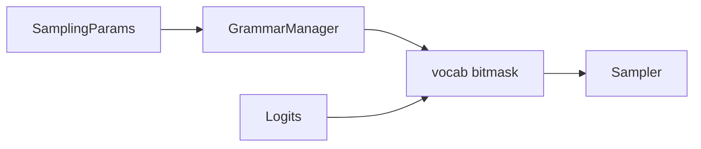
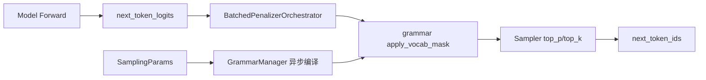

# Sampling · 核心概念

## 用户故事：JSON 输出总缺括号 — Grammar 与 Sampling 谁排队？

### Persona

**阿杰**，Agent 平台要强制 API 返回合法 JSON。开启 `json_schema` 后，`num_grammar_queue_reqs` 升高，首 token 延迟增加。他需要理解 GrammarManager 异步编译与 Sampler 的先后关系。

### 时间线

| 时刻 | 事件 |
|------|------|
| T0 | 客户端带 `response_format: json_schema` 进入 OpenAI 层 |
| T0+5ms | `SamplingParams` 携带 schema；GrammarManager 异步编译 bitmask |
| T0+200ms | 编译完成前请求在 grammar queue 等待 |
| T1 | forward 产出 logits → `apply_vocab_mask` → `Sampler` top_p 采样 |
| T2 | 非法 token 被 mask，输出稳定 JSON；queue 清空后 TTFT 恢复 |

### 涉及模块



**Explain：** 采样层像**带安检的抽奖**：logits 是候选号码，grammar mask 是「不允许的号码」，Sampler 才是最终抽签。约束越强，安检（编译+mask）越可能成瓶颈。

**Code：**

```python
# 来源：python/sglang/srt/sampling/sampling_params.py L75-L90
class SamplingParams(msgspec.Struct, kw_only=True, omit_defaults=True):
    """
    The sampling parameters.

    See docs/backend/sampling_params.md or
    https://docs.sglang.io/backend/sampling_params.html
    for the documentation.
    """

    # --- API parameters (set by callers) ---
    max_new_tokens: Optional[int] = 128
    stop: Optional[Union[str, List[str]]] = (
        None  # API input alias, copied to stop_strs then cleared in normalize()
    )
    stop_token_ids: Optional[Set[int]] = None
    stop_regex: Optional[Union[str, List[str]]] = (
```

**Comment：**

- `json_schema` / `regex` / `ebnf` 走 constrained 子系统，与温度 top_p 正交。
- 监控 `num_grammar_queue_reqs` 判断编译是否排队。

### 如果…会怎样（调试）

| 现象 | 可能原因 | 排查 |
|------|----------|------|
| JSON 仍非法 | schema 与 tokenizer 词表不兼容 | 换 xgrammar/outlines 后端 |
| TTFT 尖刺 | grammar 编译冷启动 | 预热同 schema 请求 |
| 采样忽快忽慢 | grammar+spec 触发 overlap disable | 见 Scheduler Q2 |

---

## 1. 架构位置

采样层位于 **ModelRunner forward（logits 产出）** 与 **Scheduler 回写 token** 之间，约束解码由 `constrained/` 子系统异步编译 grammar，在采样前通过 vocab bitmask 过滤非法 token。



## 2. 模块组成

| 目录 | 职责 | 上游 | 下游 |
|------|------|------|------|
| `srt/sampling/` | 温度、top_p/k、penalty 批量化 | ScheduleBatch | ModelRunner.sample |
| `srt/constrained/` | grammar 编译、vocab mask | SamplingParams 约束字段 | apply_logits_bias |
| `srt/parser/` | reasoning/harmony 输出解析 | tokenizer decode | API 响应 |

## 3. SamplingParams

**Explain：** `SamplingParams` 用 msgspec Struct 实现零拷贝 IPC；API 字段与内部字段分离，`normalize()` 后 `stop`/`stop_regex` 转为 `stop_strs`/`stop_regex_strs`。`json_schema`、`regex`、`ebnf`、`structural_tag` 四者互斥优先级在 GrammarManager 中按 if-elif 链判定；任一非空即进入约束解码路径。

**Code：**

```python
# 来源：python/sglang/srt/sampling/sampling_params.py L75-L120
class SamplingParams(msgspec.Struct, kw_only=True, omit_defaults=True):
    """
    The sampling parameters.

    See docs/backend/sampling_params.md or
    https://docs.sglang.io/backend/sampling_params.html
    for the documentation.
    """

    # --- API parameters (set by callers) ---
    max_new_tokens: Optional[int] = 128
    stop: Optional[Union[str, List[str]]] = (
        None  # API input alias, copied to stop_strs then cleared in normalize()
    )
    stop_token_ids: Optional[Set[int]] = None
    stop_regex: Optional[Union[str, List[str]]] = (
        None  # API input alias, copied to stop_regex_strs then cleared in normalize()
    )
    temperature: float = 1.0
    top_p: float = 1.0
    top_k: int = TOP_K_ALL
    min_p: float = 0.0
    frequency_penalty: float = 0.0
    presence_penalty: float = 0.0
    repetition_penalty: float = 1.0
    min_new_tokens: int = 0
    n: int = 1
    json_schema: Optional[str] = None
    regex: Optional[str] = None
    ebnf: Optional[str] = None
    structural_tag: Optional[str] = None
    ignore_eos: bool = False
    skip_special_tokens: bool = True
    spaces_between_special_tokens: bool = True
    no_stop_trim: bool = False
    custom_params: Optional[Dict[str, CustomParamValue]] = None
    stream_interval: Optional[int] = None
    logit_bias: Optional[Dict[str, float]] = None
    sampling_seed: Optional[int] = None

    # --- Internal fields (populated by __post_init__ or normalize(), not API-facing) ---
    stop_strs: Optional[Union[str, List[str]]] = None  # from stop
    stop_regex_strs: Optional[Union[str, List[str]]] = None  # from stop_regex
    stop_str_max_len: int = 0  # set by normalize()
    stop_regex_max_len: int = 0  # set by normalize()
    is_normalized: bool = False  # set by normalize()
```

**Comment：**
- `custom_params.thinking_budget` 限制 reasoning token 数
- `skip_tokenizer_init=True` 时 stop_str/min_new_tokens 不可用

## 4. SamplingBatchInfo

**Explain：** 将 N 个 req 的标量采样参数堆叠为 GPU tensor（temperatures `[bs,1]` 可广播）；`grammars` 列表与 batch 行一一对应。`is_all_greedy`/`need_top_p_sampling` 等布尔 flag 在构建时 OR/AND 归约，Sampler 据此选择 argmax 或 FlashInfer 采样 kernel，避免 cold path 开销。

**Code：**

```python
# 来源：python/sglang/srt/sampling/sampling_batch_info.py L23-L75
@dataclasses.dataclass
class SamplingBatchInfo:
    # Basic batched sampling params
    temperatures: torch.Tensor
    top_ps: torch.Tensor
    top_ks: torch.Tensor
    min_ps: torch.Tensor

    # Whether all requests use greedy sampling
    is_all_greedy: bool

    # Whether any requests use top_p sampling
    need_top_p_sampling: bool

    # Whether any requests use top_k sampling
    need_top_k_sampling: bool

    # Whether any request needs min_p sampling
    need_min_p_sampling: bool

    # Masking tensors for grammar-guided structured outputs
    vocab_size: int
    grammars: Optional[List] = None
    rids_int: Optional[torch.Tensor] = None
    bootstrap_room_ids_int: Optional[torch.Tensor] = None
    vocab_mask: Optional[torch.Tensor] = None
    apply_mask_func: Optional[Callable[[torch.Tensor, torch.Tensor], None]] = None

    # Penalizer
    penalizer_orchestrator: Optional[penaltylib.BatchedPenalizerOrchestrator] = None
    acc_additive_penalties: Optional[torch.Tensor] = None  # Used in the overlap mode
    acc_scaling_penalties: Optional[torch.Tensor] = (
        None  # Used in the overlap mode for repetition penalty
    )

    # Whether any request has custom logit processor
    has_custom_logit_processor: bool = False
    # Custom parameters
    custom_params: Optional[List[Optional[Dict[str, Any]]]] = None
    # Custom logit processor
    custom_logit_processor: Optional[
        Dict[int, Tuple[CustomLogitProcessor, torch.Tensor]]
    ] = None

    # Used for deterministic sampling
    sampling_seed: Optional[torch.Tensor] = None

    # Device
    device: str = "cuda"

    # Handle logit bias
    logit_bias: Optional[torch.Tensor] = None

```

## 5. 约束解码三后端对比

| 维度 | xgrammar | outlines | llguidance |
|------|----------|----------|------------|
| 启动参数 | `--grammar-backend xgrammar` | `--grammar-backend outlines` | `--grammar-backend llguidance` |
| JSON Schema | 原生支持，编译为 GrammarMatcher | 通过 outlines 转 FSM | 序列化为 llguidance grammar |
| Regex | 支持 | 支持（核心能力） | 支持 |
| EBNF | 支持 | 支持 | 支持 |
| apply_mask 实现 | Triton/CUDA bitmask kernel | `logits.masked_fill_(-inf)` | `apply_token_bitmask_inplace` |
| Token filter | 支持（strict_thinking） | 有限 | 支持 |
| Jump forward | 支持 | 支持（byte-level） | 支持（compute_ff_tokens） |
| 典型场景 | 默认推荐，大 vocab 高效 | 轻量 regex 约束 | 复杂 schema + 多格式 |

**Explain：** 三者均实现 `BaseGrammarBackend` 接口，由 `create_grammar_backend` 按 server_args 选择；xgrammar 对 tokenizer 有兼容性要求，不支持时会降级为 none（除非 strict_thinking）。outlines 实现最简单但大 batch 下 masked_fill 较慢；llguidance 功能最全，适合复杂 JSON schema。

## 6. GrammarManager 异步模型

**Explain：** grammar 编译在 `ThreadPoolExecutor` 中异步执行，避免阻塞 Scheduler 主循环；未完成的 req 暂存 `grammar_queue`，每轮 `get_ready_grammar_requests` poll Future 状态。DP 并行时 all_gather 同步 ready/failed 集合，防止 rank 间 grammar 就绪不一致导致 hang。

**Code：**

```python
# 来源：python/sglang/srt/constrained/base_grammar_backend.py L131-L136
class BaseGrammarBackend:
    _enable_strict_thinking: bool = False

    def __init__(self):
        self.executor = ThreadPoolExecutor()
        self.cache: Dict[Tuple[str, str], BaseGrammarObject] = {}
```

**Comment：**
- cache key 为 `(type, schema_string)` 元组
- 编译失败缓存 `InvalidGrammarObject`，相同 schema 后续请求直接 abort

## 7. Penalty Orchestrator

**Explain：** frequency/presence/repetition/min_new_tokens 四类 penalizer 统一由 orchestrator 调度；仅在至少一个 req 需要时才 `is_required=True` 并分配 `[bs, vocab_size]` 累积张量。penalty 在 grammar mask 之前施加，保证被惩罚 token 即使合法也会被降权。

**Code：**

```python
# 来源：python/sglang/srt/sampling/penaltylib/frequency_penalty.py L403-L440
class BatchedFrequencyPenalizer(_BatchedPenalizer):
 def _cumulate_output_tokens(self, output_ids: torch.Tensor):
 self.cumulated_frequency_penalties.scatter_add_(
 dim=1, index=output_ids.unsqueeze(1), src=self.frequency_penalties,
 )
 def _apply(self, logits: torch.Tensor) -> torch.Tensor:
 logits.sub_(self.cumulated_frequency_penalties)
```
