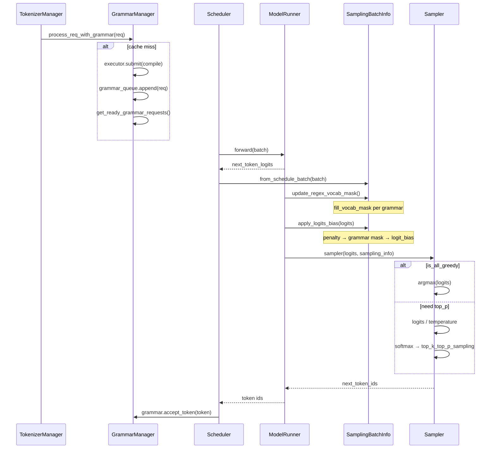

# Sampling：数据流与交互

## 1. 输入 / 输出

| 方向 | 类型 | 说明 | 源码 |
|------|------|------|------|
| 输入 | `LogitsProcessorOutput.next_token_logits` | 模型 forward 末位 logits `[bs, vocab]` | model_runner.sample |
| 输入 | `SamplingBatchInfo` | 批量化采样参数 + grammars | sampling_batch_info |
| 输出 | `next_token_ids: Tensor[bs]` | 采样 token id | sampler.forward |
| 副作用 | grammar.accept_token | 推进约束状态机 | 采样后 Scheduler |

## 2. 上下游

| 模块 | 关系 | 说明 |
|------|------|------|
| ScheduleBatch / Req | 上游 | 携带 SamplingParams 与 grammar object |
| ModelRunner.forward | 上游 | 产出 logits |
| GrammarManager | 并行上游 | 异步编译 grammar，就绪后 req 入 waiting_queue |
| TokenizerManager | 下游 | 接收 token id，decode 输出 |
| Speculative Decoding（投机解码） | 消费者 | penalty repeat 扩展 draft layout |

## 3. 完整采样时序图

**Explain：** 约束请求先入 grammar_queue 等待编译；就绪后与常规请求一起 batch forward；sample 阶段严格按 penalty → mask → temperature → top_p 顺序执行。



## 4. logits → penalty 代码路径

**Explain：** `apply_logits_bias` 是采样前唯一入口；overlap 模式下 additive/scaling penalty 预先 accumulate 到独立 buffer，非 overlap 模式走 orchestrator.apply 逐 penalizer 修改。

**Code：**

```python
# 来源：python/sglang/srt/sampling/sampling_batch_info.py L266-L283
    def apply_logits_bias(self, logits: torch.Tensor):
        if self.acc_additive_penalties is not None:
            # Used in the overlap mode
            logits.add_(self.acc_additive_penalties)

        if self.acc_scaling_penalties is not None:
            # Used in the overlap mode
            apply_scaling_penalties(logits, self.acc_scaling_penalties)

        if self.penalizer_orchestrator and self.penalizer_orchestrator.is_required:
            # Used in the non-overlap mode
            self.penalizer_orchestrator.apply(logits)

        if self.vocab_mask is not None:
            self.apply_mask_func(logits=logits, vocab_mask=self.vocab_mask)

        if self.logit_bias is not None:
            logits.add_(self.logit_bias)
```

**Comment：**
- penalty 先于 mask，logit_bias 最后叠加
- mask 应用后立即释放 vocab_mask 张量

## 5. grammar mask 构建

**Explain：** 每个 batch 行对应一个 grammar object（或 None）；`allocate_vocab_mask` 分配 bit-packed mask，`fill_vocab_mask(idx)` 按当前 grammar 状态写入第 idx 行合法 token。xgrammar 用 Triton kernel 原地置 -inf，outlines 用 PyTorch masked_fill。

**Code：**

```python
# 来源：python/sglang/srt/constrained/outlines_backend.py L74-L75
    def apply_vocab_mask(logits: torch.Tensor, vocab_mask: torch.Tensor):
        logits.masked_fill_(vocab_mask, float("-inf"))
```

```python
# 来源：python/sglang/srt/constrained/xgrammar_backend.py L238-L245
    def apply_vocab_mask(logits: torch.Tensor, vocab_mask: torch.Tensor) -> None:
        if logits.device.type in {"cuda", "npu", "xpu", "musa"}:
            if _is_hip:
                apply_token_bitmask_inplace_cuda(logits, vocab_mask)
            else:
                apply_token_bitmask_inplace_triton(logits, vocab_mask)
        else:
            raise RuntimeError(f"Unsupported device: {logits.device.type}")
```

## 6. top_p 采样内核

**Explain：** 标准路径先 temperature scaling 再 softmax；`_sample_from_probs` 调用 FlashInfer 融合 kernel 完成 top_k 截断、top_p 重归一化与 multinomial 采样；deterministic 模式用 per-position seed。

**Code：**

```python
# 来源：python/sglang/srt/layers/sampler.py L178-L188
            else:
                # Standard path: do softmax and sample from probs.
                logits.div_(sampling_info.temperatures)

                # In-place op to save memory
                logits[:] = torch.softmax(logits, dim=-1)
                probs = logits

                batch_next_token_ids = self._sample_from_probs(
                    probs, sampling_info, positions, simple_sampling_case
                )
```

**Comment：**
- `is_all_greedy=True` 跳过 temperature/softmax 全程
- TP 组可选 `SYNC_TOKEN_IDS_ACROSS_TP` 对齐采样结果
