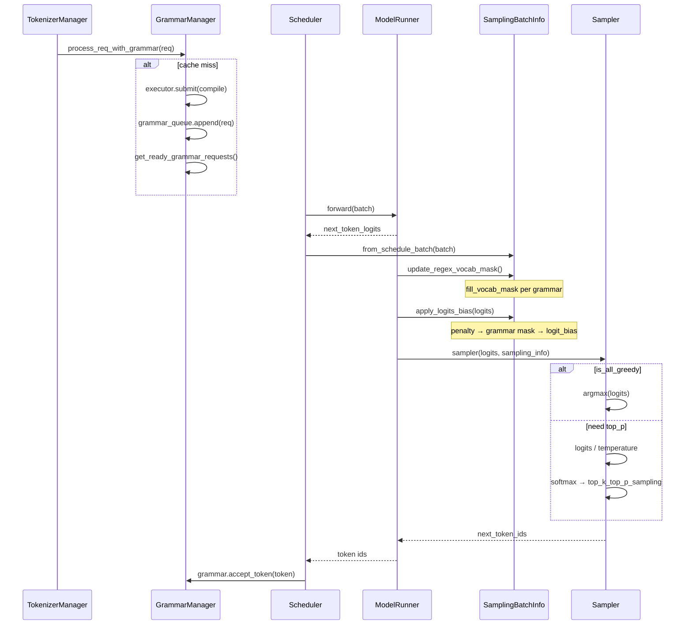
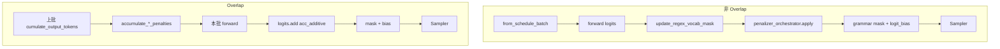

# Sampling：数据流与交互

## 1. 输入 / 输出

| 方向 | 类型 | 说明 | 源码 |
|------|------|------|------|
| 输入 | `LogitsProcessorOutput.next_token_logits` | 模型 forward 末位 logits `[bs, vocab]` | model_runner.sample |
| 输入 | `SamplingBatchInfo` | 批量化采样参数 + grammars | sampling_batch_info |
| 输出 | `next_token_ids: Tensor[bs]` | 采样 token id | sampler.forward |
| 副作用 | grammar.accept_token | 推进约束状态机 | 采样后 Scheduler |

## 2. 上下游

| 模块 | 关系 | 说明 |
|------|------|------|
| ScheduleBatch / Req | 上游 | 每 req 携带 `SamplingParams`、grammar object、`custom_logit_processor` |
| ModelRunner.forward | 上游 | 产出 `LogitsProcessorOutput.next_token_logits` |
| ModelRunner.sample | 本模块枢纽 | `_preprocess_logits` → `Sampler.forward` |
| GrammarManager | 并行上游 | 异步编译 grammar；就绪后 req 离开 `grammar_queue` |
| constrained/* | 本模块 | xgrammar/outlines/llguidance 提供 `fill_vocab_mask` / `apply_vocab_mask` |
| penaltylib | 本模块 | frequency/presence/repetition/min_new_tokens 编排 |
| TokenizerManager | 下游 | 接收 token id，decode 输出 |
| Scheduler | 下游 | overlap 模式下 penalty/mask 时序与 eager 不同 |
| Speculative Decoding（投机解码） | 消费者 | penalizer `repeat` 扩展 draft layout |
| Distributed | 协同 | TP 组 `SYNC_TOKEN_IDS_ACROSS_TP` 对齐采样结果 |

## 3. 完整采样时序图

**Explain：** 约束请求先入 grammar_queue 等待编译；就绪后与常规请求一起 batch forward；sample 阶段严格按 penalty → mask → temperature → top_p 顺序执行。



## 4. logits → penalty 代码路径

**Explain：** `apply_logits_bias` 是采样前唯一入口；overlap 模式下 additive/scaling penalty 预先 accumulate 到独立 buffer，非 overlap 模式走 orchestrator.apply 逐 penalizer 修改。

**Code：**

```python
## 来源：python/sglang/srt/sampling/sampling_batch_info.py L266-L283
    def apply_logits_bias(self, logits: torch.Tensor):
        if self.acc_additive_penalties is not None:
            # Used in the overlap mode
            logits.add_(self.acc_additive_penalties)

        if self.acc_scaling_penalties is not None:
            # Used in the overlap mode
            apply_scaling_penalties(logits, self.acc_scaling_penalties)

        if self.penalizer_orchestrator and self.penalizer_orchestrator.is_required:
            # Used in the non-overlap mode
            self.penalizer_orchestrator.apply(logits)

        if self.vocab_mask is not None:
            self.apply_mask_func(logits=logits, vocab_mask=self.vocab_mask)

        if self.logit_bias is not None:
            logits.add_(self.logit_bias)
```

**Comment：**
- penalty 先于 mask，logit_bias 最后叠加
- mask 应用后立即释放 vocab_mask 张量

## 5. grammar mask 构建

**Explain：** 每个 batch 行对应一个 grammar object（或 None）；`allocate_vocab_mask` 分配 bit-packed mask，`fill_vocab_mask(idx)` 按当前 grammar 状态写入第 idx 行合法 token。xgrammar 用 Triton kernel 原地置 -inf，outlines 用 PyTorch masked_fill。

**Code：**

```python
## 来源：python/sglang/srt/constrained/outlines_backend.py L74-L75
    def apply_vocab_mask(logits: torch.Tensor, vocab_mask: torch.Tensor):
        logits.masked_fill_(vocab_mask, float("-inf"))
```

```python
## 来源：python/sglang/srt/constrained/xgrammar_backend.py L238-L245
    def apply_vocab_mask(logits: torch.Tensor, vocab_mask: torch.Tensor) -> None:
        if logits.device.type in {"cuda", "npu", "xpu", "musa"}:
            if _is_hip:
                apply_token_bitmask_inplace_cuda(logits, vocab_mask)
            else:
                apply_token_bitmask_inplace_triton(logits, vocab_mask)
        else:
            raise RuntimeError(f"Unsupported device: {logits.device.type}")
```

## 6. top_p 采样内核

**Explain：** 标准路径先 temperature scaling 再 softmax；`_sample_from_probs` 调用 FlashInfer 融合 kernel 完成 top_k 截断、top_p 重归一化与 multinomial 采样；deterministic 模式用 per-position seed。

**Code：**

```python
## 来源：python/sglang/srt/layers/sampler.py L178-L188
            else:
                # Standard path: do softmax and sample from probs.
                logits.div_(sampling_info.temperatures)

                # In-place op to save memory
                logits[:] = torch.softmax(logits, dim=-1)
                probs = logits

                batch_next_token_ids = self._sample_from_probs(
                    probs, sampling_info, positions, simple_sampling_case
                )
```

**Comment：**
- `is_all_greedy=True` 跳过 temperature/softmax 全程
- TP 组可选 `SYNC_TOKEN_IDS_ACROSS_TP` 对齐采样结果

---

## 7. 典型一次 decode 采样数据流

**Explain：** 每个 decode step，Scheduler 已把 batch 组装为 `ForwardBatch`；`sampling_info` 由 `SamplingBatchInfo.from_schedule_batch` 构造。采样严格顺序：**mask 构建 → penalty → grammar mask → logit_bias → temperature → top_p 采样**。

| 步骤 | 位置 | 动作 |
|:----:|------|------|
| 1 | Scheduler | `get_ready_grammar_requests` 移出已编译 req |
| 2 | ScheduleBatch | `SamplingBatchInfo.from_schedule_batch` 收集 temperature/top_p/grammars |
| 3 | ModelRunner | `forward` → `next_token_logits [bs, vocab]` |
| 4 | ModelRunner | `_preprocess_logits`：`update_regex_vocab_mask` + `apply_logits_bias` |
| 5 | Sampler | greedy argmax 或 softmax + FlashInfer top_k/top_p 采样 |
| 6 | ModelRunner | `_sync_token_ids_across_tp`（若启用） |
| 7 | Scheduler | grammar `accept_token` 推进约束状态机 |

**Code：**

```python
## 来源：python/sglang/srt/model_executor/model_runner.py L3160-L3191
# 提交版本：70df09b
    def sample(
        self,
        logits_output: LogitsProcessorOutput,
        forward_batch: ForwardBatch,
    ) -> torch.Tensor:
        self._preprocess_logits(logits_output, forward_batch.sampling_info)

        next_token_ids = self.sampler(
            logits_output,
            forward_batch.sampling_info,
            forward_batch.return_logprob,
            forward_batch.top_logprobs_nums,
            forward_batch.token_ids_logprobs,
            (
                forward_batch.positions
                if forward_batch.forward_mode.is_decode()
                else forward_batch.seq_lens - 1
            ),
        )
        self.maybe_update_ngram_token_table(next_token_ids, forward_batch)
        return next_token_ids
```

**Comment：**

- Prefill 采样位置用 `seq_lens - 1`（末 token）；decode 用 `positions`。
- `_preprocess_logits` 后立即 `vocab_mask = None` 防 overlap 闭包泄漏 VRAM。

---

## 8. Overlap vs 非 Overlap  penalty 路径

**Explain：** overlap scheduling 下 penalty 在上一 batch 结果处理阶段 **预累积** 到 `acc_additive_penalties` / `acc_scaling_penalties`；非 overlap 则在 `apply_logits_bias` 内调 `penalizer_orchestrator.apply`。grammar mask 两路径均在 sample 前施加。



**Code：**

```python
## 来源：python/sglang/srt/sampling/sampling_batch_info.py L76-L92
    @classmethod
    def from_schedule_batch(cls, batch: ScheduleBatch, vocab_size: int):
        global_server_args = get_global_server_args()
        enable_deterministic = global_server_args.enable_deterministic_inference

        reqs = batch.reqs
        device = batch.device
        _pin = is_pin_memory_available(device)
        temperatures = (
            torch.tensor(
                [r.sampling_params.temperature for r in reqs],
                dtype=torch.float,
                pin_memory=_pin,
            )
            .to(device, non_blocking=True)
            .view(-1, 1)
        )
```

**Comment：**

- `is_all_greedy` / `need_top_p_sampling` 等 flag 在构造期计算，Sampler 可短路跳过 FlashInfer kernel。
- `enable_deterministic_inference` 时构造 per-req `sampling_seed` 供 FlashInfer deterministic 采样。

---

## 9. Greedy 与 stochastic 分叉

**Explain：** 全 batch greedy 时跳过 temperature 除法与 softmax，直接 argmax；否则走标准 probs 路径或 Ascend / RL on-policy 专用分支。

**Code：**

```python
## 来源：python/sglang/srt/layers/sampler.py L121-L128
        if sampling_info.is_all_greedy:
            if _use_aiter and not _disable_aiter_greedy_sample:
                batch_next_token_ids = torch.empty(
                    logits.shape[0], device=logits.device, dtype=torch.int32
                )
                _aiter_greedy_sample(batch_next_token_ids, logits)
            else:
                batch_next_token_ids = torch.argmax(logits, -1)
```

**Comment：**

- penalty 与 grammar mask 在 `_preprocess_logits` 中 **先于** argmax/softmax 施加，greedy 同样受约束。
- `return_logprob=True` 时 greedy 路径仍算 `log_softmax` 供 API 返回。

---

## 10. 与相邻专题的边界

| 问题 | 本模块回答 | 见其他批 |
|------|----------|----------|
| logits 谁算？ | ModelRunner forward | [[11-ModelRunner-00-MOC]] |
| grammar 何时编译？ | GrammarManager 队列 | 本模块 [[20-Sampling-02-源码走读|02]] |
| 投机 decode 如何 repeat penalty？ | `penalizer_orchestrator.apply(repeat=)` | [[21-Speculative-00-MOC]] |
| API 采样参数谁解析？ | TokenizerManager → `SamplingParams` | [[06-TokenizerManager-00-MOC]] |
