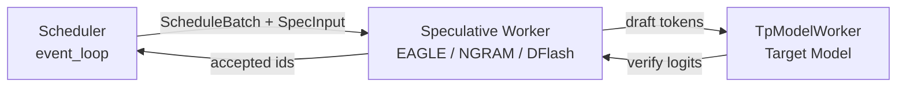

# 投机解码（Speculative Decoding）

> **阶段 V · 高级特性** | 状态：已完成 | Git：`70df09b83363e0127b43c83a6007d3938f815b2d` 
> **源码范围：** `python/sglang/srt/speculative/` — EAGLE、NGRAM、DFLASH、MTP、Reject Sampling

---

## 本模块在架构中的位置

投机解码在 **Scheduler 调度循环**与 **TpWorker forward** 之间插入 Draft → Verify 两阶段：draft 模型（或 NGRAM）快速产出候选 token，target 模型一次 forward 验证并接受/拒绝。Scheduler 通过 `SpeculativeAlgorithm.create_worker` 选择具体 Worker 类，无需硬编码算法分支。



---

## 零基础一句话

**像考试先猜答案再对答案：** draft 模型快速「猜」几个 token，target 模型一次性「批改」，猜对的步数越多，整体生成越快。

---

## 用户场景

**Persona：** 推理工程师老周部署 Llama-3 + EAGLE draft，需要理解 `accept_rate` 低于 0.5 时为何应关闭投机解码，以及 overlap 模式下 draft/target 如何共享 KV layout。

---

## 五件套阅读顺序

| 顺序 | 文件 | 一句话说明 |
|------|------|------------|
| 01 | [[21-Speculative-01-核心概念]] | 算法枚举、SpecInput 阶段、插件注册 |
| 启动链路 | [[21-Speculative-02-源码走读]] | SpeculativeAlgorithm、Worker、Reject Sampling |
| HTTP Server | [[21-Speculative-03-数据流与交互]] | Scheduler 触发点、与 KV Cache 交互 |
| OpenAI API | [[21-Speculative-04-关键问题]] | 算法选型、Overlap 限制、PD 分离兼容 |
| ✓ | [[21-Speculative-05-checkpoint]] | 验收清单 |

---

## 核心源码锚点

**Explain：** 所有投机算法通过 `SpeculativeAlgorithm.from_string` 统一解析；`create_worker` 按算法类型返回对应的 V2 Worker 类，Scheduler 无需关心具体实现。

**Code：**

```python
# 来源：python/sglang/srt/speculative/spec_info.py L193-L238
    def create_worker(
        self, server_args: ServerArgs
    ) -> Optional[Union[Type[BaseSpecWorker], Type[TpModelWorker], Type[NGRAMWorker]]]:
        assert (
            not self.is_none()
        ), "Cannot create worker for NONE speculative algorithm."

        if self.is_dflash():
            # V2 worker drives both overlap and non-overlap (scheduler runs it
            # synchronously when overlap is disabled), same as EAGLE.
            from sglang.srt.speculative.dflash_worker_v2 import DFlashWorkerV2

            return DFlashWorkerV2

        if self.is_frozen_kv_mtp():
            # V2 worker drives both overlap and non-overlap (scheduler runs it
            # synchronously when overlap is disabled), same as EAGLE.
            from sglang.srt.speculative.frozen_kv_mtp_worker_v2 import (
                FrozenKVMTPWorkerV2,
            )

            return FrozenKVMTPWorkerV2

        # EAGLE / EAGLE3 / STANDALONE / MULTI_LAYER always use the V2 worker,
        # even with overlap disabled (scheduler drives it synchronously).
        if self.is_eagle() and server_args.enable_multi_layer_eagle:
            from sglang.srt.speculative.multi_layer_eagle_worker_v2 import (
                MultiLayerEagleWorkerV2,
            )

            return MultiLayerEagleWorkerV2

        elif self.is_eagle():
            from sglang.srt.speculative.eagle_worker_v2 import EAGLEWorkerV2

            return EAGLEWorkerV2
        elif self.is_standalone():
            from sglang.srt.speculative.standalone_worker_v2 import (
                StandaloneWorkerV2,
            )

            return StandaloneWorkerV2
        elif self.is_ngram():
            from sglang.srt.speculative.ngram_worker import NGRAMWorker

            return NGRAMWorker
```

**Comment：**

- V2 Worker 统一承载 overlap / 非 overlap 两种调度模式。
- EAGLE 家族共享 draft+verify 框架；NGRAM 无 draft KV，走纯 CPU 匹配路径。
- 插件算法通过 `SpeculativeAlgorithm.register` 装饰器扩展。

---

## 验证建议

1. **开启 EAGLE：** `--speculative-algorithm eagle --speculative-draft-model-path <draft>`，观察日志 `accept_rate`。
2. **阈值判断：** accept_rate 持续 < 0.5 时关闭投机，draft forward 成本可能超过收益（见 [[08-设计追问与框架对比|08-设计追问]]）。
3. **与 PD：** PD 分离模式下 draft KV 传输路径见 PD 分离 checkpoint 遗留说明。

---

## 阅读路径

← [[20-Sampling-00-MOC|Sampling]] 
→ [[22-Disaggregation-00-MOC|PD 分离：Prefill-Decode 分离]]
